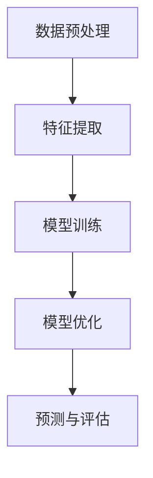

                 

# 第三章: 机器学习优化投资策略的理论基础

## 3.1 机器学习优化策略的核心原理

### 3.1.1 优化目标与约束条件

机器学习优化投资策略的核心目标是最大化投资回报率，同时最小化风险。优化过程需要考虑以下约束条件：

1. 投资组合的总价值不能为负。
2. 投资组合的流动性要求。
3. 风险承受能力。
4. 市场环境的动态变化。

### 3.1.2 优化目标的数学表达式

最大化投资回报率可以表示为：

$$
\text{maximize} \quad \sum_{i=1}^{n} w_i r_i
$$

其中，$w_i$ 是资产 $i$ 的权重，$r_i$ 是资产 $i$ 的预期回报率。

### 3.1.3 约束条件的数学表达式

约束条件可以表示为：

$$
\begin{cases}
\sum_{i=1}^{n} w_i = 1 \\
w_i \geq 0 \quad \forall i \\
\end{cases}
$$

---

## 3.2 机器学习优化策略的算法原理

### 3.2.1 线性回归与优化

线性回归是一种简单但强大的机器学习算法，常用于预测连续型目标变量。其优化目标是最小化预测值与实际值之间的平方差之和。

$$
\text{minimize} \quad \sum_{i=1}^{m} (y_i - \beta x_i)^2
$$

其中，$\beta$ 是回归系数，$x_i$ 是输入特征，$y_i$ 是目标变量。

### 3.2.2 支持向量机与优化

支持向量机（SVM）是一种监督学习算法，常用于分类和回归问题。其优化目标是在特征空间中找到一个超平面，使得支持向量与非支持向量之间的距离最大化。

$$
\text{minimize} \quad \frac{1}{2} \sum_{i=1}^{n} \beta_i^2
$$

$$
\text{subject to} \quad y_i (\beta \cdot x_i + \rho) \geq 1 \quad \forall i
$$

### 3.2.3 随机森林与优化

随机森林是一种基于树的集成学习算法，通过构建多个决策树并进行投票或平均来提高模型的准确性和鲁棒性。

$$
\text{优化目标：} \quad \text{最小化预测误差}
$$

### 3.2.4 算法流程图

---

## 3.3 机器学习优化策略的数学公式

### 3.3.1 线性回归的数学表达式

$$
y = \beta_0 + \beta_1 x_1 + \beta_2 x_2 + \ldots + \beta_k x_k + \epsilon
$$

其中，$\beta_0$ 是截距，$\beta_1, \beta_2, \ldots, \beta_k$ 是回归系数，$x_1, x_2, \ldots, x_k$ 是输入特征，$\epsilon$ 是误差项。

### 3.3.2 支持向量机的数学表达式

$$
y = \text{sign}(\beta \cdot x + \rho)
$$

其中，$\beta$ 是权重向量，$\rho$ 是截距，$x$ 是输入样本。

### 3.3.3 随机森林的数学表达式

随机森林通过集成多个决策树的预测结果来提高准确率，其预测结果可以表示为：

$$
y = \frac{1}{N} \sum_{i=1}^{N} \text{Tree}_i(x)
$$

其中，$N$ 是决策树的数量，$\text{Tree}_i(x)$ 是第 $i$ 棵树的预测结果。

---

## 3.4 本章小结

本章详细介绍了机器学习优化投资策略的理论基础，包括优化目标、约束条件、核心算法及其数学表达式。通过线性回归、支持向量机和随机森林的介绍，读者可以理解机器学习在优化投资策略中的重要作用。

---

接下来，我会根据这个大纲继续撰写后续的内容，确保每一部分都详细且逻辑清晰。如果有任何问题或需要进一步的解释，请随时告诉我！

