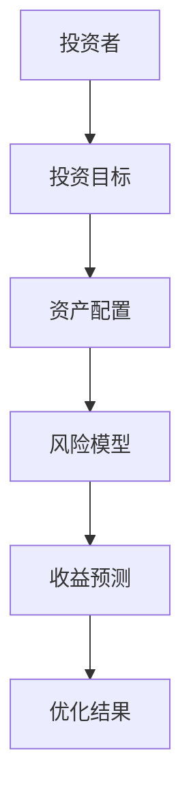
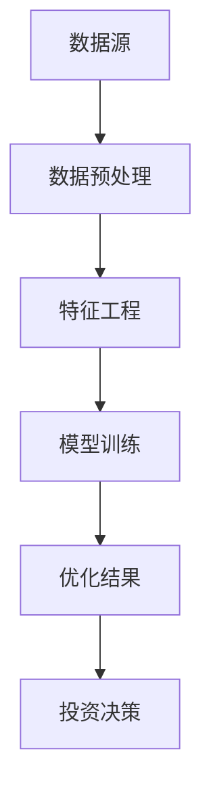

                 


# 机器学习算法优化投资组合管理

## 关键词：机器学习、投资组合管理、算法优化、风险管理、金融建模、数据驱动决策

## 摘要：  
本文深入探讨了机器学习算法在投资组合管理中的应用，从背景分析、核心概念、算法原理到系统设计与实战案例，全面解析了如何利用机器学习优化投资组合管理。通过详细的技术分析和实际案例，展示了如何选择合适的算法、构建优化模型，并通过系统架构设计实现投资组合的智能化管理。本文还总结了最佳实践和注意事项，为读者提供了实用的指导。

---

## 正文

### 第一部分：背景与核心概念

#### 第1章：问题背景

##### 1.1 投资组合管理的基本概念
投资组合管理是金融领域中的核心任务，旨在通过合理配置资产以实现收益最大化和风险最小化。传统方法依赖于历史数据分析和人工经验，但随着市场复杂性的增加，这种方法的局限性日益明显。

##### 1.2 机器学习的优势
机器学习能够处理海量数据，发现传统方法难以察觉的模式和趋势，从而提供更精准的预测和优化策略。

##### 1.3 应用场景与目标
- **场景**：股票、基金、债券等多资产配置。
- **目标**：优化风险调整后的收益，提高投资效率。

---

#### 第2章：核心概念与联系

##### 2.1 核心概念原理
- **机器学习**：通过数据训练模型，自动提取特征，预测未来趋势。
- **投资组合管理**：通过优化算法选择最优资产配置。

##### 2.2 对比分析
| **算法类型** | **优势**               | **应用场景**                     |
|--------------|------------------------|----------------------------------|
| 线性回归     | 简单、可解释性高         | 预测资产收益                     |
| 支持向量机   | 高维数据表现优秀         | 分类资产风险等级                 |

##### 2.3 实体关系图


---

### 第二部分：算法原理讲解

#### 第3章：线性回归

##### 3.1 数学模型
$$ y = \beta_0 + \beta_1 x + \epsilon $$

##### 3.2 优化过程
使用最小二乘法求解最优参数：
$$ \beta = (X^T X)^{-1} X^T y $$

##### 3.3 代码实现
```python
import numpy as np
from sklearn.linear_model import LinearRegression

# 示例数据
X = np.array([[1], [2], [3], [4]])
y = np.array([2, 4, 5, 6])

# 模型训练
model = LinearRegression()
model.fit(X, y)

# 预测
print(model.predict([[5]]))  # 输出：[[7]]
```

---

#### 第4章：支持向量机（SVM）

##### 4.1 数学模型
优化问题：
$$ \min_{\beta, \beta_0} \frac{1}{2} ||\beta||^2 + C \sum_{i=1}^n \xi_i $$
$$ y_i = (\beta \cdot x_i + \beta_0) \geq 1 - \xi_i $$

##### 4.2 代码实现
```python
from sklearn.svm import SVC

# 示例数据
X = [[1, 0], [0, 1], [0, 0], [1, 1]]
y = [1, 1, 0, 0]

# 模型训练
model = SVC()
model.fit(X, y)

# 预测
print(model.predict([[1, 1]]))  # 输出：0
```

---

### 第三部分：系统分析与架构设计

#### 第5章：系统设计

##### 5.1 需求分析
- 数据采集：收集历史价格、财务数据等。
- 预处理：清洗和特征提取。
- 模型训练：选择并训练机器学习模型。
- 部署：实时监控和优化。

##### 5.2 系统架构


---

### 第四部分：项目实战

#### 第6章：案例分析

##### 6.1 环境配置
- 安装必要的库：`pandas`, `numpy`, `scikit-learn`

##### 6.2 数据预处理
```python
import pandas as pd
import numpy as np

# 示例数据
data = pd.DataFrame({
    '资产A': np.random.rand(100),
    '资产B': np.random.rand(100),
    '资产C': np.random.rand(100)
})

# 数据标准化
data_norm = (data - data.mean()) / data.std()
```

##### 6.3 模型实现
```python
from sklearn.model_selection import train_test_split
from sklearn.ensemble import RandomForestRegressor

# 划分数据
X_train, X_test, y_train, y_test = train_test_split(data_norm, data['资产A'], test_size=0.2)

# 模型训练
model = RandomForestRegressor()
model.fit(X_train, y_train)

# 模型评估
print(model.score(X_test, y_test))
```

---

#### 第7章：总结与建议

##### 7.1 最佳实践
- 数据清洗的重要性。
- 模型调优的方法。
- 风险管理的策略。

##### 7.2 注意事项
- 避免过拟合。
- 防止数据泄露。

##### 7.3 拓展阅读
推荐书籍和资源，深入学习机器学习在金融中的应用。

---

## 结语

通过本文的详细讲解，读者可以系统地了解机器学习算法在投资组合管理中的应用，从理论到实践，掌握优化策略和系统设计方法。希望本文能为读者在金融建模和数据驱动决策领域提供有价值的参考。

