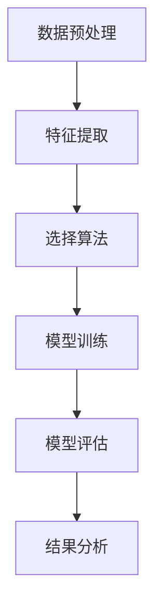

                 


# 《机器学习辅助公司文化评估》

> **关键词**：公司文化评估，机器学习，数据驱动决策，组织行为学，人工智能应用

> **摘要**：公司文化是企业成功的关键因素之一，然而传统公司文化评估方法存在主观性强、数据不足等问题。本文通过机器学习的方法，提出一种基于数据驱动的公司文化评估框架，涵盖数据预处理、特征提取、模型训练与评估，以及系统架构设计等关键环节。结合实际案例，详细解读机器学习在公司文化评估中的应用场景，分析其优缺点，并总结最佳实践。

---

## 第一部分：背景介绍

### 第1章：公司文化评估的背景与挑战

#### 1.1 公司文化的核心概念

公司文化是企业在长期发展过程中形成的价值观、行为准则、思维方式和组织结构的总和。良好的公司文化能够提升员工凝聚力、促进创新、增强企业的市场竞争力。然而，传统公司文化评估方法通常依赖于主观问卷调查和管理者经验判断，存在以下问题：

- 数据量不足，难以全面反映公司文化特征；
- 问卷调查结果受主观因素影响较大；
- 数据分析缺乏深度，难以量化公司文化的核心要素。

#### 1.2 机器学习在公司文化评估中的应用背景

机器学习是一种人工智能技术，通过数据驱动的方法，自动学习数据中的模式和特征。近年来，机器学习在企业数据分析、预测和决策支持中得到了广泛应用。在公司文化评估领域，机器学习的优势包括：

- 可以处理大规模的非结构化数据（如文本、员工行为数据）；
- 能够量化公司文化的隐性特征；
- 可以通过模型预测公司文化对员工绩效、企业绩效的影响。

#### 1.3 机器学习辅助公司文化评估的必要性

随着企业数字化转型的推进，公司文化评估需要更加科学化和数据化。传统的评估方法难以满足现代企业对文化管理的精准需求。机器学习通过引入数据驱动的方法，能够帮助企业在以下方面实现突破：

- **量化评估**：将公司文化的定性特征转化为可量化的指标；
- **实时分析**：通过实时数据捕捉员工行为和态度的变化；
- **预测性分析**：预测公司文化对公司绩效和员工满意度的影响。

---

## 第二部分：核心概念与联系

### 第2章：公司文化与机器学习的核心概念

#### 2.1 公司文化的属性特征对比

| 属性 | 公司文化 | 机器学习 |
|------|----------|----------|
| 核心特征 | 价值观、行为准则 | 数据驱动、自动化学习 |
| 数据类型 | 文本、行为数据 | 结构化与非结构化数据 |
| 变化速度 | 缓慢且受外部环境影响 | 快速迭代且依赖数据输入 |

#### 2.2 公司文化评估的实体关系图

```mermaid
erDiagram
    company {
        id
        name
        culture_features
    }
    employee {
        id
        name
        performance
        feedback
    }
    survey {
        id
        question
        answer
        employee_id
    }
    culture_assessment {
        id
        model
        prediction
        company_id
    }
    company --> employee : 属于
    company --> survey : 进行
    employee --> survey : 参与
    company --> culture_assessment : 使用
```

#### 2.3 机器学习在公司文化评估中的核心原理

机器学习通过以下步骤实现对公司文化的量化评估：

1. **数据收集**：从员工反馈、行为数据、绩效数据等来源获取数据。
2. **特征提取**：将公司文化的核心特征（如团队协作、创新性）转化为可量化的指标。
3. **模型训练**：使用机器学习算法（如支持向量机、随机森林）训练模型，识别公司文化的潜在模式。
4. **预测与分析**：通过模型预测公司文化对员工绩效和企业绩效的影响，并提出改进建议。

---

## 第三部分：算法原理讲解

### 第3章：机器学习算法在公司文化评估中的应用

#### 3.1 数据预处理与特征提取

1. **数据清洗**：去除重复数据、填补缺失值、处理异常值。
2. **特征提取**：将文本数据（如员工反馈）转化为数值型特征（如情感分数）。

示例：将员工反馈文本“我喜欢团队合作”转化为情感分数 $0.85$。

#### 3.2 常见机器学习算法及其适用场景

1. **线性回归**：用于预测公司文化对员工绩效的影响。
2. **支持向量机（SVM）**：用于分类公司文化类型（如创新型、保守型）。
3. **聚类分析**：用于发现员工群体中的文化特征相似性。

#### 3.3 算法流程图



---

## 第四部分：系统分析与架构设计方案

### 第4章：公司文化评估系统的架构设计

#### 4.1 系统功能设计

1. **数据收集模块**：收集员工反馈、行为数据。
2. **模型训练模块**：训练机器学习模型，评估公司文化。
3. **结果展示模块**：生成可视化报告，提供改进建议。

#### 4.2 系统架构设计


#### 4.3 系统接口设计

1. **数据接口**：`GET /api/data` 用于获取员工反馈数据。
2. **模型接口**：`POST /api/model` 用于调用机器学习模型进行预测。

---

## 第五部分：项目实战

### 第5章：机器学习辅助公司文化评估的实现

#### 5.1 环境安装

```bash
pip install numpy pandas scikit-learn
```

#### 5.2 系统核心实现源代码

```python
import pandas as pd
from sklearn.model_selection import train_test_split
from sklearn.svm import SVC
from sklearn.metrics import accuracy_score

# 数据加载
data = pd.read_csv('culture_assessment.csv')

# 特征提取
X = data.drop('culture_type', axis=1)
y = data['culture_type']

# 数据分割
X_train, X_test, y_train, y_test = train_test_split(X, y, test_size=0.2)

# 模型训练
model = SVC()
model.fit(X_train, y_train)

# 模型评估
y_pred = model.predict(X_test)
print(f'准确率：{accuracy_score(y_test, y_pred)}')
```

#### 5.3 代码应用解读与分析

- 数据加载：从 CSV 文件中读取公司文化评估数据。
- 特征提取：选择与公司文化类型相关的特征。
- 数据分割：将数据划分为训练集和测试集。
- 模型训练：使用支持向量机（SVM）训练分类模型。
- 模型评估：计算模型在测试集上的准确率。

---

## 第六部分：总结与展望

### 6.1 最佳实践 tips

- 数据质量是模型性能的关键，确保数据清洗和特征提取的准确性。
- 在实际应用中，结合业务背景解释模型结果，避免过度依赖技术。

### 6.2 小结

机器学习为公司文化评估提供了新的思路和方法。通过数据驱动的方式，企业可以更精准地量化公司文化，优化文化管理策略，提升员工满意度和企业绩效。

### 6.3 注意事项

- 公司文化评估涉及员工隐私，需严格遵守数据保护法规。
- 模型结果需结合业务背景进行解释，避免片面化。

### 6.4 拓展阅读

- 《机器学习实战》
- 《企业级机器学习：大数据条件下的算法部署与应用》

---

通过以上步骤，我们可以看到，机器学习在公司文化评估中的应用具有广阔的前景。未来，随着技术的不断发展，公司文化评估将更加智能化、数据化，为企业管理提供更有力的支持。

