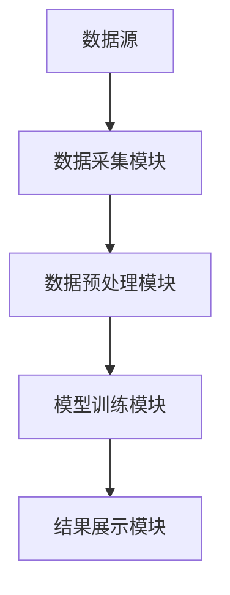

                 


# 《机器学习预测公司自由现金流》

**关键词**：机器学习，现金流预测，数据驱动，财务分析，投资决策，风险管理

**摘要**：机器学习在预测公司自由现金流方面具有重要价值，本文系统探讨了其技术基础、算法原理、系统架构及实际应用。通过详细分析，读者将了解如何利用机器学习模型提升现金流预测的准确性和效率，从而支持更明智的投资和风险管理决策。

---

# 第一部分：机器学习与现金流预测的背景

## 第1章：现金流预测的重要性

### 1.1 现金流预测的定义与作用

#### 1.1.1 现金流预测的定义
现金流预测是指通过分析历史数据和相关因素，预测未来一段时间内公司经营活动、投资活动和筹资活动所产生的现金流入和流出的过程。

#### 1.1.2 现金流预测的作用
现金流预测在企业财务管理中具有重要意义，能够帮助公司制定资金使用计划、优化资本结构、评估投资项目可行性以及降低财务风险。

#### 1.1.3 现金流预测的核心要素
- **历史数据**：包括收入、支出、资产、负债等财务数据。
- **业务模式**：如收入来源、成本结构、销售周期等。
- **外部因素**：如市场环境、经济指标、行业趋势等。

### 1.2 机器学习在现金流预测中的优势

#### 1.2.1 数据驱动的预测优势
机器学习通过处理大量数据，发现传统统计方法难以捕捉的复杂模式，提高预测的准确性和鲁棒性。

#### 1.2.2 机器学习算法的多样性
机器学习提供多种算法，如线性回归、随机森林、神经网络等，适用于不同场景的数据特征和预测目标。

#### 1.2.3 机器学习模型的可解释性
部分机器学习模型（如线性回归、决策树）具有较高的可解释性，便于财务人员理解和验证预测结果。

---

## 第2章：机器学习的定义与特点

### 2.1 机器学习的定义

#### 2.1.1 机器学习的定义
机器学习是一种人工智能技术，通过数据训练模型，使其能够从经验中学习并做出预测或决策。

### 2.2 机器学习的核心特点

#### 2.2.1 数据驱动
机器学习依赖于大量数据进行训练，数据质量和数量直接影响模型性能。

#### 2.2.2 自动学习
模型能够自动从数据中提取特征，无需手动设计特征。

#### 2.2.3 高维度处理
机器学习擅长处理高维数据，能够捕捉复杂的数据模式。

---

# 第二部分：现金流预测的理论基础

## 第3章：现金流预测的数学模型与算法

### 3.1 线性回归模型

#### 3.1.1 线性回归的原理
线性回归通过最小化预测值与实际值的平方差之和，建立自变量与因变量之间的线性关系。

#### 3.1.2 线性回归的数学公式
$$ \text{预测值} = \beta_0 + \beta_1x + \epsilon $$

#### 3.1.3 示例
假设我们有销售数据和广告支出，可以通过线性回归预测未来现金流。

---

## 第4章：支持向量机（SVM）

### 4.1 SVM的原理
SVM通过构建超平面，将数据点分为两类，适用于分类和回归问题。

#### 4.1.1 SVM的数学公式
$$ \text{min} \frac{1}{2}||\beta||^2 + C\sum_{i=1}^n \xi_i $$
$$ y_i = \text{sign}(\beta^T x_i + \beta_0) $$

---

## 第5章：随机森林

### 5.1 随机森林的原理
随机森林通过构建多个决策树，利用投票法进行预测，具有较高的准确性和鲁棒性。

#### 5.1.1 随机森林的数学公式
$$ \text{预测值} = \text{多数投票} $$

---

## 第6章：神经网络

### 6.1 神经网络的原理
神经网络通过多层结构模拟人脑，能够捕捉复杂的非线性关系。

#### 6.1.1 神经网络的数学公式
$$ a^{(l+1)} = \sigma(w^{(l)} a^{(l)} + b^{(l)}) $$

---

# 第三部分：现金流预测的系统分析与架构设计

## 第7章：现金流预测系统的架构设计

### 7.1 系统功能设计

#### 7.1.1 数据采集模块
负责收集公司财务数据、市场数据等。

#### 7.1.2 数据预处理模块
清洗数据、特征工程、数据标准化等。

#### 7.1.3 模型训练模块
选择算法、训练模型、调优参数。

#### 7.1.4 结果展示模块
可视化预测结果、生成报告。

### 7.2 系统架构设计

#### 7.2.1 数据流图


---

# 第四部分：项目实战

## 第8章：现金流预测项目实现

### 8.1 环境配置

#### 8.1.1 安装Python
```bash
python --version
pip install numpy pandas scikit-learn
```

#### 8.1.2 数据集准备
下载财务数据，清洗数据，提取特征。

### 8.2 模型实现

#### 8.2.1 线性回归实现
```python
from sklearn.linear_model import LinearRegression
model = LinearRegression()
model.fit(X_train, y_train)
```

---

## 第9章：结果分析与优化

### 9.1 模型评估

#### 9.1.1 评估指标
- 均方误差（MSE）
- R平方（R²）

### 9.2 模型优化

#### 9.2.1 超参数调优
使用网格搜索或随机搜索优化模型参数。

---

# 第五部分：总结与展望

## 第10章：总结与最佳实践

### 10.1 应用价值
现金流预测能够帮助企业优化资金管理，降低财务风险。

### 10.2 模型选择建议
根据数据特征和业务需求选择合适的算法。

### 10.3 持续优化
定期更新数据，重新训练模型，确保预测的准确性。

---

通过以上目录结构，我们可以系统地探讨机器学习在现金流预测中的应用，从基础理论到实际操作，帮助读者全面理解和掌握这一技术。

