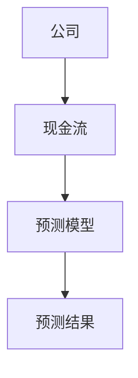
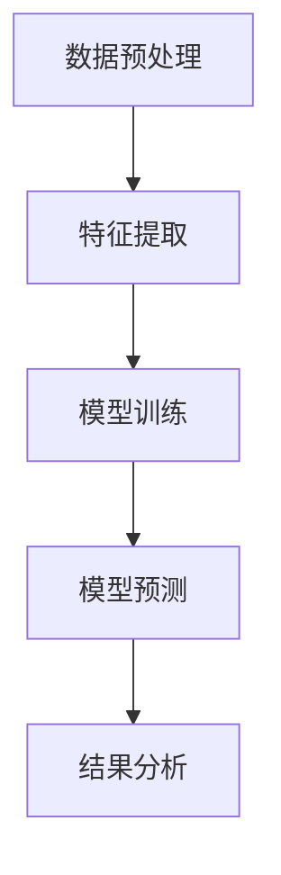

                 


# 机器学习预测公司自由现金流趋势

> 关键词：机器学习，自由现金流，时间序列预测，回归分析，LSTM，金融预测

> 摘要：本文详细探讨了机器学习在预测公司自由现金流趋势中的应用。从自由现金流的基本概念到机器学习算法的原理，再到实际项目实战，本文为读者提供了从理论到实践的全面指导。通过对比传统统计模型与机器学习模型的优缺点，分析了LSTM等先进算法在时间序列预测中的优势，并结合实际案例展示了如何构建一个高效的现金流预测系统。

---

## 目录

1. [自由现金流与机器学习预测概述](#1)
2. [核心概念与原理](#2)
3. [机器学习算法原理与数学模型](#3)
4. [系统分析与架构设计](#4)
5. [项目实战](#5)
6. [总结与展望](#6)

---

### 第1章: 自由现金流与机器学习预测概述

#### 1.1 自由现金流的基本概念

- **1.1.1 自由现金流的定义**
  - 自由现金流（Free Cash Flow，FCF）是企业在扣除所有运营成本、税收和资本支出后的剩余现金流量。
  - FCF = 营业收入 - 营业成本 - 税费 - 折旧 - 资本支出

- **1.1.2 自由现金流的重要性**
  - 企业价值评估的核心指标
  - 投资决策的重要依据
  - 反映企业财务健康状况

- **1.1.3 自由现金流的计算方法**
  - 直接法：净利润 + 非现金费用 - 资本支出
  - 间接法：营业收入 - 营业支出 - 税费 - 资本支出

#### 1.2 机器学习在金融预测中的应用

- **1.2.1 机器学习的基本概念**
  - 机器学习是一种通过数据驱动模型的训练，使其能够从经验中“学习”的人工智能技术。
  - 监督学习、无监督学习、半监督学习、强化学习等主要学习方式。

- **1.2.2 机器学习在金融领域的应用现状**
  - 股票价格预测
  - 风险评估
  - 信用评分
  - 市场情绪分析

- **1.2.3 机器学习在自由现金流预测中的优势**
  - 高维度数据处理能力
  - 时间序列预测的准确性
  - 模型的自适应性

#### 1.3 本章小结

本章主要介绍了自由现金流的基本概念及其在企业中的重要性，并探讨了机器学习在金融预测中的应用及其在现金流预测中的优势。

---

### 第2章: 核心概念与原理

#### 2.1 机器学习的核心原理

- **2.1.1 监督学习与无监督学习的区别**

| 监督学习 | 无监督学习 |
|----------|------------|
| 需要标记数据 | 无标记数据 |
| 常用于分类和回归任务 | 常用于聚类和异常检测 |

- **2.1.2 回归与分类任务的区别**

| 回归任务 | 分类任务 |
|----------|----------|
| 预测连续值 | 预测离散值 |
| 示例：预测房价 | 示例：预测垃圾邮件 |

- **2.1.3 时间序列预测的基本原理**

时间序列预测是通过历史数据预测未来趋势的方法，常用于股票价格、经济指标等预测。

#### 2.2 自由现金流预测的数学模型

- **2.2.1 线性回归模型**

$$ y = \beta_0 + \beta_1x + \epsilon $$

- **2.2.2 非线性回归模型**

$$ y = \beta_0 + \beta_1x + \beta_2x^2 + \epsilon $$

- **2.2.3 时间序列模型的分类**

| AR模型 | MA模型 | ARMA模型 | LSTM模型 |
|--------|--------|----------|----------|
| 自回归模型 | 移动平均模型 | 综合自回归和移动平均模型 | 长短期记忆网络 |

#### 2.3 机器学习与传统统计模型的对比

- **2.3.1 传统统计模型的特点**

| 特点 | 描述 |
|------|------|
| 简单性 | 模型简单，易于解释 |
| 计算效率 | 计算效率高，适合小数据集 |

- **2.3.2 机器学习模型的特点**

| 特点 | 描述 |
|------|------|
| 高维度数据处理 | 能够处理高维数据 |
| 自适应性 | 模型能够自适应数据变化 |
| 预测精度 | 在大数据集上表现更优 |

- **2.3.3 两种方法的优缺点对比**

| 对比维度 | 传统统计模型 | 机器学习模型 |
|----------|--------------|--------------|
| 解释性 | 高 | 低（如神经网络） |
| 计算效率 | 高 | 低（如深度学习） |
| 适用场景 | 小数据集、简单问题 | 大数据集、复杂问题 |

#### 2.4 实体关系图与流程图

- **2.4.1 自由现金流预测的实体关系图（ER图）**



- **2.4.2 机器学习预测流程图（Mermaid）**



---

### 第3章: 机器学习算法原理与数学模型

#### 3.1 线性回归算法

- **3.1.1 线性回归的数学模型**

$$ y = \beta_0 + \beta_1x + \epsilon $$

- **3.1.2 最小二乘法的原理**

$$ \text{最小化} \sum (y_i - \hat{y}_i)^2 $$

- **3.1.3 线性回归的实现代码**

```python
import numpy as np
from sklearn.linear_model import LinearRegression

# 示例数据
X = np.array([1, 2, 3, 4]).reshape(-1, 1)
y = np.array([2, 4, 5, 6])

# 模型训练
model = LinearRegression()
model.fit(X, y)

# 预测
print(model.predict(X))  # 输出预测结果
```

---

#### 3.2 随机森林算法

- **3.2.1 随机森林的数学模型**

随机森林是一种基于决策树的集成学习方法，通过投票或平均的方式进行预测。

- **3.2.2 随机森林的实现代码**

```python
from sklearn.ensemble import RandomForestRegressor

# 示例数据
X = np.array([[1, 2], [3, 4], [5, 6], [7, 8]])
y = np.array([2, 4, 5, 6])

# 模型训练
model = RandomForestRegressor(n_estimators=100)
model.fit(X, y)

# 预测
print(model.predict(X))  # 输出预测结果
```

#### 3.3 支持向量回归算法

- **3.3.1 支持向量回归的数学模型**

支持向量回归（Support Vector Regression, SVR）通过构建支持向量来优化回归问题。

- **3.3.2 支持向量回归的实现代码**

```python
from sklearn.svm import SVR

# 示例数据
X = np.array([[1, 2], [3, 4], [5, 6], [7, 8]])
y = np.array([2, 4, 5, 6])

# 模型训练
model = SVR(kernel='rb

