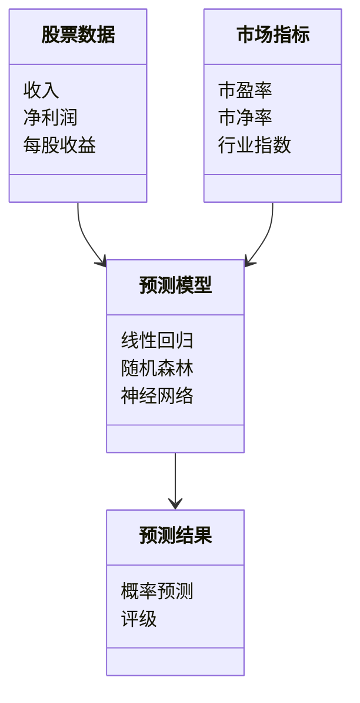
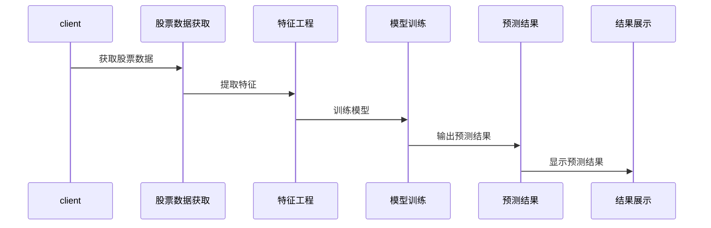

                 


# 机器学习预测费雪成长股表现

> 关键词：机器学习，股票预测，费雪成长股，金融数据分析，随机森林，神经网络，时间序列分析

> 摘要：本文深入探讨了如何利用机器学习技术预测费雪成长股的表现。通过分析费雪成长股的特点，结合机器学习算法的优势，构建了一个完整的预测系统，详细讲解了从数据获取、特征工程到模型训练的全过程，并通过实际案例展示了系统的实现与优化。

---

## 第一章：费雪成长股与机器学习预测概述

### 1.1 费雪成长股的定义与特点

#### 1.1.1 费雪成长股的定义
费雪成长股是指那些收入和利润持续增长的公司股票，这些公司通常具有较高的成长潜力。费雪投资理念强调长期增长和股东价值的提升。

#### 1.1.2 费雪成长股的核心特点
- **收入持续增长**：费雪成长股公司的收入每年都有显著增长。
- **高利润率**：这些公司通常具有较高的净利润率。
- **行业领先地位**：费雪成长股公司往往在行业内具有领先地位，能够持续创新和扩张。
- **股息增长**：部分费雪成长股公司会持续增加股息，吸引长期投资者。

#### 1.1.3 费雪成长股的投资价值
费雪成长股的投资价值体现在其长期增长潜力上。通过投资这些股票，投资者可以分享公司成长的成果，实现资产的长期增值。

### 1.2 机器学习在金融预测中的应用

#### 1.2.1 机器学习在金融领域的应用现状
机器学习在金融领域的应用广泛，包括股票价格预测、风险评估、交易策略优化等。通过分析历史数据和市场行为，机器学习模型能够捕捉复杂的市场规律。

#### 1.2.2 机器学习在股票预测中的优势
- **数据处理能力**：机器学习能够处理海量数据，发现传统方法难以察觉的模式。
- **非线性关系**：许多金融数据呈现非线性关系，机器学习模型（如神经网络）能够更好地捕捉这些关系。
- **实时更新**：机器学习模型可以动态更新，适应市场的变化。

#### 1.2.3 费雪成长股预测的可行性分析
费雪成长股的持续增长特性使其适合用机器学习进行预测。通过对公司财务数据和市场数据的分析，机器学习模型可以识别出潜在的高成长公司。

### 1.3 费雪成长股预测的背景与意义

#### 1.3.1 股票市场预测的复杂性
股票市场受到多种因素的影响，包括宏观经济环境、行业趋势和公司基本面等。这些因素相互作用，使得股票价格预测具有高度不确定性。

#### 1.3.2 费雪成长股预测的挑战
费雪成长股预测的挑战在于如何准确捕捉公司的成长潜力，同时应对市场的波动性。此外，数据的稀缺性和模型的泛化能力也是需要解决的问题。

#### 1.3.3 机器学习在费雪成长股预测中的潜力
机器学习在处理复杂数据和非线性关系方面的优势，使其成为费雪成长股预测的理想工具。通过构建有效的特征和优化模型，可以提高预测的准确性和可靠性。

---

## 第二章：机器学习预测的核心概念与联系

### 2.1 机器学习的基本原理

#### 2.1.1 机器学习的定义与分类
机器学习是一种通过数据训练模型，使其能够进行预测或决策的技术。根据学习方式，可以分为监督学习、无监督学习和强化学习。

#### 2.1.2 监督学习、无监督学习与强化学习
- **监督学习**：基于标注数据进行训练，适用于回归和分类任务。
- **无监督学习**：基于未标注数据进行训练，适用于聚类和降维任务。
- **强化学习**：通过与环境交互，学习最优策略。

#### 2.1.3 回归与分类问题
- **回归问题**：预测连续型输出，如股票价格。
- **分类问题**：预测离散型输出，如股票涨跌。

### 2.2 费雪成长股预测的机器学习模型选择

#### 2.2.1 线性回归模型
线性回归是一种简单但有效的回归模型，适用于线性关系的预测。其数学公式为：
$$ y = \beta_0 + \beta_1x_1 + \beta_2x_2 + \dots + \beta_nx_n $$

#### 2.2.2 随机森林模型
随机森林是一种基于决策树的集成学习方法，具有较高的鲁棒性和准确性。其核心思想是通过构建多棵决策树，取其预测结果的多数投票或平均值。

#### 2.2.3 神经网络模型
神经网络是一种模仿人脑结构和功能的深度学习模型，能够捕捉复杂的非线性关系。其网络结构包括输入层、隐藏层和输出层。

### 2.3 机器学习与费雪成长股预测的关联

#### 2.3.1 数据特征的重要性
在费雪成长股预测中，特征工程是关键。常见的特征包括公司财务指标（如营收增长率、净利润率）和市场指标（如市盈率、市净率）。

#### 2.3.2 模型选择与优化
模型选择需要考虑数据特性、任务目标和计算资源。优化过程包括参数调优和模型评估。

#### 2.3.3 预测结果的解释性
解释性是费雪成长股预测的重要要求。模型的可解释性有助于投资者理解预测结果的原因。

---

## 第三章：机器学习预测的数学模型与公式

### 3.1 线性回归模型

#### 3.1.1 线性回归的数学公式
$$ y = \beta_0 + \beta_1x + \epsilon $$
其中，$y$ 是目标变量，$x$ 是自变量，$\beta_0$ 和 $\beta_1$ 是回归系数，$\epsilon$ 是误差项。

#### 3.1.2 最小二乘法的优化过程
$$ \text{最小化} \sum_{i=1}^n (y_i - (\beta_0 + \beta_1x_i))^2 $$

### 3.2 随机森林模型

#### 3.2.1 随机森林的集成学习原理
随机森林通过 bootstrap 样本和随机特征选择，构建多棵决策树，并将预测结果进行集成。

### 3.3 神经网络模型

#### 3.3.1 神经网络的结构与训练过程
神经网络由输入层、隐藏层和输出层组成。训练过程通过反向传播算法更新权重，最小化预测误差。

---

## 第四章：系统分析与架构设计

### 4.1 项目需求分析

#### 4.1.1 问题场景介绍
费雪成长股预测系统的目标是基于公司财务数据和市场数据，预测股票的未来表现。

#### 4.1.2 项目介绍
本项目旨在构建一个费雪成长股预测系统，帮助投资者识别具有高成长潜力的股票。

### 4.2 系统功能设计

#### 4.2.1 领域模型（Mermaid 类图）


#### 4.2.2 系统架构设计（Mermaid 架构图）
```mermaid
client
    ----
    股票数据获取
    ----
    特征工程
    ----
    模型训练
    ----
    结果展示
```

### 4.3 系统接口设计

#### 4.3.1 数据接口
系统需要从数据源获取股票数据和市场指标，接口设计应支持数据清洗和特征提取。

#### 4.3.2 模型接口
模型接口需要支持多种算法的调用和预测结果的输出。

### 4.4 系统交互设计（Mermaid 序列图）


---

## 第五章：项目实战

### 5.1 环境安装

#### 5.1.1 安装 Python 和相关库
```bash
pip install numpy pandas scikit-learn tensorflow
```

### 5.2 系统核心实现

#### 5.2.1 数据获取与预处理
```python
import pandas as pd
import numpy as np

# 获取股票数据
data = pd.read_csv('stock_data.csv')
# 数据清洗
data = data.dropna()
# 特征提取
features = data[['收入', '净利润', '每股收益', '市盈率', '市净率', '行业指数']]
```

#### 5.2.2 模型训练与优化
```python
from sklearn.ensemble import RandomForestRegressor
from sklearn.model_selection import train_test_split
from sklearn.metrics import mean_squared_error

# 划分训练集和测试集
X_train, X_test, y_train, y_test = train_test_split(features, data['股价'], test_size=0.2)
# 训练随机森林模型
model = RandomForestRegressor()
model.fit(X_train, y_train)
# 模型评估
y_pred = model.predict(X_test)
print(mean_squared_error(y_test, y_pred))
```

#### 5.2.3 结果展示与分析
```python
import matplotlib.pyplot as plt

plt.plot(y_test, label='实际值')
plt.plot(y_pred, label='预测值')
plt.legend()
plt.show()
```

### 5.3 实际案例分析

#### 5.3.1 数据来源与特征选择
选择具有代表性的费雪成长股，提取其财务数据和市场指标。

#### 5.3.2 模型实现与优化
通过交叉验证优化模型参数，选择最佳模型。

#### 5.3.3 结果解读与策略制定
根据预测结果制定投资策略，重点关注高概率的上涨股票。

### 5.4 项目小结

#### 5.4.1 项目总结
通过项目实战，验证了机器学习在费雪成长股预测中的有效性。

#### 5.4.2 经验总结
- 数据清洗和特征工程对模型性能影响重大。
- 模型选择和优化需要结合实际数据和业务需求。

---

## 第六章：总结与展望

### 6.1 总结
本文详细探讨了机器学习在费雪成长股预测中的应用，从理论到实践，构建了一个完整的预测系统。通过实际案例验证了模型的有效性。

### 6.2 未来展望
未来可以进一步优化模型，引入更复杂的算法，如深度学习和集成学习。同时，可以结合更多数据源，如新闻和社交媒体数据，提高预测的准确性。

### 6.3 注意事项
- 模型预测结果仅供参考，实际投资需谨慎。
- 模型需要定期更新，以适应市场变化。

### 6.4 拓展阅读
推荐读者阅读《机器学习实战》和《股票技术分析》，深入理解机器学习和股票预测的更多内容。

---

# 结语

通过本文的详细讲解，读者可以掌握机器学习预测费雪成长股表现的核心方法。从理论到实践，从算法到系统，逐步构建一个高效的预测模型，为投资决策提供有力支持。

