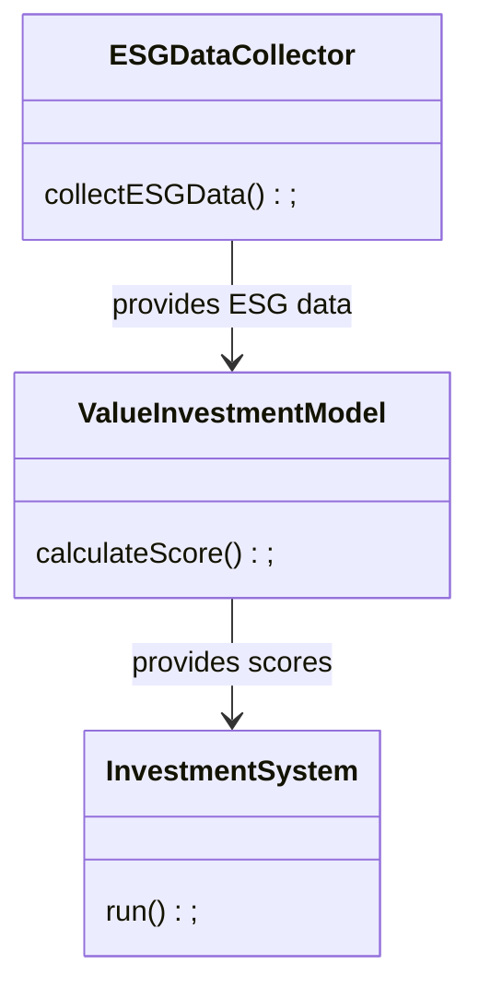
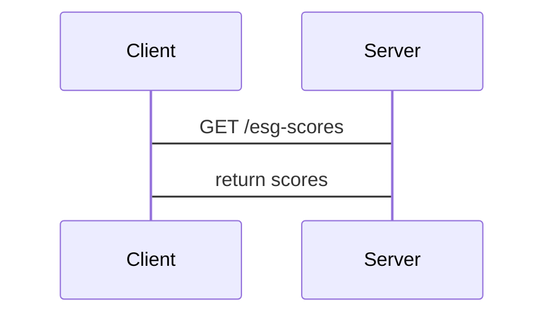

                 


```markdown
# 杰里米·格兰瑟姆的ESG价值投资整合

> 关键词：ESG投资、价值投资、整合方法、系统架构、案例分析

> 摘要：本文详细探讨了如何将ESG（环境、社会、治理）因素整合到传统价值投资策略中，通过构建数学模型和系统架构，展示了如何利用ESG评估体系优化投资决策。文章从理论背景、整合方法到系统实现，全面分析了杰里米·格兰瑟姆的ESG价值投资整合策略，提供了丰富的案例和代码示例，为投资者提供了实践指导。

---

## 第一部分: ESG投资背景与价值投资整合概述

### 第1章: ESG投资的背景与现状

#### 1.1 ESG投资的定义与核心概念
##### 1.1.1 环境（Environmental）的内涵与外延
- 环境维度关注企业的环境影响，包括碳排放、资源利用效率等。
- 通过ER图展示环境维度的核心指标：
```mermaid
erDiagram
    env : 环境指标
    attributes
    env -->|拥有| env_indicators
    env -->|包含| emission, resource_usage, waste_management
```
##### 1.1.2 社会责任（Social）的内涵与外延
- 社会维度关注企业对社会的影响，包括员工权益、社区参与等。
- 通过表格对比社会维度与环境维度的关键指标：
| 维度 | 指标 | 描述 |
|------|------|------|
| 环境 | 碳排放 | 企业运营中的温室气体排放 |
| 社会 | 员工权益 | 员工工资、工作条件等 |
##### 1.1.3 治理结构（Governance）的内涵与外延
- 治理维度关注企业的管理结构和透明度，包括董事会构成、内部审计等。

#### 1.2 ESG投资的发展历程
##### 1.2.1 国际ESG投资的发展史
- 从20世纪90年代开始，ESG投资逐步从欧洲扩展到全球。
##### 1.2.2 国内ESG投资的现状与趋势
- 近年来，国内ESG投资快速增长，受到政策和市场的双重推动。

#### 1.3 ESG投资对传统价值投资的影响
##### 1.3.1 传统价值投资的局限性
- 传统价值投资主要关注财务指标，忽视了非财务因素对企业长期价值的影响。
##### 1.3.2 ESG投资的补充与整合作用
- ESG投资通过引入环境、社会和治理因素，弥补了传统价值投资的不足。

### 第2章: 价值投资理论基础

#### 2.1 价值投资的核心原理
##### 2.1.1 价值投资的基本假设
- 市场短期波动，但长期趋向于反映企业的内在价值。
##### 2.1.2 价值投资的关键要素
- 企业的财务状况、管理团队、行业地位等。
##### 2.1.3 价值投资的适用场景
- 适用于成熟市场中的低估股票。

### 第3章: ESG与价值投资的整合方法论

#### 3.1 ESG评估体系的核心要素
##### 3.1.1 环境维度的评估指标
- 碳排放强度、能源使用效率等。
##### 3.1.2 社会维度的评估指标
- 员工满意度、社会责任支出等。
##### 3.1.3 治理维度的评估指标
- 董事会多样性、高管薪酬结构等。

#### 3.2 ESG与价值投资的整合模型
##### 3.2.1 模型构建的逻辑框架
- 将ESG评分与传统价值指标（如市盈率、市净率）相结合。
##### 3.2.2 模型的数学表达式
$$
\text{综合评分} = \alpha \times \text{ESG评分} + \beta \times \text{传统价值指标}
$$
其中，$\alpha$ 和 $\beta$ 是模型权重系数，需通过历史数据进行优化。

#### 3.3 模型的验证与优化
##### 3.3.1 模型的验证方法
- 使用历史数据回测模型的有效性。
##### 3.3.2 模型的优化策略
- 调整权重系数，以提高模型的预测精度。

---

## 第二部分: ESG价值投资系统的架构与实现

### 第4章: ESG价值投资系统的架构设计

#### 4.1 系统功能模块划分
##### 4.1.1 数据采集模块
- 从公开数据源（如 Bloomberg、MSCI）获取企业ESG评分和传统财务数据。
##### 4.1.2 模型计算模块
- 实现ESG与价值投资的整合模型，计算综合评分。

#### 4.2 系统架构设计
##### 4.2.1 系统功能设计（领域模型）

##### 4.2.2 系统架构设计（系统架构图）


#### 4.3 系统接口与交互
##### 4.3.1 系统接口设计
- RESTful API，如 `GET /esg-scores`。
##### 4.3.2 系统交互设计


### 第5章: 项目实战与案例分析

#### 5.1 环境安装
```bash
pip install requests pandas numpy
```

#### 5.2 核心代码实现
```python
import pandas as pd
import numpy as np

def calculate_esg_score(enterprise):
    # 计算环境评分
    env_score = enterprise['carbon_emission'] / enterprise['revenue'] * 100
    # 计算社会评分
    social_score = (enterprise['employee_welfare'] + enterprise['community_investment']) / enterprise['revenue'] * 100
    # 计算治理评分
    governance_score = (enterprise['board_diversity'] + enterprise['executive_bonus']) / 2 * 100
    # 返回综合评分
    return env_score * 0.4 + social_score * 0.3 + governance_score * 0.3

# 示例数据
data = {
    'carbon_emission': [100, 200],
    'employee_welfare': [50, 70],
    'community_investment': [30, 40],
    'board_diversity': [0.6, 0.8],
    'executive_bonus': [0.2, 0.3]
}

df = pd.DataFrame(data)
df['esg_score'] = df.apply(lambda x: calculate_esg_score(x), axis=1)
print(df)
```

#### 5.3 案例分析
- 通过具体案例展示模型的应用效果，如分析某企业的ESG评分与传统价值指标的结合。

### 第6章: 最佳实践与总结

#### 6.1 小结
- 总结文章的主要内容和研究成果。

#### 6.2 注意事项
- 强调在实际应用中需要注意数据质量、模型权重调整等问题。

#### 6.3 拓展阅读
- 提供与主题相关的进一步阅读资料。

---

## 第三部分: 总结与展望

### 6.4 总结
- ESG投资与价值投资的整合是未来投资的重要趋势，本文通过理论与实践相结合，展示了如何构建有效的整合模型。

### 6.5 展望
- 展望未来的研究方向，如引入机器学习算法优化模型、扩展更多行业的应用等。

---

## 结语

通过本文的详细阐述，读者可以全面理解杰里米·格兰瑟姆的ESG价值投资整合方法，并通过实际案例和代码实现，掌握如何在投资决策中引入ESG因素。希望本文能为投资者提供有价值的参考和启发。
```

