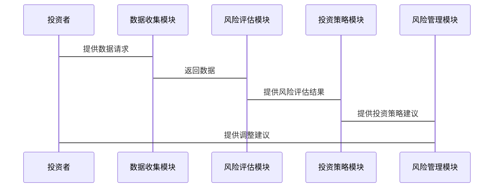

                 


# 杰里米·格兰瑟姆的气候变化投资策略

> 关键词：气候变化投资，风险管理，可再生能源，碳中和，投资策略，杰里米·格兰瑟姆

> 摘要：本文将深入探讨杰里米·格兰瑟姆的气候变化投资策略，从气候变化的经济影响、投资策略的核心概念、算法原理、系统架构设计、项目实战以及最佳实践等方面进行详细分析。通过科学的模型构建、系统的架构设计、丰富的案例分析，帮助投资者更好地理解和应用气候变化投资策略，抓住碳中和时代的投资机遇，规避潜在风险。

---

## 第1章: 气候变化的经济影响

### 1.1 气候变化的定义与背景

#### 1.1.1 气候变化的科学定义
气候变化是指全球气候系统长期的变化趋势，主要由人类活动（如化石燃料的使用、森林砍伐等）引起的温室气体排放增加导致。这些变化包括全球变暖、极端天气事件增多、海平面上升等，对全球经济、社会和生态系统产生深远影响。

#### 1.1.2 气候变化的经济影响
气候变化对经济的影响是多方面的，包括但不限于：
- **经济损失**：极端天气事件（如飓风、洪水）导致的财产损失和基础设施破坏。
- **产业转型**：传统高碳产业（如煤炭、石油）的衰退和新能源产业（如太阳能、风能）的崛起。
- **政策成本**：为应对气候变化，各国政府可能需要投入大量资金用于减排、适应和应对措施。

#### 1.1.3 气候变化对企业投资的影响
- **投资机会**：新能源、绿色技术等领域投资需求增加。
- **投资风险**：传统高碳资产的贬值风险和政策风险上升。
- **企业社会责任**：投资者越来越关注企业的环境表现，ESG（环境、社会、治理）投资理念逐渐成为主流。

### 1.2 气候变化对全球经济的潜在影响

#### 1.2.1 气候变化对能源行业的冲击
- **化石能源需求下降**：随着全球向可再生能源转型，煤炭、石油等传统能源的需求可能大幅减少。
- **新能源投资增加**：太阳能、风能等可再生能源的投资机会增加，相关产业链（如电池、储能技术）也将受益。

#### 1.2.2 气候变化对农业的影响
- **气候变化导致的干旱、洪水等极端天气事件增加，影响农作物产量，推高粮食价格。
- **农业技术革新**：气候智能型农业（如精准农业、滴灌技术）的投资机会增加。

#### 1.2.3 气候变化对金融市场的潜在影响
- **资产价格波动**：高碳资产的价值可能大幅下降，而低碳资产的价值可能上升。
- **金融监管加强**：各国政府可能出台更严格的碳排放标准，迫使企业调整业务模式。

### 1.3 气候变化对投资策略的影响

#### 1.3.1 气候变化投资的定义
气候变化投资是指将气候变化因素纳入投资决策，通过投资于适应或减缓气候变化的企业或项目，以实现长期收益的投资策略。

#### 1.3.2 气候变化投资的核心要素
- **碳排放模型**：评估企业或项目的碳排放情况。
- **气候变化情景分析**：模拟不同气候变化情景下资产的价值变化。
- **风险管理**：识别和管理与气候变化相关的投资风险。

#### 1.3.3 气候变化投资的边界与外延
- **边界**：气候变化投资的核心是通过减少碳排放或适应气候变化来实现投资收益。
- **外延**：包括与气候变化相关的技术创新、政策变化、市场趋势等。

### 1.4 气候变化投资的背景与现状

#### 1.4.1 气候变化投资的兴起
随着全球气候变化问题的加剧，投资者开始意识到气候变化对经济和投资的影响，气候变化投资逐渐兴起。

#### 1.4.2 气候变化投资的全球趋势
- **全球范围内的政策支持**：各国政府纷纷出台支持绿色投资的政策。
- **投资者意识的提高**：越来越多的投资者将ESG因素纳入投资决策。

#### 1.4.3 气候变化投资的政策支持
- **碳定价机制**：通过碳税或碳交易机制，为高碳排放企业创造经济压力。
- **政府补贴**：政府对绿色技术的研发和推广提供资金支持。

### 1.5 本章小结
本章主要介绍了气候变化的定义、经济影响、对投资策略的影响以及其兴起的背景和政策支持。通过这些分析，我们可以看到气候变化不仅是环境问题，更是经济和投资领域的重要议题。

---

## 第2章: 气候变化投资的核心概念与联系

### 2.1 气候变化投资的核心概念

#### 2.1.1 气候变化投资的定义
气候变化投资是指投资者将气候变化因素纳入投资决策，通过投资于适应或减缓气候变化的企业或项目，以实现长期收益的投资策略。

#### 2.1.2 气候变化投资的属性特征
- **长期性**：气候变化的影响是长期的，因此需要长期的投资策略。
- **风险性**：气候变化可能导致资产价格波动，带来投资风险。
- **社会性**：气候变化投资不仅是经济活动，也涉及社会责任。

### 2.2 气候变化投资与传统投资的区别

#### 2.2.1 投资目标的差异
- **传统投资**：追求短期收益最大化。
- **气候变化投资**：注重长期可持续发展，关注企业的环境表现。

#### 2.2.2 投资策略的差异
- **传统投资**：基于市场波动、公司财务数据等传统指标。
- **气候变化投资**：基于碳排放、气候变化情景分析等新兴指标。

#### 2.2.3 风险管理的差异
- **传统投资**：关注市场风险、信用风险等。
- **气候变化投资**：额外关注与气候变化相关的物理风险和政策风险。

### 2.3 气候变化投资的ER实体关系图


### 2.4 气候变化投资的核心要素

#### 2.4.1 气候变化的科学模型
- **IPCC报告**：政府间气候变化专门委员会（IPCC）的报告是气候变化科学研究的权威依据。
- **气候变化情景分析**：通过模拟不同情景（如RCP2.6、RCP4.5、RCP6.0、RCP8.5）来评估气候变化的影响。

#### 2.4.2 气候变化的经济模型
- **碳排放模型**：用于估算企业在不同情景下的碳排放量。
- **经济损失模型**：评估气候变化对经济和社会的具体影响。

#### 2.4.3 气候变化的政策框架
- **碳定价机制**：如碳税和碳交易。
- **政策支持**：如政府对绿色技术的补贴和税收优惠。

### 2.5 气候变化投资的系统架构

#### 2.5.1 系统功能设计
- **数据收集**：收集企业的碳排放数据、市场数据等。
- **风险评估**：基于气候变化情景分析，评估投资风险。
- **投资策略制定**：根据风险评估结果，制定投资策略。
- **风险管理**：实时监控和调整投资组合，以应对气候变化带来的风险。

#### 2.5.2 系统架构图


### 2.6 本章小结
本章详细介绍了气候变化投资的核心概念、与传统投资的区别以及系统的架构设计。通过这些分析，我们可以更好地理解气候变化投资的本质和实施方式。

---

## 第3章: 气候变化投资的算法原理

### 3.1 气候变化投资的算法概述

#### 3.1.1 气候变化投资的核心算法
- **碳排放模型**：用于估算企业在不同情景下的碳排放量。
- **气候变化情景分析**：通过模拟不同情景，评估气候变化对投资的影响。

#### 3.1.2 气候变化投资的算法特点
- **数据驱动**：依赖大量的气候数据和市场数据。
- **动态调整**：根据气候变化的新数据和政策变化，动态调整算法。

### 3.2 气候变化投资的算法实现

#### 3.2.1 线性回归模型
- **目的**：预测企业在不同情景下的碳排放量。
- **公式**：
  $$ y = \beta_0 + \beta_1x + \epsilon $$
  其中，$y$ 是碳排放量，$x$ 是相关变量（如能源消耗量），$\beta_0$ 和 $\beta_1$ 是回归系数，$\epsilon$ 是误差项。

#### 3.2.2 情景分析模型
- **目的**：模拟不同气候变化情景下资产的价值变化。
- **步骤**：
  1. 定义情景（如RCP2.6、RCP4.5、RCP6.0、RCP8.5）。
  2. 为每个情景设定参数（如温度变化、降水变化等）。
  3. 根据参数计算资产的价值变化。

#### 3.2.3 风险评估模型
- **目的**：评估气候变化对投资组合的风险影响。
- **方法**：
  1. 计算每种资产在不同情景下的收益和损失。
  2. 根据资产的相关性，计算投资组合的风险敞口。

### 3.3 气候变化投资的Python代码实现

#### 3.3.1 碳排放模型的实现

```python
import numpy as np
import pandas as pd
from sklearn.linear_model import LinearRegression

# 假设我们有碳排放数据和相关变量
data = pd.DataFrame({
    'Energy_Consumption': [10, 15, 20, 25, 30],
    'Carbon_Emission': [5, 8, 12, 16, 20]
})

# 使用线性回归模型预测碳排放
model = LinearRegression()
model.fit(data[['Energy_Consumption']], data['Carbon_Emission'])

# 预测新的能源消耗下的碳排放
new_energy = np.array([[22]])
predicted_emission = model.predict(new_energy)
print(f"Predicted Carbon Emission: {predicted_emission[0]:.2f}")
```

#### 3.3.2 情景分析模型的实现

```python
import numpy as np
import pandas as pd
import random

# 定义情景
scenarios = ['RCP2.6', 'RCP4.5', 'RCP6.0', 'RCP8.5']

# 为每个情景生成随机的温度变化数据
temperature_change = {}
for scenario in scenarios:
    temperature_change[scenario] = random.uniform(1.0, 5.0)

# 根据温度变化计算资产价值变化
def calculate_asset_value(price, temperature_change):
    return price * (1 - temperature_change / 10)

# 示例：计算不同情景下的资产价值
initial_price = 100
values = {}
for scenario in scenarios:
    values[scenario] = calculate_asset_value(initial_price, temperature_change[scenario])

print(values)
```

### 3.4 本章小结
本章详细介绍了气候变化投资的核心算法，包括线性回归模型、情景分析模型和风险评估模型的实现。通过这些算法，投资者可以更好地理解和应对气候变化带来的风险和机会。

---

## 第4章: 气候变化投资的系统架构设计

### 4.1 系统功能设计

#### 4.1.1 数据收集模块
- **功能**：收集与气候变化相关的数据，如碳排放数据、市场数据、政策数据等。

#### 4.1.2 风险评估模块
- **功能**：基于收集的数据，评估气候变化对投资组合的风险影响。

#### 4.1.3 投资策略模块
- **功能**：根据风险评估结果，制定相应的投资策略。

#### 4.1.4 风险管理模块
- **功能**：实时监控投资组合的表现，动态调整投资策略以应对气候变化。

### 4.2 系统架构图


### 4.3 系统接口设计

#### 4.3.1 数据接口
- **输入**：碳排放数据、市场数据等。
- **输出**：风险评估结果。

#### 4.3.2 投资策略接口
- **输入**：风险评估结果。
- **输出**：投资策略建议。

#### 4.3.3 风险管理接口
- **输入**：投资组合表现。
- **输出**：调整建议。

### 4.4 系统交互序列图



### 4.5 本章小结
本章详细介绍了气候变化投资系统的功能设计、架构设计和接口设计。通过这些设计，我们可以构建一个高效、可靠的气候变化投资系统。

---

## 第5章: 气候变化投资的项目实战

### 5.1 项目背景

#### 5.1.1 项目目标
- **目标**：通过气候变化投资策略，实现长期的资产增值。

#### 5.1.2 项目范围
- **范围**：选择可再生能源行业作为投资标的，制定相应的投资策略。

### 5.2 项目实施

#### 5.2.1 数据收集
- **数据来源**：收集可再生能源企业的碳排放数据、财务数据、市场数据等。

#### 5.2.2 风险评估
- **方法**：使用线性回归模型和情景分析模型，评估气候变化对可再生能源投资的影响。

#### 5.2.3 投资策略制定
- **策略**：基于风险评估结果，制定长期投资策略，重点投资于技术领先、管理优秀的可再生能源企业。

#### 5.2.4 风险管理
- **方法**：实时监控投资组合的表现，动态调整投资策略，以应对气候变化带来的风险。

### 5.3 项目案例分析

#### 5.3.1 案例选择
- **案例**：某可再生能源企业的投资分析。

#### 5.3.2 数据分析
- **分析**：基于历史数据，预测企业在不同情景下的碳排放和资产价值。

#### 5.3.3 投资建议
- **建议**：基于分析结果，提出具体的投资建议。

### 5.4 本章小结
本章通过一个具体的项目案例，详细介绍了气候变化投资策略的实施过程，从数据收集到风险评估，再到投资策略的制定和风险管理。

---

## 第6章: 气候变化投资的最佳实践

### 6.1 投资者的最佳实践

#### 6.1.1 知识储备
- **建议**：投资者需要深入了解气候变化的科学知识和经济影响。

#### 6.1.2 数据驱动
- **建议**：基于可靠的数据和模型，制定投资策略。

#### 6.1.3 长期视角
- **建议**：气候变化投资需要长期视角，关注企业的可持续发展能力。

### 6.2 风险管理的最佳实践

#### 6.2.1 定期评估
- **建议**：定期评估投资组合的风险敞口，及时调整策略。

#### 6.2.2 情景分析
- **建议**：基于不同的气候变化情景，制定相应的风险管理措施。

### 6.3 信息披露的最佳实践

#### 6.3.1 透明报告
- **建议**：定期向投资者披露气候变化投资的相关信息，增强信任。

#### 6.3.2 标准化报告
- **建议**：采用国际通用的ESG报告标准，方便投资者理解和比较。

### 6.4 本章小结
本章总结了气候变化投资的最佳实践，包括知识储备、数据驱动、长期视角、定期评估、情景分析、透明报告和标准化报告等方面，为投资者提供了宝贵的参考。

---

## 第7章: 总结与展望

### 7.1 本研究的主要结论

- 气候变化是影响全球经济和投资的重要因素。
- 气候变化投资需要结合科学模型、算法和系统架构设计。
- 通过合理的投资策略和风险管理，投资者可以在气候变化时代实现长期收益。

### 7.2 未来研究的方向

- **技术进步**：探索更先进的气候变化预测模型和投资算法。
- **政策支持**：推动更多支持绿色投资的政策出台。
- **国际合作**：加强国际合作，共同应对气候变化挑战。

### 7.3 展望

随着全球气候变化问题的加剧，气候变化投资将成为未来投资的重要方向。通过科学的策略和有效的管理，投资者可以在碳中和时代抓住机遇，规避风险，实现可持续发展。

---

## 参考文献

1. IPCC, 2021. Climate Change 2021: The Physical Science Basis.
2. Grantham, J., 2022. Climate Change and Investment Strategy.
3. 肖恩·卡罗尔, 2023. 气候变化与投资策略.

---

通过以上章节的详细分析，我们可以看到杰里米·格兰瑟姆的气候变化投资策略不仅需要科学的模型和算法，还需要系统的架构设计和实际的项目实施。只有这样，投资者才能在气候变化时代抓住机遇，规避风险，实现长期的可持续发展。

