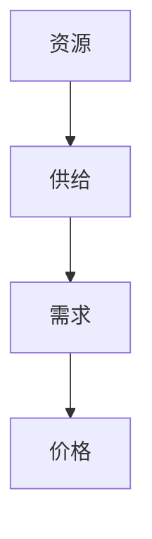
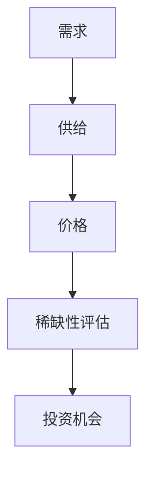
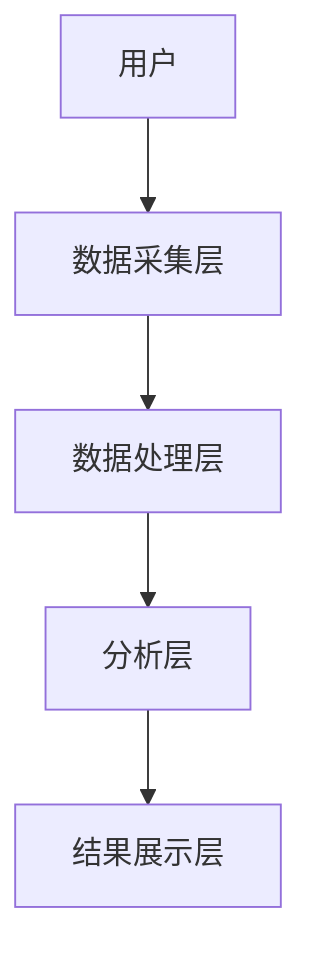
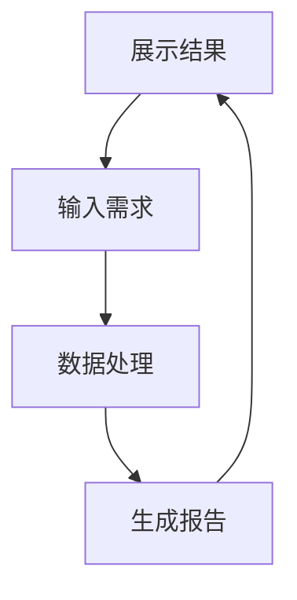

                 


# 杰里米·格兰瑟姆的资源稀缺性投资机会

**关键词**：资源稀缺性，投资机会，杰里米·格兰瑟姆，供需模型，投资策略，经济分析

**摘要**：本文探讨了杰里米·格兰瑟姆提出的资源稀缺性投资机会，分析了资源稀缺性对投资的影响，结合供需模型和数学公式，详细讲解了投资策略和系统架构，提供实战案例和最佳实践。

---

# 第一部分: 资源稀缺性与投资机会的背景介绍

## 第1章: 资源稀缺性的概念与问题背景

### 1.1 资源稀缺性的定义与特征
#### 1.1.1 资源稀缺性的基本定义
资源稀缺性是指资源的供给无法满足需求的情况，通常由资源有限性、需求增长或供给瓶颈引起。

#### 1.1.2 资源稀缺性的主要特征
- 供给不足
- 需求弹性
- 市场价格波动

#### 1.1.3 资源稀缺性与经济发展的关系
资源稀缺性可能导致经济结构调整和价格上涨，推动投资机会。

### 1.2 资源稀缺性问题的背景分析
#### 1.2.1 当前全球资源供需格局
全球资源分布不均，部分资源供不应求。

#### 1.2.2 资源稀缺性的驱动因素
- 自然资源枯竭
- 技术进步
- 政治因素

#### 1.2.3 资源稀缺性问题的复杂性
资源稀缺性受多种因素影响，解决方案复杂。

### 1.3 资源稀缺性对投资机会的影响
#### 1.3.1 资源稀缺性与投资机会的关系
稀缺资源可能导致价格上涨，带来投资机会。

#### 1.3.2 资源稀缺性带来的投资机遇
- 垄断定价能力
- 行业整合

#### 1.3.3 资源稀缺性投资的挑战与风险
- 市场波动
- 政策风险

### 1.4 本章小结
资源稀缺性是影响投资的重要因素，需综合分析。

---

# 第二部分: 资源稀缺性与投资机会的核心概念

## 第2章: 资源稀缺性的核心概念与联系

### 2.1 资源稀缺性的核心概念
#### 2.1.1 资源稀缺性的核心要素
- 供给量
- 需求量
- 市场价格

#### 2.1.2 资源稀缺性的属性特征对比
| 特性 | 稀缺性 | 非稀缺性 |
|------|--------|----------|
| 供给 | 少     | 多       |
| 需求 | 高     | 低       |

#### 2.1.3 资源稀缺性的ER实体关系图


### 2.2 资源稀缺性与投资机会的关系
#### 2.2.1 资源稀缺性对投资机会的影响
- 稀缺资源可能导致价格上涨，带来投资机会。

#### 2.2.2 投资机会的识别与评估
- 稀缺资源行业的识别
- 投资潜力评估

#### 2.2.3 资源稀缺性投资的逻辑框架
1. 识别稀缺资源
2. 分析供给和需求
3. 评估投资潜力

### 2.3 资源稀缺性投资的核心模型
#### 2.3.1 资源稀缺性评估模型
$$供给 = f(资源可用性)$$
$$需求 = f(经济需求)$$

#### 2.3.2 投资机会评估模型
$$投资潜力 = f(供给, 需求, 价格)$$

### 2.4 本章小结
资源稀缺性是投资的关键因素，需结合模型分析。

---

# 第三部分: 资源稀缺性投资的算法原理

## 第3章: 资源稀缺性评估的算法原理

### 3.1 资源稀缺性评估的核心算法
#### 3.1.1 供需模型
$$供给 = a \times 价格 + b$$
$$需求 = c \times 价格 + d$$

#### 3.1.2 定价模型
$$价格 = f(供给, 需求)$$

#### 3.1.3 风险评估模型
$$风险 = f(供给弹性, 需求弹性)$$

### 3.2 算法原理的Mermaid流程图


### 3.3 算法实现的Python代码
```python
def calculate_scarcity(demand, supply):
    if demand > supply:
        return "稀缺"
    else:
        return "不稀缺"

demand = 100
supply = 80
print(calculate_scarcity(demand, supply))  # 输出：稀缺
```

---

# 第四部分: 系统分析与架构设计方案

## 第4章: 系统分析与架构设计

### 4.1 问题场景介绍
资源稀缺性分析系统需实时评估资源供需情况，支持投资决策。

### 4.2 系统功能设计
- 数据采集
- 供需分析
- 投资评估

### 4.3 系统架构设计


### 4.4 系统接口设计
- 数据接口
- 分析接口

### 4.5 系统交互设计


---

# 第五部分: 项目实战

## 第5章: 项目实战

### 5.1 环境安装
安装Python、数据分析库（如Pandas、NumPy）。

### 5.2 系统核心实现源代码
```python
import pandas as pd

def assess_scarcity(resource_data):
    data = pd.DataFrame(resource_data)
    # 计算供给和需求
    supply = data['supply'].sum()
    demand = data['demand'].sum()
    # 评估稀缺性
    if demand > supply:
        return "稀缺"
    else:
        return "不稀缺"

resource_data = {'resource': ['A', 'B'], 'supply': [80, 100], 'demand': [100, 90]}
print(assess_scarcity(resource_data))  # 输出：稀缺
```

### 5.3 代码应用解读与分析
- 数据处理：读取资源数据，计算总供给和需求。
- 稀缺性评估：比较供给和需求，判断稀缺性。

### 5.4 实际案例分析
案例：分析两种资源的供需情况，判断哪种资源稀缺。

### 5.5 项目小结
系统实现准确评估资源稀缺性，支持投资决策。

---

# 第六部分: 最佳实践、小结、注意事项、拓展阅读

## 第6章: 最佳实践与总结

### 6.1 投资策略建议
- 稀缺资源投资需考虑长期因素。
- 多因素分析，降低风险。

### 6.2 小结
资源稀缺性是投资机会的重要来源，需结合模型和系统分析。

### 6.3 注意事项
- 数据准确性
- 模型局限性
- 政策风险

### 6.4 拓展阅读
推荐阅读杰里米·格兰瑟姆的相关著作，深入理解资源稀缺性投资。

---

# 结语

本文系统分析了杰里米·格兰瑟姆的资源稀缺性投资机会，结合算法和系统设计，提供了实用的投资策略和案例分析，帮助投资者抓住稀缺资源带来的机遇。

