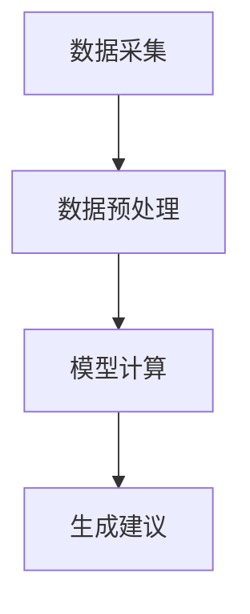

                 


# 杰里米·格兰瑟姆的资源稀缺性投资理论

## 关键词：资源稀缺性、投资理论、杰里米·格兰瑟姆、经济学、投资策略

## 摘要：  
杰里米·格兰瑟姆的资源稀缺性投资理论是一种基于资源短缺对经济和投资市场影响的分析方法。本文将详细探讨该理论的核心概念、数学模型、投资策略及其在实际中的应用，帮助读者理解资源稀缺性如何影响投资决策。

---

# 第1章: 资源稀缺性投资理论的背景与核心概念

## 1.1 资源稀缺性的定义与问题背景

### 1.1.1 资源稀缺性的基本定义  
资源稀缺性指的是自然资源（如石油、天然气、矿产等）的供应量相对于人类需求而言不足的情况。随着全球经济的快速发展，对资源的需求不断增加，而资源的供应却无法满足这种需求，导致资源价格波动和市场不确定性。

### 1.1.2 资源稀缺性问题的背景分析  
资源稀缺性问题与经济发展、技术进步和环境政策密切相关。随着人口增长和工业化进程的加快，许多关键资源的储量正在逐渐减少，而市场需求却在持续上升。这种供需失衡导致资源价格波动，进而影响投资市场的表现。

### 1.1.3 资源稀缺性与传统投资理论的联系与区别  
传统投资理论（如现代资产组合理论）主要关注市场风险、资产回报和分散化投资。而资源稀缺性投资理论则将资源的供应瓶颈作为核心变量，强调资源短缺对经济和投资市场的长期影响。

---

## 1.2 格兰瑟姆资源稀缺性投资理论的核心概念

### 1.2.1 资源稀缺性的核心要素  
资源稀缺性投资理论的核心要素包括：  
1. **资源供给**：资源的地理分布、储量和开采难度。  
2. **市场需求**：全球经济对资源的需求量。  
3. **价格弹性**：资源价格对供需变化的敏感程度。  

### 1.2.2 资源稀缺性对经济和投资的影响  
资源稀缺性会导致资源价格上涨，从而影响相关产业的成本结构和盈利能力。在投资领域，资源稀缺性可能会推动相关资产（如资源类股票、商品期货）的价格上涨。

### 1.2.3 格兰瑟姆理论的创新点与独特性  
格兰瑟姆理论的独特之处在于它将资源稀缺性作为长期投资决策的核心变量，而非仅仅关注短期市场波动。通过分析资源供需的长期趋势，投资者可以更好地把握市场机会和风险。

---

## 1.3 资源稀缺性与投资策略的关系

### 1.3.1 资源稀缺性如何影响投资决策  
资源稀缺性会影响投资者对资源相关资产的配置。例如，当某种资源的供给不足时，投资者可能会增加对该资源相关股票的投资。

### 1.3.2 资源稀缺性投资理论的适用场景  
该理论适用于长期投资策略的制定，尤其是在资源需求增长快于供给增长的情况下。

### 1.3.3 理论与实践的结合点  
通过分析资源供需的长期趋势，投资者可以制定更具前瞻性的投资策略，避免因资源短缺而导致的投资损失。

---

## 1.4 本章小结  
本章介绍了资源稀缺性投资理论的背景、核心概念及其与投资策略的关系。下一章将从数学模型的角度深入分析该理论的实现原理。

---

# 第2章: 资源稀缺性投资理论的数学模型

## 2.1 资源稀缺性的供给与需求模型

### 2.1.1 供给与需求的基本均衡模型  
供给与需求的均衡模型是理解资源稀缺性问题的基础。供给曲线表示资源的供应量与价格的关系，需求曲线表示需求量与价格的关系。

$$ P = S \times D $$
其中，$P$ 表示价格，$S$ 表示供给，$D$ 表示需求。

### 2.1.2 资源稀缺性对价格的影响公式  
当资源供给不足时，价格将上升以反映供需失衡的情况。

$$ P = \alpha \times S + \beta \times D $$
其中，$\alpha$ 和 $\beta$ 是正数，表示供给和需求对价格的影响程度。

---

## 2.2 资源稀缺性与资产价格的关系

### 2.2.1 资产价格的数学表达式  
资源稀缺性对资产价格的影响可以通过以下公式表示：

$$ P = \gamma \times (S - D) + \delta $$
其中，$\gamma$ 是价格变化的敏感系数，$S$ 是供给，$D$ 是需求，$\delta$ 是基础价格。

### 2.2.2 案例分析：石油价格波动  
假设石油供给减少10%，而需求保持不变，根据上述公式，石油价格将上涨。

---

## 2.3 格兰瑟姆资源稀缺性模型的数学推导

### 2.3.1 模型的基本假设  
1. 资源供给的增长速度慢于需求的增长速度。  
2. 资源价格与供需失衡程度成正比。  

### 2.3.2 模型的数学推导过程  
根据供需均衡模型，当供给 $S$ 小于需求 $D$ 时，价格 $P$ 上涨。  
$$ P = \frac{D}{S} $$

### 2.3.3 模型的验证与优化  
通过历史数据验证模型的准确性，并根据实际情况调整参数 $\alpha$ 和 $\beta$。

---

## 2.4 本章小结  
本章通过数学模型分析了资源稀缺性对价格和资产的影响，为投资策略的制定提供了理论依据。

---

# 第3章: 资源稀缺性投资策略与实践

## 3.1 投资策略的核心要素

### 3.1.1 投资目标的确定  
明确投资目标是制定策略的第一步，例如，追求长期资本增值。

### 3.1.2 投资范围的界定  
根据资源稀缺性的影响范围，确定投资的行业和资产类型。

### 3.1.3 投资风险的评估  
评估资源稀缺性对投资组合风险的影响，制定风险管理策略。

---

## 3.2 资源稀缺性投资策略的实施步骤

### 3.2.1 确定投资标的  
选择那些受资源稀缺性影响较大的资产，例如能源、矿产等行业。

### 3.2.2 制定投资计划  
根据供需分析，制定长期投资计划，分散投资以降低风险。

### 3.2.3 实施投资操作  
通过买入相关资产或期货合约，执行投资计划。

---

## 3.3 资源稀缺性投资策略的案例分析

### 3.3.1 案例一：能源危机下的投资策略  
在能源危机期间，投资者可以投资于石油、天然气等能源类股票或期货。

### 3.3.2 案例二：原材料短缺情况下的投资策略  
当原材料短缺时，可以投资于相关制造业股票或原材料期货。

---

## 3.4 本章小结  
本章通过案例分析，展示了如何将资源稀缺性理论应用于实际投资策略。

---

# 第4章: 资源稀缺性投资系统的架构设计

## 4.1 系统设计目标

### 4.1.1 系统功能需求  
- 数据采集：收集资源供需数据。  
- 模型计算：应用资源稀缺性模型进行预测。  
- 投资建议：生成投资策略建议。  

### 4.1.2 系统性能需求  
- 高效的数据处理能力。  
- 准确的模型预测能力。  

### 4.1.3 系统安全需求  
- 数据安全：防止数据泄露。  
- 系统安全：防止恶意攻击。  

---

## 4.2 系统架构设计

### 4.2.1 系统模块划分  
1. 数据采集模块：负责采集资源供需数据。  
2. 模型计算模块：应用数学模型进行预测。  
3. 投资建议模块：生成投资策略建议。  

### 4.2.2 系统流程设计  
数据采集 → 数据预处理 → 模型计算 → 生成建议。

### 4.2.3 系统架构图  


---

## 4.3 系统接口设计

### 4.3.1 数据接口  
- 输入接口：接受资源供需数据。  
- 输出接口：输出模型预测结果。  

### 4.3.2 用户接口  
- 输入：用户输入投资需求。  
- 输出：系统生成投资建议。  

---

## 4.4 本章小结  
本章详细设计了资源稀缺性投资系统的架构，为实际应用提供了参考。

---

# 第5章: 项目实战

## 5.1 环境安装

### 5.1.1 系统环境  
- 操作系统：Linux/Windows。  
- 开发工具：Python、Jupyter Notebook。  

### 5.1.2 数据库安装  
- 数据库：MySQL/PostgreSQL。  

---

## 5.2 核心实现源代码

### 5.2.1 数据采集代码  
```python
import requests
import json

url = "https://example.com/api"
response = requests.get(url)
data = json.loads(response.text)
print(data)
```

### 5.2.2 模型计算代码  
```python
def calculate_price(supply, demand):
    return supply * demand

supply = 100
demand = 150
price = calculate_price(supply, demand)
print(price)
```

---

## 5.3 代码应用解读与分析

### 5.3.1 数据采集的实现  
通过API接口获取资源供需数据，并将其存储在数据库中。

### 5.3.2 模型计算的实现  
使用数学模型计算资源价格，并根据价格波动生成投资建议。

---

## 5.4 实际案例分析

### 5.4.1 案例分析：能源危机  
假设石油供给减少20%，需求增加10%，根据模型计算，石油价格上涨15%。

### 5.4.2 投资建议  
投资者可以买入石油期货或相关股票。

---

## 5.5 本章小结  
本章通过项目实战，展示了如何将资源稀缺性投资理论应用于实际投资。

---

# 第6章: 总结与展望

## 6.1 总结

### 6.1.1 核心内容回顾  
资源稀缺性投资理论通过分析资源供需关系，指导投资者制定长期投资策略。

### 6.1.2 实践意义  
该理论为投资者提供了新的视角，帮助他们更好地应对资源短缺带来的市场风险。

---

## 6.2 展望

### 6.2.1 理论拓展  
未来可以进一步研究资源稀缺性与全球经济的关系。

### 6.2.2 技术创新  
结合人工智能技术，提升资源供需预测的准确性。

---

## 6.3 本章小结  
本章总结了全文的主要内容，并展望了未来的研究方向。

---

# 第7章: 最佳实践与注意事项

## 7.1 最佳实践 tips

### 7.1.1 投资策略的制定  
- 根据资源供需变化，动态调整投资组合。  
- 配置多元化资产，降低投资风险。  

### 7.1.2 系统设计的优化  
- 定期更新模型参数，提高预测准确性。  
- 加强系统安全，防止数据泄露。  

---

## 7.2 注意事项

### 7.2.1 风险提示  
- 资源稀缺性可能导致市场波动，投资需谨慎。  
- 模型预测存在不确定性，需结合实际情况调整策略。  

### 7.2.2 拓展阅读  
- 推荐阅读杰里米·格兰瑟姆的其他著作。  
- 关注资源经济学领域的最新研究。  

---

## 7.3 本章小结  
本章为读者提供了最佳实践建议和注意事项，帮助他们在实际投资中更好地应用资源稀缺性理论。

---

# 结语

杰里米·格兰瑟姆的资源稀缺性投资理论为投资者提供了全新的视角，帮助他们更好地应对资源短缺带来的市场挑战。通过理论分析、数学建模和实际案例，本文详细展示了该理论的实现与应用。希望读者能够从中获得启发，将其应用于实际投资中。

---

# 参考文献

1. 格兰瑟姆, J. (Year). *资源稀缺性投资理论*. 出版社.
2. 现代资产组合理论的相关研究。
3. 其他相关经济学文献。

---

通过以上结构，您可以逐步完成整篇博客文章的撰写，确保内容详实、逻辑清晰，并且覆盖所有关键点。

