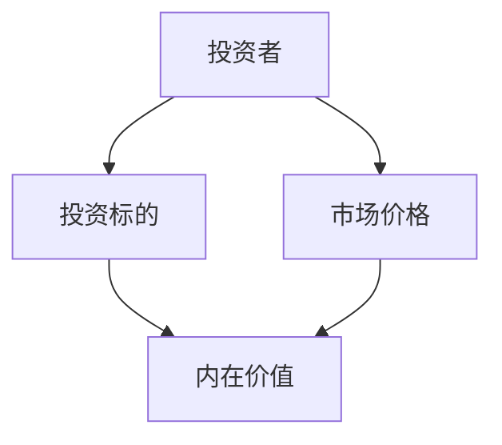
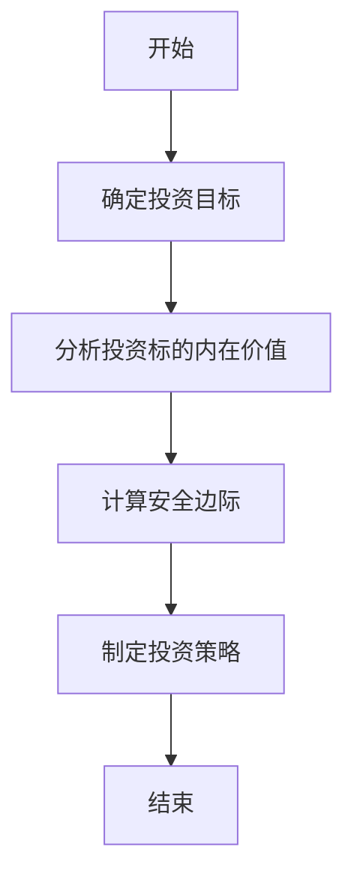
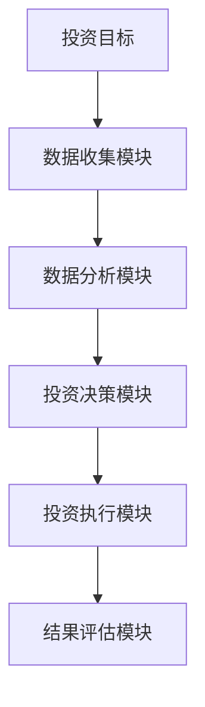
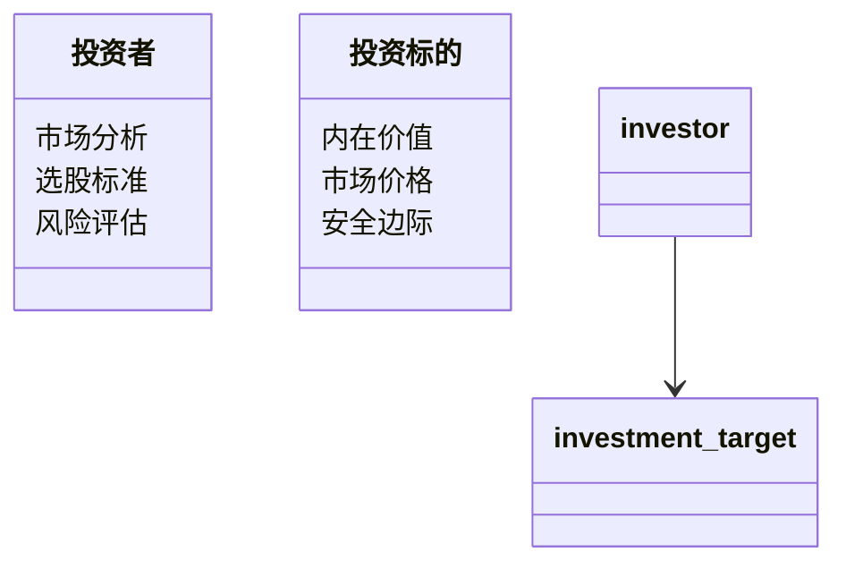
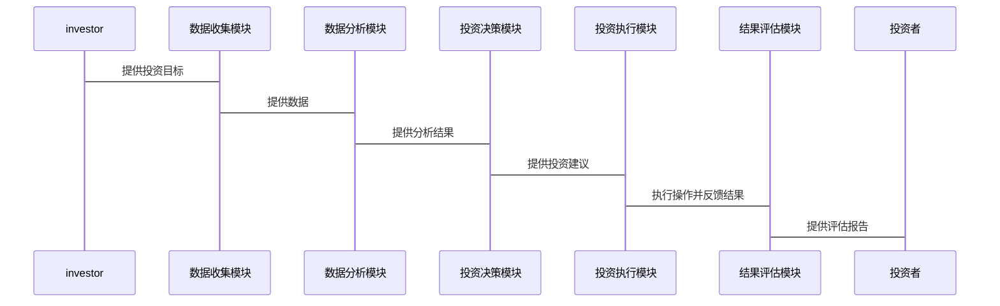

                 


# 杰里米·格兰瑟姆的长期价值投资哲学

> 关键词：价值投资，长期投资，杰里米·格兰瑟姆，安全边际，投资哲学，风险管理，系统架构

> 摘要：本文深入探讨了杰里米·格兰瑟姆的长期价值投资哲学，分析了其核心概念、投资策略、算法原理、系统架构以及实际案例。通过技术化的语言和详细的分析，揭示了长期价值投资的内在逻辑和实际应用。

---

## 第一部分: 长期价值投资的背景与核心概念

### 第1章: 长期价值投资的背景介绍

#### 1.1 价值投资的定义与特点

##### 1.1.1 价值投资的定义
价值投资是一种以企业内在价值为基础的投资策略，强调以低于内在价值的价格买入优质资产。其核心在于寻找市场价格与内在价值存在显著差距的投资标的。

##### 1.1.2 价值投资的核心特点
- **长期性**：关注企业的长期价值，而非短期价格波动。
- **安全性**：注重安全边际，即购买价格低于内在价值。
- **逆周期性**：在市场低迷时寻找低估资产，在市场繁荣时保持谨慎。

##### 1.1.3 价值投资与短期投资的区别
- 短期投资关注市场波动和交易机会，而价值投资关注企业的基本面。
- 短期投资风险较高，而价值投资通过安全边际降低风险。

#### 1.2 长期价值投资的背景与重要性

##### 1.2.1 长期价值投资的背景
随着金融市场的发展，投资者逐渐意识到短期交易的高风险和低稳定性，长期价值投资因其稳定性受到关注。

##### 1.2.2 长期价值投资的重要性
- **稳定性**：长期投资有助于平滑市场波动对投资组合的影响。
- **收益性**：通过持有优质资产，长期投资能够获得复利效应。
- **风险管理**：通过安全边际降低投资风险。

##### 1.2.3 长期价值投资与经济周期的关系
长期价值投资不受短期经济波动影响，更关注企业的长期盈利能力。

### 第2章: 杰里米·格兰瑟姆的核心投资哲学

#### 2.1 格兰瑟姆投资哲学的核心理念

##### 2.1.1 长期价值投资的核心理念
格兰瑟姆强调以低于内在价值的价格买入优质资产，注重安全边际和长期稳定性。

##### 2.1.2 投资的长期性与稳定性
格兰瑟姆认为，投资的目的是通过长期持有优质资产实现财富增长，而非短期交易。

##### 2.1.3 风险控制与安全边际
安全边际是格兰瑟姆投资哲学的核心，通过购买价格低于内在价值的资产，降低投资风险。

#### 2.2 格兰瑟姆的投资策略与方法

##### 2.2.1 格兰瑟姆的投资策略
- **估值驱动**：以内在价值为基础，寻找低估资产。
- **分散投资**：通过分散投资降低风险。
- **长期持有**：避免频繁交易，减少交易成本。

##### 2.2.2 格兰瑟姆的投资方法
- **基本面分析**：分析企业的财务状况、行业地位和竞争优势。
- **安全边际计算**：确定资产的内在价值，计算购买价格与内在价值的差距。

##### 2.2.3 格兰瑟姆的选股标准
- 低市盈率（P/E）。
- 低市净率（P/B）。
- 高股息率。
- 强大的财务状况。

### 第3章: 格兰瑟姆投资哲学的核心概念与联系

#### 3.1 核心概念原理

##### 3.1.1 长期价值投资的核心概念
- 内在价值：资产的真实价值，与市场价格无关。
- 安全边际：购买价格低于内在价值的差距。
- 风险控制：通过分散投资和安全边际降低风险。

##### 3.1.2 格兰瑟姆投资哲学的核心原理
- 内在价值是投资的基础。
- 安全边际是投资的关键。
- 长期持有是实现收益的核心。

#### 3.2 核心概念属性特征对比表格

| 概念       | 属性特征                     |
|------------|------------------------------|
| 内在价值   | 资产的真实价值，不随市场价格波动而变化 |
| 安全边际   | 购买价格低于内在价值的差距       |
| 风险控制   | 通过分散投资和安全边际降低风险   |

#### 3.3 ER实体关系图


### 第4章: 格兰瑟姆投资哲学的算法原理

#### 4.1 算法原理流程图


#### 4.2 算法数学模型
$$
\text{安全边际} = \text{内在价值} - \text{市场价格}
$$

#### 4.3 举例说明
假设某股票的内在价值为$50，市场价格为$40，则安全边际为$10。

### 第5章: 格兰瑟姆投资哲学的系统分析与架构设计

#### 5.1 系统架构设计


#### 5.2 系统功能设计


### 第6章: 格兰瑟姆投资哲学的项目实战

#### 6.1 环境安装
##### 6.1.1 安装Python
使用Anaconda安装Python环境，并安装必要的库，如pandas、numpy、scipy等。

#### 6.2 系统核心实现源代码

##### 6.2.1 数据分析模块
```python
import pandas as pd
import numpy as np

def calculate_intrinsic_value(financial_data):
    # 简单计算内在价值的方法，可根据具体情况进行调整
    return financial_data['Revenue'] * 0.5

def calculate_margin_of_safety(intrinsic_value, market_price):
    return intrinsic_value - market_price

# 示例数据
data = {
    'Revenue': [100, 200, 300],
    'Market_Price': [50, 100, 150]
}
df = pd.DataFrame(data)

# 计算内在价值和安全边际
df['Intrinsic_Value'] = df.apply(lambda x: calculate_intrinsic_value(x), axis=1)
df['Margin_of_Safety'] = df.apply(lambda x: calculate_margin_of_safety(x['Intrinsic_Value'], x['Market_Price']), axis=1)

print(df)
```

##### 6.2.2 投资决策模块
```python
def investment_decision(margin_of_safety):
    if margin_of_safety > 0:
        return "买入"
    elif margin_of_safety == 0:
        return "持有"
    else:
        return "卖出"

# 示例数据
data = {
    'Margin_of_Safety': [10, 5, -2]
}
df = pd.DataFrame(data)

# 投资决策
df['Decision'] = df.apply(lambda x: investment_decision(x['Margin_of_Safety']), axis=1)

print(df)
```

#### 6.3 代码应用解读与分析
- 数据分析模块通过计算内在价值和安全边际，帮助投资者确定投资标的的价值。
- 投资决策模块根据安全边际的正负，给出买入、持有或卖出的决策。

#### 6.4 实际案例分析
假设某股票的内在价值为$100，市场价格为$80，则安全边际为$20，投资决策为“买入”。

#### 6.5 项目小结
通过Python代码实现数据分析和投资决策，能够帮助投资者自动化地应用格兰瑟姆的投资哲学，提高投资效率和准确性。

---

## 第二部分: 格兰瑟姆投资哲学的系统架构与应用

### 第7章: 系统架构设计与实现

#### 7.1 系统架构设计


#### 7.2 系统功能设计
- 数据收集模块：收集投资标的的财务数据和市场价格。
- 数据分析模块：计算内在价值和安全边际。
- 投资决策模块：根据安全边际给出投资建议。
- 投资执行模块：执行买入、卖出或持有操作。
- 结果评估模块：评估投资结果，调整投资策略。

#### 7.3 系统交互设计


### 第8章: 格兰瑟姆投资哲学的实际应用与案例分析

#### 8.1 实际应用
- 数据分析与建模：使用Python进行数据清洗、建模和预测。
- 投资组合管理：通过安全边际和分散投资降低风险。

#### 8.2 案例分析
- 案例一：某股票的内在价值为$100，市场价格为$80，安全边际为$20，投资决策为买入。
- 案例二：某股票的内在价值为$50，市场价格为$60，安全边际为-$10，投资决策为卖出。

### 第9章: 格兰瑟姆投资哲学的系统优化与扩展

#### 9.1 系统优化
- 数据源扩展：引入更多数据源，提高分析精度。
- 模型优化：改进内在价值计算模型，提高准确性。

#### 9.2 系统扩展
- 自动化交易：通过API实现自动化交易。
- 多策略组合：结合其他投资策略，优化投资组合。

---

## 第三部分: 格兰瑟姆投资哲学的总结与展望

### 第10章: 格兰瑟姆投资哲学的总结

#### 10.1 核心要点总结
- 长期价值投资的核心是内在价值和安全边际。
- 风险控制是投资成功的关键。
- 分散投资能够降低整体风险。

#### 10.2 投资哲学的现实意义
- 为投资者提供了一种稳定的投资方法。
- 在复杂市场中，长期价值投资能够帮助投资者避免短期波动的影响。

### 第11章: 格兰瑟姆投资哲学的未来展望

#### 11.1 技术进步对投资的影响
- 人工智能和大数据技术将改变投资方式。
- 自动化投资工具将更加普及。

#### 11.2 格兰瑟姆投资哲学的未来发展
- 结合新技术，进一步优化投资策略。
- 更加注重ESG因素，推动可持续投资。

---

## 总结

杰里米·格兰瑟姆的长期价值投资哲学为投资者提供了一种稳定、安全的投资方法。通过系统化的方法和风险管理，投资者能够更好地应对市场波动，实现长期收益。随着技术的进步，投资哲学将与更多新技术结合，推动投资领域的发展。

---

通过以上内容，您可以逐步构建一篇结构完整、内容丰富的技术博客文章，涵盖杰里米·格兰瑟姆长期价值投资哲学的各个方面。

