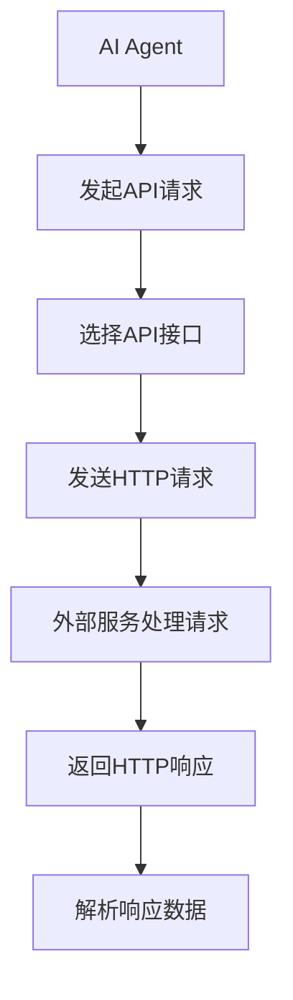
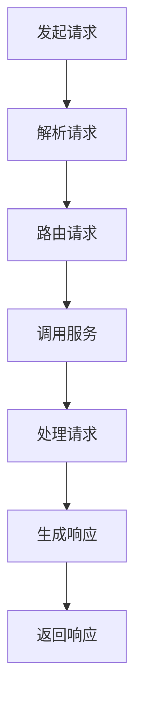
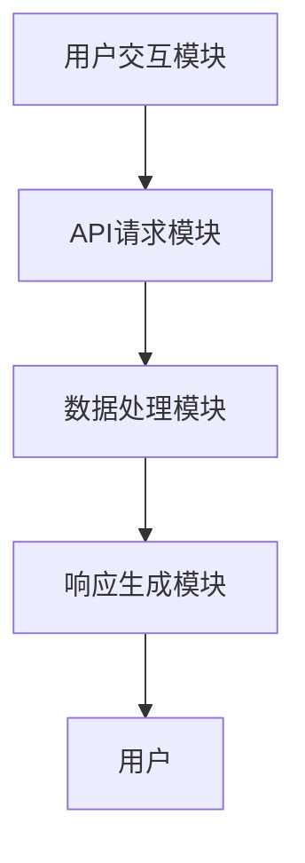

                 


# 构建AI Agent的API集成能力：连接外部服务

## 关键词：AI Agent、API集成、外部服务、系统架构、算法原理、项目实战

## 摘要：本文详细探讨了构建具备API集成能力的AI Agent的过程，从背景介绍到系统架构设计，再到项目实战，全面解析了AI Agent如何通过API连接外部服务，实现智能化交互与数据处理。

---

# 第1章: AI Agent与API集成的背景与概念

## 1.1 AI Agent的基本概念

### 1.1.1 AI Agent的定义与特点
AI Agent（人工智能代理）是指能够感知环境、自主决策并执行任务的智能实体。它具备以下特点：
- **自主性**：无需外部干预，自主完成任务。
- **反应性**：能够实时感知环境变化并做出反应。
- **目标导向**：基于目标驱动行为，追求最优解决方案。
- **学习能力**：通过数据和经验不断优化自身的性能。

### 1.1.2 API在AI Agent中的作用
API（应用程序编程接口）是AI Agent与外部服务交互的核心桥梁。通过API，AI Agent可以调用外部服务的功能，获取数据或执行操作，从而增强自身的智能化能力。

### 1.1.3 AI Agent与传统软件的区别
AI Agent与传统软件的主要区别在于：
- AI Agent具备学习和适应能力，能够根据环境变化调整行为。
- AI Agent能够通过API集成外部服务，实现复杂任务的协同完成。

## 1.2 API集成的核心概念

### 1.2.1 API的分类与特点
API可以分为以下几类：
- **RESTful API**：基于HTTP协议，采用REST（Representational State Transfer）风格，广泛应用于Web服务。
- **GraphQL API**：通过查询语言定义数据需求，灵活性高，减少网络请求次数。
- **SOAP API**：基于XML和WS-*标准，提供强类型和严格的安全性，适用于企业级应用。

### 1.2.2 API集成的背景与意义
随着AI Agent的应用场景越来越广泛，API集成成为实现复杂任务的关键能力。通过API集成，AI Agent可以调用第三方服务（如天气预报、社交媒体等），扩展自身的功能和数据源。

### 1.2.3 API集成的挑战与解决方案
API集成的挑战包括：
- **兼容性问题**：不同API接口的协议和格式可能存在差异，导致集成困难。
- **性能问题**：频繁调用外部API可能影响系统的响应速度和稳定性。
- **安全性问题**：API集成需要处理敏感数据，必须确保数据的安全性和隐私性。

解决方案包括：
- **协议适配**：通过中间件或适配器实现不同协议之间的转换。
- **缓存机制**：通过缓存减少对外部API的调用频率，提高性能。
- **身份验证**：采用OAuth、JWT等安全协议，确保API调用的安全性。

## 1.3 AI Agent与外部服务的交互机制

### 1.3.1 API请求的流程
AI Agent通过API与外部服务交互的典型流程包括：
1. **发起请求**：AI Agent根据需求生成API请求。
2. **传输请求**：通过网络将请求发送到外部服务。
3. **处理请求**：外部服务接收请求，执行相关操作。
4. **返回响应**：外部服务将处理结果返回给AI Agent。
5. **处理响应**：AI Agent解析响应数据，并根据结果调整后续行为。

### 1.3.2 API响应的处理
AI Agent在接收到外部服务的响应后，需要对响应数据进行解析和处理。常见的处理方式包括：
- **数据解析**：将响应数据转换为AI Agent能够理解的格式（如JSON）。
- **错误处理**：检查响应状态码，处理可能出现的错误。
- **数据存储**：将有用的数据存储起来，供后续任务使用。

### 1.3.3 API集成的边界与外延
API集成的边界是指AI Agent与外部服务交互的接口，通常包括API的调用方式、数据格式和安全机制。外延则包括API的文档、认证方式和性能指标等。

## 1.4 本章小结
本章介绍了AI Agent的基本概念、API集成的核心概念以及AI Agent与外部服务的交互机制。通过这些内容，读者可以理解API在AI Agent中的重要性以及API集成的基本流程。

---

# 第2章: API集成的核心概念

## 2.1 API的分类与特点

### 2.1.1 RESTful API与GraphQL API的对比
- **RESTful API**：
  - 基于HTTP协议，采用资源导向的URL设计。
  - 支持GET、POST、PUT、DELETE等HTTP方法。
  - 数据格式通常为JSON，易于解析和处理。
- **GraphQL API**：
  - 使用GraphQL查询语言定义数据需求。
  - 支持复杂的数据查询，减少网络请求次数。
  - 数据格式通常为JSON，但查询灵活性更高。

### 2.1.2 公共API与私有API的区别
- **公共API**：
  - 对外公开，任何人都可以调用。
  - 通常有严格的调用限制和速率控制。
- **私有API**：
  - 只限内部使用，通常需要身份验证。
  - 数据安全性更高，适合企业内部系统集成。

### 2.1.3 API版本控制的重要性
API版本控制是确保API兼容性和稳定性的重要手段。通过版本控制，可以在API功能发生变化时，确保旧版本的客户端能够正常调用。

## 2.2 API集成的原理与流程

### 2.2.1 API请求的发起与响应
API请求的发起流程如下：
1. **生成请求**：AI Agent根据需求生成API请求。
2. **发送请求**：通过HTTP协议将请求发送到外部服务。
3. **接收响应**：外部服务处理请求后，返回响应数据。

### 2.2.2 API认证与授权机制
API认证与授权是确保API调用安全性的关键步骤。常见的认证方式包括：
- **API Key**：通过API密钥进行身份验证。
- **OAuth**：通过OAuth协议实现第三方登录和授权。
- **JWT**：使用JSON Web Token进行无状态认证。

### 2.2.3 API速率限制与错误处理
为了防止滥用和Dos攻击，大多数API都设置了速率限制。常见的错误处理机制包括：
- **重试机制**：在API调用失败时，自动重试一定次数。
- **错误码处理**：根据HTTP状态码判断错误类型，并采取相应的处理措施。

## 2.3 API集成的实体关系与流程图

### 2.3.1 ER实体关系图
```mermaid
erDiagram
    actor 用户 "AI Agent"
    actor 服务提供者 "External Service"
    service API接口 "API Interface"
    用户->服务提供者: 调用API接口
    用户->API接口: 发送请求
    服务提供者->API接口: 处理请求
    API接口->用户: 返回响应
```

### 2.3.2 API请求处理流程图（Mermaid）


## 2.4 本章小结
本章详细讲解了API的分类、集成的原理与流程，以及API集成的实体关系与流程图。通过这些内容，读者可以理解API集成的核心概念和实现流程。

---

# 第3章: API集成的算法原理

## 3.1 API请求处理的流程

### 3.1.1 请求解析与参数提取
AI Agent在处理API请求时，首先需要解析请求数据，提取必要的参数。例如，解析JSON格式的请求体，提取API方法、参数等信息。

### 3.1.2 请求路由与服务调用
根据解析后的请求参数，AI Agent需要将请求路由到相应的服务进行处理。这一步通常涉及URL路由和中间件的处理。

### 3.1.3 响应处理与数据格式化
外部服务处理完请求后，会返回响应数据。AI Agent需要将响应数据进行格式化处理，例如将JSON数据转换为AI Agent内部的数据结构。

## 3.2 API集成的数学模型

### 3.2.1 请求处理的数学模型
API请求处理的数学模型可以表示为：
$$
\text{响应} = f(\text{请求})
$$
其中，$f$ 表示API处理函数，$\text{请求}$ 是输入的请求参数，$\text{响应}$ 是处理后的结果。

### 3.2.2 响应生成的数学模型
API响应生成的数学模型可以表示为：
$$
\text{响应数据} = g(\text{请求参数})
$$
其中，$g$ 表示响应生成函数，$\text{请求参数}$ 是API调用的参数，$\text{响应数据}$ 是处理后的数据。

### 3.2.3 API性能优化的数学公式
为了优化API性能，可以使用以下公式计算API的响应时间：
$$
\text{响应时间} = \frac{\text{请求总数}}{\text{处理能力}}
$$
其中，$\text{处理能力}$ 是单位时间内可以处理的请求数。

## 3.3 算法流程图（Mermaid）

### 3.3.1 API请求处理流程图


## 3.4 本章小结
本章详细讲解了API请求处理的流程、数学模型和算法流程图。通过这些内容，读者可以理解API集成的算法原理和优化方法。

---

# 第4章: AI Agent的系统架构与接口设计

## 4.1 系统功能模块设计

### 4.1.1 用户交互模块
用户交互模块负责接收用户的输入，并通过API调用外部服务，返回处理结果。例如，用户输入“查询天气”，AI Agent通过天气API获取天气数据，并将结果返回给用户。

### 4.1.2 API请求模块
API请求模块负责生成API请求，发送到外部服务，并处理响应数据。这包括请求的发起、参数的设置以及响应的解析。

## 4.2 系统架构设计

### 4.2.1 系统功能设计
系统的功能模块包括：
- 用户交互模块
- API请求模块
- 数据处理模块
- 响应生成模块

### 4.2.2 系统架构图（Mermaid）


## 4.3 本章小结
本章详细讲解了AI Agent的系统架构设计和功能模块设计。通过这些内容，读者可以理解AI Agent如何通过API集成实现与外部服务的交互。

---

# 第5章: 项目实战

## 5.1 环境安装

### 5.1.1 安装Python
```bash
python --version
pip install --upgrade pip
```

### 5.1.2 安装依赖库
```bash
pip install requests
pip install json
```

## 5.2 系统核心实现源代码

### 5.2.1 API请求模块
```python
import requests
import json

def call_api(endpoint, params):
    try:
        response = requests.get(endpoint, params=params)
        response.raise_for_status()
        return json.loads(response.text)
    except requests.exceptions.RequestException as e:
        print(f"Error calling API: {e}")
        return None
```

### 5.2.2 数据处理模块
```python
def process_data(data):
    if not data:
        return None
    # 解析数据并进行处理
    processed_data = {
        'status': data.get('status'),
        'result': data.get('result')
    }
    return processed_data
```

## 5.3 代码应用解读与分析

### 5.3.1 API请求模块解读
API请求模块通过`requests`库发送HTTP请求，并处理响应数据。`call_api`函数接受目标端点和请求参数，返回解析后的数据。

### 5.3.2 数据处理模块解读
数据处理模块负责将外部服务返回的数据进行解析和处理，生成AI Agent能够理解的格式。

## 5.4 实际案例分析和详细讲解剖析

### 5.4.1 案例分析：天气预报AI Agent
假设我们想要构建一个天气预报AI Agent，可以通过调用天气API获取实时天气数据。

#### 代码实现
```python
def get_weather(city):
    endpoint = f"https://api.weather.com/currentWeather?city={city}"
    params = {}
    response = call_api(endpoint, params)
    if response:
        processed_data = process_data(response)
        return processed_data
    return None
```

#### 功能解读
- `call_api`函数负责调用天气API，获取天气数据。
- `process_data`函数将天气数据进行解析和处理，生成AI Agent能够理解的格式。
- `get_weather`函数将目标城市作为参数，调用API获取天气数据，并返回处理后的结果。

## 5.5 项目小结
本章通过实际案例分析，详细讲解了AI Agent的API集成实现过程。通过代码实现和功能解读，读者可以理解如何通过API集成实现复杂的任务。

---

# 第6章: 最佳实践

## 6.1 API选择与管理
- **选择合适的API**：根据需求选择合适的API，确保API的功能和性能满足要求。
- **API文档的重要性**：仔细阅读和理解API文档，确保正确调用API。
- **API监控与日志记录**：通过监控和日志记录，及时发现和解决API调用中的问题。

## 6.2 错误处理与容错机制
- **错误码处理**：根据HTTP状态码判断错误类型，并采取相应的处理措施。
- **重试机制**：在API调用失败时，自动重试一定次数。
- **熔断机制**：在API调用出现故障时，暂时停止调用，避免影响系统性能。

## 6.3 性能优化与调优
- **缓存机制**：通过缓存减少对外部API的调用频率。
- **并行处理**：通过异步调用提高API调用效率。
- **负载均衡**：通过负载均衡技术，分散API请求的压力。

## 6.4 安全性与隐私保护
- **身份验证**：采用OAuth、JWT等安全协议，确保API调用的安全性。
- **数据加密**：对敏感数据进行加密处理，防止数据泄露。
- **隐私合规**：确保API调用符合相关隐私法规和政策。

## 6.5 小结
通过以上最佳实践，读者可以更好地管理和优化AI Agent的API集成能力，确保系统的稳定性和安全性。

---

# 第7章: 总结与展望

## 7.1 本章总结
本文详细探讨了构建具备API集成能力的AI Agent的过程，从背景介绍到系统架构设计，再到项目实战，全面解析了AI Agent如何通过API连接外部服务，实现智能化交互与数据处理。

## 7.2 未来展望
随着AI技术的不断发展，API集成将在AI Agent的应用中发挥越来越重要的作用。未来，我们需要进一步研究API集成的优化方法，探索新的API设计模式，以应对更加复杂和多样化的应用场景。

---

# 参考文献
1. RESTful API设计指南
2. GraphQL官方文档
3. OAuth 2.0协议规范
4. JSON格式规范
5. HTTP协议规范

---

# END

---

**注意**：由于篇幅限制，上述内容是一个简要的示例，实际文章需要按照完整的逻辑展开，确保每一部分内容详实、逻辑清晰。

