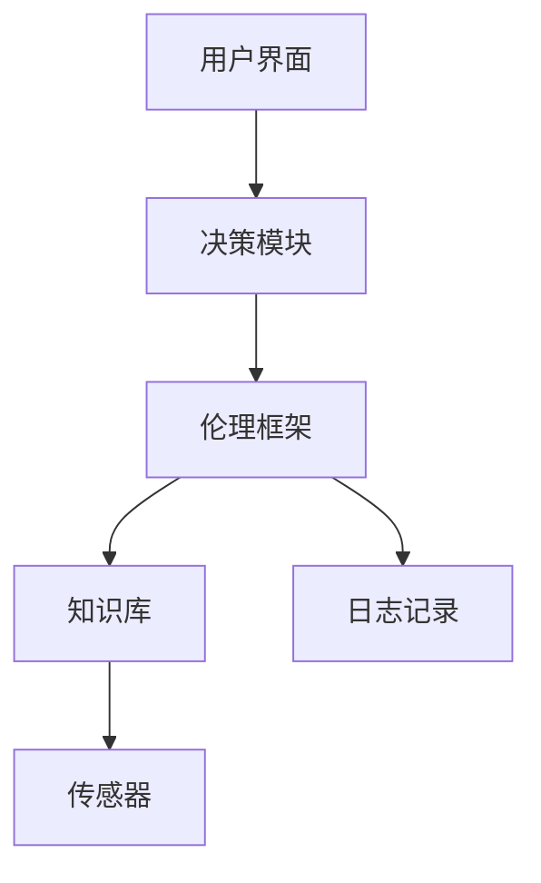

                 


# 《构建AI Agent的伦理决策框架》

---

## 关键词  
AI Agent, 伦理决策, 人工智能, 决策框架, 伦理算法, 可解释性, 责任归属  

---

## 摘要  
随着人工智能技术的快速发展，AI Agent（智能体）在各个领域的应用日益广泛，但在决策过程中涉及的伦理问题也愈发突出。本文旨在构建一个AI Agent的伦理决策框架，通过分析伦理决策的核心要素、算法原理和系统架构，提出一套能够实现公平、透明和可解释的伦理决策方法。文章内容包括背景介绍、核心概念、算法设计、系统实现以及实际案例分析，为AI Agent的伦理决策提供理论和实践指导。

---

# 目录大纲

## 第一部分: AI Agent与伦理决策框架的背景介绍

### 第1章: AI Agent与伦理决策的基本概念

#### 1.1 AI Agent的基本概念
- 1.1.1 AI Agent的定义  
  - AI Agent是具备感知环境、自主决策和执行任务能力的智能实体。  
- 1.1.2 AI Agent的核心特点  
  - 智能性：能够理解和处理复杂环境。  
  - 自主性：无需外部干预即可完成任务。  
  - 反应性：能够实时感知并调整行为。  
- 1.1.3 AI Agent的分类与应用场景  
  - 分类：基于智能水平分为反应式、认知式和混合式。  
  - 应用场景：自动驾驶、医疗辅助、金融投资等。  

#### 1.2 伦理决策的基本概念
- 1.2.1 伦理决策的定义  
  - 伦理决策是基于道德准则和价值判断的决策过程。  
- 1.2.2 伦理决策的核心要素  
  - 目标：最大化社会利益。  
  - 原则：公平性、透明性、可解释性。  
  - 情境：涉及人类福祉的关键决策。  
- 1.2.3 伦理决策与传统决策的区别  
  - 传统决策：基于数据和规则，不考虑道德因素。  
  - 伦理决策：综合考虑伦理原则和利益平衡。  

#### 1.3 AI Agent伦理决策的必要性
- 1.3.1 AI Agent决策中的伦理问题  
  - 公平性：算法偏见可能导致不公正的结果。  
  - 透明性：用户需要理解决策的依据。  
  - 可解释性：决策过程需清晰可追溯。  
- 1.3.2 伦理决策在AI Agent中的作用  
  - 提高决策的可信度。  
  - 降低决策风险。  
  - 促进技术的广泛应用。  
- 1.3.3 伦理决策框架的构建目标  
  - 提供伦理决策的标准和方法。  
  - 实现决策过程的透明和可解释。  
  - 平衡利益冲突，确保公平性。  

#### 1.4 本章小结  
本章介绍了AI Agent的基本概念和伦理决策的核心要素，明确了构建伦理决策框架的必要性和目标。

---

### 第2章: AI Agent伦理决策框架的背景与问题背景

#### 2.1 当前AI Agent决策中的问题
- 2.1.1 决策的不确定性  
  - AI Agent在复杂环境中的决策可能面临不确定性。  
- 2.1.2 决策的公平性问题  
  - 数据偏见可能导致决策不公平。  
- 2.1.3 决策的透明性与可解释性  
  - 用户难以理解AI的决策过程。  

#### 2.2 伦理决策框架的构建背景
- 2.2.1 AI技术的快速发展  
  - AI Agent在各行业的广泛应用。  
- 2.2.2 社会对AI伦理的关注  
  - 全球范围内对AI伦理的监管需求增加。  
- 2.2.3 AI Agent在高风险场景中的应用  
  - 医疗、金融等领域对伦理决策的需求迫切。  

#### 2.3 问题描述与边界
- 2.3.1 问题描述  
  - AI Agent在决策过程中可能引发伦理问题，需要构建框架确保决策的伦理性和可解释性。  
- 2.3.2 问题解决  
  - 通过伦理决策框架，规范AI Agent的决策过程。  
- 2.3.3 边界与外延  
  - 伦理决策框架适用于高风险场景，不涉及低风险的简单决策。  

#### 2.4 本章小结  
本章分析了当前AI Agent决策中存在的伦理问题，并明确了构建伦理决策框架的背景和必要性。

---

## 第二部分: 伦理决策框架的核心概念与联系

### 第3章: 伦理决策框架的核心概念

#### 3.1 伦理决策框架的组成部分
- 3.1.1 伦理原则  
  - 公平性：确保决策不偏不倚。  
  - 透明性：让用户了解决策过程。  
  - 可解释性：决策过程需清晰可追溯。  
- 3.1.2 价值评估  
  - 评估决策对社会、环境和个体的影响。  
- 3.1.3 利益平衡  
  - 在不同利益之间找到最优平衡点。  

#### 3.2 核心概念的属性特征对比
| 核心概念 | 属性特征 | 描述 |
|----------|-----------|------|
| 伦理原则 | 公平性     | 确保决策对所有相关方公平。 |
|          | 透明性     | 决策过程需公开可追溯。 |
|          | 可解释性   | 决策依据需清晰易懂。 |
| 价值评估 | 社会价值   | 评估决策对社会的影响。 |
|          | 环境价值   | 评估决策对环境的影响。 |
|          | 个体价值   | 评估决策对个体的影响。 |
| 利益平衡 | 最大化     | 在冲突中找到最优解。 |
|          | 公正性     | 平衡各方利益，避免偏见。 |

#### 3.3 ER实体关系图
```mermaid
er
actor(AI Agent) --> decision_framework: 使用伦理决策框架
actor(AI Agent) --> ethical_principles: 遵循伦理原则
actor(AI Agent) --> value_assessment: 进行价值评估
actor(AI Agent) -->利益平衡
```

#### 3.4 本章小结  
本章详细介绍了伦理决策框架的核心概念及其属性特征，通过对比分析和ER图展示了各部分的关系。

---

## 第三部分: 伦理决策框架的算法原理

### 第4章: 伦理决策算法的设计与实现

#### 4.1 伦理决策算法的核心原理
- 4.1.1 基于规则的伦理决策算法  
  - 通过预定义的伦理规则进行决策。  
- 4.1.2 基于效用的伦理决策算法  
  - 根据效用函数计算最优决策。  

#### 4.2 基于规则的伦理决策算法
- 4.2.1 算法流程  
  ```mermaid
  graph TD
    A[开始] --> B[输入决策情境]
    B --> C[匹配伦理规则]
    C --> D[输出决策结果]
    D --> E[结束]
  ```
- 4.2.2 优缺点分析  
  - 优点：规则明确，易于实现。  
  - 缺点：规则难以覆盖所有复杂场景。  

#### 4.3 基于效用的伦理决策算法
- 4.3.1 算法流程  
  ```mermaid
  graph TD
    A[开始] --> B[输入决策情境]
    B --> C[计算各选项的效用值]
    C --> D[选择效用值最高的选项]
    D --> E[输出决策结果]
    E --> F[结束]
  ```
- 4.3.2 数学模型  
  - 效用函数：$$ U(a) = \sum_{i=1}^{n} w_i \cdot v_i $$
  - 其中，$$ w_i $$ 是权重，$$ v_i $$ 是价值指标。  

#### 4.4 本章小结  
本章详细介绍了两种伦理决策算法的设计与实现，分析了各自的优缺点。

---

## 第四部分: 伦理决策框架的系统架构设计

### 第5章: 伦理决策系统的架构与实现

#### 5.1 系统功能设计
- 5.1.1 感知模块  
  - 负责收集环境信息。  
- 5.1.2 决策模块  
  - 负责基于伦理框架进行决策。  
- 5.1.3 伦理评估模块  
  - 负责评估决策的伦理合规性。  

#### 5.2 系统架构设计


#### 5.3 系统接口设计
- 接口1：决策模块与伦理框架之间的交互接口。  
- 接口2：用户界面与决策模块的交互接口。  

#### 5.4 本章小结  
本章设计了伦理决策系统的架构，明确了各模块的功能与交互关系。

---

## 第五部分: 伦理决策框架的项目实战

### 第6章: 伦理决策框架的实现与案例分析

#### 6.1 项目实战环境安装
- 安装Python和相关库（如numpy、scipy）。  

#### 6.2 核心代码实现
- 伦理决策算法的实现：  
  ```python
  def ethical_decision_algorithm(context):
      # 根据伦理框架计算效用值
      utility = calculate_utility(context)
      # 选择效用值最高的选项
      return max(utility.items(), key=lambda x: x[1])[0]
  ```

#### 6.3 系统测试与结果分析
- 测试场景：医疗辅助决策、自动驾驶等。  
- 测试结果：验证决策的公平性和可解释性。  

#### 6.4 本章小结  
本章通过实际案例展示了伦理决策框架的实现过程，验证了其有效性和可行性。

---

## 第六部分: 伦理决策框架的最佳实践

### 第7章: 伦理决策框架的优化与扩展

#### 7.1 最佳实践 tips
- 确保伦理框架的动态调整能力。  
- 提高系统的透明性和可解释性。  

#### 7.2 本章小结  
本章总结了构建伦理决策框架的关键点，提供了优化建议和注意事项。

---

## 参考文献  
（此处列出相关参考文献）

---

## 附录  
（此处列出附录内容）

---

以上为《构建AI Agent的伦理决策框架》的详细目录大纲，涵盖了背景介绍、核心概念、算法原理、系统架构、项目实战和最佳实践等部分，符合用户要求的逻辑清晰、结构紧凑、简单易懂的技术博客文章结构。

