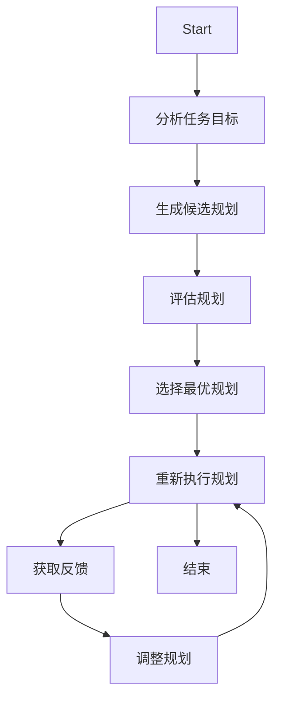
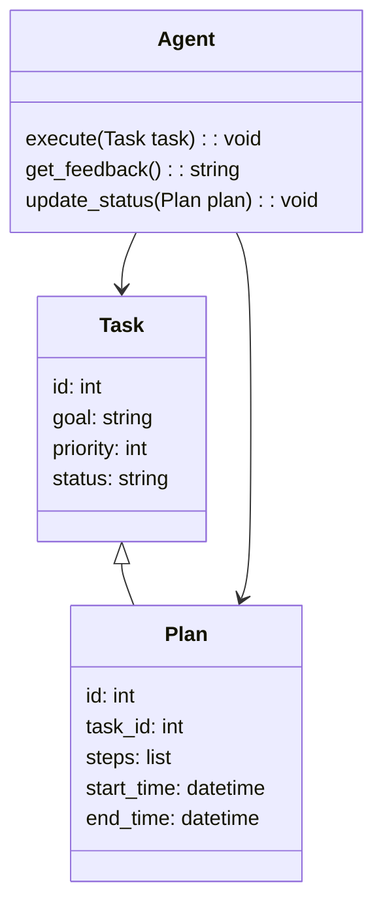
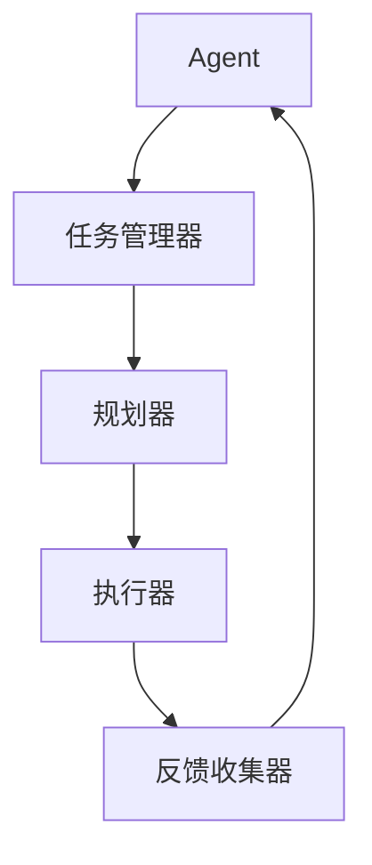
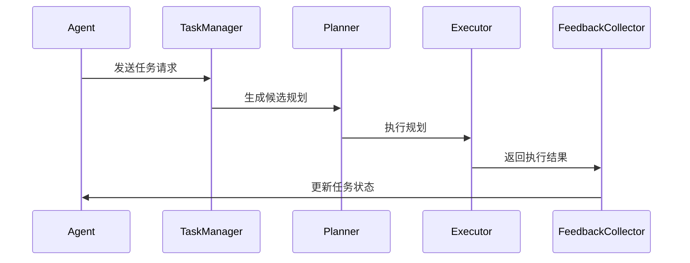

                 


# 构建AI Agent的动态任务规划与执行框架

**关键词**：AI Agent，动态任务规划，执行框架，任务分解，算法原理，系统架构

**摘要**：本文详细探讨了构建AI Agent的动态任务规划与执行框架的核心概念、算法原理、系统架构设计以及项目实战。通过背景介绍、核心概念对比、算法流程图、系统架构图和项目案例分析，帮助读者全面理解动态任务规划与执行框架的构建方法及其实际应用。

---

# 1. AI Agent的动态任务规划与执行框架概述

## 1.1 问题背景与描述

### 1.1.1 AI Agent的基本概念
AI Agent（人工智能代理）是指能够感知环境、自主决策并执行任务的智能实体。AI Agent可以是软件程序、机器人或其他智能系统，其核心目标是通过与环境交互来实现特定目标。

### 1.1.2 动态任务规划的核心问题
动态任务规划是指在不确定或变化的环境中，AI Agent能够动态调整任务优先级、分解任务并制定执行计划的能力。动态任务规划的核心问题包括：
- 任务目标的变化与不确定性
- 多目标冲突与优先级管理
- 环境变化对任务执行的影响

### 1.1.3 解决方案与边界
动态任务规划与执行框架通过以下方式解决问题：
- 实时感知环境变化
- 动态调整任务优先级
- 自适应任务分解与重组
- 灵活的执行策略

边界与外延：
- 不考虑底层传感器和执行器的具体实现
- 不涉及具体的任务执行细节（如运动规划）
- 专注于任务层次的动态规划与执行

---

## 1.2 核心概念与原理

### 1.2.1 动态任务规划的原理
动态任务规划的核心原理包括：
- **任务分解**：将复杂任务分解为多个子任务，每个子任务具有明确的目标和约束。
- **优先级管理**：根据环境变化和任务目标，动态调整任务优先级。
- **状态监测**：实时监测任务执行状态，根据反馈调整规划。

### 1.2.2 执行框架的实现机制
执行框架负责将规划结果转化为具体行动，包括：
- **任务分配**：将任务分配给不同的子系统或模块。
- **执行监控**：实时跟踪任务执行进度，发现异常时及时调整。
- **反馈处理**：根据执行结果更新任务状态，优化后续规划。

### 1.2.3 核心概念对比
| 核心概念 | 动态任务规划 | 静态任务规划 |
|----------|--------------|---------------|
| 任务目标 | 动态变化     | 静态固定     |
| 执行环境 | 不确定性高    | 稳定           |
| 规划频率 | 实时调整     | 一次性规划     |

---

# 2. 动态任务规划的算法原理

## 2.1 算法流程图



## 2.2 Python实现示例

```python
def dynamic_task_planning(tasks):
    for task in tasks:
        if task.is_critical:
            execute_critical_task(task)
        else:
            queue_task(task)
    return "Planning complete"
```

---

## 2.3 数学模型与公式

动态任务规划的数学模型可以表示为：
$$ V(s) = \max_{a} [ r(s,a) + \gamma V(s') ] $$
其中：
- $s$ 表示当前状态
- $a$ 表示动作
- $r(s,a)$ 表示动作 $a$ 在状态 $s$ 下的奖励
- $\gamma$ 表示折扣因子
- $s'$ 表示执行动作 $a$ 后的新状态

---

# 3. 系统架构设计

## 3.1 问题场景介绍

AI Agent需要在动态环境中完成复杂的任务，例如：
- 自动驾驶中的路径规划与避障
- 机器人任务分配与协作
- 智能助手的多任务处理

## 3.2 系统功能设计

### 3.2.1 领域模型类图



## 3.3 系统架构设计



---

## 3.4 接口与交互设计

### 3.4.1 序列图



---

# 4. 项目实战

## 4.1 环境安装

安装必要的库：
```bash
pip install mermaid
pip install matplotlib
pip install numpy
```

## 4.2 核心代码实现

```python
class Task:
    def __init__(self, id, goal, priority):
        self.id = id
        self.goal = goal
        self.priority = priority
        self.status = "pending"

class Plan:
    def __init__(self, task_id, steps, start_time, end_time):
        self.task_id = task_id
        self.steps = steps
        self.start_time = start_time
        self.end_time = end_time

class Agent:
    def __init__(self, tasks):
        self.tasks = tasks
        self.plans = []

    def execute(self, task):
        # 简化执行逻辑
        pass
```

## 4.3 案例分析

以自动驾驶为例，动态任务规划可以实现路径优化和避障。

---

# 5. 最佳实践与小结

## 5.1 小结

动态任务规划与执行框架是AI Agent实现复杂任务的核心技术，通过实时感知和动态调整，能够有效应对不确定性环境的挑战。

## 5.2 注意事项

- 确保任务分解的粒度适中
- 及时处理反馈以优化规划
- 考虑系统性能和实时性要求

## 5.3 拓展阅读

- 《强化学习导论》
- 《分布式系统与任务分配》
- 《动态规划算法与应用》

--- 

**总结**：本文详细介绍了AI Agent的动态任务规划与执行框架，从理论到实践，为读者提供了一套完整的解决方案。

