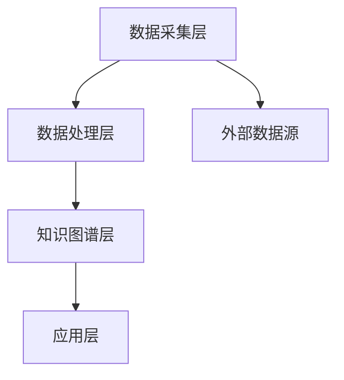
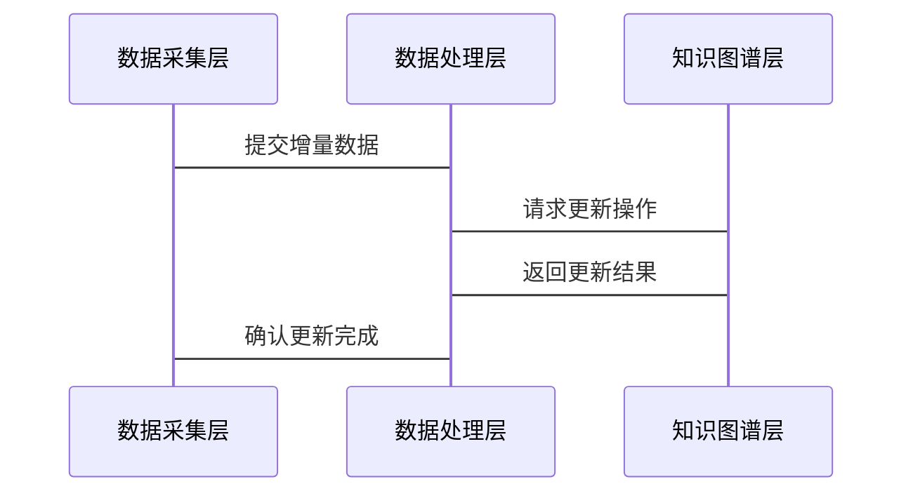

                 

# 构建AI Agent的动态知识图谱更新系统

> 关键词：AI Agent, 动态知识图谱, 知识图谱更新, 系统架构, 算法实现

> 摘要：本文旨在探讨如何构建一个高效的AI Agent动态知识图谱更新系统。从AI Agent的基本概念出发，详细分析动态知识图谱的构建与更新机制，结合实际应用场景，系统性地介绍动态知识图谱更新的算法原理与系统架构设计，最后通过一个具体项目案例展示系统的实现过程。本文将帮助读者全面理解动态知识图谱更新的核心技术与实现方法。

---

## 第1章: AI Agent与动态知识图谱概述

### 1.1 AI Agent的基本概念
#### 1.1.1 AI Agent的定义与特点
- AI Agent的定义：智能体（AI Agent）是指在环境中能够感知并自主行动以实现目标的实体。
- 特点：自主性、反应性、主动性、社会性、学习能力。

#### 1.1.2 动态知识图谱的定义与特点
- 动态知识图谱的定义：一种动态更新的知识表示模型，能够实时反映现实世界的变化。
- 特点：动态性、实时性、可扩展性。

#### 1.1.3 AI Agent与知识图谱的关系
- AI Agent依赖知识图谱进行推理和决策。
- 知识图谱通过动态更新保持信息的准确性和及时性。

### 1.2 动态知识图谱更新的背景与意义
#### 1.2.1 知识图谱的动态更新需求
- 知识图谱的动态更新需求来源于数据的实时变化，如新增实体、属性或关系的变更。
- 实际应用场景：社交媒体、电子商务、医疗健康等领域。

#### 1.2.2 动态知识图谱更新的挑战
- 数据异构性：不同数据源格式和语义的差异。
- 更新效率：大规模数据的实时更新需要高效的算法和优化的系统架构。
- 更新准确性：确保更新后知识图谱的准确性，避免错误信息的传播。

#### 1.2.3 动态知识图谱更新的意义
- 提高AI Agent的决策能力和智能水平。
- 支持动态环境下的实时推理和交互。
- 为复杂应用场景提供可靠的知识支持。

---

## 第2章: 动态知识图谱更新的核心概念

### 2.1 知识图谱的表示与存储
#### 2.1.1 知识图谱的表示方法
- 图表示法：使用图论中的节点和边表示实体及其关系。
- 三元组表示法：(头实体, 关系, 尾实体)。

#### 2.1.2 知识图谱的存储技术
- 图数据库：如Neo4j、RDF三元组存储。
- 关系型数据库：将知识图谱转换为表格形式存储。
- 索引优化：使用倒排索引提高查询效率。

#### 2.1.3 知识图谱的动态更新机制
- 增量更新：仅更新变化的部分，减少计算开销。
- 全量更新：定期对整个知识图谱进行重新构建，确保一致性。

### 2.2 动态知识图谱更新的算法原理
#### 2.2.1 知识图谱更新的算法分类
- 基于规则的更新算法：通过预定义的规则匹配和更新知识图谱。
- 基于机器学习的更新算法：利用深度学习模型自动学习更新策略。

#### 2.2.2 基于规则的更新算法
- 规则定义：定义匹配条件和更新操作。
- 匹配过程：通过规则匹配知识图谱中的特定模式。
- 更新操作：根据匹配结果执行插入、删除或修改操作。

#### 2.2.3 基于机器学习的更新算法
- 特征提取：从知识图谱中提取特征向量。
- 模型训练：训练分类器或回归模型预测更新操作。
- 更新验证：验证更新结果的准确性。

---

## 第3章: 动态知识图谱更新的算法实现

### 3.1 知识图谱更新的算法流程
#### 3.1.1 数据获取与预处理
- 数据源获取：从多个数据源获取增量数据。
- 数据清洗：去除噪声数据，确保数据质量。

#### 3.1.2 知识抽取与融合
- 实体识别：从文本中提取实体。
- 关系抽取：识别实体之间的关系。
- 数据融合：将多个数据源的信息整合到统一的知识图谱中。

#### 3.1.3 知识图谱的更新与验证
- 更新操作执行：根据算法结果执行更新。
- 更新结果验证：检查更新后知识图谱的正确性。

### 3.2 基于规则的更新算法实现
#### 3.2.1 规则定义与匹配
- 定义规则：例如，如果一个实体的属性值发生变化，则更新其相关关系。
- 规则匹配：在知识图谱中查找匹配的模式。

#### 3.2.2 更新策略的制定
- 策略制定：确定更新的优先级和执行顺序。
- 策略优化：通过优化规则减少不必要的更新操作。

#### 3.2.3 更新结果的验证
- 验证方法：通过人工检查或自动化工具验证更新结果。
- 问题修复：修复更新过程中出现的错误。

### 3.3 基于机器学习的更新算法实现
#### 3.3.1 特征提取与表示
- 特征提取：从知识图谱中提取节点和边的特征向量。
- 表示方法：使用图嵌入技术（如Word2Vec、GraphSAGE）生成低维向量表示。

#### 3.3.2 模型训练与优化
- 模型选择：选择适合任务的机器学习模型（如SVM、随机森林、神经网络）。
- 模型训练：使用训练数据训练模型，优化参数。
- 模型评估：通过验证集评估模型的性能。

#### 3.3.3 更新结果的评估
- 评估指标：准确率、召回率、F1值。
- 模型优化：根据评估结果进一步优化模型。

---

## 第4章: 动态知识图谱更新的系统架构设计

### 4.1 系统功能设计
#### 4.1.1 知识抽取模块
- 功能描述：从多种数据源抽取实体和关系。
- 输入输出：输入原始数据，输出抽取的三元组。

#### 4.1.2 知识融合模块
- 功能描述：将多个数据源的信息整合到统一的知识图谱中。
- 输入输出：输入多个三元组，输出融合后的知识图谱。

#### 4.1.3 知识图谱更新模块
- 功能描述：根据动态变化的数据更新知识图谱。
- 输入输出：输入增量数据，输出更新后的知识图谱。

### 4.2 系统架构设计
#### 4.2.1 分层架构设计
- 分层结构：数据采集层、数据处理层、知识图谱层。
- 层间交互：通过API或消息队列实现各层之间的通信。

#### 4.2.2 模块间交互设计
- 交互流程：数据采集层获取增量数据，数据处理层进行抽取和融合，知识图谱层执行更新操作。
- 交互接口：定义模块间的接口，确保兼容性和可扩展性。

#### 4.2.3 系统扩展性设计
- 模块化设计：各模块相对独立，便于扩展。
- 可扩展接口：设计灵活的接口，支持新模块的接入。

### 4.3 系统架构图

### 4.4 系统接口设计
- 数据采集接口：接收增量数据。
- 数据处理接口：提供抽取和融合功能。
- 知识图谱更新接口：执行具体的更新操作。

### 4.5 系统交互流程图

---

## 第5章: 动态知识图谱更新的项目实战

### 5.1 项目背景与目标
#### 5.1.1 项目背景介绍
- 项目背景：构建一个支持动态更新的AI Agent知识图谱系统，应用于智能客服领域。

#### 5.1.2 项目目标设定
- 目标：实现知识图谱的动态更新，支持智能客服的实时对话和知识推理。

#### 5.1.3 项目范围界定
- 范围：仅考虑增量数据的更新，不涉及全量重建。

### 5.2 项目核心实现
#### 5.2.1 环境搭建与依赖安装
- 环境搭建：安装Python、虚拟环境（如venv）。
- 依赖安装：使用pip安装所需的库（如Neo4j驱动、pandas、numpy）。

#### 5.2.2 核心代码实现
- 数据采集模块：编写代码从数据库中获取增量数据。
- 数据处理模块：实现知识抽取和融合功能。
- 知识图谱更新模块：编写更新逻辑，执行具体的更新操作。

#### 5.2.3 代码功能解读
- 数据采集模块：使用Neo4j数据库存储知识图谱，编写查询语句获取增量数据。
- 数据处理模块：使用自然语言处理库（如spaCy）进行实体识别和关系抽取。
- 知识图谱更新模块：根据抽取的结果，通过图数据库的API执行插入、删除或修改操作。

### 5.3 项目案例分析
#### 5.3.1 案例背景介绍
- 案例背景：智能客服系统中，用户咨询关于产品信息的问题，需要动态更新产品知识库。

#### 5.3.2 数据流分析
- 数据采集：从用户咨询中提取实体（产品名称、型号）和关系（属于、支持）。
- 数据处理：将提取的实体和关系与现有知识图谱进行匹配，生成增量数据。
- 知识图谱更新：将增量数据插入知识图谱，更新产品信息。

#### 5.3.3 系统输出与结果验证
- 系统输出：更新后的知识图谱，支持智能客服的实时推理。
- 结果验证：通过查询知识图谱，验证更新结果的准确性。

---

## 第6章: 动态知识图谱更新的最佳实践

### 6.1 最佳实践
- 系统设计：模块化设计，确保系统的可扩展性和可维护性。
- 数据管理：采用高效的数据存储和查询技术，优化系统性能。
- 算法选择：根据具体场景选择合适的算法，平衡准确性和效率。

### 6.2 小结
- 本文系统性地介绍了动态知识图谱更新的核心概念、算法实现和系统架构设计。
- 通过实际项目案例展示了系统的实现过程，为读者提供了宝贵的实践经验。

### 6.3 注意事项
- 确保数据的准确性和及时性，避免错误信息的传播。
- 在实际应用中，注意系统的性能优化和扩展性设计。
- 定期对系统进行维护和更新，保持知识图谱的准确性和完整性。

### 6.4 拓展阅读
- 推荐阅读相关领域的书籍和论文，深入理解动态知识图谱更新的最新研究成果。

---

通过以上目录大纲，读者可以系统性地了解动态知识图谱更新的核心技术与实现方法，掌握构建AI Agent动态知识图谱更新系统的具体步骤和实践技巧。

