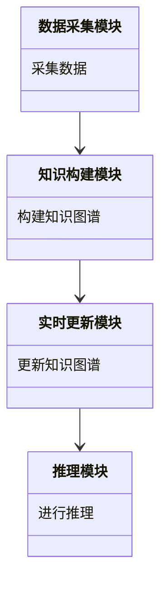
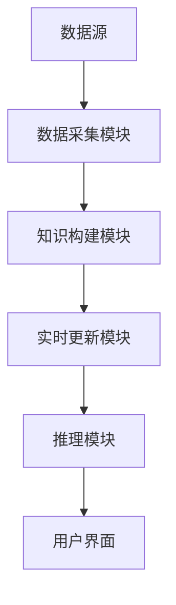
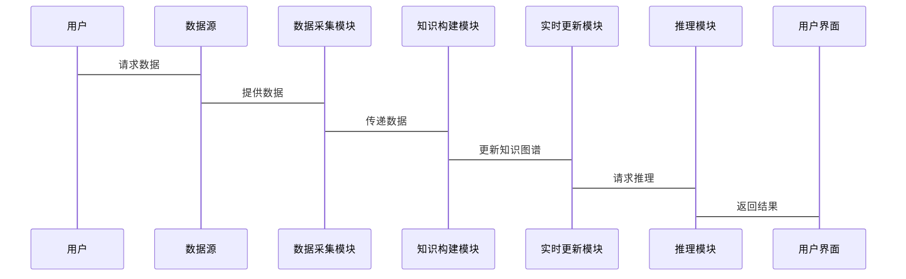

                 


# 《构建AI Agent的动态知识图谱：实时更新与推理》

## 关键词：动态知识图谱、AI Agent、实时更新、推理、知识图谱构建、AI推理机制

## 摘要：本文深入探讨了构建AI Agent的动态知识图谱的关键技术，重点分析了实时更新与推理的实现机制。通过详细阐述动态知识图谱的核心概念、算法原理、系统架构设计以及实际项目案例，本文为读者提供了从理论到实践的全面指导，帮助理解如何构建高效、智能的动态知识图谱，以支持AI Agent的自主决策和推理能力。

---

# 第一部分: 动态知识图谱与AI Agent概述

# 第1章: 动态知识图谱与AI Agent的背景介绍

## 1.1 问题背景与问题描述

### 1.1.1 动态知识图谱的定义与特点

动态知识图谱是一种能够实时捕捉和反映现实世界中实体及其关系变化的知识表示方法。它与传统静态知识图谱的主要区别在于其实时更新能力，能够根据新的数据流不断调整和优化知识结构。

**动态知识图谱的特点：**

- **实时性**：能够快速响应数据变化，保持知识的时效性。
- **多样性**：支持多种类型的数据（结构化、半结构化、非结构化）。
- **可扩展性**：能够动态添加、删除或修改知识节点和关系。
- **自适应性**：能够根据上下文自动调整知识表示形式。

### 1.1.2 AI Agent的核心概念与功能

AI Agent（智能体）是一种能够感知环境、自主决策并执行任务的智能系统。AI Agent的核心功能包括：

- **感知**：通过传感器或其他输入渠道获取环境信息。
- **推理**：基于知识图谱进行逻辑推理，生成新的知识或结论。
- **决策**：根据推理结果做出最优或合理的选择。
- **执行**：通过执行机构或接口与外部环境交互。

### 1.1.3 动态知识图谱与AI Agent的关联性

动态知识图谱为AI Agent提供了动态、实时的知识支持，使其能够根据环境变化快速调整行为策略。AI Agent则为动态知识图谱提供了应用的场景，推动其实时更新和优化。

### 1.1.4 问题解决与边界外延

动态知识图谱与AI Agent的结合，能够解决以下问题：

- **实时知识更新**：确保AI Agent始终基于最新的知识进行推理和决策。
- **动态推理**：支持在复杂、多变的环境中进行高效的推理和决策。
- **知识表示优化**：通过动态更新优化知识图谱的结构和内容。

### 1.1.5 核心概念与要素组成

动态知识图谱与AI Agent的核心要素包括：

- **知识节点**：表示实体或概念。
- **关系边**：表示实体之间的关系。
- **属性**：描述实体的特征或性质。
- **动态规则**：定义知识更新的触发条件和操作。
- **推理规则**：定义推理的逻辑规则和策略。

---

## 1.2 问题解决与边界外延

### 1.2.1 动态知识图谱在AI Agent中的作用

动态知识图谱为AI Agent提供了动态、实时的知识支持，使其能够根据环境变化快速调整行为策略。

### 1.2.2 AI Agent动态推理的实现方式

AI Agent的动态推理可以通过以下方式实现：

- **基于规则的推理**：通过预定义的规则进行逻辑推理。
- **基于机器学习的推理**：利用训练好的模型进行推理。
- **混合推理**：结合规则和机器学习模型进行推理。

### 1.2.3 问题解决的边界与外延

动态知识图谱与AI Agent的结合，其边界与外延包括：

- **边界**：动态知识图谱的实时更新能力和AI Agent的推理能力。
- **外延**：动态知识图谱的应用场景和AI Agent的决策范围。

---

## 1.3 核心概念与要素组成

### 1.3.1 动态知识图谱的核心要素

动态知识图谱的核心要素包括：

- **知识节点**：表示实体或概念。
- **关系边**：表示实体之间的关系。
- **属性**：描述实体的特征或性质。
- **动态规则**：定义知识更新的触发条件和操作。
- **推理规则**：定义推理的逻辑规则和策略。

### 1.3.2 AI Agent的知识表示与推理机制

AI Agent的知识表示与推理机制包括：

- **知识表示**：通过知识图谱的形式表示知识。
- **推理机制**：基于知识图谱进行逻辑推理。

### 1.3.3 知识图谱与AI Agent的交互模式

知识图谱与AI Agent的交互模式包括：

- **读写模式**：AI Agent读取知识图谱并进行推理，或者写入新的知识。
- **订阅模式**：AI Agent订阅知识图谱的动态更新。

---

## 1.4 本章小结

本章通过介绍动态知识图谱与AI Agent的背景、核心概念与联系，为后续章节的深入分析奠定了基础。接下来，我们将从动态知识图谱的核心概念与联系、算法原理、系统架构设计等方面展开详细讨论。

---

# 第2章: 动态知识图谱的核心概念与联系

## 2.1 动态知识图谱的原理与实现

### 2.1.1 动态知识图谱的构建过程

动态知识图谱的构建过程包括以下步骤：

1. **数据采集**：从多种数据源采集数据。
2. **数据预处理**：清洗、转换和整合数据。
3. **知识抽取**：从数据中提取实体、关系和属性。
4. **知识融合**：将多个数据源的知识进行整合和冲突消解。
5. **知识存储**：将知识表示为图结构并存储。
6. **实时更新**：根据新的数据流不断更新知识图谱。

### 2.1.2 实时更新机制的实现方式

实时更新机制可以通过以下方式实现：

- **数据流驱动**：通过数据流触发知识图谱的更新。
- **事件驱动**：通过事件触发知识图谱的更新。

### 2.1.3 动态知识图谱的存储与管理

动态知识图谱的存储与管理可以通过以下方式实现：

- **图数据库**：使用图数据库（如Neo4j）存储知识图谱。
- **分布式存储**：使用分布式存储技术提高存储效率和扩展性。

## 2.2 AI Agent的推理机制

### 2.2.1 基于知识图谱的推理

基于知识图谱的推理可以通过以下方式实现：

- **路径查询**：通过查询知识图谱中的路径进行推理。
- **规则推理**：通过预定义的规则进行推理。

### 2.2.2 动态推理的实现方式

动态推理的实现方式包括：

- **在线推理**：实时进行推理。
- **增量推理**：根据新的知识进行增量推理。

## 2.3 动态知识图谱与AI Agent的联系

### 2.3.1 动态知识图谱对AI Agent的支持

动态知识图谱为AI Agent提供了动态、实时的知识支持，使其能够根据环境变化快速调整行为策略。

### 2.3.2 AI Agent对动态知识图谱的推动

AI Agent的应用推动了动态知识图谱的实时更新和优化。

---

## 2.4 本章小结

本章详细介绍了动态知识图谱的核心概念与联系，重点分析了动态知识图谱的构建过程、实时更新机制以及AI Agent的推理机制。接下来，我们将从算法原理、系统架构设计等方面展开深入讨论。

---

# 第3章: 算法原理讲解

## 3.1 动态知识图谱的实时更新算法

### 3.1.1 实时更新算法的实现流程

实时更新算法的实现流程如下：

1. **数据采集**：从数据源采集新的数据。
2. **数据处理**：清洗、转换和整合数据。
3. **知识抽取**：从数据中提取实体、关系和属性。
4. **知识融合**：将新的知识与现有知识图谱进行融合。
5. **知识存储**：将更新后的知识图谱存储。

### 3.1.2 实时更新算法的数学模型

实时更新算法的数学模型如下：

$$
\text{更新后知识图谱} = \text{现有知识图谱} \cup \text{新知识}
$$

### 3.1.3 实时更新算法的实现代码

```python
def update_knowledge_graph(graph, new_data):
    # 数据预处理
    processed_data = preprocess(new_data)
    # 知识抽取
    extracted Knowledge = extract(processed_data)
    # 知识融合
    merged_graph = merge(graph, extracted_Knowledge)
    return merged_graph
```

---

## 3.2 AI Agent的推理算法

### 3.2.1 推理算法的实现流程

推理算法的实现流程如下：

1. **知识查询**：从知识图谱中查询相关知识。
2. **规则匹配**：匹配推理规则。
3. **逻辑推理**：根据推理规则进行推理。
4. **结果返回**：返回推理结果。

### 3.2.2 推理算法的数学模型

推理算法的数学模型如下：

$$
\text{推理结果} = \text{推理规则} \times \text{知识图谱}
$$

### 3.2.3 推理算法的实现代码

```python
def infer(agent, query):
    # 知识查询
    knowledge = query_graph(agent.graph, query)
    # 推理规则匹配
    rule = match_rule(knowledge)
    # 逻辑推理
    result = perform_inference(rule, knowledge)
    return result
```

---

## 3.3 本章小结

本章详细介绍了动态知识图谱的实时更新算法和AI Agent的推理算法，重点分析了其实现流程、数学模型和代码实现。接下来，我们将从系统架构设计等方面展开深入讨论。

---

# 第4章: 系统分析与架构设计

## 4.1 问题场景介绍

### 4.1.1 系统问题场景

系统问题场景包括：

- **数据源多样化**：需要处理多种数据源。
- **知识更新频繁**：需要实时更新知识图谱。
- **推理需求复杂**：需要高效的推理能力。

## 4.2 系统功能设计

### 4.2.1 系统功能模块

系统功能模块包括：

- **数据采集模块**：负责数据采集。
- **知识构建模块**：负责知识构建。
- **实时更新模块**：负责实时更新知识图谱。
- **推理模块**：负责推理。

### 4.2.2 领域模型设计

领域模型设计如下：



---

## 4.3 系统架构设计

### 4.3.1 系统架构设计

系统架构设计如下：



---

## 4.4 系统交互设计

### 4.4.1 系统交互流程

系统交互流程如下：

1. **数据采集**：用户通过数据源向系统输入数据。
2. **知识构建**：系统将数据转化为知识图谱。
3. **实时更新**：系统根据新数据实时更新知识图谱。
4. **推理**：系统根据知识图谱进行推理并返回结果。

### 4.4.2 系统交互序列图

系统交互序列图如下：



---

## 4.5 本章小结

本章通过问题场景介绍、系统功能设计、系统架构设计和系统交互设计，详细描述了构建动态知识图谱的系统架构。接下来，我们将从项目实战等方面展开深入讨论。

---

# 第5章: 项目实战

## 5.1 环境安装与配置

### 5.1.1 环境安装

环境安装包括：

- **Python**：安装Python 3.x。
- **图数据库**：安装Neo4j。
- **开发工具**：安装PyCharm或VS Code。

### 5.1.2 环境配置

环境配置包括：

- **Python库**：安装必要的Python库（如pandas、networkx）。
- **Neo4j配置**：配置Neo4j的远程访问。

## 5.2 系统核心实现

### 5.2.1 核心代码实现

核心代码实现包括：

```python
import neo4j
from neo4j import GraphDatabase

class KnowledgeGraph:
    def __init__(self, uri, user, password):
        self.driver = GraphDatabase.driver(uri, auth=(user, password))
    
    def add_node(self, label, properties):
        with self.driver.session() as session:
            session.run("CREATE (n:" + label + " { " + str(properties) + " })")
    
    def add_relation(self, start_label, start_id, relation, end_label, end_id):
        with self.driver.session() as session:
            session.run("MATCH (a:" + start_label + "{id:" + start_id + "}), (b:" + end_label + "{id:" + end_id + "}) CREATE (a)-[r:" + relation + "]->(b)")
```

### 5.2.2 代码功能解读与分析

核心代码实现的功能包括：

- **添加节点**：向知识图谱中添加节点。
- **添加关系**：向知识图谱中添加关系。

## 5.3 实际案例分析

### 5.3.1 案例背景

案例背景包括：

- **医疗领域**：构建医疗知识图谱，支持AI Agent辅助诊断。

### 5.3.2 案例实现

案例实现包括：

1. **数据采集**：从医疗数据库中采集患者信息。
2. **知识构建**：构建医疗知识图谱。
3. **实时更新**：实时更新医疗知识图谱。
4. **推理**：基于知识图谱进行推理，辅助诊断。

### 5.3.3 案例分析

案例分析包括：

- **推理结果**：AI Agent基于知识图谱进行推理，辅助医生做出诊断。
- **推理过程**：详细分析推理过程，展示动态知识图谱的优势。

## 5.4 项目小结

### 5.4.1 经验总结

经验总结包括：

- **动态知识图谱的优势**：能够实时更新知识图谱，支持动态推理。
- **AI Agent的应用价值**：能够提高医疗诊断的准确性和效率。

### 5.4.2 问题与改进方向

问题与改进方向包括：

- **数据质量**：需要提高数据采集和处理的准确性。
- **推理效率**：需要优化推理算法，提高推理效率。

---

## 5.5 本章小结

本章通过实际案例分析，详细展示了动态知识图谱在AI Agent中的应用。接下来，我们将从总结与展望等方面展开深入讨论。

---

# 第6章: 总结与展望

## 6.1 总结

### 6.1.1 核心内容回顾

核心内容回顾包括：

- **动态知识图谱**：动态知识图谱的构建与实时更新。
- **AI Agent的推理机制**：基于知识图谱的推理。

### 6.1.2 实践经验总结

实践经验总结包括：

- **动态知识图谱的优势**：能够实时更新知识图谱，支持动态推理。
- **AI Agent的应用价值**：能够提高决策的准确性和效率。

---

## 6.2 展望

### 6.2.1 未来研究方向

未来研究方向包括：

- **动态知识图谱的优化**：优化动态知识图谱的构建与更新算法。
- **推理算法的改进**：改进推理算法，提高推理效率和准确性。

### 6.2.2 技术发展趋势

技术发展趋势包括：

- **知识图谱的深度学习**：结合深度学习技术，提高知识图谱的表示能力。
- **实时推理的优化**：优化实时推理技术，提高推理速度和准确性。

---

## 6.3 本章小结

本章通过总结与展望，对构建AI Agent的动态知识图谱进行了全面回顾与展望。未来的研究方向和技术发展趋势将为动态知识图谱与AI Agent的结合提供更多的可能性。

---

# 附录

## 附录A: 相关术语解释

- **动态知识图谱**：一种能够实时捕捉和反映现实世界中实体及其关系变化的知识表示方法。
- **AI Agent**：一种能够感知环境、自主决策并执行任务的智能系统。

## 附录B: 参考文献

- [1] 知识图谱相关研究论文。
- [2] AI Agent相关研究论文。

---

# 结束语

构建AI Agent的动态知识图谱是一项具有挑战性的任务，但其潜力巨大。通过实时更新与推理，动态知识图谱能够为AI Agent提供强大的知识支持，使其在复杂、多变的环境中实现高效的决策和推理。未来的研究将进一步优化动态知识图谱的构建与更新算法，改进推理算法，推动AI Agent在更多领域的应用。

--- 

以上是《构建AI Agent的动态知识图谱：实时更新与推理》的目录大纲，希望对您有所帮助！

