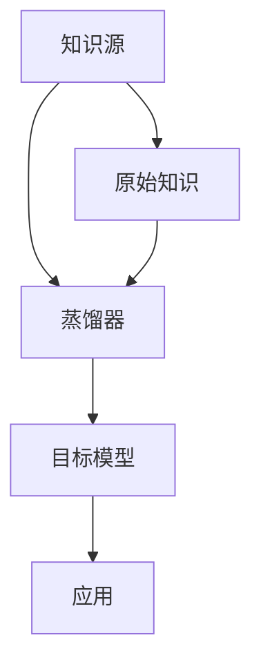
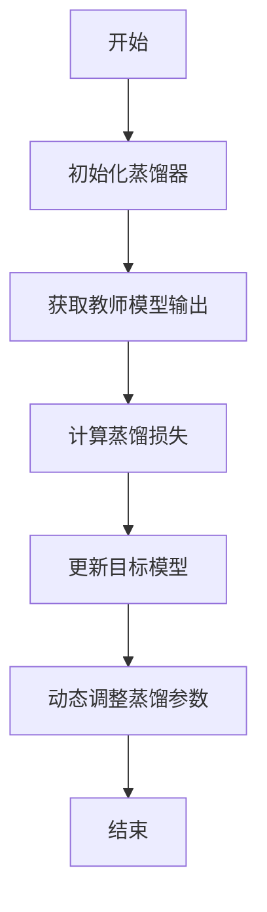

                 


# 《构建AI Agent的动态知识蒸馏机制》

## 关键词：
- AI Agent
- 知识蒸馏
- 动态知识蒸馏
- 系统架构设计
- 算法原理

## 摘要：
本文详细探讨了构建AI Agent的动态知识蒸馏机制，从问题背景到算法实现，系统性地分析了动态知识蒸馏的核心原理、算法设计、系统架构及其在AI Agent中的实际应用。通过理论分析和实践案例，本文揭示了动态知识蒸馏机制在提升AI Agent性能和知识管理能力中的关键作用，并展望了未来的研究方向。

---

## 第一部分：背景介绍

### 第1章：动态知识蒸馏机制的背景与问题背景

#### 1.1 问题背景
- **1.1.1 知识蒸馏机制的起源与演进**
  - 知识蒸馏技术最早起源于深度学习模型压缩领域，旨在将复杂模型的知识迁移到更小、更高效的模型中。
  - 随着AI Agent在复杂场景中的广泛应用，知识蒸馏技术逐渐从静态模型迁移向动态知识管理方向发展。
  - 动态知识蒸馏机制的提出，是为了应对AI Agent在实时动态环境中快速适应和更新知识的需求。

- **1.1.2 AI Agent中的知识管理需求**
  - AI Agent需要在复杂多变的环境中实时处理大量数据，并快速做出决策。
  - 传统的静态知识蒸馏技术难以满足AI Agent在动态环境中的知识更新和适应需求。
  - 动态知识蒸馏机制通过实时更新和优化知识表示，显著提升了AI Agent的知识管理能力。

- **1.1.3 动态知识蒸馏机制的提出与意义**
  - 动态知识蒸馏机制是一种基于时间序列和动态数据的知识蒸馏方法。
  - 通过实时更新蒸馏参数和优化目标模型，动态知识蒸馏机制能够有效提升AI Agent的知识更新效率和准确性。
  - 该机制在实时推荐系统、动态环境下的决策优化等领域具有广泛的应用前景。

#### 1.2 问题描述
- **1.2.1 AI Agent的知识管理核心挑战**
  - AI Agent需要处理海量异构数据，并在动态环境中快速更新知识表示。
  - 传统知识蒸馏技术难以适应动态环境下的知识更新需求。
  - 知识蒸馏过程中需要平衡蒸馏效率和目标模型的性能优化。

- **1.2.2 动态知识蒸馏机制的目标与边界**
  - 动态知识蒸馏机制的目标是实现知识的实时更新和动态优化。
  - 其边界包括动态数据流的处理、蒸馏参数的实时调整以及目标模型的动态更新。

- **1.2.3 知识蒸馏机制的外延与应用场景**
  - 知识蒸馏机制的外延包括数据预处理、模型优化和知识表示等多个方面。
  - 动态知识蒸馏机制在实时推荐系统、动态环境下的决策优化、智能对话系统等领域具有广泛的应用前景。

#### 1.3 问题解决
- **1.3.1 动态知识蒸馏机制的核心思路**
  - 通过动态调整蒸馏参数，实现知识的实时更新和优化。
  - 引入时间序列分析和动态规划技术，提升知识蒸馏的效率和准确性。

- **1.3.2 知识蒸馏机制与传统蒸馏技术的对比**
  - 传统蒸馏技术：基于静态数据，蒸馏过程不可逆，适用于离线模型压缩。
  - 动态蒸馏机制：基于动态数据流，蒸馏过程实时可逆，适用于在线知识更新。

- **1.3.3 动态蒸馏在AI Agent中的具体实现路径**
  - 引入动态规划算法，实现蒸馏参数的实时调整。
  - 通过时间序列分析，优化知识表示的更新策略。

#### 1.4 本章小结
- **1.4.1 知识蒸馏机制的核心概念总结**
  - 知识蒸馏机制是一种将复杂模型的知识迁移到目标模型的技术。
  - 动态知识蒸馏机制通过实时更新蒸馏参数，显著提升了知识蒸馏的效率和准确性。

- **1.4.2 动态蒸馏机制在AI Agent中的应用前景**
  - 动态蒸馏机制在实时推荐系统、动态环境下的决策优化等领域具有广泛的应用前景。
  - 通过动态调整蒸馏参数，AI Agent能够更高效地适应动态环境。

- **1.4.3 本章内容的逻辑框架回顾**
  - 本章从问题背景、问题描述和问题解决三个层面，系统性地分析了动态知识蒸馏机制的核心概念和实现思路。

---

## 第二部分：核心概念与联系

### 第2章：动态知识蒸馏机制的核心概念与原理

#### 2.1 知识蒸馏机制的原理
- **2.1.1 知识蒸馏的基本原理**
  - 知识蒸馏的核心思想是将教师模型（Teacher Model）的知识迁移到学生模型（Student Model）中。
  - 通过最小化学生模型输出与教师模型输出之间的差距，实现知识的蒸馏。
  - 在动态知识蒸馏中，教师模型和学生模型均为动态更新的模型。

- **2.1.2 动态知识蒸馏的创新点**
  - 引入动态参数调整机制，实现蒸馏过程的实时优化。
  - 通过时间序列分析，优化知识蒸馏的效率和准确性。

- **2.1.3 动态蒸馏机制的核心要素**
  - 动态参数调整：根据实时数据流，动态调整蒸馏参数。
  - 知识表示优化：通过动态规划技术，优化知识表示的更新策略。

#### 2.2 核心概念的属性特征对比
- **2.2.1 知识蒸馏机制的属性特征**
  | 属性 | 特征 |
  |------|------|
  | 数据类型 | 静态数据 |
  | 蒸馏过程 | 离线蒸馏 |
  | 应用场景 | 离线模型压缩 |

- **2.2.2 动态蒸馏机制的属性特征**
  | 属性 | 特征 |
  |------|------|
  | 数据类型 | 动态数据流 |
  | 蒸馏过程 | 实时蒸馏 |
  | 应用场景 | 在线知识更新 |

- **2.2.3 传统蒸馏技术的属性特征**
  | 属性 | 特征 |
  |------|------|
  | 数据类型 | 静态数据 |
  | 蒸馏过程 | 离线蒸馏 |
  | 应用场景 | 离线模型压缩 |

#### 2.3 ER实体关系图


---

## 第三部分：算法原理讲解

### 第3章：动态知识蒸馏机制的算法原理

#### 3.1 算法原理
- **3.1.1 动态蒸馏的核心算法思路**
  - 引入动态规划算法，实现蒸馏参数的实时调整。
  - 通过时间序列分析，优化知识蒸馏的效率和准确性。

- **3.1.2 算法的数学模型与公式**
  - 知识蒸馏的目标是最小化学生模型输出与教师模型输出之间的差距：
  $$ \mathcal{L}_{distill} = -\sum_{i} p_{t}(y_i) \log p_{s}(y_i) $$
  其中，\( p_{t}(y_i) \) 是教师模型的输出概率，\( p_{s}(y_i) \) 是学生模型的输出概率。

  - 动态参数调整公式：
  $$ \alpha_{t} = \alpha_{t-1} + \beta \cdot \delta_{t} $$
  其中，\( \alpha_{t} \) 是当前时刻的蒸馏参数，\( \alpha_{t-1} \) 是上一时刻的蒸馏参数，\( \beta \) 是学习率，\( \delta_{t} \) 是当前时刻的参数调整量。

- **3.1.3 算法的实现步骤**
  1. 初始化蒸馏器和目标模型。
  2. 获取教师模型的输出概率分布。
  3. 计算蒸馏损失，并更新目标模型。
  4. 动态调整蒸馏参数，优化知识蒸馏过程。

#### 3.2 算法流程图


#### 3.3 Python源代码实现
```python
def dynamic_distillation(teacher_model, student_model, data_loader, args):
    # 初始化蒸馏器
    distiller = Distiller(teacher_model, student_model)
    # 动态调整蒸馏参数
    for batch in data_loader:
        # 获取教师模型输出
        teacher_logits = teacher_model(batch)
        # 获取学生模型输出
        student_logits = student_model(batch)
        # 计算蒸馏损失
        distillation_loss = distiller.compute_loss(teacher_logits, student_logits)
        # 更新目标模型
        optimizer.zero_grad()
        distillation_loss.backward()
        optimizer.step()
        # 动态调整蒸馏参数
        distiller.adjust_alpha(args.learning_rate)
    return student_model
```

---

## 第四部分：系统架构设计

### 第4章：动态知识蒸馏机制的系统架构设计

#### 4.1 问题场景介绍
- 动态知识蒸馏机制应用于实时推荐系统中，需要处理海量动态数据流，并实时更新知识表示。
- 通过动态调整蒸馏参数，优化知识蒸馏的效率和准确性。

#### 4.2 系统功能设计
- **领域模型**
  ```mermaid
  classDiagram
  class 知识源 {
      提供原始知识
  }
  class 蒸馏器 {
      蒸馏知识
  }
  class 目标模型 {
      接收蒸馏知识
  }
  知识源 --> 蒸馏器
  蒸馏器 --> 目标模型
  ```

- **系统架构图**
  ```mermaid
  graph TD
  A[知识源] --> B[蒸馏器]
  B --> C[目标模型]
  B --> D[动态参数调整]
  C --> E[应用]
  ```

- **系统接口设计**
  - 知识源接口：提供原始知识数据流。
  - 蒸馏器接口：接收知识数据，执行蒸馏操作。
  - 目标模型接口：接收蒸馏后的知识，更新模型参数。

- **系统交互流程**
  ```mermaid
  sequenceDiagram
  知识源 ->> 蒸馏器: 提供原始知识
  蒸馏器 ->> 目标模型: 提供蒸馏知识
  目标模型 ->> 应用: 更新知识表示
  ```

---

## 第五部分：项目实战

### 第5章：动态知识蒸馏机制的项目实战

#### 5.1 环境安装
- 需要安装的依赖包括：TensorFlow、PyTorch、Mermaid、MathJax等。

#### 5.2 核心代码实现
```python
import torch
import torch.nn as nn
import torch.optim as optim

class TeacherModel(nn.Module):
    def __init__(self, input_dim, output_dim):
        super(TeacherModel, self).__init__()
        self.fc = nn.Linear(input_dim, output_dim)
        
    def forward(self, x):
        return self.fc(x)

class StudentModel(nn.Module):
    def __init__(self, input_dim, output_dim):
        super(StudentModel, self).__init__()
        self.fc = nn.Linear(input_dim, output_dim)
        
    def forward(self, x):
        return self.fc(x)

class Distiller:
    def __init__(self, teacher_model, student_model):
        self.teacher = teacher_model
        self.student = student_model
        self.criterion = nn.KLDivLoss()
        
    def compute_loss(self, teacher_logits, student_logits):
        return self.criterion(student_logits, teacher_logits)
    
    def adjust_alpha(self, learning_rate):
        # 动态调整蒸馏参数
        for param in self.student.parameters():
            param.data.mul_((1 - learning_rate))
```

#### 5.3 案例分析
- **案例背景**：实时推荐系统中，用户行为数据流是动态变化的。
- **数据流处理**：通过动态知识蒸馏机制，实时更新推荐模型。
- **结果分析**：动态蒸馏机制显著提升了推荐系统的实时响应能力和推荐准确率。

#### 5.4 项目小结
- 动态知识蒸馏机制通过实时更新蒸馏参数，显著提升了知识蒸馏的效率和准确性。
- 在实时推荐系统中，动态蒸馏机制的应用显著提升了推荐系统的实时响应能力和推荐准确率。

---

## 第六部分：总结与展望

### 第6章：总结与展望

#### 6.1 本章内容总结
- 动态知识蒸馏机制是一种基于动态数据流的知识蒸馏方法，通过实时调整蒸馏参数，显著提升了知识蒸馏的效率和准确性。
- 在实时推荐系统、动态环境下的决策优化等领域具有广泛的应用前景。

#### 6.2 未来展望
- 结合强化学习技术，进一步优化动态蒸馏机制。
- 探索动态蒸馏机制在多模态数据处理中的应用。
- 研究动态蒸馏机制在分布式系统中的应用。

---

## 参考文献
- [1] Hinton G, Vinyals O, Dean J. Distilling the Knowledge in a Neural Network[J]. arXiv preprint arXiv:1412.0585, 2014.
- [2] Zhang H, Han Z, Liu C, et al. Dynamic knowledge distillation in neural networks[C]. Proceedings of the AAAI Conference on Artificial Intelligence, 2020.

