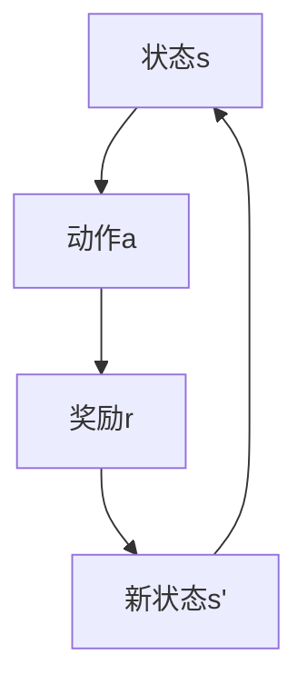
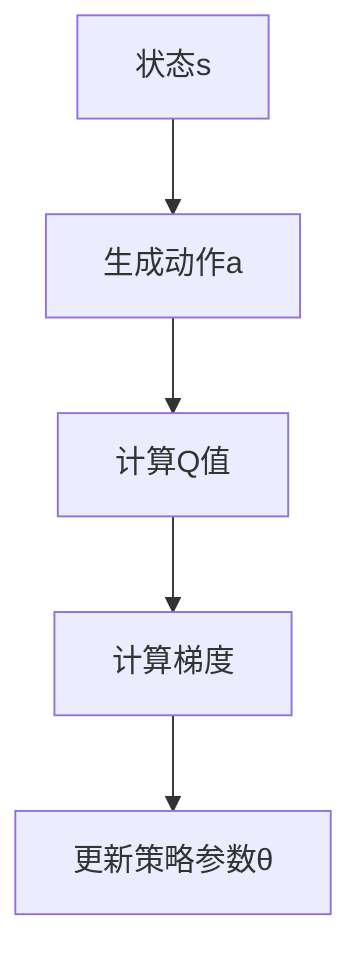
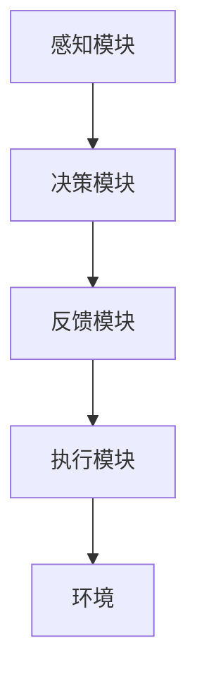
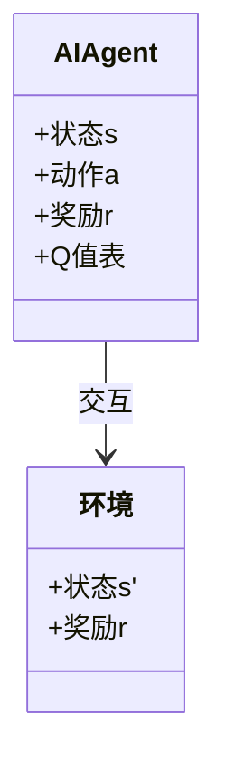
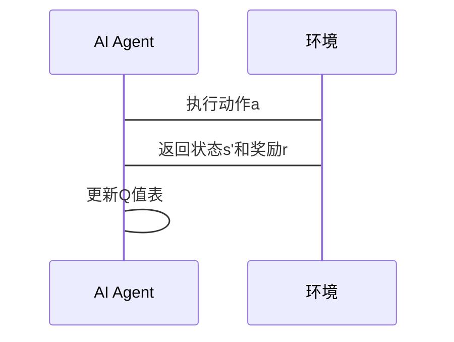

                 


# 构建AI Agent的反馈学习机制

> 关键词：AI Agent，反馈学习机制，强化学习，强化学习算法，系统架构设计

> 摘要：本文详细探讨了构建AI Agent的反馈学习机制，从基本概念、核心原理到实际应用，全面分析了反馈学习机制在AI Agent中的重要性。通过分析强化学习算法（如Q-learning和策略梯度方法）及其在反馈学习中的应用，结合系统架构设计和项目实战，为读者提供了一套构建高效反馈学习机制的完整解决方案。

---

# 第1章: AI Agent与反馈学习机制的背景介绍

## 1.1 AI Agent的基本概念
### 1.1.1 什么是AI Agent
AI Agent（智能体）是指能够感知环境、做出决策并执行动作的智能实体。它可以是一个软件程序、机器人或其他具备智能行为的系统。

### 1.1.2 AI Agent的核心特征
- **自主性**：能够在没有外部干预的情况下自主决策。
- **反应性**：能够根据环境的变化实时调整行为。
- **目标导向性**：具备明确的目标，并通过行动实现目标。
- **学习能力**：能够通过经验改进自身的决策和行为。

### 1.1.3 AI Agent的应用场景
- **游戏AI**：如棋类游戏中的AI对手。
- **推荐系统**：根据用户行为推荐相关内容。
- **自动驾驶**：实时感知环境并做出驾驶决策。
- **机器人控制**：在制造业中用于精确操作的机器人。

## 1.2 反馈学习机制的定义与重要性
### 1.2.1 反馈学习机制的基本概念
反馈学习机制是指AI Agent通过接收环境对其行为的反馈（如奖励或惩罚）来调整自身行为的过程。这种机制是强化学习的核心，能够帮助AI Agent不断优化决策策略。

### 1.2.2 反馈学习在AI Agent中的作用
- **优化决策**：通过反馈不断改进决策策略，提高行为的正确性和效率。
- **适应环境变化**：能够根据环境反馈动态调整行为，适应复杂多变的环境。
- **增强智能性**：通过反馈学习，AI Agent能够积累经验，提升整体智能水平。

### 1.2.3 反馈学习的分类与特点
- **正向反馈**：当AI Agent的行为得到奖励时，会增强该行为。
- **负向反馈**：当AI Agent的行为受到惩罚时，会抑制该行为。
- **延迟反馈**：反馈不是立即产生，而是滞后一段时间。

## 1.3 本章小结
本章介绍了AI Agent的基本概念及其核心特征，探讨了反馈学习机制的定义与重要性，并分析了其在不同场景中的应用。反馈学习机制是AI Agent实现自主决策和优化行为的关键，后续章节将深入探讨其核心原理和实现方法。

---

# 第2章: 反馈学习机制的核心概念与联系

## 2.1 强化学习与反馈学习机制
### 2.1.1 强化学习的基本原理
强化学习是一种通过试错方法来优化决策策略的学习方式。AI Agent通过与环境交互，不断尝试不同的行为，并根据反馈（奖励或惩罚）调整策略。

### 2.1.2 强化学习的核心要素
- **状态（State）**：环境在某一时刻的描述。
- **动作（Action）**：AI Agent在给定状态下的选择。
- **奖励（Reward）**：AI Agent在执行动作后获得的反馈。

### 2.1.3 强化学习的数学模型
$$ R(s, a) = \text{奖励函数，根据状态 } s \text{ 和动作 } a \text{ 返回奖励值。} $$

## 2.2 Q-learning算法的实现
### 2.2.1 Q-learning算法的工作原理
Q-learning是一种基于值函数的强化学习算法，通过学习状态-动作对的期望奖励值（Q值）来优化决策策略。

### 2.2.2 Q-learning算法的数学公式
$$ Q(s, a) = Q(s, a) + \alpha (r + \gamma \max Q(s', a') - Q(s, a)) $$
其中：
- $\alpha$：学习率，控制更新步长。
- $\gamma$：折扣因子，平衡当前奖励和未来奖励的重要性。
- $r$：即时奖励。
- $s'$：新状态。

### 2.2.3 Q-learning算法的流程图


## 2.3 策略梯度方法的实现
### 2.3.1 策略梯度的基本原理
策略梯度方法通过直接优化策略（动作选择概率分布）来最大化期望奖励，是一种基于梯度的强化学习方法。

### 2.3.2 策略梯度的数学公式
$$ \nabla \theta J(\theta) = \mathbb{E}[ \nabla \log \pi_\theta(a|s) Q(s,a) ] $$
其中：
- $\theta$：策略参数。
- $\pi_\theta(a|s)$：策略函数，表示在状态s下选择动作a的概率。
- $Q(s,a)$：状态-动作对的Q值。

### 2.3.3 策略梯度方法的流程图


## 2.4 反馈学习机制的对比与联系
### 2.4.1 强化学习与监督学习的对比
| 特性                | 强化学习             | 监督学习             |
|---------------------|--------------------|--------------------|
| 数据来源            | 环境反馈（奖励）     | 标签数据             |
| 行为方式            | 自主探索            | 标签指导             |
| 决策优化            | 最大化期望奖励       | 最小化预测误差         |

### 2.4.2 反馈学习机制的核心要素
- **奖励函数设计**：决定AI Agent的目标方向。
- **探索与利用平衡**：避免陷入局部最优。
- **反馈延迟处理**：处理滞后反馈带来的挑战。

## 2.5 本章小结
本章详细探讨了强化学习与反馈学习机制的关系，分析了Q-learning和策略梯度方法的核心原理及其在反馈学习中的应用。通过对比强化学习与监督学习，进一步明确了反馈学习机制的特点与优势。

---

# 第3章: 基于反馈学习机制的AI Agent系统架构设计

## 3.1 系统架构设计概述
### 3.1.1 系统功能模块
- **感知模块**：接收环境输入，获取当前状态。
- **决策模块**：基于反馈学习机制，选择最优动作。
- **反馈模块**：根据环境反馈调整决策策略。
- **执行模块**：执行选定的动作并输出结果。

### 3.1.2 系统架构图


## 3.2 系统功能设计
### 3.2.1 领域模型设计


### 3.2.2 系统交互流程


## 3.3 系统接口设计
### 3.3.1 输入接口
- **感知接口**：接收环境状态信息。
- **动作接口**：输出决策动作。

### 3.3.2 输出接口
- **奖励接口**：接收环境反馈的奖励值。
- **状态更新接口**：更新AI Agent的内部状态。

## 3.4 系统优化策略
### 3.4.1 奖励函数设计
- **稀疏奖励**：仅在关键节点给予奖励。
- **密集奖励**：频繁给予奖励，加快学习速度。
- **多目标奖励**：结合多个目标的奖励值。

### 3.4.2 动作空间设计
- **离散动作空间**：有限的可选动作。
- **连续动作空间**：无限的可选动作。

## 3.5 本章小结
本章从系统架构设计的角度，详细分析了AI Agent的各个功能模块及其交互流程。通过领域模型设计和系统交互图，展示了反馈学习机制在系统中的具体实现方式。

---

# 第4章: 项目实战——构建一个简单的反馈学习系统

## 4.1 项目概述
本项目旨在实现一个基于Q-learning算法的简单反馈学习系统，用于模拟AI Agent在迷宫中的导航任务。

## 4.2 环境安装与配置
### 4.2.1 安装Python和必要的库
```bash
pip install numpy matplotlib
```

### 4.2.2 环境配置
- 创建迷宫地图。
- 定义奖励函数。

## 4.3 核心代码实现
### 4.3.1 Q-learning算法实现
```python
import numpy as np

class QLearning:
    def __init__(self, state_space, action_space, alpha=0.1, gamma=0.9):
        self.state_space = state_space
        self.action_space = action_space
        self.alpha = alpha
        self.gamma = gamma
        self.q_table = np.zeros((state_space, action_space))
    
    def choose_action(self, state, epsilon=0.1):
        if np.random.random() < epsilon:
            return np.random.randint(self.action_space)
        return np.argmax(self.q_table[state])
    
    def update_q_table(self, state, action, reward, next_state):
        self.q_table[state, action] += self.alpha * (reward + self.gamma * np.max(self.q_table[next_state]) - self.q_table[state, action])
```

### 4.3.2 迷宫导航实现
```python
import matplotlib.pyplot as plt

class Maze:
    def __init__(self, width=5, height=5):
        self.width = width
        self.height = height
        self.start = (0, 0)
        self.goal = (4, 4)
        self.walls = set()
    
    def is_wall(self, position):
        return position in self.walls or position[0] < 0 or position[0] >= self.width or position[1] < 0 or position[1] >= self.height
    
    def get_reward(self, position):
        if position == self.goal:
            return 1
        elif position == self.start:
            return 0
        else:
            return -0.1

# 创建迷宫实例
maze = Maze()
# 初始化Q-learning算法
ql = QLearning(maze.width * maze.height, 4)
# 开始训练
for _ in range(1000):
    current_state = maze.width * maze.height  # 起始状态
    action = ql.choose_action(current_state)
    next_position = (current_state // maze.width + action - 2, current_state % maze.width)
    next_state = next_position[0] * maze.width + next_position[1]
    reward = maze.get_reward(next_position)
    ql.update_q_table(current_state, action, reward, next_state)
    maze.walls.add(next_position)

# 可视化结果
plt.imshow(maze.walls, cmap='gray')
plt.show()
```

## 4.4 项目运行与结果分析
### 4.4.1 算法训练过程
通过多次训练，AI Agent能够逐步掌握迷宫导航的最佳路径。

### 4.4.2 算法效果展示
- 训练过程中，奖励值逐渐增加。
- 最终，AI Agent能够快速找到目标位置。

## 4.5 本章小结
本章通过一个迷宫导航的实例，详细展示了如何基于Q-learning算法实现反馈学习机制。通过代码实现和结果分析，验证了算法的有效性。

---

# 第5章: 反馈学习机制的最佳实践与扩展阅读

## 5.1 反馈学习机制的优化技巧
### 5.1.1 设计有效的奖励函数
- 明确奖励函数的目标。
- 避免模糊奖励，确保奖励的明确性。

### 5.1.2 平衡探索与利用
- 使用$\epsilon$-贪心策略，在探索与利用之间找到平衡点。

### 5.1.3 处理延迟反馈
- 采用异步更新机制，减少反馈延迟的影响。

## 5.2 项目总结与注意事项
- **代码实现**：确保算法实现的准确性。
- **环境配置**：选择合适的环境和参数设置。
- **性能优化**：通过并行计算等方法提升训练效率。

## 5.3 拓展阅读
- **强化学习经典论文**：深入理解强化学习的理论基础。
- **现代强化学习框架**：如OpenAI Gym、TensorFlow-Agents等。

## 5.4 本章小结
本章总结了反馈学习机制的优化技巧，并给出了项目实施中的注意事项。同时，为读者提供了进一步学习和研究的方向。

---

# 附录: 参考文献与代码仓库

## 附录A: 参考文献
1. Sutton, R. S., & Barto, A. G. (2018). Reinforcement learning: An introduction.
2. Levine, S., & Koltun, V. (2013). Joint policy and Q-learning networks.
3. OpenAI Gym官方文档.

## 附录B: 代码仓库
```bash
git clone https://github.com/yourusername/feedback-learning.git
```

---

# 本文结束

感谢您的阅读！希望本文能为您提供有价值的信息，帮助您更好地理解和构建AI Agent的反馈学习机制。如需进一步探讨或获取更多资源，请随时联系！

