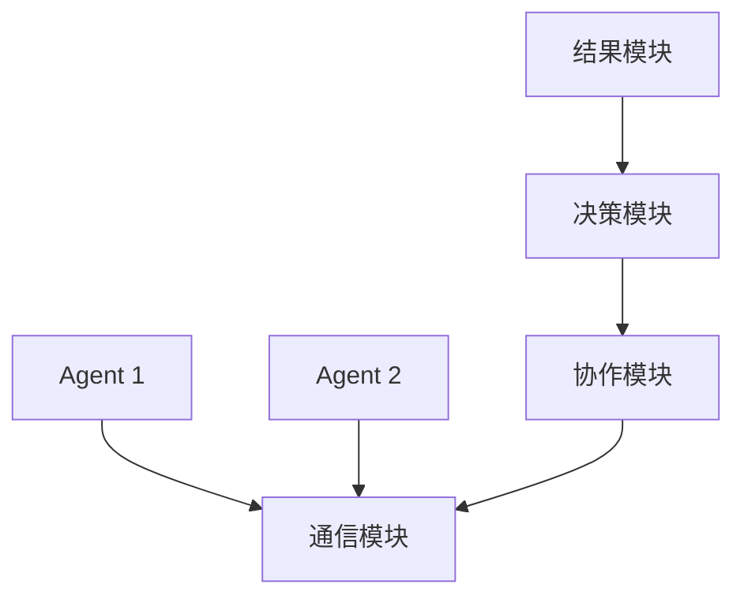

                 


# 构建AI Agent的多Agent协作决策系统

> 关键词：多Agent系统，协作决策，博弈论，分布式计算，数学模型，系统架构

> 摘要：本文深入探讨构建AI Agent的多Agent协作决策系统的核心概念、算法原理、系统架构设计以及实际应用案例。通过详细的分析和实例，帮助读者理解如何设计和实现高效的多Agent协作决策系统。

---

# 第一部分: 多Agent协作决策系统背景与基础

## 第1章: 多Agent协作决策系统概述

### 1.1 多Agent系统的核心概念

#### 1.1.1 什么是Agent
Agent（智能体）是指能够感知环境并采取行动以实现目标的实体。Agent可以是软件程序、机器人或其他智能设备。Agent的关键特征包括自主性、反应性、目标导向和社会性。

**自主性**：Agent能够自主决策，无需外部干预。  
**反应性**：Agent能够根据环境变化实时调整行为。  
**目标导向**：Agent的行为以实现特定目标为导向。  
**社会性**：Agent能够与其他Agent或人类进行交互协作。

#### 1.1.2 多Agent系统的定义与特点
多Agent系统（MAS，Multi-Agent System）是由多个相互作用的Agent组成的系统，这些Agent通过协作完成单个Agent无法完成的任务。MAS的特点包括：

- **分布性**：多个Agent独立运行，没有中央控制节点。  
- **协作性**：Agent之间通过通信和协作完成共同目标。  
- **动态性**：环境和Agent的状态可能动态变化。  
- **复杂性**：多个Agent的交互可能导致复杂的系统行为。

#### 1.1.3 多Agent系统与传统AI的区别
传统的AI系统通常基于规则或预定义的逻辑进行决策，而多Agent系统强调多个智能体之间的协作与交互。MAS能够处理动态环境中的复杂问题，而传统AI系统在处理需要多智能体协作的问题时显得力不从心。

### 1.2 多Agent协作决策的背景与问题

#### 1.2.1 单一Agent的局限性
单一Agent在处理复杂任务时存在以下局限性：
- **资源限制**：单个Agent的计算资源有限。  
- **知识限制**：单个Agent的知识有限，难以应对复杂问题。  
- **决策限制**：单个Agent的决策能力有限，难以处理多目标冲突。

#### 1.2.2 多Agent协作的必要性
多Agent协作可以通过以下方式克服单一Agent的局限性：
- **分布式计算**：利用多个Agent的计算能力协同工作。  
- **知识共享**：多个Agent可以通过共享知识提高整体决策能力。  
- **任务分配**：通过协作优化任务分配，提高效率。

#### 1.2.3 多Agent协作决策的应用场景
多Agent协作决策在多个领域有广泛应用，例如：
- **机器人协作**：多机器人协作完成复杂任务。  
- **自动驾驶**：自动驾驶车辆之间的协作与通信。  
- **分布式计算**：利用多个计算节点协作完成任务。

## 第2章: 多Agent协作决策的核心概念

### 2.1 多Agent协作决策的基本原理

#### 2.1.1 Agent的自主性与社会性
Agent的自主性使其能够独立决策，而社会性则使其能够与其他Agent协作。这两个特性共同构成了多Agent协作的基础。

#### 2.1.2 多Agent协作的通信机制
Agent之间的通信是协作的基础。通信机制包括：
- **消息传递**：Agent通过消息传递信息。  
- **状态共享**：Agent共享当前状态以提高协作效率。  
- **协议协商**：通过协议确定协作规则。

#### 2.1.3 多Agent协作的决策模型
多Agent协作的决策模型包括：
- **基于博弈论的决策模型**：通过博弈论分析Agent之间的策略选择。  
- **基于分布式计算的决策模型**：通过分布式计算实现协作决策。

### 2.2 多Agent协作决策的数学模型

#### 2.2.1 Agent的决策空间表示
Agent的决策空间可以用集合表示，例如：
$$
D_i = \{d_{i1}, d_{i2}, ..., d_{in}\}
$$
其中，$D_i$表示Agent $i$的决策空间，$d_{ij}$表示第$j$个决策。

#### 2.2.2 协作决策的数学公式
协作决策的目标是最大化整体收益，可以用以下公式表示：
$$
\max_{\{d_i\}} \sum_{i=1}^n v_i(d_i)
$$
其中，$v_i(d_i)$表示Agent $i$在决策$d_i$下的收益。

#### 2.2.3 多Agent协作的约束条件
协作决策需要满足以下约束条件：
- **通信约束**：Agent之间的通信受限。  
- **计算约束**：每个Agent的计算能力有限。  
- **时间约束**：协作决策需要在规定时间内完成。

---

# 第二部分: 多Agent协作决策的算法与实现

## 第3章: 多Agent协作决策的算法原理

### 3.1 基于博弈论的协作决策

#### 3.1.1 博弈论基础
博弈论是分析多Agent协作的重要工具。博弈论中的关键概念包括：
- **玩家**：参与博弈的Agent。  
- **策略**：每个玩家的决策方案。  
- **收益**：每个玩家在策略选择后的收益。

#### 3.1.2 Nash均衡与协作决策
Nash均衡是博弈论中的一个重要概念，表示在给定其他玩家策略的情况下，每个玩家都不会改变自己的策略的状态。Nash均衡可以用于分析多Agent协作中的稳定状态。

#### 3.1.3 基于博弈论的协作算法实现
基于博弈论的协作算法可以通过以下步骤实现：
1. **定义博弈规则**：确定博弈的玩家、策略和收益。  
2. **计算Nash均衡**：找到博弈的Nash均衡点。  
3. **实现协作决策**：根据Nash均衡点制定协作策略。

### 3.2 基于分布式计算的协作决策

#### 3.2.1 分布式计算的基本原理
分布式计算是指在多个计算节点上进行计算的过程。分布式计算可以通过以下步骤实现：
1. **任务分配**：将任务分解为多个子任务，并分配给不同的计算节点。  
2. **子任务计算**：每个计算节点独立计算分配的子任务。  
3. **结果汇总**：将所有计算节点的结果汇总，得到最终结果。

#### 3.2.2 分布式协作决策的算法框架
分布式协作决策的算法框架包括：
- **任务分配**：将协作决策任务分配给多个Agent。  
- **子任务计算**：每个Agent独立计算分配的子任务。  
- **结果汇总**：将所有Agent的计算结果汇总，得到最终决策。

## 第4章: 多Agent协作决策的数学模型与公式

### 4.1 多Agent协作的数学建模

#### 4.1.1 Agent的状态表示
Agent的状态可以用向量表示，例如：
$$
S_i = (s_{i1}, s_{i2}, ..., s_{in})
$$
其中，$S_i$表示Agent $i$的状态，$s_{ij}$表示第$j$个状态。

#### 4.1.2 协作决策的数学公式
协作决策的数学公式可以表示为：
$$
\max_{\{d_i\}} \sum_{i=1}^n u_i(S_i, d_i)
$$
其中，$u_i(S_i, d_i)$表示Agent $i$在状态$S_i$和决策$d_i$下的效用函数。

#### 4.1.3 多Agent协作的约束条件
多Agent协作的约束条件包括：
- **通信约束**：Agent之间的通信受限。  
- **计算约束**：每个Agent的计算能力有限。  
- **时间约束**：协作决策需要在规定时间内完成。

### 4.2 协作决策的数学公式

#### 4.2.1 基于博弈论的决策公式
基于博弈论的决策公式可以表示为：
$$
\max_{d_i} \sum_{i=1}^n v_i(d_i)
$$
其中，$v_i(d_i)$表示Agent $i$在决策$d_i$下的收益。

#### 4.2.2 分布式协作的优化公式
分布式协作的优化公式可以表示为：
$$
\min_{\{x_i\}} \sum_{i=1}^n f_i(x_i)
$$
其中，$x_i$表示Agent $i$的决策变量，$f_i(x_i)$表示Agent $i$的优化目标函数。

---

# 第三部分: 多Agent协作决策系统的架构与设计

## 第5章: 多Agent协作决策系统的架构设计

### 5.1 系统功能设计

#### 5.1.1 Agent的通信与协作模块
通信与协作模块负责Agent之间的通信和协作。通信模块包括消息传递和状态共享，协作模块包括任务分配和决策协调。

#### 5.1.2 协作决策的算法实现模块
协作决策的算法实现模块负责具体算法的实现，包括任务分配、子任务计算和结果汇总。

#### 5.1.3 系统的监控与管理模块
监控与管理模块负责系统的监控和管理，包括状态监控、性能优化和错误处理。

### 5.2 系统架构图
以下是多Agent协作决策系统的架构图：



### 5.3 系统模块的交互流程
系统模块的交互流程如下：
1. **通信模块**：接收来自其他Agent的消息。  
2. **协作模块**：根据消息进行任务分配。  
3. **决策模块**：根据任务分配进行决策计算。  
4. **结果模块**：汇总计算结果并输出。

## 第6章: 多Agent协作决策系统的接口与交互

### 6.1 系统接口设计

#### 6.1.1 Agent之间的通信接口
Agent之间的通信接口包括：
- **发送消息**：发送消息到其他Agent。  
- **接收消息**：接收其他Agent发送的消息。  
- **状态共享**：共享当前状态给其他Agent。

#### 6.1.2 系统与外部环境的接口
系统与外部环境的接口包括：
- **输入接口**：接收外部环境的输入数据。  
- **输出接口**：输出协作决策的结果到外部环境。

---

# 第四部分: 项目实战

## 第7章: 项目实战

### 7.1 环境搭建与代码实现

#### 7.1.1 环境搭建
以下是搭建多Agent协作决策系统的环境要求：
- **操作系统**：Linux或Windows。  
- **编程语言**：Python。  
- **框架**：可以使用Python的多线程或多进程库。  
- **依赖库**：需要安装numpy、scipy等数学库。

#### 7.1.2 核心代码实现
以下是多Agent协作决策系统的核心代码：

```python
import random

class Agent:
    def __init__(self, id):
        self.id = id
        self.state = random.random()
        self.decision = None

    def make_decision(self, others):
        # 假设决策函数是最大化自己的收益
        max_utility = -float('inf')
        best_decision = None
        for decision in self.possible_decisions:
            utility = self.compute_utility(decision, others)
            if utility > max_utility:
                max_utility = utility
                best_decision = decision
        self.decision = best_decision

    def compute_utility(self, decision, others):
        # 假设收益计算基于自己的决策和其他Agent的决策
        utility = 0
        for other in others:
            utility += self.possible_utilities[decision][other.decision]
        return utility

# 创建多个Agent实例
agents = [Agent(i) for i in range(5)]

# 每个Agent做出决策
for agent in agents:
    others = [a for a in agents if a.id != agent.id]
    agent.make_decision(others)

# 输出所有Agent的决策
for agent in agents:
    print(f"Agent {agent.id}的决策是：{agent.decision}")
```

#### 7.1.3 代码解读与分析
上述代码实现了多个Agent之间的协作决策。每个Agent基于自己的状态和其他Agent的决策做出最优决策。通过不断迭代，多个Agent可以实现协作。

### 7.2 实际案例分析

#### 7.2.1 案例背景
假设我们有一个智能制造工厂，需要多个机器人协作完成生产任务。每个机器人需要根据其他机器人的状态做出决策。

#### 7.2.2 案例实现
以下是智能制造工厂中多机器人协作的实现：

```python
class Robot:
    def __init__(self, id, task):
        self.id = id
        self.task = task
        self.status = "idle"

    def assign_task(self, new_task):
        self.status = "busy"
        self.task = new_task

    def complete_task(self):
        self.status = "idle"

# 创建多个机器人实例
robots = [Robot(i, "basic") for i in range(5)]

# 分配任务给机器人
for i, robot in enumerate(robots):
    if i % 2 == 0:
        robot.assign_task("assembly")
    else:
        robot.assign_task("inspection")

# 检查所有机器人的状态
for robot in robots:
    print(f"Robot {robot.id}的状态是：{robot.status}")
```

#### 7.2.3 详细分析
通过上述代码，我们可以看到多个机器人如何协作完成不同的任务。每个机器人根据任务分配做出决策，并通过状态更新实现协作。

### 7.3 项目小结
通过上述项目实战，我们可以看到多Agent协作决策系统在实际应用中的具体实现。通过代码实现，我们可以更好地理解协作决策的原理和实现方法。

---

# 第五部分: 总结与展望

## 第8章: 总结与展望

### 8.1 最佳实践 Tips
- **明确目标**：在设计多Agent协作决策系统时，首先要明确协作的目标。  
- **选择合适的算法**：根据具体问题选择合适的协作算法。  
- **优化通信机制**：优化Agent之间的通信机制，提高协作效率。  
- **监控与管理**：实时监控系统状态，及时发现和解决问题。

### 8.2 小结
本文详细介绍了多Agent协作决策系统的构建过程，包括核心概念、算法原理、系统架构设计和实际应用案例。通过本文的学习，读者可以掌握多Agent协作决策系统的核心知识，并能够将其应用到实际项目中。

### 8.3 注意事项
- **通信延迟**：多Agent协作需要考虑通信延迟对系统的影响。  
- **计算能力**：每个Agent的计算能力可能有限，需要考虑分布式计算。  
- **安全性**：多Agent协作系统需要考虑安全性问题，防止恶意攻击。

### 8.4 拓展阅读
- **博弈论**：进一步学习博弈论的相关知识，特别是多人博弈的问题。  
- **分布式系统**：深入学习分布式系统的理论和实践。  
- **多Agent系统**：阅读更多关于多Agent系统的书籍和论文，了解最新的研究成果。

---

# 结语

通过本文的学习，读者可以系统地了解多Agent协作决策系统的构建过程，并能够将其应用到实际项目中。希望本文能够为读者提供有价值的知识和启发，帮助他们在多Agent协作决策领域取得更大的进步。

