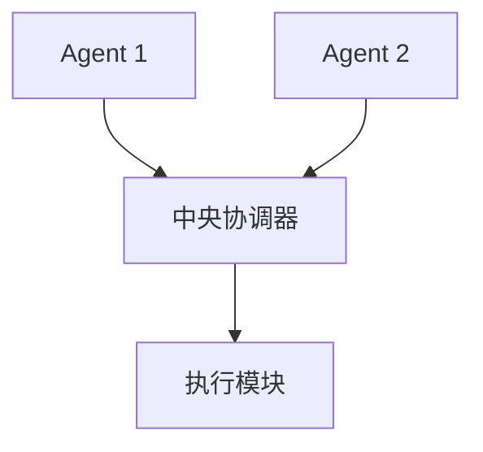
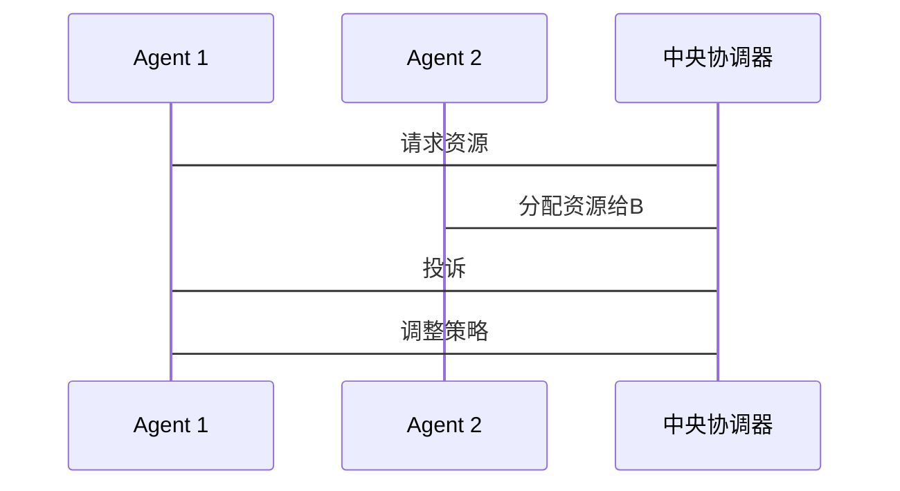

                 


# 构建AI Agent的多Agent竞争与合作框架

## 关键词：AI Agent, 多Agent系统, 竞争与合作, 系统架构, 算法原理

## 摘要：本文将详细探讨构建AI Agent的多Agent竞争与合作框架。从基本概念到数学模型，从算法原理到系统架构，再到项目实战，全面解析多Agent系统中的竞争与合作机制，帮助读者掌握构建高效多Agent系统的关键技术和方法。

---

## 第一部分: AI Agent与多Agent系统基础

### 第1章: AI Agent的基本概念

#### 1.1 AI Agent的定义与特点

**1.1.1 AI Agent的定义**

AI Agent（智能体）是指在环境中能够感知并自主行动以实现目标的实体。AI Agent可以是软件程序、机器人或其他智能系统，具备以下核心特点：

- **自主性**：能够在没有外部干预的情况下自主决策。
- **反应性**：能够感知环境并实时响应。
- **目标导向性**：所有行动都以实现特定目标为导向。
- **社会性**：能够与其他Agent或人类进行交互和协作。

**1.1.2 AI Agent的核心特点**

1. **自主性**：AI Agent无需外部控制，能够独立决策和行动。
2. **反应性**：能够根据环境反馈调整行为。
3. **目标导向性**：所有行为都围绕目标展开。
4. **社会性**：能够与其他Agent或人类进行交互和协作。

**1.1.3 AI Agent与传统智能系统的区别**

| 特性       | AI Agent                          | 传统智能系统                  |
|------------|-----------------------------------|-----------------------------|
| 自主性      | 高                                | 低                           |
| 反应性      | 高                                | 中                           |
| 目标导向性  | 高                                | 低                           |
| 社会性      | 高                                | 中                           |

**1.2 多Agent系统概述**

**1.2.1 多Agent系统的定义**

多Agent系统是由多个相互作用的AI Agent组成的系统，这些Agent通过协作和竞争共同完成复杂任务。

**1.2.2 多Agent系统的分类**

1. **按架构**：
   - **集中式架构**：所有Agent通过中央协调器进行通信和协作。
   - **分布式架构**：Agent之间直接交互，无中央协调器。
2. **按应用领域**：
   - **游戏AI**：如MOBA游戏中的英雄角色。
   - **分布式计算**：如云计算环境中的资源分配。
   - **机器人协作**：如工厂中的工业机器人协作完成任务。

**1.2.3 多Agent系统的优势与挑战**

| 优势       | 描述                           |
|------------|--------------------------------|
| 高效性      | 多个Agent协作可提高任务完成效率 |
| 可扩展性    | 系统可扩展性强，易于添加新Agent |
| 灵活性      | 系统可根据环境变化动态调整行为 |

| 挑战       | 描述                           |
|------------|--------------------------------|
| 协作复杂性  | 多Agent协作需要复杂的协调机制 |
| 竞争管理    | 竞争可能导致资源分配不均或效率低下 |
| 安全性      | 竞争可能引发安全风险，如恶意Agent |

**1.3 多Agent系统中的竞争与合作**

**1.3.1 竞争与合作的基本概念**

- **竞争**：多个Agent争夺有限资源，如游戏中的资源采集。
- **合作**：多个Agent协同完成任务，如团队协作完成目标。

**1.3.2 竞争与合作的实现机制**

1. **竞争机制**：
   - **资源分配**：通过拍卖、优先级等方式分配资源。
   - **竞争策略**：每个Agent根据自身条件制定竞争策略。
2. **合作机制**：
   - **任务分配**：根据Agent的能力分配任务。
   - **协作协议**：通过通信协议确保协作顺利进行。

**1.3.3 竞争与合作的典型案例**

- 游戏AI：如MOBA游戏中，Agent需要竞争资源（如金币）并合作（如团队协作）。
- 机器人协作：如工业机器人协作完成复杂任务，需要竞争资源（如加工时间）并合作（如协同完成装配）。

---

### 第2章: 多Agent系统的数学模型与算法基础

#### 2.1 多Agent系统的核心概念

**2.1.1 Agent的理性与决策**

- **理性**：Agent的决策基于理性选择，以最大化自身效用。
- **决策**：Agent根据感知信息选择最优行动。

**2.1.2 多Agent系统中的状态表示**

- **状态空间**：系统中所有可能的状态集合。
- **动作空间**：Agent可以执行的所有动作。

**2.1.3 多Agent系统中的行为选择**

- **策略**：Agent在给定状态下的行动规则。
- **价值函数**：衡量不同行动的价值，帮助选择最优行动。

#### 2.2 多Agent系统的数学模型

**2.2.1 Agent的数学表示**

$$
\text{Agent}(s) = a
$$

其中，$s$是状态，$a$是行动。

**2.2.2 多Agent系统的数学模型**

$$
\text{System}(S, A, \pi) = \text{Environment}(R)
$$

其中，$S$是状态空间，$A$是动作空间，$\pi$是策略，$R$是奖励。

**2.2.3 多Agent系统的优化目标**

$$
\max_{\pi} \mathbb{E}[R]
$$

其中，$\pi$是策略，$R$是奖励。

#### 2.3 多Agent系统的算法基础

**2.3.1 分布式计算算法**

- **分布式计算**：任务分解到多个Agent，每个Agent独立计算，最后汇总结果。

**2.3.2 强化学习算法**

- **Q-Learning**：通过试错学习最优策略。
- **多智能体强化学习（MADRL）**：多个Agent通过强化学习协作或竞争。

**2.3.3 协作与竞争算法**

- **协作算法**：如任务分配算法、资源分配算法。
- **竞争算法**：如拍卖算法、优先级算法。

---

### 第3章: 多Agent系统的竞争与合作机制

#### 3.1 多Agent系统中的竞争机制

**3.1.1 竞争的定义与实现**

- **竞争**：多个Agent争夺有限资源。
- **实现**：通过资源分配算法（如拍卖）实现。

**3.1.2 竞争的数学模型**

$$
\text{竞争}(R) = \max_{i} \text{Agent}_i(\text{资源})
$$

**3.1.3 竞争的典型案例分析**

- **资源分配**：多个Agent竞争有限资源，如云计算中的CPU时间分配。

#### 3.2 多Agent系统中的合作机制

**3.2.1 合作的定义与实现**

- **合作**：多个Agent协同完成任务。
- **实现**：通过任务分配算法（如基于角色的分配）实现。

**3.2.2 合作的数学模型**

$$
\text{合作}(T) = \sum_{i} \text{Agent}_i(\text{任务})
$$

**3.2.3 合作的典型案例分析**

- **任务分配**：多个Agent协同完成任务，如配送系统中的订单分配。

#### 3.3 竞争与合作的平衡与协调

**3.3.1 竞争与合作的协调机制**

- **协调机制**：通过通信协议和协作算法实现竞争与合作的协调。

**3.3.2 竞争与合作的动态平衡**

- **动态平衡**：根据环境变化调整竞争与合作的强度。

**3.3.3 竞争与合作的优化策略**

- **优化策略**：通过博弈论优化竞争与合作策略，最大化系统整体收益。

---

### 第4章: 多Agent系统的系统架构与设计

#### 4.1 多Agent系统的架构设计

**4.1.1 分层架构**

- **分层架构**：将系统分为感知层、决策层和执行层，每一层由不同的Agent负责。

**4.1.2 分布式架构**

- **分布式架构**：Agent之间直接交互，无中央协调器。

**4.1.3 集中式架构**

- **集中式架构**：所有Agent通过中央协调器进行通信和协作。

#### 4.2 多Agent系统的功能设计

**4.2.1 Agent的功能模块划分**

- **感知模块**：负责感知环境信息。
- **决策模块**：负责制定行动策略。
- **执行模块**：负责执行具体行动。

**4.2.2 多Agent系统的功能流程**

1. 感知环境。
2. 制定决策。
3. 执行行动。
4. 反馈结果。

#### 4.3 系统分析与架构设计方案

**4.3.1 问题场景介绍**

- **问题场景**：多个Agent需要在复杂环境中协作完成任务。

**4.3.2 项目介绍**

- **项目名称**：多Agent协作系统。
- **项目目标**：实现多个AI Agent在复杂环境中的协作与竞争。

**4.3.3 系统功能设计**

- **功能模块**：感知模块、决策模块、执行模块、通信模块。
- **功能流程**：感知环境信息，制定决策，执行行动，反馈结果。

**4.3.4 系统架构图**



**4.3.5 系统交互序列图**



---

### 第5章: 项目实战

#### 5.1 环境配置

- **工具**：Python、TensorFlow、OpenAI Gym。
- **库**：numpy、matplotlib、pandas。

#### 5.2 系统核心实现源代码

```python
class Agent:
    def __init__(self, id):
        self.id = id
        self.strategy = 'cooperate'  # 可选策略：竞争或合作

    def decide(self, state):
        if self.strategy == 'cooperate':
            return '合作'
        else:
            return '竞争'

# 创建多个Agent实例
agents = [Agent(i) for i in range(5)]

# 系统运行
for agent in agents:
    print(f"Agent {agent.id} 的决策：{agent.decide('资源充足')}")
```

#### 5.3 代码应用解读与分析

- **代码解读**：
  - `Agent`类定义了AI Agent的基本结构，包含ID和策略。
  - `decide`方法根据当前状态和策略返回决策结果。
  - 创建多个Agent实例，每个Agent根据策略做出决策。

#### 5.4 实际案例分析

- **案例**：五个Agent在资源充足的情况下，部分选择合作，部分选择竞争，系统根据策略调整资源分配。

#### 5.5 项目小结

- **小结**：通过实际案例，展示了多Agent系统的竞争与合作机制，以及如何通过策略调整实现系统优化。

---

### 第6章: 最佳实践与小结

#### 6.1 最佳实践

1. **明确目标**：明确系统目标，合理设计架构。
2. **选择合适的策略**：根据场景选择竞争或合作策略。
3. **动态调整**：根据环境变化动态调整策略。
4. **安全与伦理**：确保系统安全，遵守伦理规范。

#### 6.2 小结

本文详细探讨了构建AI Agent的多Agent竞争与合作框架，从基本概念到数学模型，从算法原理到系统架构，再到项目实战，全面解析了多Agent系统中的竞争与合作机制。

#### 6.3 注意事项

- **安全性**：多Agent系统可能面临安全风险，需加强安全防护。
- **伦理问题**：需注意多Agent系统可能引发的伦理问题，如隐私保护。

#### 6.4 拓展阅读

- 推荐阅读《Multi-Agent Systems》和《Game Theory and AI》。

---

### 附录

#### 附录A: 竞争与合作的数学模型

- **竞争模型**：
  $$ \text{竞争}(R) = \max_{i} \text{Agent}_i(\text{资源}) $$
- **合作模型**：
  $$ \text{合作}(T) = \sum_{i} \text{Agent}_i(\text{任务}) $$

#### 附录B: 系统架构图


---

通过以上内容，您可以系统地构建AI Agent的多Agent竞争与合作框架，掌握从理论到实践的完整流程。希望本文对您有所帮助！

