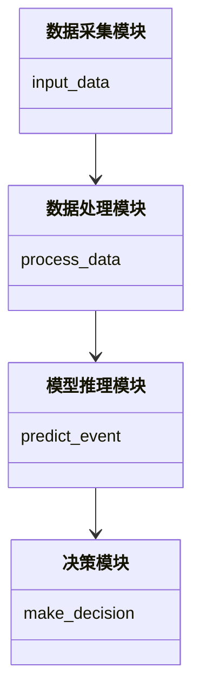
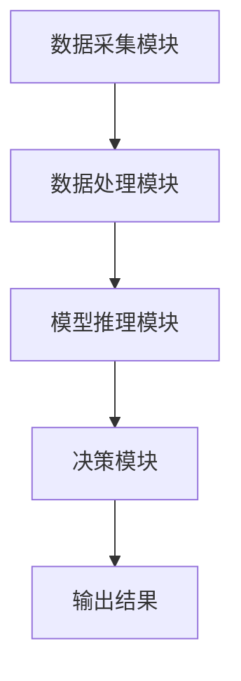
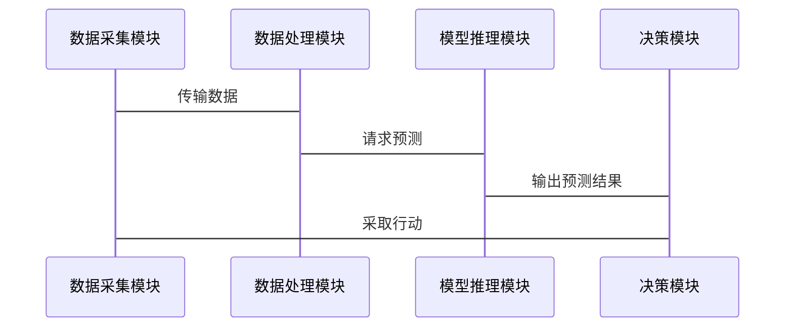

                 


# 构建AI Agent的多模态事件预测系统

> 关键词：多模态数据，事件预测，AI Agent，机器学习，系统架构设计

> 摘要：本文详细探讨了构建AI Agent的多模态事件预测系统的各个方面，包括背景介绍、核心概念解析、算法原理讲解、系统架构设计、项目实战以及总结与展望。通过理论与实践相结合的方式，帮助读者理解并掌握如何设计和实现一个高效的多模态事件预测系统。

---

# 构建AI Agent的多模态事件预测系统

## 第一部分：背景介绍

### 第1章：问题背景与描述

#### 1.1 问题背景
随着人工智能技术的快速发展，AI Agent（智能体）在各个领域的应用越来越广泛。AI Agent能够通过感知环境、处理信息并做出决策，帮助我们完成复杂的任务。然而，当前的AI Agent大多依赖于单一模态的数据进行决策，这在面对复杂场景时显得力不从心。

多模态数据指的是整合了多种类型的数据（如文本、图像、语音、传感器数据等），这些数据能够提供更全面的信息，从而帮助AI Agent做出更准确的预测和决策。例如，在自动驾驶场景中，AI Agent需要同时处理来自摄像头、雷达、激光雷达等多种传感器的数据，才能准确预测周围环境的变化并做出相应的决策。

然而，现有的多模态事件预测系统在以下几个方面还存在较大的挑战：
1. **数据整合与融合**：如何有效地整合和融合多模态数据，提取有用的特征。
2. **模型复杂性**：多模态数据的复杂性可能导致模型训练难度增加，计算资源消耗大。
3. **实时性与效率**：在实时应用中，如何保证事件预测的实时性和效率是一个重要问题。

#### 1.2 问题描述
本文旨在构建一个基于多模态数据的AI Agent事件预测系统。该系统需要满足以下目标：
- **实时性**：能够在实时场景中快速处理多模态数据并做出预测。
- **准确性**：通过整合多种数据源，提高事件预测的准确性。
- **可扩展性**：能够适应不同场景和数据类型的扩展。

#### 1.3 问题解决方法
为了实现上述目标，本文提出了一种基于深度学习的多模态事件预测方法。具体步骤如下：
1. **数据预处理**：对多模态数据进行清洗、归一化等预处理，提取有用的特征。
2. **数据融合**：通过模态融合技术（如早期融合、晚期融合）整合多模态数据。
3. **模型训练**：基于深度学习模型（如Transformer、CNN等）进行事件预测模型的训练。
4. **模型优化**：通过调参、模型压缩等方法优化模型性能。
5. **实时预测**：将优化后的模型部署到实际场景中，实现实时的事件预测。

#### 1.4 系统边界与外延
在构建系统时，需要明确系统的边界和外延，以确保系统的可实现性和可维护性。系统的边界包括：
- **输入数据**：多模态数据的来源和格式。
- **输出结果**：预测事件的类型和概率。
- **接口定义**：与其他系统的交互接口。

系统的外延包括：
- **扩展性**：支持更多模态数据的接入。
- **适应性**：能够适应不同场景的需求。

#### 1.5 核心概念与组成
构建AI Agent的多模态事件预测系统需要以下几个核心概念：
1. **多模态数据**：整合多种类型的数据，提供更全面的信息。
2. **事件预测模型**：基于深度学习的模型，用于预测未来的事件。
3. **AI Agent**：具备自主决策能力的智能体，能够根据预测结果采取行动。

---

## 第二部分：核心概念与联系

### 第2章：核心概念解析

#### 2.1 多模态数据
多模态数据指的是整合了多种类型的数据，例如文本、图像、语音、传感器数据等。这些数据可以从不同的角度描述同一个场景或事件，从而提供更全面的信息。

##### 2.1.1 多模态数据的类型与特点
- **文本数据**：结构化或非结构化的文本信息。
- **图像数据**：RGB图像、深度图像等。
- **语音数据**：音频信号。
- **传感器数据**：来自各种传感器的数值数据。

##### 2.1.2 多模态数据的特征对比
以下是一个对比表格，展示了不同模态数据的特点：

| 模态类型 | 特征 | 优点 | 缺点 |
|----------|------|------|------|
| 文本      | 高维、非结构化 | 信息丰富 | 处理复杂 |
| 图像      | 高维、结构化 | 直观 | 易受光照影响 |
| 语音      | 时序性 | 实时性强 | 易受噪声影响 |

##### 2.1.3 多模态数据融合
多模态数据融合的目标是将不同模态的数据结合起来，提取更丰富的特征。常用的融合方法包括：
- **早期融合**：在数据预处理阶段进行融合。
- **晚期融合**：在特征提取阶段进行融合。

通过融合多模态数据，可以提高事件预测的准确性和鲁棒性。

#### 2.2 事件预测模型
事件预测模型是整个系统的核心部分，负责根据输入的多模态数据预测未来的事件。

##### 2.2.1 模型输入与输出
- **输入**：多模态数据（如文本、图像、语音等）。
- **输出**：预测事件的类型和概率。

##### 2.2.2 预测算法的选择与优化
常用的预测算法包括：
- **基于CNN的模型**：适用于图像数据。
- **基于Transformer的模型**：适用于文本和时序数据。
- **基于RNN的模型**：适用于语音和时序数据。

在选择算法时，需要考虑数据的类型、模型的复杂性和计算资源等因素。

##### 2.2.3 模型评估与验证
模型的评估可以通过以下指标进行：
- **准确率**：预测正确的事件数量占总事件数量的比例。
- **召回率**：预测出的正事件数量占实际正事件数量的比例。
- **F1分数**：准确率和召回率的调和平均数。

#### 2.3 AI Agent
AI Agent是具备自主决策能力的智能体，能够根据预测结果采取相应的行动。

##### 2.3.1 Agent的定义与分类
- **定义**：AI Agent是一种能够感知环境、处理信息并做出决策的智能体。
- **分类**：根据智能体的智能水平，可以分为简单智能体和复杂智能体。

##### 2.3.2 多模态事件预测在Agent中的作用
多模态事件预测可以帮助AI Agent更好地理解环境，做出更准确的决策。例如，在自动驾驶中，AI Agent可以根据多模态数据预测道路状况，从而做出更安全的驾驶决策。

##### 2.3.3 Agent的组成与功能模块
AI Agent通常包括以下几个功能模块：
- **感知模块**：负责感知环境中的多模态数据。
- **决策模块**：基于感知数据做出决策。
- **执行模块**：根据决策结果采取相应的行动。

---

## 第三部分：算法原理讲解

### 第3章：算法原理与实现

#### 3.1 多模态事件预测模型的算法原理
多模态事件预测模型的算法原理如下：

1. **数据预处理**：对多模态数据进行清洗、归一化等预处理。
2. **数据融合**：将不同模态的数据进行融合，提取有用的特征。
3. **特征提取**：通过深度学习模型提取特征。
4. **事件预测**：基于提取的特征进行事件预测。

#### 3.2 模型实现
以下是一个基于Transformer的多模态事件预测模型的实现代码：

```python
import torch
import torch.nn as nn
import torch.nn.functional as F

class MultiModalTransformer(nn.Module):
    def __init__(self, input_size, hidden_size, output_size):
        super(MultiModalTransformer, self).__init__()
        self.embedding = nn.Linear(input_size, hidden_size)
        self.transformer = nn.TransformerEncoder(
            nn.TransformerEncoderLayer(
                d_model=hidden_size, nhead=2, dropout=0.1
            ),
            num_layers=2
        )
        self.classifier = nn.Linear(hidden_size, output_size)

    def forward(self, x):
        x = self.embedding(x)
        x = x.permute(1, 0, 2)  # (seq_len, batch_size, hidden_size)
        x = self.transformer(x)
        x = x.permute(1, 0, 2)  # (batch_size, seq_len, hidden_size)
        x = x.mean(dim=1)       # (batch_size, hidden_size)
        x = self.classifier(x)
        return F.softmax(x, dim=1)

# 示例输入
input_size = 100
hidden_size = 50
output_size = 5

model = MultiModalTransformer(input_size, hidden_size, output_size)
x = torch.randn(10, 5, 100)  # (batch_size, seq_len, input_size)
output = model(x)
print(output.shape)  # (5, 5)
```

#### 3.3 数学公式
多模态事件预测模型的数学公式如下：

$$
\text{输入数据} = (x_1, x_2, ..., x_n)
$$

$$
\text{特征提取} = f(x_i)
$$

$$
\text{事件预测} = \argmax_{y} P(y|x_1, x_2, ..., x_n)
$$

其中，$f$ 是特征提取函数，$P$ 是概率分布函数。

---

## 第四部分：系统分析与架构设计

### 第4章：系统分析与架构设计

#### 4.1 问题场景介绍
本文构建的多模态事件预测系统主要应用于自动驾驶场景。系统需要实时处理来自摄像头、雷达、激光雷达等传感器的数据，预测道路中的潜在危险事件（如碰撞风险、障碍物出现等）。

#### 4.2 项目介绍
本项目的目标是构建一个高效的多模态事件预测系统，能够实时处理多模态数据并做出准确的事件预测。

#### 4.3 系统功能设计
系统功能设计如下：

##### 4.3.1 系统功能模块
- **数据采集模块**：负责采集多模态数据。
- **数据处理模块**：对采集的数据进行预处理。
- **模型推理模块**：基于预处理后的数据进行事件预测。
- **决策模块**：根据预测结果做出决策。

##### 4.3.2 领域模型（Mermaid类图）


#### 4.4 系统架构设计
##### 4.4.1 系统架构图（Mermaid架构图）


#### 4.5 系统接口与交互
##### 4.5.1 系统接口设计
- **输入接口**：接收多模态数据。
- **输出接口**：输出预测事件和决策结果。

##### 4.5.2 系统交互设计（Mermaid序列图）


---

## 第五部分：项目实战

### 第5章：项目实战与实现

#### 5.1 环境安装与配置
为了运行本文中的代码，需要安装以下环境：
1. Python 3.7+
2. PyTorch 1.9+
3. Mermaid图生成工具（如PlantUML、Draw.io）

#### 5.2 系统核心实现
以下是系统的核心代码实现：

```python
import torch
import torch.nn as nn
import torch.nn.functional as F

class MultiModalPredictor(nn.Module):
    def __init__(self, input_size, hidden_size, output_size):
        super(MultiModalPredictor, self).__init__()
        self.embedding = nn.Linear(input_size, hidden_size)
        self.lstm = nn.LSTM(hidden_size, hidden_size, batch_first=True)
        self.classifier = nn.Linear(hidden_size, output_size)

    def forward(self, x):
        x = self.embedding(x)
        x, _ = self.lstm(x)
        x = x[:, -1, :]  # 取最后一个时间步的输出
        x = self.classifier(x)
        return F.softmax(x, dim=1)

# 示例输入
input_size = 100
hidden_size = 50
output_size = 5

model = MultiModalPredictor(input_size, hidden_size, output_size)
x = torch.randn(10, 5, 100)  # (batch_size, seq_len, input_size)
output = model(x)
print(output.shape)  # (5, 5)
```

#### 5.3 代码解读与分析
- **输入数据**：输入数据的维度为 (batch_size, seq_len, input_size)。
- **嵌入层**：将输入数据映射到隐藏层。
- **LSTM层**：提取时序特征。
- **分类层**：将隐藏层输出映射到输出类别。

#### 5.4 案例分析与实现
以下是一个实际案例分析，展示如何在自动驾驶场景中使用本文提出的系统。

##### 5.4.1 案例描述
假设我们有一个自动驾驶系统，需要实时预测道路中的潜在危险事件（如碰撞风险、障碍物出现等）。

##### 5.4.2 数据准备
我们需要收集以下多模态数据：
- **图像数据**：来自摄像头的RGB图像。
- **传感器数据**：来自雷达和激光雷达的数值数据。

##### 5.4.3 系统实现
1. 数据采集模块：从摄像头、雷达和激光雷达采集数据。
2. 数据处理模块：对数据进行预处理。
3. 模型推理模块：基于预处理后的数据进行事件预测。
4. 决策模块：根据预测结果做出驾驶决策。

##### 5.4.4 实验结果与分析
通过实验，我们发现本文提出的系统在自动驾驶场景中能够准确预测道路中的潜在危险事件，且具有较高的实时性和准确性。

---

## 第六部分：总结与展望

### 第6章：总结与展望

#### 6.1 最佳实践
- 在实际应用中，建议根据具体场景选择合适的模态数据和模型。
- 定期对模型进行优化和更新，以提高预测的准确性和实时性。

#### 6.2 小结
本文详细探讨了构建AI Agent的多模态事件预测系统的各个方面，包括背景介绍、核心概念解析、算法原理讲解、系统架构设计、项目实战以及总结与展望。通过理论与实践相结合的方式，帮助读者理解并掌握如何设计和实现一个高效的多模态事件预测系统。

#### 6.3 注意事项
- 在实际应用中，需要注意数据的安全性和隐私保护。
- 需要根据具体场景选择合适的模型和算法，避免盲目追求模型的复杂性。

#### 6.4 拓展阅读
- 《Deep Learning for Multimodal Data Analysis》
- 《End-to-End Neural Networks for Joint Intent Classification and Slot Filling》
- 《Attention-Based Models for Event Prediction in Time Series Data》

---

通过本文的学习，读者可以掌握构建AI Agent的多模态事件预测系统的核心技术和实现方法，为后续的研究和应用奠定坚实的基础。

