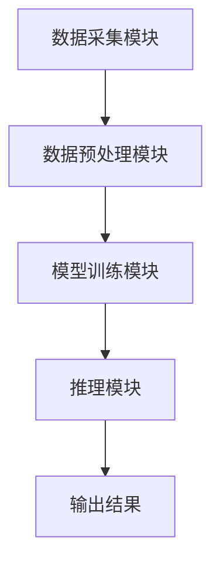

                 


# 构建AI Agent的多模态情境理解与推理系统

## 关键词：AI Agent，多模态，情境理解，推理系统，机器学习，深度学习

## 摘要：本文详细探讨了构建AI Agent的多模态情境理解与推理系统的各个方面，包括核心概念、算法原理、系统架构设计以及实际应用案例。文章从背景介绍入手，逐步分析多模态数据处理、情境理解模型和推理机制，结合具体算法和系统设计，为读者提供全面而深入的技术指导。

---

## 第一部分：AI Agent与多模态情境理解概述

### 第1章：AI Agent的基本概念

#### 1.1 AI Agent的定义与特点
AI Agent（智能体）是指在计算机系统中，能够感知环境并采取行动以实现目标的实体。它具有以下特点：
- **自主性**：能够自主决策，无需外部干预。
- **反应性**：能实时感知环境并做出反应。
- **社会性**：能够与其他Agent或人类交互协作。

#### 1.2 多模态数据的定义与重要性
多模态数据指的是来自多种感官渠道（如视觉、听觉、触觉等）的数据类型。在AI Agent中，多模态数据处理的重要性体现在：
- **信息互补性**：不同模态的数据能够提供互补的信息，提升系统的整体理解能力。
- **鲁棒性**：通过结合多种数据源，系统能够更准确地理解情境，减少单一模态数据的局限性。

#### 1.3 情境理解与推理的必要性
情境理解是指系统能够理解当前环境中的各种因素及其相互关系。推理机制则是基于情境理解，推导出下一步行动或决策的过程。这两者的结合使AI Agent能够在复杂环境中自主运作，完成复杂任务。

---

### 第2章：多模态数据处理的核心概念

#### 2.1 多模态数据的融合方法
多模态数据融合是将来自不同模态的数据进行整合，以获得更全面的信息。常见的融合方法包括：
- **早期融合**：在数据预处理阶段进行融合。
- **晚期融合**：在特征提取或高层语义理解阶段进行融合。
- **层次化融合**：结合上述两种方法，分层进行数据融合。

#### 2.2 情境理解模型的构建
情境理解模型需要能够从多模态数据中提取有用的特征，并建立这些特征与情境之间的关联。常用的方法包括基于深度学习的模型，如Transformer和卷积神经网络（CNN）。

#### 2.3 推理机制的设计与实现
推理机制是基于情境理解模型，利用逻辑推理或概率推理，推导出可能的行动或结果。常见的推理方法包括基于规则的推理和基于统计学习的推理。

---

## 第二部分：多模态情境理解与推理的核心算法

### 第3章：多模态数据融合算法

#### 3.1 多模态数据融合的原理
多模态数据融合的原理在于通过数学模型将不同模态的数据结合起来，提取共同特征或互补信息。例如，图像和文本的融合可以通过将图像特征与文本向量进行点积或拼接来实现。

#### 3.2 基于深度学习的多模态融合
基于深度学习的多模态融合通常采用端到端的模型，如多模态Transformer。模型能够自动学习不同模态之间的关联，并生成联合表示。

#### 3.3 注意力机制在多模态融合中的应用
注意力机制能够帮助模型关注重要的信息，提升融合效果。例如，在图像和文本融合中，注意力机制可以用于定位图像中与文本内容相关的关键区域。

---

### 第4章：情境理解模型的构建与优化

#### 4.1 情境理解模型的构建原理
情境理解模型通常基于深度学习，通过多层非线性变换，将输入的多模态数据映射到语义空间。模型的设计需要考虑数据的模态数量和特征维度。

#### 4.2 基于Transformer的多模态情境理解
Transformer模型在自然语言处理中表现出色，其自注意力机制可以用于处理序列数据。在多模态情境理解中，可以将不同模态的数据转化为序列形式，输入到Transformer模型中进行联合分析。

---

## 第三部分：系统架构与设计

### 第5章：系统架构设计

#### 5.1 系统模块划分
AI Agent的多模态情境理解与推理系统通常包括以下几个模块：
- **数据采集模块**：负责从多种渠道获取数据。
- **数据预处理模块**：对数据进行清洗、归一化等处理。
- **模型训练模块**：训练多模态情境理解模型。
- **推理模块**：基于模型进行推理，生成行动指令。

#### 5.2 系统架构设计图
使用Mermaid图展示系统架构设计：



#### 5.3 接口设计与交互流程
系统需要定义清晰的接口，确保各模块之间的数据流通和交互。例如，数据预处理模块将处理后的数据传递给模型训练模块，训练好的模型加载到推理模块中进行实时推理。

---

## 第四部分：项目实战

### 第6章：项目实现

#### 6.1 环境配置
项目实战需要安装以下环境和工具：
- Python 3.8+
- PyTorch或TensorFlow框架
- Mermaid图表工具
- Jupyter Notebook

#### 6.2 核心代码实现

##### 6.2.1 数据预处理代码
```python
import pandas as pd
from sklearn.preprocessing import StandardScaler

def preprocess_data(data):
    # 假设data是包含多种模态的数据
    # 这里仅展示部分预处理步骤
    numeric_features = data.select_dtypes(include=['float', 'int'])
    scaler = StandardScaler()
    processed_data = scaler.fit_transform(numeric_features)
    return processed_data
```

##### 6.2.2 模型训练代码
```python
import torch
import torch.nn as nn

class MultimodalTransformer(nn.Module):
    def __init__(self, input_size, hidden_size):
        super().__init__()
        self.transformer = nn.Transformer(input_size, hidden_size)
        self.fc = nn.Linear(hidden_size, 1)
    
    def forward(self, x):
        x = self.transformer(x)
        x = self.fc(x)
        return x

model = MultimodalTransformer(input_size=512, hidden_size=256)
criterion = nn.MSELoss()
optimizer = torch.optim.Adam(model.parameters(), lr=0.001)
```

##### 6.2.3 推理代码
```python
def infer(model, input_data):
    with torch.no_grad():
        output = model(input_data)
        return output
```

#### 6.3 案例分析
通过一个具体的案例，展示如何利用上述代码实现一个多模态的情境理解与推理系统。例如，构建一个基于图像和文本的问答系统，能够根据用户的问题和相关图片信息生成回答。

---

## 第五部分：总结与扩展

### 第7章：总结与展望

#### 7.1 最佳实践 tips
- 在数据预处理阶段，确保数据的多样性和质量。
- 在模型训练时，使用合适的超参数设置和交叉验证方法。
- 在推理阶段，考虑系统的实时性和响应速度。

#### 7.2 小结
本文详细介绍了构建AI Agent的多模态情境理解与推理系统的各个方面，从理论到实践，为读者提供了全面的技术指导。

#### 7.3 注意事项
- 数据隐私和安全问题需要特别关注。
- 模型的可解释性和透明性是实际应用中的重要考量。

#### 7.4 拓展阅读
推荐进一步阅读以下内容：
- 多模态数据融合的最新研究进展。
- 基于Transformer的多模态模型在NLP中的应用。

---

通过以上步骤，您可以系统地构建一个多模态的情境理解与推理系统，实现AI Agent在复杂环境中的智能决策和行动。

