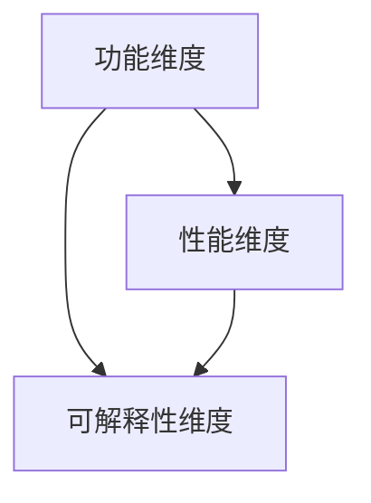
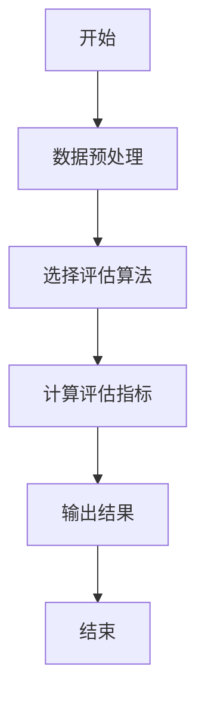
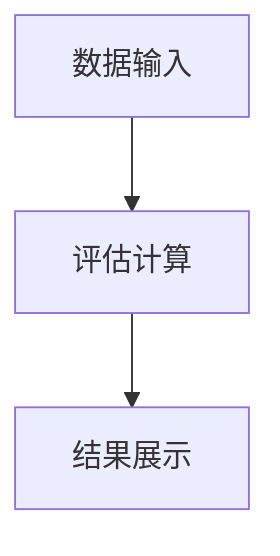

                 


# 构建AI Agent的多维度性能评估体系

> **关键词**：AI Agent，多维度性能评估，算法原理，系统架构，数学模型，评估指标，性能优化

> **摘要**：  
本文将深入探讨构建AI Agent的多维度性能评估体系的关键步骤与方法。首先，我们将从AI Agent的基本概念出发，分析其在不同场景下的应用需求。接着，我们将详细阐述多维度性能评估的核心概念，包括功能维度、性能维度和可解释性维度，并通过对比分析和实体关系图（ER图）展示各维度之间的关系。随后，我们将探讨评估算法的原理与实现，结合具体的数学模型和公式，分析如何优化评估过程。最后，我们将从系统架构的角度，提出构建评估体系的具体设计方案，并通过实际案例分析，验证我们的评估体系的有效性。本文将为您提供一个全面、系统的方法论，帮助您更好地理解和优化AI Agent的性能表现。

---

# 第一部分: AI Agent的多维度性能评估体系概述

## 第1章: AI Agent基础与问题背景

### 1.1 AI Agent的基本概念

#### 1.1.1 什么是AI Agent
AI Agent（人工智能代理）是指能够感知环境、做出决策并采取行动以实现特定目标的智能实体。它可以是一个软件程序、机器人或其他智能系统，通过与环境交互，完成复杂任务。

#### 1.1.2 AI Agent的类型与特点
AI Agent可以根据智能水平和应用领域分为多种类型：
- **反应式Agent**：基于当前感知做出反应，适用于实时任务。
- **认知式Agent**：具备推理和规划能力，适用于复杂决策任务。
- **学习式Agent**：能够通过数据学习优化自身性能。
- **协作式Agent**：能够与其他Agent或人类协作完成任务。

#### 1.1.3 AI Agent的应用场景
AI Agent广泛应用于自动驾驶、智能助手、机器人控制、推荐系统等领域。例如，自动驾驶汽车中的AI Agent需要实时感知环境并做出安全决策。

### 1.2 多维度性能评估的必要性

#### 1.2.1 当前AI Agent评估的痛点
传统评估方法通常只关注单一维度（如准确率），难以全面反映AI Agent的性能。例如，高准确率可能伴随着低效率或较差的可解释性。

#### 1.2.2 多维度评估的目标与意义
多维度评估的目标是全面、客观地衡量AI Agent的能力，包括功能实现、运行效率、决策可解释性等多个方面。这种评估方法能够帮助开发者发现AI Agent的优缺点，并针对性地进行优化。

#### 1.2.3 评估体系的边界与外延
AI Agent的性能评估需要考虑任务需求、环境约束和用户期望，避免超出实际应用范围。例如，对于实时任务，效率是关键，而对于需要解释性的任务，可解释性是核心。

### 1.3 问题描述与解决方案

#### 1.3.1 当前AI Agent评估的主要问题
- 评估维度单一，无法全面反映性能。
- 缺乏统一的评估标准，导致结果难以比较。
- 评估指标与实际需求脱节，难以指导优化方向。

#### 1.3.2 多维度评估体系的构建思路
从功能、性能、可解释性等多个维度出发，设计合理的评估指标和方法，构建全面的评估体系。

#### 1.3.3 解决方案的可行性分析
通过引入多维度评估指标和优化算法，可以更全面地衡量AI Agent的性能，指导后续优化工作。

---

## 第2章: 多维度性能评估的核心概念

### 2.1 多维度评估的维度分解

#### 2.1.1 功能维度
功能维度关注AI Agent是否能够完成预期的任务，包括任务完成率、功能覆盖度等指标。

#### 2.1.2 性能维度
性能维度关注AI Agent在运行过程中的效率和资源消耗，包括响应时间、资源利用率等指标。

#### 2.1.3 可解释性维度
可解释性维度关注AI Agent的决策过程是否透明，包括决策可解释性、结果一致性等指标。

### 2.2 各维度的定义与特征对比

#### 2.2.1 维度对比表格
| 维度       | 定义                               | 特征 |
|------------|------------------------------------|------|
| 功能维度   | 任务完成情况                       | 精确性、完整性 |
| 性能维度   | 运行效率和资源消耗                 | 响应时间、资源利用率 |
| 可解释性维度 | 决策过程的透明度                   | 可解释性、一致性 |

#### 2.2.2 维度之间的关系
通过Mermaid绘制的实体关系图展示各维度之间的关系：



---

## 第3章: 多维度评估的算法原理

### 3.1 评估算法的选择与优化

#### 3.1.1 常见评估算法概述
常用的评估算法包括准确率评估、F1分数评估、AUC评估等。

#### 3.1.2 算法的优缺点对比
| 算法类型 | 优点                           | 缺点                           |
|----------|--------------------------------|--------------------------------|
| 准确率   | 简单直观                       | 无法反映分类不平衡问题           |
| F1分数   | 考虑精确率和召回率的平衡         | 未直接反映性能维度               |
| AUC      | 适用于概率排序                 | 未直接反映可解释性维度           |

#### 3.1.3 算法优化策略
结合多维度评估指标，设计新的评估算法，例如加权F1分数，同时考虑准确率和可解释性。

### 3.2 算法实现与流程图

#### 3.2.1 用Mermaid绘制的算法流程图


#### 3.2.2 算法实现的Python代码示例
```python
def multi_dimensional_assessment(agent_output, ground_truth):
    # 计算准确率
    accuracy = sum(agent_output == ground_truth) / len(agent_output)
    
    # 计算F1分数
    precision = ...
    recall = ...
    f1 = 2 * (precision * recall) / (precision + recall)
    
    # 计算可解释性指标
    interpretability = ...
    
    return {
        'accuracy': accuracy,
        'f1': f1,
        'interpretability': interpretability
    }
```

### 3.3 数学模型与公式推导

#### 3.3.1 评估指标的数学模型
- **准确率公式**：  
  $$ \text{准确率} = \frac{\text{正确预测数}}{\text{总预测数}} $$
  
- **F1分数公式**：  
  $$ \text{F1} = 2 \cdot \frac{\text{精确率} \cdot \text{召回率}}{\text{精确率} + \text{召回率}} $$

---

## 第4章: 系统分析与架构设计

### 4.1 问题场景介绍

#### 4.1.1 评估系统的功能需求
系统需要支持多维度评估指标的计算、结果可视化和报告生成。

#### 4.1.2 系统的性能需求
系统需要高效处理大规模数据，支持实时评估。

#### 4.1.3 系统的可扩展性需求
系统需要支持新评估指标的快速接入。

### 4.2 系统架构设计

#### 4.2.1 系统功能模块划分
- 数据输入模块
- 评估计算模块
- 结果展示模块

#### 4.2.2 用Mermaid绘制的系统架构图


---

## 第5章: 项目实战

### 5.1 环境安装与配置
安装必要的Python库，例如numpy、scikit-learn等。

### 5.2 核心代码实现

#### 5.2.1 评估函数实现
```python
def calculate_f1(y_true, y_pred):
    from sklearn.metrics import confusion_matrix
    tn, fp, fn, tp = confusion_matrix(y_true, y_pred).ravel()
    precision = tp / (tp + fp)
    recall = tp / (tp + fn)
    f1 = 2 * (precision * recall) / (precision + recall)
    return f1
```

#### 5.2.2 多维度评估实现
```python
def multi_dimensional_assessment(y_true, y_pred):
    accuracy = sum(y_true == y_pred) / len(y_true)
    f1 = calculate_f1(y_true, y_pred)
    return {
        'accuracy': accuracy,
        'f1': f1
    }
```

### 5.3 实际案例分析

#### 5.3.1 案例背景
以一个文本分类任务为例，评估AI Agent的分类性能。

#### 5.3.2 代码应用解读与分析
通过实际数据集，计算AI Agent的准确率和F1分数，并分析结果。

---

## 第6章: 总结与展望

### 6.1 总结
本文详细介绍了构建AI Agent多维度性能评估体系的关键步骤，包括核心概念、算法原理和系统设计。

### 6.2 未来展望
未来可以进一步研究动态权重调整的评估方法，以适应不同场景的需求。

### 6.3 小结
多维度性能评估是优化AI Agent性能的重要手段，通过本文的方法，可以显著提升AI Agent的综合性能。

---

## 第7章: 最佳实践 Tips

### 7.1 注意事项
- 确保评估指标与实际需求一致。
- 定期更新评估体系，适应新需求。

### 7.2 拓展阅读
建议阅读相关领域的最新论文和技术报告，以获取更深入的见解。

---

通过以上目录结构，您可以系统地构建AI Agent的多维度性能评估体系，从理论到实践，逐步掌握相关知识。

