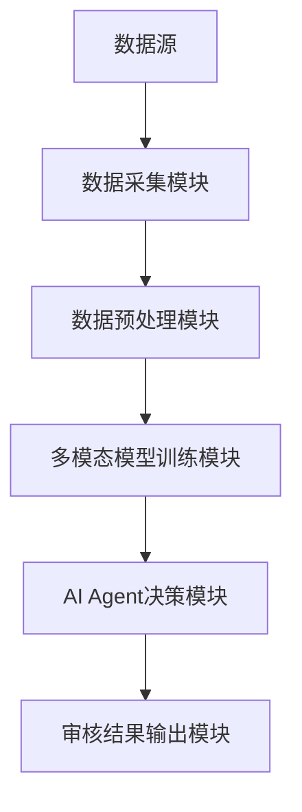

                 


# 《构建AI Agent的实时多模态内容审核系统》

> **关键词**: AI Agent, 多模态内容审核, 实时审核, 系统架构, 机器学习

> **摘要**: 本文详细介绍如何构建一个基于AI Agent的实时多模态内容审核系统。通过分析多模态数据的特性，设计AI Agent的核心算法，构建高效的系统架构，最终实现对文本、图像、视频等多类型内容的实时审核。文章从背景介绍、核心概念、算法原理、系统设计到项目实战，全面阐述了构建该系统的关键步骤和技术细节。

---

## 目录大纲

### 第1章: 引言

#### 1.1 问题背景
- 当前内容审核的挑战
  - 人工审核效率低、成本高
  - 内容多样化、审核难度大
- 多模态内容审核的需求
  - 文本、图像、视频等多种数据类型
  - 实时性要求高

#### 1.2 系统目标与价值
- 系统目标
  - 实现多模态内容的实时审核
  - 提高审核效率和准确性
- 系统价值
  - 自动化处理大量内容
  - 减少人工审核的工作量
  - 提高审核的准确性和一致性

#### 1.3 AI Agent的作用
- AI Agent的核心能力
  - 自主决策
  - 实时响应
- AI Agent在内容审核中的应用
  - 智能分析多模态数据
  - 自动分类和标记内容

---

### 第2章: 核心概念与原理

#### 2.1 AI Agent的定义与特征
- AI Agent的定义
  - 智能代理，能够感知环境、自主决策
- 核心特征
  - 感知性
  - 决策性
  - 实时性

#### 2.2 多模态内容审核的定义与挑战
- 多模态数据的定义
  - 文本、图像、视频等多种数据类型
- 多模态内容审核的挑战
  - 数据异构性
  - 数据量大、处理复杂
  - 实时性要求高

#### 2.3 AI Agent与多模态审核的结合
- AI Agent如何处理多模态数据
  - 统一数据表示
  - 跨模态特征融合
- 多模态数据对AI Agent的影响
  - 提高决策的准确性
  - 增强系统的鲁棒性

---

### 第3章: 系统架构设计

#### 3.1 系统模块划分
- 数据采集模块
  - 实时采集多模态数据
  - 数据预处理
- 模型训练模块
  - 多模态模型训练
  - 模型优化
- AI Agent决策模块
  - 接收输入数据
  - 调用模型进行分类
  - 输出审核结果

#### 3.2 系统架构图


#### 3.3 关键模块设计
- 数据采集模块
  - 支持多种数据类型的采集
  - 实时传输数据
- AI Agent决策模块
  - 调用预训练的多模态模型
  - 分析数据并生成决策
  - 输出审核结果

---

### 第4章: 算法原理与实现

#### 4.1 多模态数据融合方法
- 图文融合
  - 使用注意力机制进行跨模态特征融合
- 视频与音频融合
  - 基于时间同步的特征融合

#### 4.2 AI Agent的决策算法
- 基于概率的分类算法
  - 使用贝叶斯网络进行决策
- 基于深度学习的分类算法
  - 使用Transformer进行跨模态信息处理

#### 4.3 实现细节
- 模型训练
  - 数据增强
  - 模型优化
- 决策模块实现
  - 接收多模态输入
  - 调用模型进行分类
  - 输出结果

---

### 第5章: 项目实战

#### 5.1 环境搭建
- 安装Python
- 安装TensorFlow
- 安装Flask

#### 5.2 核心代码实现
```python
import tensorflow as tf
from tensorflow.keras import layers

# 多模态数据预处理
def preprocess_data(text, image):
    # 文本处理
    text_seq = tf.keras.preprocessing.text.Tokenizer().texts_to_sequences([text])[0]
    # 图像处理
    image_seq = tf.keras.preprocessing.image.load_img(image, target_size=(224, 224))
    image_seq = tf.keras.preprocessing.image.img_to_array(image_seq)
    return text_seq, image_seq
```

#### 5.3 系统运行与测试
- 启动服务
  ```bash
  python app.py
  ```
- 发送请求
  ```bash
  curl -X POST -F "text=测试文本" -F "image=@test.jpg" http://localhost:5000/analyze
  ```

---

### 第6章: 总结与展望

#### 6.1 系统总结
- 系统实现的功能
  - 实时多模态数据采集
  - 多模态内容审核
- 系统的优势
  - 高效性
  - 准确性

#### 6.2 系统的不足
- 现有算法的局限性
  - 多模态数据融合不够充分
  - AI Agent的决策能力有限
- 未来改进方向
  - 提升模型的跨模态理解能力
  - 引入更先进的AI算法

#### 6.3 展望
- 多模态内容审核的未来发展
  - 更智能的AI Agent
  - 更高效的算法
  - 更广泛的应用场景

---

通过以上目录大纲，我们可以系统地构建一个基于AI Agent的实时多模态内容审核系统，涵盖从理论到实践的各个方面，确保读者能够全面理解和掌握相关技术。

