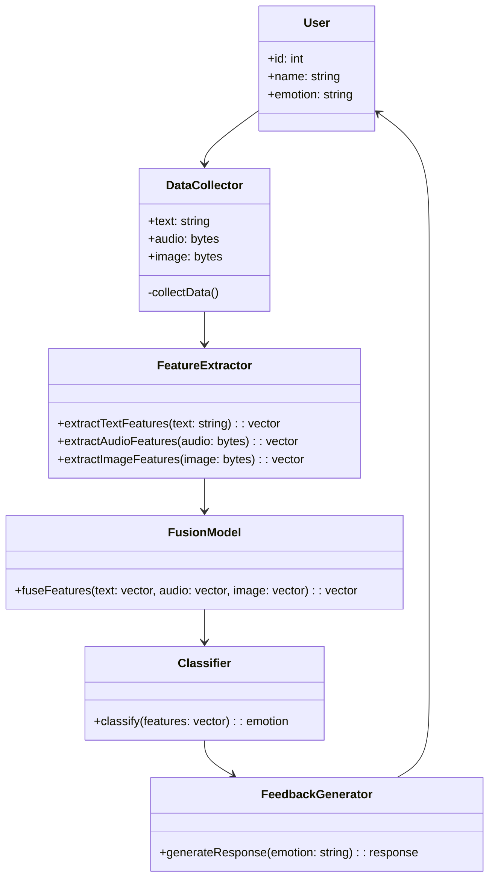
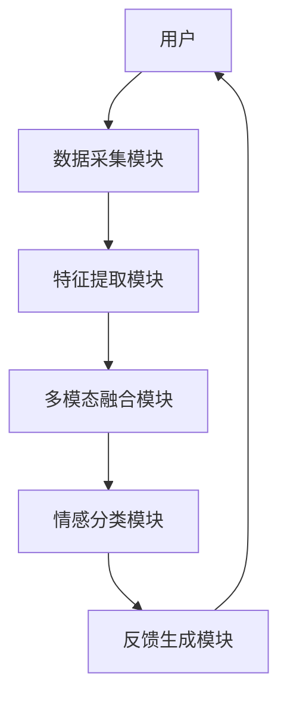
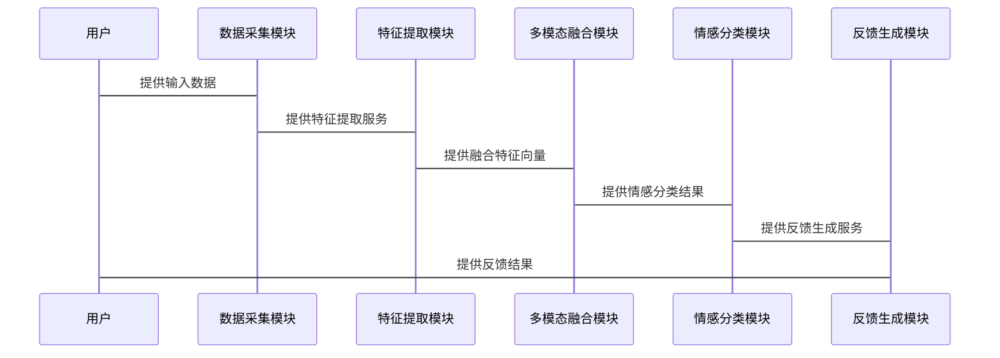

                 


# 构建AI Agent的实时多模态情感识别系统

## 关键词：AI Agent，实时情感识别，多模态数据，深度学习，情感分类

## 摘要：本篇文章详细探讨了构建AI Agent的实时多模态情感识别系统的各个方面，从背景概念、核心算法到系统架构和项目实战。文章首先介绍了AI Agent和多模态情感识别的基本概念及其重要性，接着深入分析了多模态数据处理与融合的核心技术，详细讲解了基于深度学习的多模态情感识别算法，包括模型设计和优化策略。随后，文章从系统架构的角度分析了实时多模态情感识别系统的构建方法，并通过具体的项目实战展示了如何实现这一系统。最后，文章总结了最佳实践和注意事项，为读者提供了完整的构建指南。

---

# 第1章 AI Agent与实时多模态情感识别概述

## 1.1 AI Agent的基本概念

### 1.1.1 AI Agent的定义与特点

AI Agent（人工智能代理）是指能够感知环境、自主决策并执行任务的智能实体。AI Agent的特点包括：

- **自主性**：能够在没有外部干预的情况下独立运作。
- **反应性**：能够实时感知环境变化并做出反应。
- **目标导向**：基于目标进行决策和行动。
- **学习能力**：通过数据和经验不断优化自身性能。

### 1.1.2 AI Agent的核心功能与应用场景

AI Agent的核心功能包括：

- **感知**：通过多模态数据（如文本、语音、图像）感知环境。
- **决策**：基于感知信息做出最优决策。
- **执行**：根据决策执行具体任务。

AI Agent的应用场景广泛，包括智能客服、虚拟助手、智能家居、自动驾驶等。

### 1.1.3 多模态数据的定义与重要性

多模态数据是指来自不同感官渠道的数据，如文本、语音、图像、视频等。多模态数据的重要性体现在：

- **信息互补性**：不同模态的数据可以提供互补的信息，提高识别的准确性和鲁棒性。
- **用户体验**：通过多模态交互，用户可以获得更自然和丰富的交互体验。
- **任务复杂性**：多模态数据能够处理更加复杂的情感识别任务。

## 1.2 情感识别的背景与意义

### 1.2.1 情感识别的基本概念

情感识别是指通过分析多模态数据，识别和理解人类情感状态的技术。情感识别的基本任务包括情感分类（如快乐、悲伤、愤怒）和情感强度分析。

### 1.2.2 多模态情感识别的优势

多模态情感识别相比单模态情感识别具有以下优势：

- **准确性**：通过结合多种模态的数据，可以提高情感识别的准确性。
- **鲁棒性**：单一模态数据可能受到环境噪声的影响，多模态数据可以提供冗余信息，增强系统的鲁棒性。
- **丰富性**：多模态数据能够捕捉到更多的情感信息，提高情感识别的细腻程度。

### 1.2.3 情感识别在AI Agent中的应用价值

在AI Agent中，情感识别可以帮助系统更好地理解用户的需求和情绪状态，从而提供更加智能化和个性化的服务。例如，在智能客服中，情感识别可以帮助识别用户的情绪状态，提供更加贴心的服务。

## 1.3 本章小结

本章主要介绍了AI Agent和实时多模态情感识别的基本概念，阐述了多模态数据的重要性，以及情感识别在AI Agent中的应用价值。接下来的章节将深入探讨多模态数据处理与融合的核心技术，以及基于深度学习的多模态情感识别算法。

---

# 第2章 多模态数据处理与融合

## 2.1 多模态数据的特征分析

### 2.1.1 文本数据的特征提取

文本数据的特征提取通常包括以下步骤：

1. **文本预处理**：去除停用词、分词、词干提取等。
2. **特征表示**：使用词袋模型、TF-IDF、词嵌入（如Word2Vec、GloVe）等方法将文本转换为数值特征。

### 2.1.2 语音数据的特征提取

语音数据的特征提取通常包括以下步骤：

1. **预处理**：去除背景噪声、分帧处理。
2. **特征提取**：提取梅尔频率倒谱系数（MFCCs）、谱图、声学特征等。

### 2.1.3 图像数据的特征提取

图像数据的特征提取通常包括以下步骤：

1. **图像预处理**：调整尺寸、归一化、增强数据等。
2. **特征提取**：使用CNN提取图像的深层特征。

## 2.2 多模态数据融合方法

### 2.2.1 基于特征融合的方法

特征融合是指在特征级别对不同模态的数据进行融合。常见的特征融合方法包括：

- **拼接融合**：将不同模态的特征向量拼接在一起。
- **加权融合**：根据模态的重要性对特征进行加权求和。
- **注意力融合**：使用注意力机制对不同模态的特征进行动态加权。

### 2.2.2 基于模型融合的方法

模型融合是指在模型级别对不同模态的模型输出进行融合。常见的模型融合方法包括：

- **投票融合**：将不同模型的输出进行投票，选择多数结果。
- **加权融合**：根据模型的性能对输出进行加权求和。
- **多任务学习**：在统一的模型中同时学习多个任务，共享特征表示。

### 2.2.3 基于注意力机制的融合方法

注意力机制是一种有效的多模态融合方法，可以动态地调整不同模态的重要性。注意力机制的核心思想是：

$$
\alpha_i = \frac{\exp(e_i)}{\sum_{j} \exp(e_j)}
$$

其中，$\alpha_i$表示第$i$个模态的注意力权重，$e_i$是第$i$个模态的注意力得分。

## 2.3 多模态情感识别的挑战与解决方案

### 2.3.1 数据异质性问题

数据异质性是指不同模态的数据具有不同的特征维度和分布。为了解决数据异质性问题，可以采用以下方法：

- **特征对齐**：通过数据预处理或特征变换，将不同模态的特征对齐到同一空间。
- **模态无关模型**：设计模型时，尽量减少模态之间依赖性。

### 2.3.2 数据同步性问题

数据同步性问题是指不同模态的数据在时间上可能不一致。为了解决数据同步性问题，可以采用以下方法：

- **时间对齐**：将不同模态的数据对齐到同一时间窗口。
- **异步处理**：设计模型时，允许不同模态的数据异步输入。

### 2.3.3 模型泛化能力的提升方法

为了提高模型的泛化能力，可以采用以下方法：

- **数据增强**：通过增加多样化的训练数据，提高模型的鲁棒性。
- **预训练模型**：利用大规模预训练模型进行特征提取和微调。

## 2.4 本章小结

本章主要介绍了多模态数据的特征分析与融合方法，探讨了多模态情感识别的挑战与解决方案。接下来的章节将详细介绍基于深度学习的多模态情感识别算法。

---

# 第3章 基于深度学习的多模态情感识别算法

## 3.1 深度学习在情感识别中的应用

### 3.1.1 基于CNN的图像特征提取

CNN（卷积神经网络）是一种有效的图像特征提取方法。典型的CNN结构包括卷积层、池化层和全连接层。例如，AlexNet、VGGNet和ResNet等模型都可以用于图像特征提取。

### 3.1.2 基于RNN的文本特征提取

RNN（循环神经网络）是一种有效的序列数据处理方法。长短期记忆网络（LSTM）和门控循环单元（GRU）是常用的RNN变体，可以用于文本特征提取。

### 3.1.3 基于Transformer的语音特征提取

Transformer是一种基于自注意力机制的深度学习模型，近年来在语音处理中得到了广泛应用。与CNN和RNN相比，Transformer具有全局上下文感知能力，适合处理序列数据。

## 3.2 多模态融合的深度学习模型

### 3.2.1 多模态注意力网络

多模态注意力网络是一种有效的多模态融合方法，核心思想是通过注意力机制对不同模态的特征进行动态加权。例如，可以使用以下公式进行多模态注意力计算：

$$
\alpha_i = \frac{\exp(e_i)}{\sum_{j} \exp(e_j)}
$$

其中，$\alpha_i$表示第$i$个模态的注意力权重，$e_i$是第$i$个模态的注意力得分。

### 3.2.2 多任务学习模型

多任务学习模型是一种同时学习多个任务的深度学习方法，可以通过共享特征表示来提高模型的泛化能力。例如，可以同时学习文本、语音和图像的情感分类任务。

### 3.2.3 跨模态对比学习

跨模态对比学习是一种通过对比不同模态的特征相似性来提高模型性能的方法。例如，可以使用以下损失函数进行跨模态对比学习：

$$
L = -\log\left(\frac{\exp(s)}{\exp(s) + \exp(d)}\right)
$$

其中，$s$是正样本的相似性得分，$d$是负样本的相似性得分。

## 3.3 情感分类的损失函数与优化方法

### 3.3.1 交叉熵损失函数

交叉熵损失函数是一种常用的分类任务损失函数，适用于多类别情感分类任务。交叉熵损失函数的公式为：

$$
L = -\sum_{i=1}^{n} y_i \log(p_i)
$$

其中，$y_i$是真实标签，$p_i$是预测概率。

### 3.3.2 情感分类的优化算法

常用的优化算法包括随机梯度下降（SGD）、Adam优化器等。在深度学习中，Adam优化器因其高效性和稳定性而被广泛使用。

### 3.3.3 预训练模型的微调策略

预训练模型的微调策略是一种通过在大规模数据上预训练模型，然后在特定任务上进行微调的方法。例如，可以使用BERT、GPT等预训练语言模型进行情感分类任务。

## 3.4 本章小结

本章主要介绍了基于深度学习的多模态情感识别算法，包括深度学习在情感识别中的应用、多模态融合的深度学习模型以及情感分类的损失函数与优化方法。接下来的章节将从系统架构的角度分析实时多模态情感识别系统的构建方法。

---

# 第4章 系统分析与架构设计

## 4.1 问题场景介绍

实时多模态情感识别系统的应用场景包括智能客服、虚拟助手、在线教育等。在这些场景中，系统需要实时处理多模态数据，快速识别用户情感状态，并提供相应的反馈。

## 4.2 系统功能设计

### 4.2.1 领域模型设计

领域模型是对系统功能的抽象，通常可以用类图表示。以下是多模态情感识别系统的领域模型：



### 4.2.2 系统架构设计

以下是多模态情感识别系统的架构图：



### 4.2.3 系统接口设计

系统接口设计需要考虑模块之间的交互接口。以下是主要接口的定义：

- **数据采集模块**：提供`collectData()`方法，用于采集多模态数据。
- **特征提取模块**：提供`extractFeatures()`方法，用于将数据转换为特征向量。
- **多模态融合模块**：提供`fuseFeatures()`方法，用于融合不同模态的特征向量。
- **情感分类模块**：提供`classify()`方法，用于对融合后的特征向量进行情感分类。
- **反馈生成模块**：提供`generateResponse()`方法，用于根据情感分类结果生成反馈。

### 4.2.4 系统交互流程

以下是系统交互流程的序列图：



## 4.3 本章小结

本章主要介绍了实时多模态情感识别系统的架构设计，包括系统功能设计、系统架构设计、系统接口设计和系统交互流程。接下来的章节将通过具体的项目实战展示如何实现这一系统。

---

# 第5章 项目实战

## 5.1 环境安装

### 5.1.1 Python环境配置

建议使用Python 3.8及以上版本，并安装以下库：

- `numpy`
- `pandas`
- `scikit-learn`
- `tensorflow`
- `pytorch`
- `transformers`

### 5.1.2 数据集准备

需要准备一个多模态情感识别数据集，包含文本、语音和图像数据。例如，可以使用自定义数据集，或公开数据集（如AffectNet、IEMOCAP等）。

## 5.2 核心代码实现

### 5.2.1 数据采集模块

以下是数据采集模块的实现代码：

```python
import sounddevice as sd
import cv2
import numpy as np

class DataCollector:
    def collect_data(self):
        # 收集文本数据
        text = input("请输入文本数据：")
        # 收集语音数据
        audio, _ = sd.rec(2.0, 44100, 2)
        audio = audio.T
        # 收集图像数据
        image = cv2.imread("input.jpg")
        return text, audio, image
```

### 5.2.2 特征提取模块

以下是特征提取模块的实现代码：

```python
import librosa
import torch
from torch.nn import Conv2d, MaxPool2d, ReLU, Linear, Dropout, Flatten

class TextFeatureExtractor:
    def __init__(self, model_name='bert-base-uncased'):
        self.tokenizer = AutoTokenizer.from_pretrained(model_name)
        self.model = AutoModel.from_pretrained(model_name)
    
    def extract_features(self, text):
        inputs = self.tokenizer(text, return_tensors='np')
        outputs = self.model(**inputs)
        return outputs.last_hidden_state[:, 0, :]

class AudioFeatureExtractor:
    def extract_features(self, audio):
        mfccs = librosa.feature.mfcc(y=audio, sr=44100, n_mfcc=13)
        return mfccs.T

class ImageFeatureExtractor:
    def __init__(self):
        self.cnn = torch.nn.Sequential(
            Conv2d(3, 64, 3, padding=1),
            MaxPool2d(2, 2),
            ReLU(),
            Conv2d(64, 128, 3, padding=1),
            MaxPool2d(2, 2),
            ReLU(),
            Flatten(),
            Linear(128*128, 256),
            ReLU(),
            Dropout(0.5)
        )
    
    def extract_features(self, image):
        image = image / 255.0
        image = torch.from_numpy(image).permute(2, 3, 0, 1)
        features = self.cnn(image)
        return features.numpy()
```

### 5.2.3 多模态融合模块

以下是多模态融合模块的实现代码：

```python
class FusionModel:
    def __init__(self, text_dim=128, audio_dim=13, image_dim=256):
        self.text_dim = text_dim
        self.audio_dim = audio_dim
        self.image_dim = image_dim
    
    def fuse_features(self, text_features, audio_features, image_features):
        # 使用注意力机制进行融合
        attention_weights = self._compute_attention(text_features, audio_features, image_features)
        fused_features = text_features * attention_weights[0] + audio_features * attention_weights[1] + image_features * attention_weights[2]
        return fused_features

    def _compute_attention(self, text_features, audio_features, image_features):
        # 计算注意力权重
        text_score = np.sum(text_features, axis=1) / self.text_dim
        audio_score = np.sum(audio_features, axis=1) / self.audio_dim
        image_score = np.sum(image_features, axis=1) / self.image_dim
        attention_weights = np.exp([text_score, audio_score, image_score]) / np.sum(np.exp([text_score, audio_score, image_score]))
        return attention_weights
```

### 5.2.4 情感分类模块

以下是情感分类模块的实现代码：

```python
import torch
from torch import nn

class EmotionClassifier(nn.Module):
    def __init__(self, input_dim=512, hidden_dim=256, output_dim=4):
        super(EmotionClassifier, self).__init__()
        self.fc1 = nn.Linear(input_dim, hidden_dim)
        self.relu = nn.ReLU()
        self.fc2 = nn.Linear(hidden_dim, output_dim)
    
    def forward(self, x):
        x = self.fc1(x)
        x = self.relu(x)
        x = self.fc2(x)
        return x

# 初始化分类器
classifier = EmotionClassifier()
criterion = nn.CrossEntropyLoss()
optimizer = torch.optim.Adam(classifier.parameters(), lr=0.001)
```

### 5.2.5 反馈生成模块

以下是反馈生成模块的实现代码：

```python
class FeedbackGenerator:
    def generate_response(self, emotion):
        feedback = {
            'happy': '您看起来非常开心！有什么我可以帮助您的吗？',
            'sad': '您看起来有点低落，有什么我可以为您做的吗？',
            'angry': '您看起来有些生气，有什么我可以为您做的吗？',
            'neutral': '您看起来情绪平和，有什么我可以帮助您的吗？'
        }
        return feedback[emotion]
```

## 5.3 案例分析与实际应用

以下是一个简单的案例分析：

```python
# 初始化数据采集模块
data_collector = DataCollector()

# 采集数据
text, audio, image = data_collector.collect_data()

# 特征提取
text_features = text_feature_extractor.extract_features(text)
audio_features = audio_feature_extractor.extract_features(audio)
image_features = image_feature_extractor.extract_features(image)

# 多模态融合
fused_features = fusion_model.fuse_features(text_features, audio_features, image_features)

# 情感分类
outputs = classifier(torch.from_numpy(fused_features))
_, predicted = torch.max(outputs.data, 1)
emotion = predicted.numpy()[0]

# 生成反馈
feedback = feedback_generator.generate_response(emotion)

# 输出结果
print(f"识别到的情感为：{emotion}")
print(f"生成的反馈为：{feedback}")
```

## 5.4 项目总结

本章通过具体的项目实战展示了如何实现一个多模态情感识别系统，包括数据采集、特征提取、多模态融合、情感分类和反馈生成模块的实现。通过案例分析，展示了系统的实际应用价值。

---

# 第6章 最佳实践、小结与拓展阅读

## 6.1 最佳实践

- **数据预处理**：在处理多模态数据时，需要进行充分的数据预处理，如去噪、归一化等。
- **模型优化**：在模型训练过程中，可以采用数据增强、学习率调整等优化策略。
- **系统优化**：在系统实现过程中，需要注意系统的实时性和稳定性，避免数据同步和模型推理时间过长的问题。

## 6.2 小结

本篇文章详细探讨了构建AI Agent的实时多模态情感识别系统的各个方面，从背景概念、核心算法到系统架构和项目实战。通过系统的介绍和具体的实现案例，为读者提供了一个完整的构建指南。

## 6.3 拓展阅读

- **多模态数据处理**：深入研究多模态数据处理的技术，如对比学习、自适应融合等。
- **深度学习模型**：探索更先进的深度学习模型，如多模态Transformer、视觉-语言模型等。
- **实时系统优化**：研究实时系统的优化方法，如异步处理、边缘计算等。

---

# 附录

## 附录A 数据集示例

以下是多模态情感识别数据集的示例：

```json
{
    "samples": [
        {
            "text": "我感到非常开心",
            "audio": "audio_1.wav",
            "image": "image_1.jpg",
            "emotion": "happy"
        },
        {
            "text": "我感到非常难过",
            "audio": "audio_2.wav",
            "image": "image_2.jpg",
            "emotion": "sad"
        },
        // 更多样本...
    ]
}
```

## 附录B 常用工具与库

- **文本处理**：NLTK、spaCy、Hugging Face Transformers
- **语音处理**：Librosa、Scipy、PyTorch Audio
- **图像处理**：OpenCV、TensorFlow、Keras
- **深度学习框架**：TensorFlow、PyTorch
- **自然语言处理**：BERT、GPT、RoBERTa

---

# 参考文献

1. 深度学习入门：基于Python的实践（李永乐）
2. 《Python机器学习》（ Aurélien Géron）
3. 《深度学习》（Ian Goodfellow）
4. 《情感分析与自然语言处理》（Nitin Indurkar）
5. OpenCV官方文档
6. TensorFlow官方文档
7. PyTorch官方文档
8. Hugging Face Transformers官方文档

---

通过以上内容，您可以系统地学习和实现一个多模态情感识别系统。

