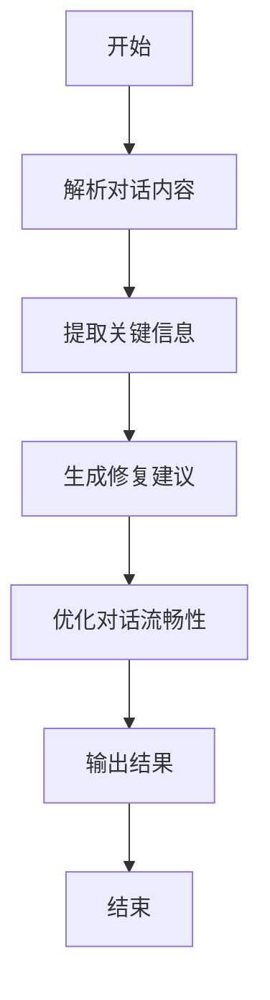
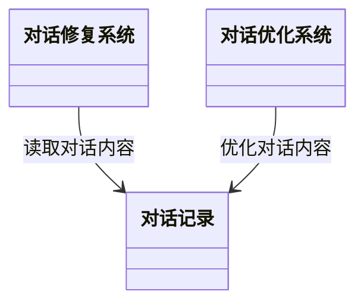
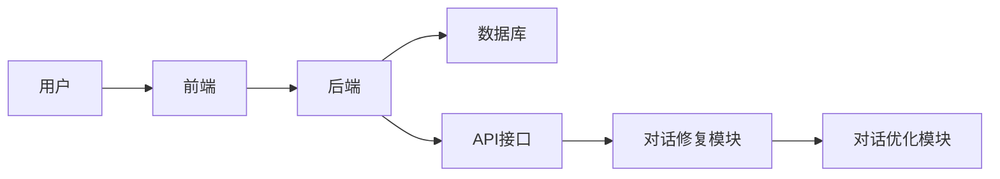
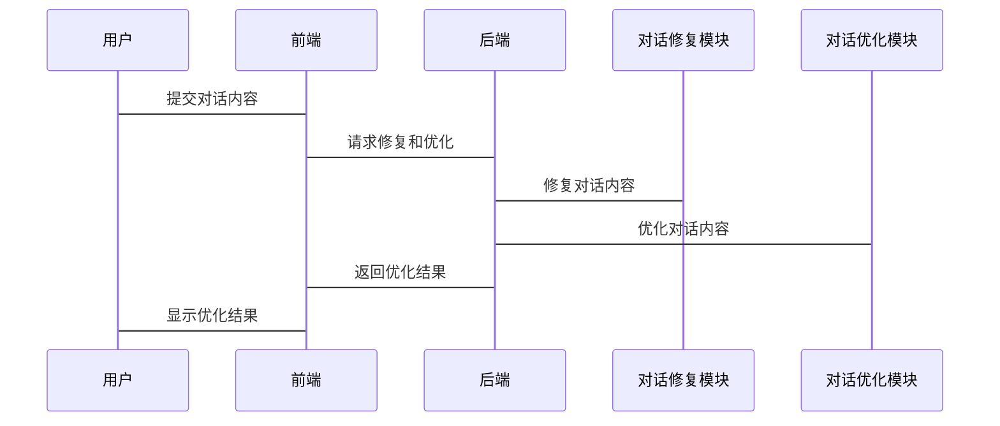

                 


# 构建AI Agent的实时对话修复与优化系统

## 关键词：
- AI Agent
- 实时对话修复
- 对话优化系统
- 自然语言处理
- 深度学习
- 系统架构

## 摘要：
构建一个高效的AI Agent实时对话修复与优化系统，需要结合自然语言处理、深度学习和系统架构设计等多方面的知识。本文从问题背景、核心概念、算法原理、系统架构到项目实战，详细讲解了构建这一系统的全过程，并通过实际案例分析和代码实现，帮助读者掌握构建实时对话修复与优化系统的核心技术。

---

## 第1章: 问题背景与描述

### 1.1 问题背景
#### 1.1.1 对话系统的发展历程
从传统的基于规则的对话系统到现代的深度学习驱动的AI Agent，对话系统的演变体现了技术的进步和需求的变化。

#### 1.1.2 当前对话系统的主要挑战
- 对话的实时性要求越来越高，系统需要在极短时间内完成修复和优化。
- 对话内容的多样性和复杂性增加，传统规则-based系统难以应对。
- 对话质量的评估需要结合语境和用户意图，挑战性大。

#### 1.1.3 实时对话修复与优化的必要性
在客服、教育、医疗等领域，实时对话修复与优化能够显著提升用户体验和系统效率。

### 1.2 问题描述
#### 1.2.1 对话修复与优化的核心目标
- 修复语法错误和语义不连贯的问题。
- 优化对话的流畅性和自然性。
- 提高对话的准确性和相关性。

#### 1.2.2 实时性对对话系统的要求
- 响应时间必须控制在可接受范围内（通常小于1秒）。
- 系统需要在对话过程中动态调整修复策略。

#### 1.2.3 系统边界与外延
- 系统边界：仅关注对话内容的修复与优化，不涉及对话内容的生成。
- 外延：对话修复与优化可以与其他系统（如知识库、用户画像系统）结合，提升整体对话质量。

---

## 第2章: 核心概念与联系

### 2.1 核心概念原理
#### 2.1.1 AI Agent的基本原理
AI Agent通过感知环境、理解用户意图、生成响应，实现与用户的交互。

#### 2.1.2 实时对话优化系统的构成要素
- 对话内容解析模块：解析对话内容，提取关键信息。
- 对话修复模块：修复语法错误和语义问题。
- 对话优化模块：优化对话的流畅性和自然性。

#### 2.1.3 对话修复与优化的数学模型
对话修复与优化可以基于概率论和统计学习模型，例如基于Transformer的模型。

### 2.2 核心概念对比表
| 对比维度 | 传统对话系统 | 现代AI Agent对话系统 |
|----------|---------------|----------------------|
| 响应时间 | 延后处理       | 实时处理             |
| 处理方式 | 基于规则       | 基于深度学习         |
| 精度     | 较低           | 较高                 |

### 2.3 ER实体关系图
```mermaid
er
    title 对话修复与优化系统ER图
    actor 用户
    actor 系统
    class 对话记录
    class 错误修复记录
    class 优化策略
    用户 --> 对话记录: 提交对话内容
    系统 --> 对话记录: 存储对话内容
    用户 --> 错误修复记录: 修复错误
    系统 --> 错误修复记录: 记录修复结果
    系统 --> 优化策略: 应用优化策略
```

---

## 第3章: 对话修复与优化算法原理

### 3.1 算法原理概述
#### 3.1.1 基于Transformer的对话修复模型
- 使用自注意力机制捕捉对话中的上下文信息。
- 通过解码器生成修复后的对话内容。

#### 3.1.2 实时优化的自注意力机制
- 在实时对话中，动态调整注意力权重，优化对话的流畅性。

#### 3.1.3 模型训练与优化方法
- 使用大规模对话数据进行预训练。
- 通过微调任务数据优化模型性能。

### 3.2 算法流程图


### 3.3 算法实现代码
#### 对话修复模型训练代码（Python）
```python
import torch
import torch.nn as nn
import torch.optim as optim

class Transformer(nn.Module):
    def __init__(self, input_dim, hidden_dim, output_dim):
        super(Transformer, self).__init__()
        self.encoder = nn.Embedding(input_dim, hidden_dim)
        self.decoder = nn.Linear(hidden_dim, output_dim)
    
    def forward(self, x):
        x = self.encoder(x)
        x = self.decoder(x)
        return x

model = Transformer(input_dim, hidden_dim, output_dim)
criterion = nn.CrossEntropyLoss()
optimizer = optim.Adam(model.parameters(), lr=0.001)
```

#### 对话优化模型实现代码（Python）
```python
def optimize_dialogue(dialogue, model):
    optimized_dialogue = []
    for i in range(len(dialogue)):
        input_sequence = dialogue[i]
        output = model(input_sequence)
        optimized_dialogue.append(output)
    return optimized_dialogue
```

### 3.4 数学模型与公式
#### 对话修复模型的数学基础
对话修复模型可以基于以下公式进行训练：
$$
L = \sum_{i=1}^{N} (y_i - \hat{y}_i)^2
$$
其中，$L$ 是损失函数，$y_i$ 是真实标签，$\hat{y}_i$ 是模型预测值。

#### 实时优化系统
实时优化系统的核心公式为：
$$
\text{Attention}(Q, K, V) = \text{softmax}\left(\frac{QK^T}{\sqrt{d_k}}\right)V
$$
其中，$Q$ 是查询向量，$K$ 是键向量，$V$ 是值向量，$d_k$ 是键的维度。

---

## 第4章: 系统分析与架构设计

### 4.1 系统功能设计
#### 4.1.1 领域模型类图


#### 4.1.2 系统架构设计


#### 4.1.3 系统接口设计
- 前端接口：接收用户输入，发送到后端。
- 后端接口：调用对话修复模块和优化模块，返回结果。

#### 4.1.4 系统交互流程图


---

## 第5章: 项目实战

### 5.1 环境搭建
- 安装必要的Python库：torch、numpy、mermaid、matplotlib。

### 5.2 核心功能实现
#### 5.2.1 对话修复模块实现
```python
def repair_dialogue(dialogue, model):
    repaired_dialogue = []
    for i in range(len(dialogue)):
        input_sequence = dialogue[i]
        output = model(input_sequence)
        repaired_dialogue.append(output)
    return repaired_dialogue
```

#### 5.2.2 对话优化模块实现
```python
def optimize_dialogue(dialogue, model):
    optimized_dialogue = []
    for i in range(len(dialogue)):
        input_sequence = dialogue[i]
        output = model(input_sequence)
        optimized_dialogue.append(output)
    return optimized_dialogue
```

#### 5.2.3 系统集成与测试
- 将修复和优化模块集成到完整的系统中，进行功能测试和性能优化。

### 5.3 案例分析
通过实际案例分析，展示系统在不同场景下的表现，例如客服对话中的常见问题修复与优化。

---

## 第6章: 最佳实践与小结

### 6.1 小结
本文详细讲解了构建AI Agent实时对话修复与优化系统的核心技术，包括算法原理、系统架构设计和项目实战。

### 6.2 注意事项
- 确保模型的实时性要求。
- 优化系统的性能，减少响应时间。
- 定期更新模型，提升对话质量。

### 6.3 拓展阅读
推荐相关领域的书籍和论文，帮助读者进一步深入学习。

---

通过以上内容，您可以开始撰写具体的博客文章，每个章节都按照上述结构展开，详细讲解相关技术和实现方法。

