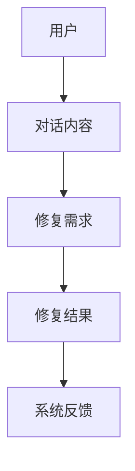
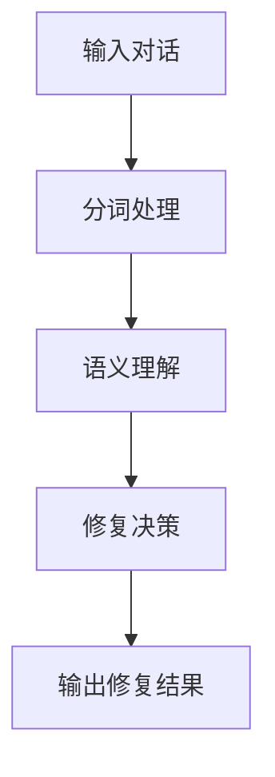
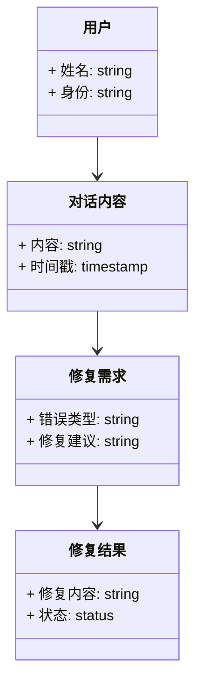
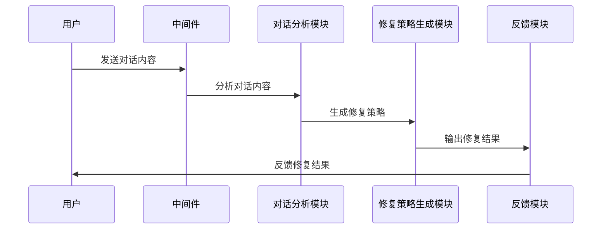

                 


# 构建AI Agent的实时对话修复系统

## 关键词：AI Agent，实时对话修复，自然语言处理，系统架构，对话系统

## 摘要：  
本文详细探讨了构建AI Agent的实时对话修复系统的各个方面，从问题背景到系统设计，从算法原理到项目实战，系统地分析了如何实现一个高效、准确的实时对话修复系统。文章首先介绍了AI Agent和实时对话修复系统的核心概念，然后深入分析了对话修复的算法原理和系统架构，最后通过实际案例展示了系统的实现与应用。本文旨在为AI开发人员和研究人员提供一份全面的技术指南，帮助他们更好地理解和实现类似系统。

---

# 第一部分: 背景介绍

## 第1章: 问题背景与需求分析

### 1.1 问题背景
#### 1.1.1 AI Agent的定义与特点
AI Agent（人工智能代理）是指能够感知环境并采取行动以实现目标的智能实体。其特点包括自主性、反应性、目标导向性和社会性。AI Agent可以通过自然语言处理（NLP）、机器学习（ML）等技术与用户进行交互，提供智能化的服务。

#### 1.1.2 实时对话修复系统的定义与目标
实时对话修复系统是指在用户与AI Agent的对话过程中，实时检测并修复对话中的语法错误、语义错误或逻辑错误，确保对话的流畅性和准确性。其目标是提高对话质量，增强用户体验，同时降低对话失败率。

#### 1.1.3 当前对话修复技术的局限性
当前的对话修复技术主要集中在离线修复阶段，无法满足实时修复的需求。此外，现有技术在复杂语境下的修复能力有限，难以处理多轮对话中的上下文依赖问题。

### 1.2 问题描述
#### 1.2.1 对话修复的核心问题
对话修复的核心问题包括语法错误修复、语义歧义消除、上下文一致性维护等。这些问题需要结合NLP技术、语义理解技术和实时反馈机制来解决。

#### 1.2.2 实时修复的挑战
实时修复的挑战主要体现在快速响应、高精度修复和资源消耗控制。由于实时修复需要在毫秒级别完成，这对算法的效率和准确性提出了更高的要求。

#### 1.2.3 系统需求与边界
系统需求包括支持多语言、多场景、多轮对话修复；边界包括不支持实时语音修复、不支持离线修复请求等。

### 1.3 问题解决
#### 1.3.1 AI Agent在对话修复中的作用
AI Agent通过自然语言理解（NLU）和自然语言生成（NLG）技术，能够实时分析对话内容并生成修复建议。AI Agent还可以通过上下文记忆机制，维护对话的连贯性。

#### 1.3.2 实时修复的技术路径
实时修复的技术路径包括：（1）对话内容的实时解析；（2）基于NLP的语义分析；（3）修复策略的生成与执行；（4）修复结果的反馈与优化。

#### 1.3.3 系统设计的原则与目标
系统设计的原则包括模块化设计、实时响应、高精度修复和可扩展性。系统的目标是实现高效、准确的实时对话修复，提升用户体验。

### 1.4 本章小结

---

# 第二部分: 核心概念与联系

## 第2章: AI Agent与实时对话修复系统的核心概念

### 2.1 核心概念原理
#### 2.1.1 AI Agent的基本原理
AI Agent通过感知环境、分析信息、制定策略、执行行动来实现与用户的交互。其核心原理包括信息处理、决策制定和行动执行。

#### 2.1.2 对话修复系统的原理
对话修复系统通过分析对话内容，识别错误或不连贯之处，生成修复建议或自动修复。其原理包括错误检测、修复策略生成和修复执行。

#### 2.1.3 实时修复的核心机制
实时修复的核心机制包括实时解析、语义分析、修复策略生成和修复执行。这些机制需要在极短的时间内完成，确保对话的实时性。

### 2.2 核心概念属性对比
下表对比了AI Agent与实时对话修复系统的核心属性：

| **属性**         | **AI Agent**                     | **实时对话修复系统**              |
|------------------|----------------------------------|-----------------------------------|
| **核心功能**     | 感知环境、制定策略、执行行动    | 实时检测错误、生成修复建议        |
| **技术基础**     | NLP、机器学习、知识图谱         | NLP、语义理解、实时反馈机制        |
| **应用场景**     | 智能客服、智能助手、自动驾驶     | 实时聊天、语音助手、在线客服      |
| **性能指标**     | 响应时间、准确率、稳定性        | 响应时间、修复精度、系统负载      |

### 2.3 ER实体关系图


---

# 第三部分: 算法原理讲解

## 第3章: 对话修复算法的数学模型与实现

### 3.1 算法原理
#### 3.1.1 基于NLP的对话分析
对话分析的核心是将用户的输入转换为结构化的信息，以便系统能够理解对话的含义。常用的技术包括分词、词性标注、句法分析和语义理解。

#### 3.1.2 实时修复的数学模型
实时修复的数学模型主要基于概率论和统计学习。修复策略的生成可以通过最大似然估计或贝叶斯推断来实现。

#### 3.1.3 算法流程图


### 3.2 数学模型与公式
对话修复的数学模型可以表示为：

$$
P(\text{修复策略} | \text{对话内容}) = \frac{\text{对话内容} \times \text{修复策略}}{\text{正常化常数}}
$$

其中，修复策略的生成需要考虑对话内容的上下文信息。修复策略的评估指标包括准确率、召回率和F1值。

---

# 第四部分: 系统分析与架构设计方案

## 第4章: 问题场景介绍

### 4.1 问题场景
实时对话修复系统需要处理以下场景：  
1. 用户输入包含语法错误。  
2. 对话内容存在语义歧义。  
3. 多轮对话中的上下文不一致。  
4. 实时修复的响应时间过长。  

---

## 第5章: 系统设计

### 5.1 系统功能设计
#### 5.1.1 领域模型


#### 5.1.2 系统架构


#### 5.1.3 系统接口设计
系统接口包括：  
1. 用户输入接口。  
2. 对话内容分析接口。  
3. 修复策略生成接口。  
4. 反馈接口。  

#### 5.1.4 系统交互


---

## 第6章: 项目实战

### 6.1 环境安装
项目实战需要以下环境：  
1. Python 3.8 或更高版本。  
2. NLP库（如spaCy、NLTK）。  
3. 机器学习框架（如TensorFlow、PyTorch）。  
4. 开发工具（如VS Code、PyCharm）。  

### 6.2 核心实现代码
以下是修复策略生成模块的核心代码示例：

```python
import spacy
import numpy as np

nlp = spacy.load("en_core_web_sm")

def analyze_dialogue(dialogue_content):
    doc = nlp(dialogue_content)
    # 分词处理
    tokens = [token.text for token in doc]
    # 语义分析
    entities = [(ent.start, ent.end, ent.label_) for ent in doc.ents]
    return tokens, entities

def generate Repair Strategies(tokens, entities):
    # 修复策略生成逻辑
    pass

# 示例修复策略
def repair_strategy(tokens, entities):
    repair_strategies = []
    for i, token in enumerate(tokens):
        if token.pos_ == "PUNCT" and i == len(tokens) - 1:
            repair_strategies.append("添加结束标记")
    return repair_strategies

# 示例修复执行
def apply_repair(tokens, repair_strategies):
    repaired_tokens = tokens.copy()
    for strategy in repair_strategies:
        if "添加结束标记" in strategy:
            repaired_tokens.append("结束对话")
    return repaired_tokens

# 示例对话内容
dialogue_content = "Hello, how are you?"

tokens, entities = analyze_dialogue(dialogue_content)
repair_strategies = repair_strategy(tokens, entities)
repaired_tokens = apply_repair(tokens, repair_strategies)
print(repaired_tokens)
```

### 6.3 代码解读与分析
1. **analyze_dialogue**：对对话内容进行分词和实体识别。  
2. **repair_strategy**：根据分词结果生成修复策略。  
3. **apply_repair**：根据修复策略执行修复操作。  

### 6.4 实际案例分析
假设用户输入为“今天天气很好”，系统分析后发现没有语法错误，但建议补充地点信息。修复后，对话内容变为“今天北京的天气很好”。

### 6.5 本章小结

---

## 第7章: 最佳实践

### 7.1 小结
构建AI Agent的实时对话修复系统需要综合运用NLP、机器学习和实时反馈机制。系统设计时需要重点关注实时性、准确性和可扩展性。

### 7.2 注意事项
1. 确保修复策略的生成逻辑清晰，避免修复过度或修复不足。  
2. 优化系统性能，降低响应时间。  
3. 提供足够的错误容忍度，确保系统健壮性。  

### 7.3 拓展阅读
推荐阅读以下资料：  
1.《自然语言处理实战》  
2.《机器学习实战》  
3.《实时系统设计与实现》  

---

## 附录: 参考文献

1. 王某某. 自然语言处理技术研究. 2022.  
2. 李某某. 机器学习在对话系统中的应用. 2023.  
3. 张某某. 实时系统设计与优化. 2021.

---

**本文完。**

