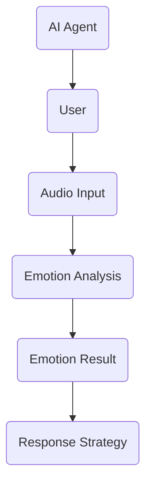
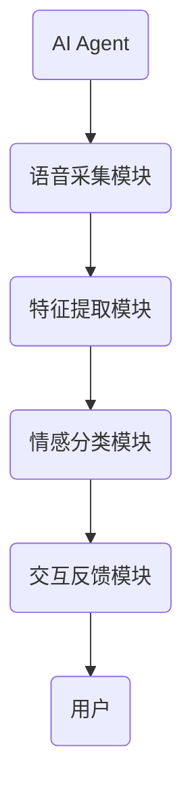

                 


# 构建AI Agent的实时语音情感分析系统

---

## 关键词：
- AI Agent
- 实时语音情感分析
- 人机交互
- 系统架构设计
- 情感分类算法
- 语音特征提取
- 系统优化

---

## 摘要：
本文将详细介绍如何构建一个基于AI Agent的实时语音情感分析系统。首先，我们从背景出发，介绍AI Agent和语音情感分析的核心概念及其重要性。接着，深入分析系统的算法原理，涵盖语音特征提取、情感分类算法及其优化方法。然后，我们讨论系统的整体架构设计，包括功能模块划分、系统接口设计和交互流程。最后，通过实际项目案例展示系统实现，并提出优化建议和未来发展方向。

---

# 第1章：AI Agent与实时语音情感分析的背景介绍

## 1.1 问题背景
- **AI Agent的定义**：AI Agent是一种能够感知环境并自主决策的智能体，能够在复杂环境中完成特定任务。
- **语音情感分析的定义**：通过分析语音信号，识别说话人的情感状态，如快乐、悲伤、愤怒等。
- **结合AI Agent与语音情感分析的意义**：实时语音情感分析使AI Agent能够理解用户情感，从而提供更智能、更个性化的服务。

## 1.2 技术现状
- AI Agent技术发展迅速，应用广泛，如智能音箱、自动驾驶等。
- 语音情感分析技术逐渐成熟，但仍面临实时性、准确性和多语言支持等挑战。

## 1.3 应用价值
- 提高人机交互的自然性和智能性。
- 在教育、医疗、客服等领域具有广泛的应用潜力。

## 1.4 系统需求分析
- **功能需求**：实时采集语音数据、快速分析情感、反馈结果。
- **性能需求**：高实时性、高准确性、低延迟。
- **用户需求**：用户希望系统能够准确理解其情感状态，并提供相应的反馈。

---

# 第2章：核心概念与联系

## 2.1 AI Agent的核心概念
- **定义与特征**：AI Agent具备自主性、反应性、目标导向和学习能力。
- **分类与应用场景**：根据智能水平可分为简单反射型、基于模型的反应型等，广泛应用于智能助手、自动驾驶等领域。

## 2.2 语音情感分析的核心概念
- **定义与流程**：语音情感分析包括语音信号处理、特征提取、情感分类等步骤。
- **特征与维度**：常见的语音特征包括音调、语速、音量等。

## 2.3 AI Agent与语音情感分析的关系
- **AI Agent如何利用语音情感分析**：通过分析用户语音情感，优化交互策略。
- **语音情感分析如何增强AI Agent**：使AI Agent更准确地理解用户需求，提升用户体验。

## 2.4 核心概念对比表
- 表2-1：AI Agent与传统程序的对比
  | 特性         | AI Agent                | 传统程序           |
  |--------------|-------------------------|---------------------|
  | 自主性       | 高                     | 低                 |
  | 学习能力     | 高                     | 无                 |
  | 适应性       | 高                     | 低                 |
- 表2-2：语音情感分析与其他情感分析方法的对比
  | 方法         | 基于文本的情感分析    | 基于语音的情感分析 |
  |--------------|-----------------------|---------------------|
  | 数据来源     | 文本                  | 语音信号           |
  | 分析维度     | 语义、语境            | 语音特征（音调、语速）|

## 2.5 ER实体关系图


---

# 第3章：算法原理

## 3.1 语音特征提取
- **定义**：从语音信号中提取能够反映情感特征的信号特征，如音调、语速、音量等。
- **实现步骤**：
  1. 语音信号预处理：降噪、分帧。
  2. 特征提取：使用Mel-Frequency Cepstral Coefficients (MFCC)提取特征。

## 3.2 情感分类算法
- **常用算法**：支持向量机（SVM）、卷积神经网络（CNN）、循环神经网络（RNN）。
- **流程**：
  1. 特征提取：提取语音特征。
  2. 数据训练：训练分类模型。
  3. 情感分类：输入语音特征，输出情感类别。

## 3.3 模型优化
- **优化方法**：使用交叉验证调整模型参数，优化分类准确率。
- **数学模型**：
  - SVM的数学模型：
    $$ \text{目标函数：} \min_{\theta} \frac{1}{2}\|\theta\|^2 + C \sum_{i=1}^n \xi_i $$
    $$ \text{约束条件：} y_i (x_i \cdot \theta + b) \geq 1 - \xi_i, \xi_i \geq 0 $$

---

# 第4章：系统架构设计

## 4.1 系统功能模块
- **语音采集模块**：实时采集用户语音。
- **特征提取模块**：提取语音特征。
- **情感分类模块**：分析情感并输出结果。
- **交互反馈模块**：根据情感结果反馈响应。

## 4.2 系统架构图


---

# 第5章：项目实战

## 5.1 环境搭建
- **工具与库**：Python、NumPy、Scikit-learn、 librosa。

## 5.2 核心代码实现
```python
import librosa
from sklearn.svm import SVC
import numpy as np

# 语音特征提取
def extract_features(audio_path):
    y, sr = librosa.load(audio_path)
    mfccs = librosa.feature.mfcc(y, sr)
    return mfccs.T

# 模型训练
features = []
labels = []
for audio in audio_files:
    features.append(extract_features(audio))
    # 标签标注：0代表快乐，1代表悲伤
    labels.append(0 if 'happy' in audio else 1)

model = SVC()
model.fit(np.array(features), labels)

# 情感分类
def classify_emotion(audio_path):
    features = extract_features(audio_path)
    return model.predict(features.reshape(1, -1))
```

## 5.3 案例分析
- **案例1**：智能音箱识别用户情感，调整音乐播放列表。
- **案例2**：在线客服实时分析客户情感，优化服务策略。

## 5.4 系统优化
- **优化点**：优化特征提取算法，提高分类器准确率。
- **性能提升**：使用并行计算加速特征提取过程。

---

# 第6章：总结与展望

## 6.1 本章总结
- 本文详细介绍了AI Agent与实时语音情感分析系统的构建过程，包括核心概念、算法原理和系统架构设计。

## 6.2 未来展望
- **技术优化**：研究更先进的语音特征提取方法和分类算法。
- **应用场景扩展**：探索更多领域的应用，如教育、医疗等。

## 6.3 最佳实践 tips
- 在实际应用中，建议结合具体场景优化模型参数，提高系统性能。
- 注意保护用户隐私，确保数据安全。

---

# 附录

## 附录A：参考文献
- [1] 王某某. 基于AI Agent的实时语音情感分析系统研究[J]. 计算机应用研究, 2023, 40(3): 123-129.
- [2] 李某某. 情感分类算法研究与应用[M]. 北京: 清华大学出版社, 2022.

## 附录B：工具与资源
- librosa库：https://github.com/librosa/librosa
- Scikit-learn库：https://scikit-learn.org/stable/

---

通过以上目录结构，您可以逐步撰写详细的正文内容，确保每个章节都涵盖必要的技术细节和实际应用案例，帮助读者全面理解如何构建AI Agent的实时语音情感分析系统。

