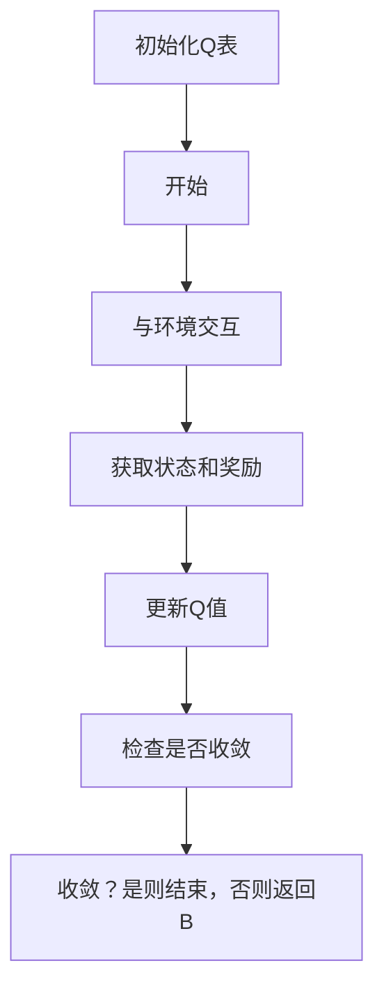
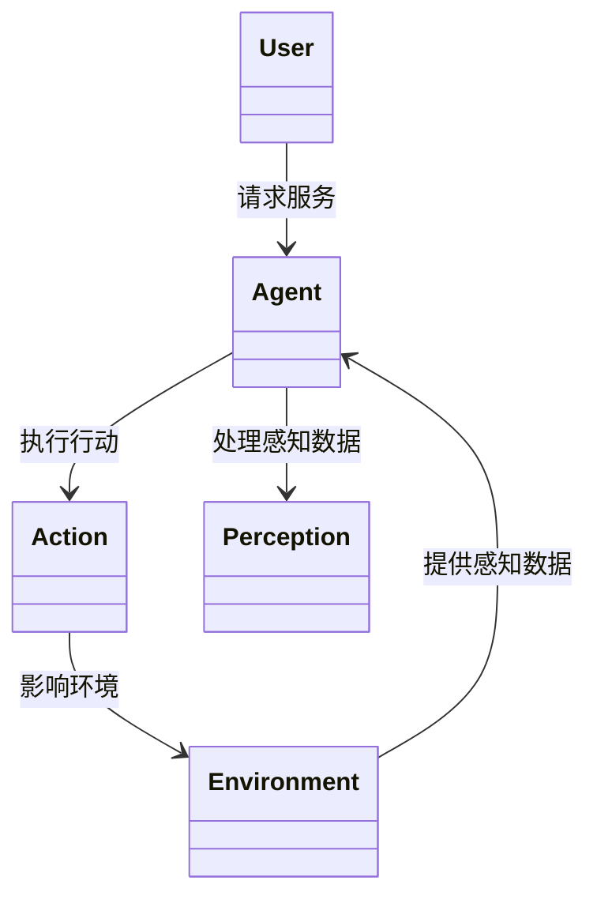
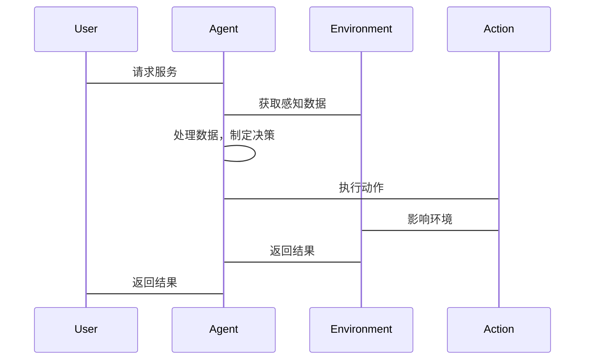

                 


# 构建AI Agent的技术栈选择指南

> 关键词：AI Agent，技术栈选择，算法原理，系统架构设计，项目实战，最佳实践

> 摘要：本文旨在为读者提供一份全面的指南，帮助他们在构建AI Agent时选择合适的技术栈。文章从AI Agent的基本概念出发，逐步深入探讨其核心原理、算法模型、系统架构设计以及实际项目中的技术选型和实现。通过详细的分析和具体的案例，本文为读者提供了从理论到实践的完整视角，帮助他们在实际项目中做出明智的技术决策。

---

## 第1章: AI Agent概述

### 1.1 AI Agent的基本概念

#### 1.1.1 AI Agent的定义
AI Agent（人工智能代理）是指能够感知环境、自主决策并执行任务的智能实体。它可以是一个软件程序、机器人或其他智能系统，旨在通过与环境交互来实现特定目标。

#### 1.1.2 AI Agent的核心特点
- **自主性**：能够在没有外部干预的情况下运行。
- **反应性**：能够实时感知环境并做出响应。
- **目标导向性**：所有行为都以实现特定目标为导向。
- **学习能力**：能够通过经验改进性能。

#### 1.1.3 AI Agent的分类与应用场景
AI Agent可以分为以下几类：
1. **简单反射型代理**：基于当前感知做出反应，不依赖历史信息。
2. **基于模型的反射型代理**：利用内部模型进行决策。
3. **目标驱动型代理**：通过优化目标函数来实现目标。
4. **实用驱动型代理**：通过最大化效用函数来优化行为。

应用场景包括：
- 自动化交易
- 智能助手（如Siri、Alexa）
- 游戏AI
- 自动驾驶

---

### 1.2 AI Agent的背景与现状

#### 1.2.1 AI Agent的发展历程
AI Agent的概念起源于人工智能领域的研究，经历了从简单规则驱动到复杂学习驱动的演变。近年来，随着深度学习和强化学习的快速发展，AI Agent的能力得到了显著提升。

#### 1.2.2 当前AI Agent的主要技术趋势
- **深度学习的普及**：利用神经网络进行感知和决策。
- **强化学习的应用**：通过试错优化行为策略。
- **多智能体协作**：多个AI Agent协同完成复杂任务。

#### 1.2.3 AI Agent在企业中的应用现状
AI Agent已经在金融、医疗、教育、物流等领域得到了广泛应用。例如，在金融领域，AI Agent可以用于自动交易和风险控制。

---

### 1.3 本章小结
本章介绍了AI Agent的基本概念、核心特点和分类，并探讨了其在实际场景中的应用。通过这些内容，读者可以对AI Agent有一个全面的了解。

---

## 第2章: AI Agent技术栈选择的核心概念与联系

### 2.1 核心概念与原理

#### 2.1.1 AI Agent的组成结构
AI Agent通常由感知层、决策层和执行层组成：
- **感知层**：负责感知环境信息。
- **决策层**：基于感知信息做出决策。
- **执行层**：执行决策并返回结果。

#### 2.1.2 AI Agent的执行流程
1. 感知环境：通过传感器或API获取输入数据。
2. 分析数据：对输入数据进行处理和分析。
3. 制定决策：基于分析结果制定行动计划。
4. 执行行动：通过执行器或API实现行动。
5. 反馈结果：将结果反馈到系统或用户。

#### 2.1.3 AI Agent与相关技术的对比分析
- **与传统AI的区别**：AI Agent具有自主性和目标导向性，而传统AI通常是静态的。
- **与机器学习模型的关系**：AI Agent可以基于机器学习模型进行决策，但AI Agent还涉及行为规划和执行。

---

### 2.2 核心概念对比表

| 比较项             | AI Agent                          | 传统AI                     |
|--------------------|-----------------------------------|---------------------------|
| 自主性             | 高                               | 低                         |
| 目标导向性         | 高                               | 低                         |
| 适应性             | 高                               | 低                         |
| 应用场景           | 自动化交易、智能助手             | 数据分析、模式识别         |

---

### 2.3 ER实体关系图

```mermaid
er
  actor: 用户
  agent: AI Agent
  environment: 环境
  action: 行动
  perception: 感知

  actor --> agent: 请求服务
  environment --> agent: 提供感知数据
  agent --> action: 执行行动
  action --> environment: 影响环境
  agent --> perception: 处理感知数据
```

---

### 2.4 本章小结
本章通过分析AI Agent的核心概念，明确了其组成结构和执行流程，并通过对比分析和ER图帮助读者理解AI Agent与其他技术的区别和联系。

---

## 第3章: AI Agent的算法原理与数学模型

### 3.1 算法原理

#### 3.1.1 AI Agent的核心算法
AI Agent的核心算法包括：
- **强化学习算法**：如Q-learning、Deep Q-Network（DQN）。
- **监督学习算法**：如随机森林、支持向量机（SVM）。
- **无监督学习算法**：如聚类分析。

#### 3.1.2 算法的数学模型
以强化学习中的Q-learning为例，其数学模型如下：

状态值函数：
$$ Q(s, a) = r + \gamma \max Q(s', a') $$

其中：
- \( s \) 是当前状态
- \( a \) 是当前动作
- \( r \) 是奖励
- \( \gamma \) 是折扣因子
- \( s' \) 是下一个状态
- \( a' \) 是下一个动作

#### 3.1.3 算法的实现步骤
1. 初始化Q表。
2. 与环境交互，获取状态和奖励。
3. 更新Q值：$$ Q(s, a) = Q(s, a) + \alpha (r + \gamma \max Q(s', a') - Q(s, a)) $$
4. 重复步骤2和3，直到收敛。

---

### 3.2 算法流程图



---

### 3.3 数学模型与公式

#### 3.3.1 算法的核心公式
强化学习中的Q-learning算法使用以下公式更新Q值：
$$ Q(s, a) = Q(s, a) + \alpha (r + \gamma \max Q(s', a') - Q(s, a)) $$

其中：
- \( \alpha \) 是学习率
- \( \gamma \) 是折扣因子

#### 3.3.2 公式的详细推导
假设当前状态为 \( s \)，采取动作 \( a \)，得到奖励 \( r \)，进入状态 \( s' \)。根据Q-learning算法，Q值的更新公式为：
$$ Q(s, a) = Q(s, a) + \alpha (r + \gamma \max Q(s', a') - Q(s, a)) $$

---

### 3.4 本章小结
本章详细介绍了AI Agent的核心算法及其数学模型，通过Q-learning算法的示例，帮助读者理解强化学习的基本原理和实现步骤。

---

## 第4章: AI Agent的系统分析与架构设计

### 4.1 问题场景介绍

#### 4.1.1 问题背景
假设我们正在开发一个智能助手AI Agent，用于处理用户的自然语言查询。

#### 4.1.2 问题目标
AI Agent需要能够理解用户的查询，并提供准确的回答或执行相应的操作。

#### 4.1.3 问题约束
- 响应时间不超过2秒
- 支持多种语言
- 支持上下文对话

---

### 4.2 系统功能设计

#### 4.2.1 领域模型的Mermaid类图



---

### 4.3 系统架构设计

#### 4.3.1 系统架构的Mermaid架构图


---

### 4.4 系统接口设计

#### 4.4.1 接口的功能描述
- `get_perception()`：获取环境中的感知数据。
- `execute_action(action)`：执行指定动作。

#### 4.4.2 接口的交互流程
1. 用户发送查询请求。
2. AI Agent通过`get_perception()`获取环境数据。
3. AI Agent根据数据做出决策。
4. AI Agent通过`execute_action()`执行动作。

---

### 4.5 系统交互设计

#### 4.5.1 系统交互的Mermaid序列图



---

### 4.6 本章小结
本章通过实际问题场景的分析，设计了AI Agent的系统架构，并通过类图、架构图和序列图详细描述了系统的功能模块和交互流程。

---

## 第5章: AI Agent的项目实战

### 5.1 环境安装

#### 5.1.1 安装Python
```bash
python --version
pip install --upgrade pip
```

#### 5.1.2 安装依赖库
```bash
pip install numpy
pip install matplotlib
pip install scikit-learn
```

---

### 5.2 系统核心实现源代码

#### 5.2.1 Q-learning算法实现
```python
import numpy as np

class QLearning:
    def __init__(self, state_space, action_space, gamma=0.9, alpha=0.1):
        self.gamma = gamma
        self.alpha = alpha
        self.Q = np.zeros((state_space, action_space))

    def update(self, state, action, reward, next_state):
        self.Q[state, action] += self.alpha * (reward + self.gamma * np.max(self.Q[next_state]) - self.Q[state, action])

    def get_action(self, state, epsilon=0.1):
        if np.random.random() < epsilon:
            return np.random.randint(0, self.Q.shape[1])
        else:
            return np.argmax(self.Q[state])
```

---

### 5.3 代码应用解读与分析

#### 5.3.1 代码功能分析
- `QLearning`类实现了Q-learning算法，用于更新Q表并选择动作。

#### 5.3.2 代码实现流程
1. 初始化Q表。
2. 与环境交互，获取状态和奖励。
3. 更新Q值。
4. 根据Q值选择动作。

---

### 5.4 实际案例分析

#### 5.4.1 案例背景
假设我们正在训练一个AI Agent在迷宫中寻找出口。

#### 5.4.2 代码实现
```python
agent = QLearning(state_space=10, action_space=4)
for _ in range(1000):
    state = get_current_state()
    action = agent.get_action(state)
    next_state, reward = step(action)
    agent.update(state, action, reward, next_state)
```

---

### 5.5 本章小结
本章通过实际项目案例，详细讲解了AI Agent的实现过程，包括环境安装、代码实现和案例分析。

---

## 第6章: 最佳实践与注意事项

### 6.1 最佳实践 tips

#### 6.1.1 技术选型建议
- 根据任务需求选择合适的算法和框架。
- 优先选择开源且社区活跃的框架。

#### 6.1.2 开发规范建议
- 保持代码的可读性和可维护性。
- 使用版本控制工具管理代码。

#### 6.1.3 测试与优化建议
- 定期进行单元测试和集成测试。
- 使用监控工具实时跟踪性能。

---

### 6.2 小结
通过本文的指导，读者可以系统地选择和实现AI Agent的技术栈，并在实际项目中取得更好的效果。

---

## 第7章: 拓展阅读

### 7.1 相关书籍推荐

#### 7.1.1 《Deep Learning》
作者：Ian Goodfellow, Yoshua Bengio, Aaron Courville

#### 7.1.2 《Reinforcement Learning: Theory and Algorithms》
作者：Sutton, Richard S., 和 Barto, Andrew G.

### 7.2 在线资源推荐
- [OpenAI官方文档](https://openai.com/)
- [Keras官方文档](https://keras.io/)

---

## 第8章: 结语

通过本文的系统讲解，读者可以全面了解AI Agent的技术栈选择，并在实际项目中应用这些知识。希望本文能为读者提供有价值的参考。

---

## 附录: 更多资源

### 附录A: AI Agent相关工具
- **TensorFlow**：Google的深度学习框架。
- **Keras**：基于TensorFlow的高级API。
- **OpenAI Gym**：强化学习的开源工具包。

### 附录B: 术语表
- **Q-learning**：一种强化学习算法，用于学习最优策略。

---

以上是《构建AI Agent的技术栈选择指南》的完整目录和内容概要。

