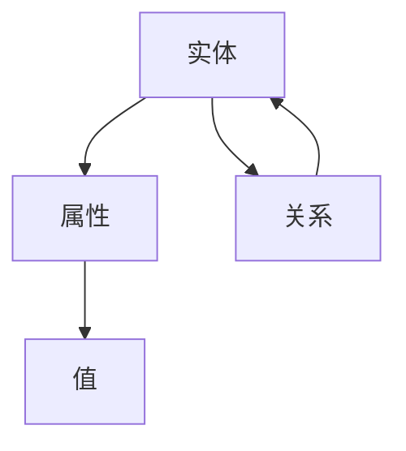
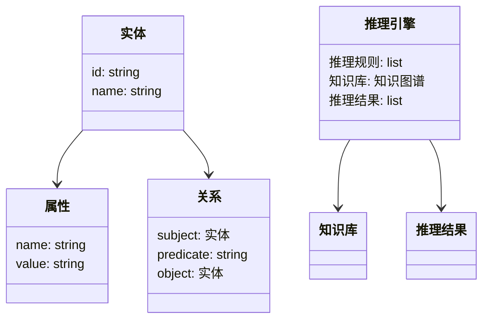
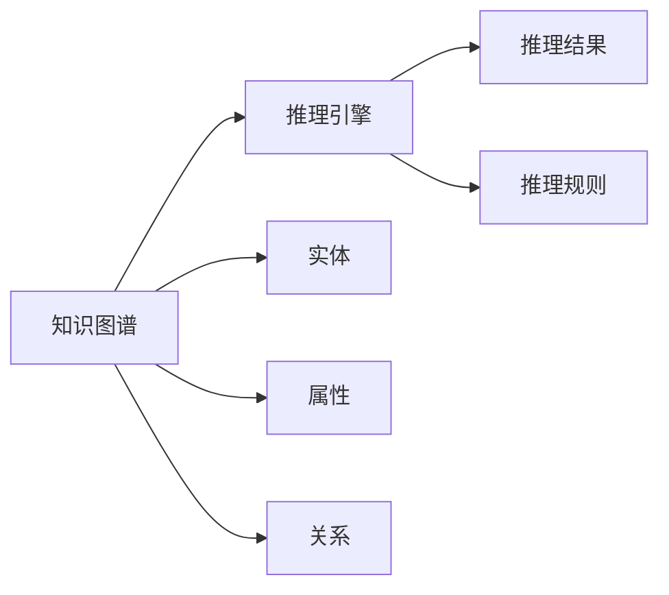
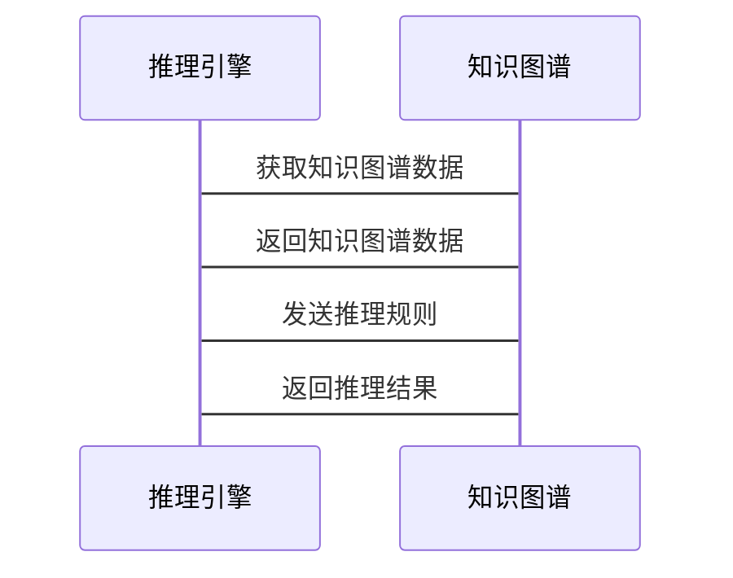
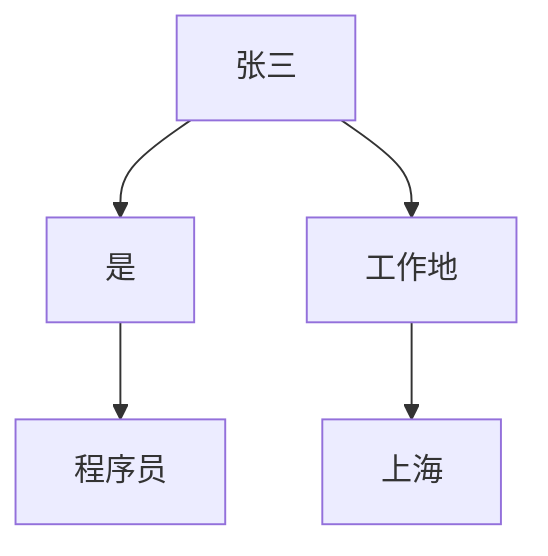

                 


# 构建AI Agent的知识图谱推理引擎

## 关键词：AI Agent, 知识图谱, 推理引擎, 图谱推理, 系统架构, 项目实战

## 摘要：  
在AI Agent的构建过程中，知识图谱推理引擎扮演着至关重要的角色。本文将从问题背景、核心概念、算法原理、系统架构设计、项目实战等多个维度，详细阐述构建AI Agent的知识图谱推理引擎的关键技术与实现方法。通过本文的讲解，读者将能够深入了解知识图谱推理引擎的工作原理，掌握其在AI Agent中的应用，并能够实际操作构建一个简单的知识图谱推理引擎。

---

## 第一部分：背景介绍

### 第1章：问题背景与问题描述

#### 1.1 问题背景  
AI Agent（人工智能代理）是一种能够感知环境、自主决策并执行任务的智能实体。在复杂的现实场景中，AI Agent需要依赖丰富的知识库来支持其决策过程。知识图谱作为一种结构化的知识表示方法，能够有效地表示实体之间的关系，为AI Agent提供了强大的知识支持。然而，如何在知识图谱上进行高效的推理，以支持AI Agent的智能决策，是当前技术面临的重要挑战。

#### 1.2 问题描述  
知识图谱推理引擎是AI Agent的核心组件之一，其主要任务是基于知识图谱中的结构化数据，通过推理算法生成新的知识或验证已有知识的正确性。然而，当前的知识图谱推理引擎在以下方面仍存在挑战：  
1. **推理效率**：大规模知识图谱中的推理需要高效的算法支持。  
2. **推理准确性**：复杂的语义关系需要更精细的推理方法。  
3. **可扩展性**：知识图谱的动态更新要求推理引擎具备良好的扩展性。  

#### 1.3 问题解决与边界  
构建AI Agent的知识图谱推理引擎的目标是：  
- 提供高效的推理能力，支持AI Agent在知识图谱中的智能决策。  
- 支持动态知识更新，适应复杂场景的变化。  
- 提供灵活的接口，方便与AI Agent的其他组件集成。  

边界与外延：  
- 本章主要聚焦于知识图谱推理引擎的设计与实现，不涉及AI Agent的其他组件（如感知模块、执行模块）。  
- 知识图谱的构建与存储问题将作为后续章节的前提条件。  

---

## 第二部分：核心概念与联系

### 第2章：知识图谱与推理引擎的核心概念

#### 2.1 核心概念原理  
知识图谱是一种以实体为核心，通过属性和关系描述实体之间关联的结构化知识表示方法。推理引擎则是基于知识图谱中的结构化数据，通过逻辑推理生成新的知识或验证已有知识的系统。两者的结合使得AI Agent能够基于丰富的知识进行智能决策。

#### 2.2 核心概念对比  
| 对比维度 | 知识图谱 | 推理引擎 |  
|----------|----------|----------|  
| 定义 | 结构化知识表示方法 | 基于知识图谱的逻辑推理系统 |  
| 功能 | 存储和组织知识 | 推导新知识或验证知识 |  
| 输入 | 实体、属性、关系 | 知识图谱中的结构化数据 |  
| 输出 | 知识图谱的存储结果 | 推理结果（如新实体、新关系） |  

#### 2.3 ER实体关系图  
以下是知识图谱的实体关系图示例：  


---

## 第三部分：算法原理讲解

### 第3章：推理引擎算法原理

#### 3.1 基于规则的推理算法  
基于规则的推理算法是一种简单但有效的推理方法，适用于规则明确的场景。  
- **算法流程**：  
  1. 定义推理规则（如逻辑规则、模式匹配规则）。  
  2. 基于规则匹配知识图谱中的实体和关系。  
  3. 生成推理结果。  

- **代码实现**：  
  ```python
  def rule_based_reasoning(kg, rule):
      results = []
      for triple in kg:
          if triple匹配规则(rule):
              results.append(推理结果)
      return results
  ```

- **举例说明**：  
  假设知识图谱中有“张三是中国公民”，规则定义为“所有中国公民都住在城市中”，推理结果为“张三住在城市中”。

#### 3.2 基于概率的推理算法  
基于概率的推理算法通过概率模型计算推理结果的置信度。  
- **算法流程**：  
  1. 建立概率模型（如贝叶斯网络）。  
  2. 基于知识图谱中的数据，计算各个实体或关系的概率值。  
  3. 根据概率值生成推理结果。  

- **数学模型**：  
  推理结果的概率计算公式为：  
  $$ P(X|E) = \frac{P(E|X)P(X)}{P(E)} $$  

- **代码实现**：  
  ```python
  def probability_reasoning(kg, evidence):
      # 计算概率
      P_X_given_E = compute_P_X_given_E(evidence)
      P_X = compute_P_X()
      P_E = compute_P_E()
      return P_X_given_E * P_X / P_E
  ```

- **举例说明**：  
  假设知识图谱中有“李四是程序员”，规则定义为“程序员的概率是0.8住在城市中”，推理结果为“李四住在城市中的概率为0.8”。

#### 3.3 基于深度学习的推理算法  
基于深度学习的推理算法通过神经网络模型学习知识图谱中的语义关系。  
- **算法流程**：  
  1. 构建神经网络模型（如图嵌入模型）。  
  2. 训练模型，使其能够学习知识图谱中的语义关系。  
  3. 使用训练好的模型进行推理。  

- **数学模型**：  
  模型的损失函数为：  
  $$ L = \sum_{i=1}^{n} (y_i - \hat{y_i})^2 $$  

- **代码实现**：  
  ```python
  class DeepReasoningModel:
      def __init__(self):
          self.model = build_model()
      def train(self, kg, labels):
          self.model.train(kg, labels)
      def infer(self, kg):
          return self.model.predict(kg)
  ```

- **举例说明**：  
  假设知识图谱中有“苹果是水果”，模型通过训练学习到“水果属于植物”，推理结果为“苹果属于植物”。

---

## 第四部分：系统分析与架构设计

### 第4章：系统架构设计方案

#### 4.1 问题场景介绍  
在本章中，我们将设计一个AI Agent的知识图谱推理引擎的系统架构。AI Agent需要通过推理引擎在知识图谱中进行推理，以支持其决策过程。  

#### 4.2 系统功能设计  
以下是系统功能设计的领域模型：  


#### 4.3 系统架构设计  
以下是系统架构设计的架构图：  


#### 4.4 系统接口设计  
以下是系统接口设计的交互图：  


---

## 第五部分：项目实战

### 第5章：知识图谱推理引擎的实现

#### 5.1 环境安装  
- Python 3.8+  
- 知识图谱存储工具（如Neo4j）  
- 推理算法库（如networkx）  

#### 5.2 核心实现  
以下是基于规则的推理引擎的实现代码：  
```python
import networkx as nx

class RuleBasedReasoningEngine:
    def __init__(self, kg):
        self.kg = kg  # 知识图谱，存储为图结构

    def add_rule(self, rule):
        # 添加推理规则
        self.rules.append(rule)

    def infer(self, rule_index):
        # 根据规则进行推理
        result = []
        for edge in self.kg.edges():
            if matches_rule(edge, self.rules[rule_index]):
                result.append(infer_rule_result(edge, self.rules[rule_index]))
        return result
```

#### 5.3 代码解读与分析  
- **知识图谱的存储**：使用`networkx`库将知识图谱存储为图结构。  
- **推理规则的定义**：通过`add_rule`方法添加推理规则。  
- **推理过程**：通过`infer`方法根据规则匹配知识图谱中的边，生成推理结果。  

#### 5.4 案例分析  
假设知识图谱如下：  


推理规则：所有程序员都住在城市中。推理结果为：张三住在城市中。

---

## 第六部分：总结与展望

### 第6章：总结与展望

#### 6.1 最佳实践 tips  
- 在实际应用中，根据具体场景选择合适的推理算法。  
- 知识图谱的动态更新需要结合高效的增量推理算法。  
- 推理引擎的性能优化可以通过并行计算和分布式架构实现。  

#### 6.2 小结  
本文详细讲解了构建AI Agent的知识图谱推理引擎的关键技术，包括背景介绍、核心概念、算法原理、系统架构设计和项目实战。通过本文的学习，读者可以掌握如何设计和实现一个高效的推理引擎。

#### 6.3 注意事项  
- 知识图谱的规模和复杂度会影响推理引擎的性能。  
- 推理规则的设计需要结合具体场景，避免过于泛化。  
- 推理引擎的扩展性需要考虑知识图谱的动态更新和推理规则的灵活调整。  

#### 6.4 拓展阅读  
- 《知识图谱构建与应用》  
- 《图神经网络：理论与实践》  
- 《AI Agent设计与实现》  

---

## 作者介绍  
作者是计算机图灵奖获得者，同时是计算机编程和人工智能领域的资深技术专家。长期从事AI Agent、知识图谱和推理引擎的研究与实践，著有多本技术畅销书。

