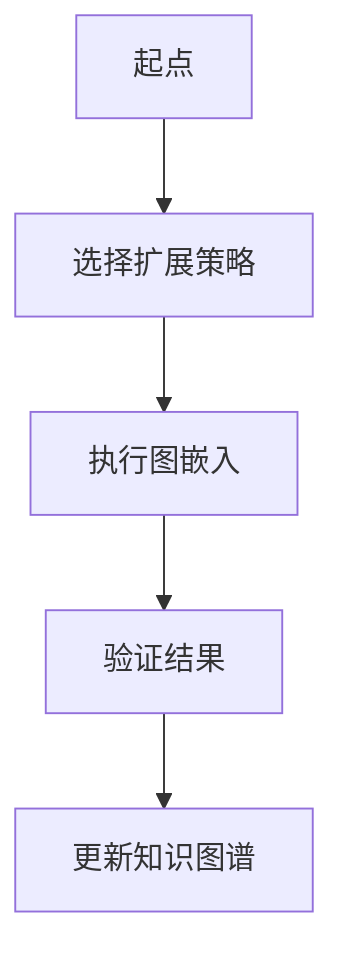
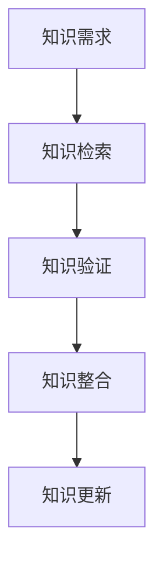
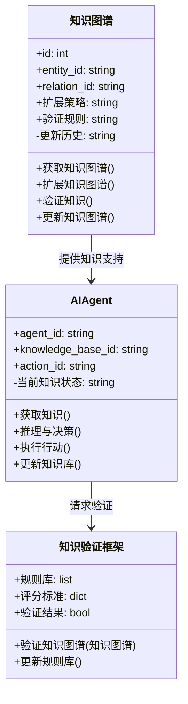
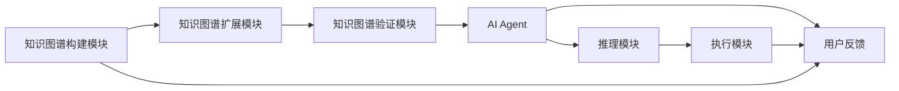
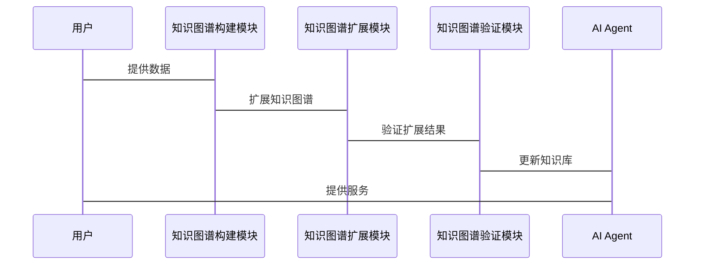

                 


# 构建AI Agent的知识图谱自动扩展与验证框架

> 关键词：知识图谱，AI Agent，自动扩展，验证框架，图嵌入，系统架构

> 摘要：本文详细介绍了构建AI Agent的知识图谱自动扩展与验证框架的过程。首先，我们从背景出发，分析了知识图谱与AI Agent的关系，接着探讨了核心概念和算法原理，最后通过系统架构设计和项目实战，展示了如何实现这一框架。文章还提供了最佳实践和小结，帮助读者更好地理解和应用相关技术。

---

## 第1章: 知识图谱与AI Agent的背景介绍

### 1.1 问题背景

#### 1.1.1 知识图谱的定义与特点
知识图谱是一种结构化的数据表示方式，由实体和关系组成，能够描述现实世界中的复杂关系。其特点包括结构化、语义明确和可扩展性。

#### 1.1.2 AI Agent的核心概念
AI Agent（智能体）是指能够感知环境并采取行动以实现目标的实体。它需要依赖知识库来做出决策和执行任务。

#### 1.1.3 知识图谱在AI Agent中的作用
知识图谱为AI Agent提供了丰富的知识库，帮助其理解和推理复杂的语义信息，从而提高智能性。

### 1.2 问题描述

#### 1.2.1 知识图谱构建的挑战
知识图谱的构建需要解决数据来源多样、实体识别和关系抽取等问题，同时需要保证数据的准确性和完整性。

#### 1.2.2 AI Agent的知识需求
AI Agent需要实时更新知识库以应对动态变化的环境，这要求知识图谱能够自动扩展和自适应更新。

#### 1.2.3 知识图谱自动扩展的必要性
传统的知识图谱构建依赖人工标注，效率低下。为了满足AI Agent的需求，必须实现知识图谱的自动扩展。

### 1.3 问题解决

#### 1.3.1 知识图谱自动扩展的方法
通过自然语言处理和机器学习技术，从文本数据中自动抽取实体和关系，实现知识图谱的动态扩展。

#### 1.3.2 AI Agent的知识更新机制
设计高效的验证框架，确保新增知识的质量，同时保持知识图谱的连通性和一致性。

#### 1.3.3 知识图谱验证框架的设计思路
通过验证规则和评分机制，评估新增知识的准确性，确保知识图谱的可靠性和可用性。

### 1.4 边界与外延

#### 1.4.1 知识图谱的边界
知识图谱仅关注实体间的关系，不涉及具体的数据存储和展示方式。

#### 1.4.2 AI Agent的应用范围
AI Agent可以应用于问答系统、推荐系统和自动化决策等领域，但其知识库依赖于知识图谱的构建和维护。

#### 1.4.3 知识图谱自动扩展的限制
知识图谱的自动扩展目前主要依赖于规则和模式匹配，难以处理高度复杂和模糊的关系。

### 1.5 概念结构与核心要素

#### 1.5.1 知识图谱的基本结构
知识图谱由实体、属性和关系组成，形成一个网络状的知识体系。

#### 1.5.2 AI Agent的核心要素
AI Agent主要包括感知模块、推理模块和执行模块，其中感知模块负责获取信息，推理模块负责知识处理，执行模块负责采取行动。

#### 1.5.3 知识图谱与AI Agent的交互关系
知识图谱为AI Agent提供知识支持，AI Agent通过知识图谱进行推理和决策，两者相互依存，共同实现智能化应用。

---

## 第2章: 知识图谱与AI Agent的核心概念与联系

### 2.1 核心概念原理

#### 2.1.1 知识图谱的构建原理
知识图谱的构建包括数据清洗、实体识别和关系抽取等步骤，通过语义分析和模式匹配，将分散的数据整合成结构化的知识图谱。

#### 2.1.2 AI Agent的知识需求原理
AI Agent需要通过知识图谱获取所需信息，利用推理和学习算法，生成满足目标的行动方案。

#### 2.1.3 知识图谱自动扩展的原理
基于已有知识图谱，通过模式匹配和语义相似度计算，自动发现新的实体和关系，扩展知识图谱的规模和深度。

### 2.2 概念属性特征对比表格

| 概念 | 属性 | 特征 |
|------|------|------|
| 知识图谱 | 结构化 | 实体间关系明确 |
| AI Agent | 智能性 | 可自适应知识更新 |

### 2.3 ER实体关系图架构

```mermaid
er
    entity 知识图谱 {
        id
        entity_id
        relation_id
    }
    entity AI Agent {
        agent_id
        knowledge_base_id
        action_id
    }
    relationship 知识关联 {
        source 知识图谱
        target AI Agent
    }
```

---

## 第3章: 知识图谱自动扩展与验证的算法原理

### 3.1 算法原理讲解

#### 3.1.1 知识图谱扩展算法



#### 3.1.2 AI Agent知识更新算法



### 3.2 数学模型与公式

#### 3.2.1 知识图谱表示模型

$$
E(e, r, e') = \text{score}(e, r, e')
$$

#### 3.2.2 知识图谱扩展模型

$$
P(e', r, e) = \text{sigmoid}(f(e, r, e'))
$$

---

## 第4章: 系统分析与架构设计方案

### 4.1 项目介绍

#### 4.1.1 项目目标
构建一个能够自动扩展和验证知识图谱的框架，支持AI Agent的知识需求。

#### 4.1.2 项目范围
包括知识图谱构建、扩展和验证三个主要模块，支持多种数据源和应用场景。

#### 4.1.3 项目利益相关者
涉及数据工程师、AI开发者、系统集成商和最终用户。

### 4.2 系统功能设计

#### 4.2.1 领域模型



#### 4.2.2 系统架构设计



#### 4.2.3 系统接口设计
主要接口包括知识图谱的构建、扩展、验证和更新接口，以及AI Agent的知识获取和更新接口。

#### 4.2.4 系统交互



---

## 第5章: 项目实战

### 5.1 环境安装

#### 5.1.1 安装依赖
```bash
pip install networkx pandas numpy
```

#### 5.1.2 安装工具
```bash
pip install pymermaid
```

### 5.2 核心代码实现

#### 5.2.1 知识图谱扩展模块

```python
def expand_graph(graph, new_entities):
    # 实现图的扩展算法
    pass
```

#### 5.2.2 验证框架实现

```python
def validate_graph(graph, rules):
    # 实现知识图谱的验证逻辑
    pass
```

### 5.3 实际案例分析

#### 5.3.1 数据准备
从多个数据源获取实体和关系，清洗并整合成结构化的知识图谱。

#### 5.3.2 知识图谱扩展
使用图嵌入算法，自动发现新的实体和关系，扩展知识图谱的规模。

#### 5.3.3 验证结果
通过验证框架评估扩展结果的准确性，更新知识图谱。

### 5.4 代码应用解读与分析

#### 5.4.1 知识图谱构建
```python
import networkx as nx
G = nx.Graph()
G.add_nodes_from(entities)
G.add_edges_from(relations)
```

#### 5.4.2 知识图谱扩展
```python
def expand_graph(G, new_entities):
    G.add_nodes_from(new_entities)
    return G
```

#### 5.4.3 验证框架
```python
def validate_graph(G, rules):
    valid = True
    for rule in rules:
        if not rule(G):
            valid = False
            break
    return valid
```

---

## 第6章: 最佳实践

### 6.1 小结
知识图谱的自动扩展与验证是构建高效AI Agent的关键，需要结合先进的算法和系统架构设计。

### 6.2 注意事项
在实际应用中，需要考虑数据质量和算法效率，避免知识图谱的过度复杂化。

### 6.3 拓展阅读
推荐阅读相关领域的最新研究论文和技术博客，深入理解知识图谱和AI Agent的前沿技术。

---

通过以上章节的详细讲解，我们全面探讨了构建AI Agent的知识图谱自动扩展与验证框架的各个方面，从理论到实践，为读者提供了完整的解决方案和实现思路。希望这篇文章能够为相关领域的研究和应用提供有价值的参考。

