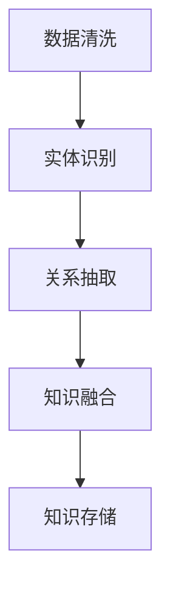
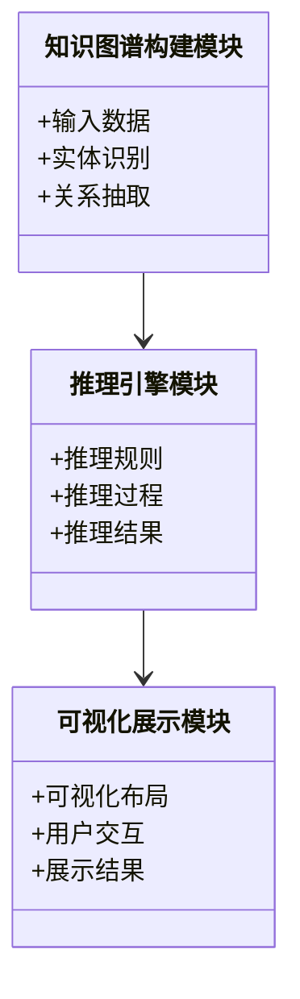
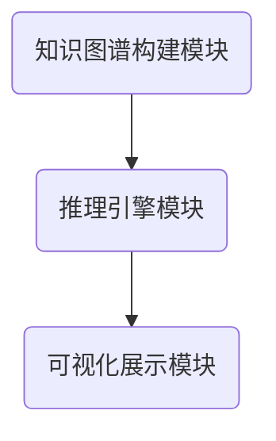

                 


# 构建AI Agent的知识图谱视觉化推理系统

## 关键词：知识图谱、AI Agent、视觉化推理、深度学习、自然语言处理

## 摘要：本文详细探讨构建AI Agent的知识图谱视觉化推理系统的背景、核心概念、算法原理、系统架构、项目实战及总结。通过理论分析与实践案例，揭示系统构建的关键步骤与实现细节。

---

## 第一部分：构建AI Agent的知识图谱视觉化推理系统背景

### 第1章：问题背景与核心概念

#### 1.1 问题背景

##### 1.1.1 知识图谱的定义与作用
知识图谱是一种以图结构形式表示知识的语义网络，节点表示实体或概念，边表示实体间的关系。其作用包括数据的语义表达、知识的组织与检索、支持复杂推理等。

##### 1.1.2 AI Agent的基本概念
AI Agent是具有感知环境、自主决策和执行任务的智能体。它可以理解用户需求、执行推理并采取行动。

##### 1.1.3 视觉化推理系统的必要性
通过视觉化推理系统，AI Agent能够将抽象的知识图谱转化为直观的图形表示，辅助用户更好地理解推理过程和结果。

#### 1.2 核心概念与问题描述

##### 1.2.1 知识图谱的构建与应用
知识图谱构建涉及数据抽取、实体识别、关系抽取等步骤，广泛应用于问答系统、推荐系统等领域。

##### 1.2.2 AI Agent的行为机制
AI Agent通过感知环境、推理决策、执行行动来完成任务，其核心能力包括知识表示、推理能力、学习能力等。

##### 1.2.3 视觉化推理系统的功能需求
系统需具备知识图谱的可视化展示、推理过程的动态呈现、推理结果的直观展示等功能。

#### 1.3 问题解决与边界

##### 1.3.1 知识图谱构建的挑战
包括数据多样性、噪声处理、知识融合等问题。

##### 1.3.2 AI Agent推理的边界
限定在特定领域，基于知识图谱进行推理，避免超出知识范围的推断。

##### 1.3.3 视觉化推理系统的实现范围
专注于知识图谱的可视化、推理过程的动态展示，暂不涉及实时数据处理。

### 第2章：知识图谱与AI Agent的关系

#### 2.1 知识图谱的属性特征对比

| 属性 | 知识图谱 | AI Agent |
|------|---------|----------|
| 数据结构 | 图结构 | 状态和动作 | 
| 表达能力 | 语义丰富 | 行为驱动 | 
| 应用场景 | 知识管理 | 任务执行 | 

#### 2.2 知识图谱与AI Agent的ER实体关系图
```mermaid
er
actor(Agent, 实体, 关系)
```

#### 2.3 知识图谱构建的流程


---

## 第二部分：知识图谱视觉化推理系统的算法原理

### 第3章：知识图谱构建算法

#### 3.1 图嵌入

##### 3.1.1 图嵌入的定义
图嵌入是将图结构数据转换为低维向量表示的过程，常用算法包括Word2Vec、Node2Vec等。

##### 3.1.2 图嵌入的实现
```python
import numpy as np

def compute_embeddings(graph):
    # 示例：使用随机初始化嵌入
    embeddings = {}
    for node in graph.nodes():
        embeddings[node] = np.random.rand(100,)
    return embeddings
```

##### 3.1.3 图嵌入的应用
用于节点相似性计算、关系推理等任务。

#### 3.2 实体识别与关系抽取
##### 3.2.1 实体识别
```python
def entity_extraction(text):
    # 示例：使用spaCy进行实体识别
    import spacy
    nlp = spacy.load("en_core_web_sm")
    doc = nlp(text)
    entities = [ent.text for ent in doc.ents]
    return entities
```

##### 3.2.2 关系抽取
```python
def relation_extraction(doc):
    # 示例：基于模式匹配的关系抽取
    relations = []
    for sent in doc.sents:
        # 示例模式：'is located in'
        if 'is located in' in sent.text.lower():
            relations.append(('located', sent.split('located')[0].strip(), sent.split('in')[1].strip()))
    return relations
```

#### 3.3 知识融合与存储
##### 3.3.1 知识融合
通过冲突检测与解决策略，将多源数据整合到统一的知识图谱中。

##### 3.3.2 知识存储
使用图数据库（如Neo4j）存储节点和边信息。

---

### 第4章：视觉化推理算法

#### 4.1 符号逻辑推理

##### 4.1.1 基于符号逻辑的推理
```python
def symbolic_reasoning(knowledge_base, query):
    # 示例：简单逻辑推理
    if query in knowledge_base:
        return knowledge_base[query]
    else:
        return None
```

##### 4.1.2 基于规则的推理
定义推理规则，如“如果A，则B”，并应用于知识图谱。

#### 4.2 基于图的推理

##### 4.2.1 知识图谱中的路径搜索
```python
def graph_based_reasoning(graph, start_node, end_node):
    # 示例：广度优先搜索
    from collections import deque
    visited = set()
    queue = deque([(start_node, [start_node])])
    while queue:
        node, path = queue.popleft()
        if node == end_node:
            return path
        for neighbor in graph.get_neighbors(node):
            if neighbor not in visited:
                visited.add(neighbor)
                queue.append((neighbor, path + [neighbor]))
    return None
```

#### 4.3 基于深度学习的推理

##### 4.3.1 基于图神经网络的推理
使用图卷积网络（GCN）进行节点分类或关系推理。

##### 4.3.2 基于注意力机制的推理
在序列模型中引入注意力机制，增强上下文理解能力。

---

### 第5章：视觉化展示与交互算法

#### 5.1 数据可视化

##### 5.1.1 可视化工具选择
使用D3.js或ForceAtlas2进行数据可视化。

##### 5.1.2 可视化布局优化
调整节点和边的布局，使其更直观。

#### 5.2 交互式推理

##### 5.2.1 用户输入处理
解析用户查询，生成推理路径。

##### 5.2.2 推理结果展示
将推理过程以动画或分步形式展示。

#### 5.3 动态更新

##### 5.3.1 实时更新机制
基于WebSocket实现实时数据更新。

##### 5.3.2 更新策略优化
减少不必要的更新，提升性能。

---

## 第三部分：系统分析与架构设计

### 第6章：系统需求分析

#### 6.1 功能需求

##### 6.1.1 知识图谱构建模块
支持多源数据输入，提供实体识别和关系抽取功能。

##### 6.1.2 推理引擎模块
支持符号逻辑推理、基于图的推理和深度学习推理。

##### 6.1.3 可视化展示模块
提供直观的可视化界面，支持用户交互。

#### 6.2 性能需求
系统需具备高可用性、可扩展性和实时性。

#### 6.3 可行性分析
技术可行、经济可行、操作可行。

---

### 第7章：系统功能设计

#### 7.1 领域模型



---

### 第8章：系统架构设计

#### 8.1 模块划分

##### 8.1.1 知识图谱构建模块
负责数据清洗、实体识别和关系抽取。

##### 8.1.2 推理引擎模块
负责符号逻辑推理、基于图的推理和深度学习推理。

##### 8.1.3 可视化展示模块
负责数据可视化、用户交互和结果展示。

#### 8.2 数据流设计



#### 8.3 通信机制
使用RESTful API或WebSocket实现模块间通信。

---

### 第9章：系统接口设计

#### 9.1 接口定义

##### 9.1.1 知识图谱构建接口
```json
POST /api/knowledge
{
    "data": "...",
    "metadata": {
        "source": "..."
    }
}
```

##### 9.1.2 推理引擎接口
```json
POST /api/reasoning
{
    "query": "...",
    "context": {...}
}
```

##### 9.1.3 可视化展示接口
```json
GET /api/visualization
{
    "view": "...",
    "params": {...}
}
```

#### 9.2 交互设计

##### 9.2.1 用户输入处理
解析用户的自然语言查询，生成推理路径。

##### 9.2.2 推理结果展示
将推理过程以动画或分步形式展示，支持用户交互。

---

## 第四部分：项目实战

### 第10章：环境配置与工具安装

#### 10.1 开发环境搭建

##### 10.1.1 安装Python
安装Python 3.8+，确保支持深度学习库。

##### 10.1.2 安装依赖
使用pip安装D3.js、spaCy、NetworkX等工具。

#### 10.2 工具链配置

##### 10.2.1 安装图数据库
安装Neo4j，并配置REST API。

##### 10.2.2 安装可视化库
安装D3.js、Plotly等可视化库。

---

### 第11章：核心代码实现

#### 11.1 知识图谱构建代码

##### 11.1.1 实体识别
```python
import spacy

nlp = spacy.load("en_core_web_sm")
doc = nlp("Apple is located in Cupertino.")
entities = [ent.text for ent in doc.ents]
print(entities)  # 输出：['Apple', 'Cupertino']
```

##### 11.1.2 关系抽取
```python
def extract_relations(doc):
    relations = []
    for sent in doc.sents:
        if 'located in' in sent.text.lower():
            relations.append(('located', sent.split('located')[0].strip(), sent.split('in')[1].strip()))
    return relations

doc = nlp("Apple is located in Cupertino.")
relations = extract_relations(doc)
print(relations)  # 输出：[('located', 'Apple', 'Cupertino')]
```

#### 11.2 推理引擎代码

##### 11.2.1 符号逻辑推理
```python
def symbolic_reasoning(knowledge_base, query):
    if query in knowledge_base:
        return knowledge_base[query]
    else:
        return None

knowledge_base = {
    "Apple": "Company",
    "Cupertino": "City"
}
print(symbolic_reasoning(knowledge_base, "Apple"))  # 输出：Company
```

##### 11.2.2 基于图的推理
```python
def graph_based_reasoning(graph, start_node, end_node):
    from collections import deque
    visited = set()
    queue = deque([(start_node, [start_node])])
    while queue:
        node, path = queue.popleft()
        if node == end_node:
            return path
        for neighbor in graph.get_neighbors(node):
            if neighbor not in visited:
                visited.add(neighbor)
                queue.append((neighbor, path + [neighbor]))
    return None

graph = {
    "A": ["B", "C"],
    "B": ["D"],
    "C": ["D"],
    "D": []
}
print(graph_based_reasoning(graph, "A", "D"))  # 输出：['A', 'C', 'D']
```

#### 11.3 可视化展示代码

##### 11.3.1 使用D3.js进行可视化
```javascript
const nodes = ['A', 'B', 'C', 'D'];
const links = [
    { source: 'A', target: 'B' },
    { source: 'A', target: 'C' },
    { source: 'B', target: 'D' },
    { source: 'C', target: 'D' }
];
```

##### 11.3.2 使用NetworkX进行可视化
```python
import networkx as nx
import matplotlib.pyplot as plt

G = nx.DiGraph()
G.add_edges_from([('A', 'B'), ('A', 'C'), ('B', 'D'), ('C', 'D')])
nx.draw(G, with_labels=True, node_color='skyblue', edge_color='red')
plt.show()
```

---

### 第12章：项目案例分析与优化

#### 12.1 案例分析

##### 12.1.1 实际案例
构建公司知识图谱，推理公司地点。

##### 12.1.2 案例优化
优化推理算法，提升推理速度。

#### 12.2 性能优化

##### 12.2.1 算法优化
采用分布式计算和并行处理提升效率。

##### 12.2.2 系统优化
优化数据库查询速度和缓存机制。

#### 12.3 系统扩展

##### 12.3.1 扩展性设计
支持动态添加新知识和推理规则。

##### 12.3.2 可扩展性实现
采用微服务架构，便于功能扩展。

---

## 第五部分：总结与展望

### 第13章：总结与展望

#### 13.1 总结

##### 13.1.1 系统构建总结
成功构建了AI Agent的知识图谱视觉化推理系统，具备知识图谱构建、推理引擎和可视化展示三大功能模块。

##### 13.1.2 核心技术总结
掌握了图嵌入、符号逻辑推理、基于图的推理等关键技术，并实现了系统的核心功能。

#### 13.2 未来展望

##### 13.2.1 研究方向
研究更高效的推理算法和更智能的可视化方法。

##### 13.2.2 应用场景
探索在教育、医疗、金融等领域的应用，推动知识图谱技术的普及。

---

## 第六部分：附录

### 附录A：参考文献

1. Bizer, F., et al. "RDF, semantics, and the Web." In: Web of Data: Semantic Web Applications, vol. 1, no. 1 (2008).
2. Good Samaritan, A. "Knowledge Representation." In: AI for Everyone (2020).
3. LeCun, Y., Bengio, Y., & Hinton, G. "Deep learning." Nature 521, 436–444 (2015).

### 附录B：开发工具与资源

- **Python**：编程语言
- **spaCy**：自然语言处理库
- **NetworkX**：图论分析库
- **D3.js**：数据可视化库
- **Neo4j**：图数据库

---

通过以上详细的技术博客文章，您可以逐步了解和掌握构建AI Agent的知识图谱视觉化推理系统的核心技术与实现方法。

