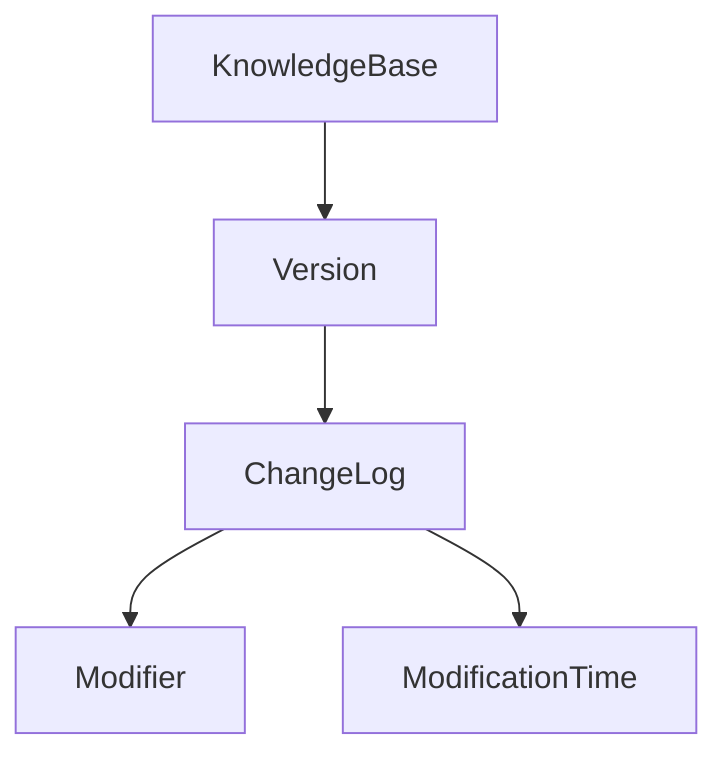
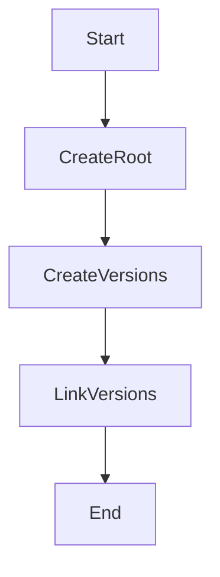
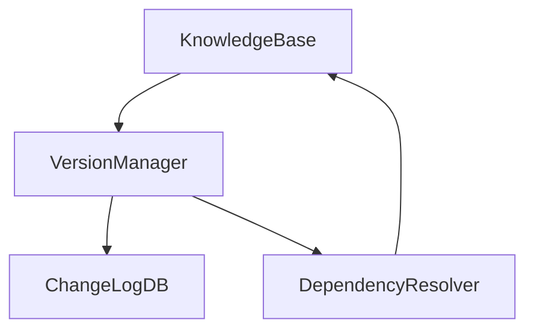
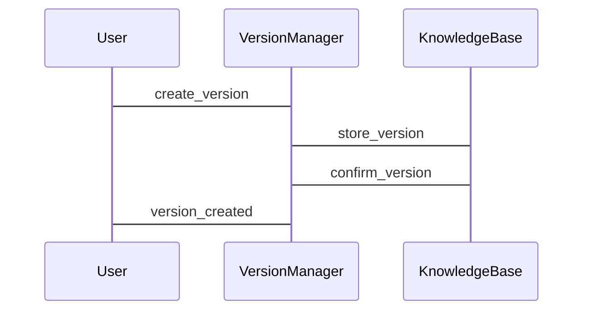

                 


# 构建AI Agent的知识库版本控制系统

> 关键词：AI Agent, 知识库, 版本控制, 系统架构, 算法原理

> 摘要：本文系统地探讨了构建AI Agent的知识库版本控制系统的必要性、核心概念、算法原理、系统架构设计以及实际项目实现。通过详细分析，提出了一个完整的解决方案，为AI Agent的知识库管理提供了理论和实践的指导。

---

## 第1章 问题背景与描述

### 1.1 问题背景

随着AI技术的快速发展，AI Agent（智能体）在各个领域的应用日益广泛。AI Agent依赖于知识库来处理和决策，知识库的准确性和完整性直接影响系统的性能。然而，知识库在更新和维护过程中，常常面临版本控制的挑战：

- **知识库的动态更新**：知识库需要定期更新以反映最新的数据和信息，这可能导致版本冲突。
- **数据的复杂性**：知识库中的数据可能涉及多个领域，结构复杂，难以统一管理。
- **版本依赖性**：不同版本的知识库可能被不同的AI Agent或应用场景使用，需要精确的版本控制。

### 1.2 问题描述

知识库版本控制的核心问题在于如何管理不同版本的知识库，确保在使用时能够准确地引用和回滚。具体问题包括：

- **版本记录与追踪**：如何记录每个版本的变更，并能够追踪到特定版本的来源。
- **版本冲突解决**：如何处理同一知识库在不同版本中的冲突。
- **版本依赖管理**：如何管理不同版本之间的依赖关系，确保系统的稳定性和一致性。

### 1.3 问题解决思路

知识库版本控制的实现需要遵循以下原则：

1. **唯一标识**：为每个知识库版本分配唯一的标识符，便于管理和引用。
2. **变更记录**：记录每个版本的变更内容，包括修改者、修改时间等。
3. **依赖管理**：明确每个版本之间的依赖关系，避免冲突。
4. **版本回滚**：支持从当前版本回滚到任意历史版本。

### 1.4 概念结构与核心要素

知识库版本控制系统的核心要素包括：

- **知识库**：存储AI Agent所需的数据和信息。
- **版本标识**：唯一标识每个版本的字符串或数字。
- **变更记录**：记录每个版本的修改日志。
- **依赖关系**：描述不同版本之间的依赖关系。
- **版本控制服务**：提供版本管理的接口和服务。

---

## 第2章 核心概念与联系

### 2.1 核心概念原理

知识库版本控制的原理可以类比于代码版本控制，但其复杂性更高。知识库中的数据可能包含结构化和非结构化的信息，这使得版本控制更加复杂。关键点包括：

- **版本树结构**：构建知识库的版本树，每个节点代表一个版本。
- **变更传播**：将变更从一个版本传播到其他版本。
- **依赖管理**：确保每个版本的依赖关系得到正确处理。

### 2.2 概念属性特征对比

以下是知识库版本控制与传统代码版本控制的对比：

| 对比维度         | 知识库版本控制          | 代码版本控制          |
|------------------|-----------------------|-----------------------|
| 数据类型         | 结构化和非结构化数据    | 代码文件             |
| 版本粒度         | 知识库整体或部分       | 单个文件             |
| 依赖关系         | 复杂，涉及多个模块      | 较简单               |
| 变更操作复杂度     | 高，涉及数据校验和迁移   | 较低                 |

### 2.3 ER实体关系图

以下是知识库版本控制的实体关系图：



---

## 第3章 算法原理讲解

### 3.1 算法原理

知识库版本控制的实现涉及以下几个关键算法：

1. **版本树构建**：构建一个树状结构，每个节点代表一个版本。
2. **变更传播**：将变更从一个版本传播到另一个版本。
3. **依赖解析**：解析不同版本之间的依赖关系。

### 3.2 算法实现

以下是版本树构建的算法实现：



以下是具体的Python代码实现：

```python
class Version:
    def __init__(self, version_id, parent_version_id, change_log):
        self.version_id = version_id
        self.parent_version_id = parent_version_id
        self.change_log = change_log

def create_version(knowledge_base, parent_version=None):
    version_id = str(uuid.uuid4())
    change_log = []
    if parent_version:
        change_log.append(f"Changes from {parent_version.version_id}")
    return Version(version_id, parent_version.version_id if parent_version else None, change_log)
```

---

## 第4章 系统分析与架构设计

### 4.1 问题场景介绍

知识库版本控制系统需要支持以下场景：

- **多用户协作**：多个用户可以同时修改知识库的不同部分。
- **版本回滚**：用户可以回滚到任意版本。
- **依赖管理**：系统需要处理不同版本之间的依赖关系。

### 4.2 系统功能设计

以下是系统的功能模块：

- **版本管理模块**：负责版本的创建、删除和查询。
- **变更记录模块**：记录每次变更的详细日志。
- **依赖解析模块**：解析不同版本之间的依赖关系。
- **访问控制模块**：控制不同用户对知识库的访问权限。

### 4.3 系统架构设计

以下是系统的架构图：



### 4.4 系统接口设计

以下是系统的主要接口：

- `create_version(knowledge_base, parent_version)`
- `get_version(version_id)`
- `rollback_version(version_id)`

### 4.5 系统交互流程

以下是系统的交互流程：



---

## 第5章 项目实战

### 5.1 环境安装

需要安装以下工具和库：

- **Python 3.8+**
- **.UUID库**：用于生成版本ID
- **数据库**：用于存储版本信息

### 5.2 核心代码实现

以下是核心代码实现：

```python
import uuid

class KnowledgeBase:
    def __init__(self):
        self.versions = {}

    def create_version(self, parent_version_id=None):
        version_id = str(uuid.uuid4())
        change_log = []
        if parent_version_id:
            change_log.append(f"Changes from {parent_version_id}")
        self.versions[version_id] = Version(version_id, parent_version_id, change_log)
        return version_id

class Version:
    def __init__(self, version_id, parent_version_id, change_log):
        self.version_id = version_id
        self.parent_version_id = parent_version_id
        self.change_log = change_log

    def get_change_log(self):
        return self.change_log
```

### 5.3 代码解读与分析

- **KnowledgeBase类**：管理知识库的版本。
- **Version类**：表示一个版本，包含版本ID、父版本ID和变更日志。
- **create_version方法**：创建一个新的版本，可以选择指定父版本。

### 5.4 实际案例分析

假设我们有一个知识库，初始版本为`v1`，后续有两个版本`v2`和`v3`。`v2`基于`v1`，`v3`基于`v2`。以下是创建版本的过程：

```python
kb = KnowledgeBase()
v1 = kb.create_version()
v2 = kb.create_version(v1)
v3 = kb.create_version(v2)
```

---

## 第6章 最佳实践、小结、注意事项与拓展阅读

### 6.1 最佳实践

- **定期备份**：定期备份知识库的版本，防止数据丢失。
- **权限管理**：严格控制不同用户的访问权限，确保数据安全。
- **依赖检查**：在回滚版本时，检查依赖关系，避免冲突。

### 6.2 小结

构建AI Agent的知识库版本控制系统是一个复杂但重要的任务。通过合理的架构设计和算法实现，可以有效地管理知识库的版本，确保系统的稳定性和可追溯性。

### 6.3 注意事项

- **数据一致性**：确保每个版本的数据一致性。
- **性能优化**：优化版本控制的性能，减少对系统性能的影响。
- **日志管理**：合理管理变更日志，避免日志膨胀。

### 6.4 拓展阅读

- 《版本控制系统的设计与实现》
- 《AI Agent的知识管理与应用》
- 《分布式系统中的版本控制》

---

通过以上步骤，我们可以系统地构建一个AI Agent的知识库版本控制系统，确保知识库的准确性和系统的稳定性。

