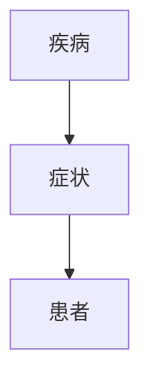
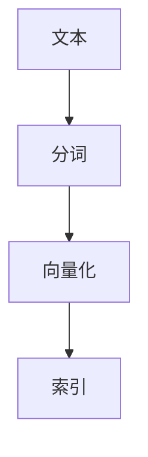
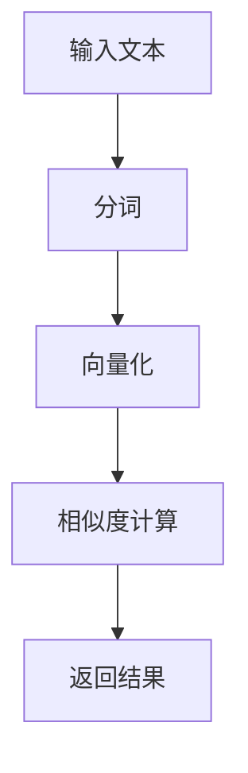
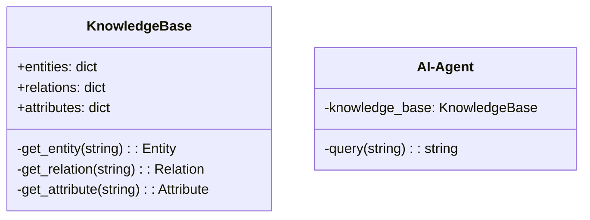
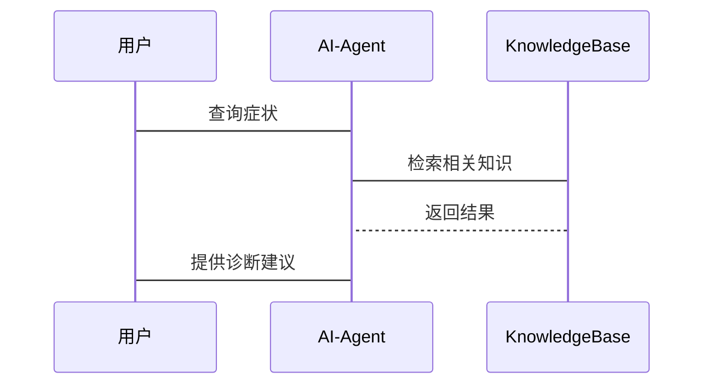

                 


# 构建AI Agent的知识库管理系统

## 关键词：
AI Agent，知识库管理系统，知识表示，向量数据库，自然语言处理，系统架构

## 摘要：
本文将详细探讨构建AI Agent的知识库管理系统的各个方面。从背景介绍到核心概念，从算法原理到系统架构设计，再到项目实战和最佳实践，本文旨在为读者提供一个全面而深入的指南。通过具体案例分析和代码实现，帮助读者理解如何设计和实现一个高效的知识库管理系统，从而提升AI Agent的性能和智能水平。

---

# 第一部分：知识库管理系统与AI Agent的背景介绍

## 第1章：知识库管理系统的背景与问题背景

### 1.1 知识库管理系统的定义与特点
#### 1.1.1 知识库管理系统的定义
知识库管理系统（Knowledge Base Management System, K.jms）是一种用于存储、组织和检索结构化知识的系统。它通过将知识表示为实体和关系，帮助AI Agent快速理解和回答问题。

#### 1.1.2 知识库管理系统的核心特点
- **结构化存储**：将知识以实体和关系的形式存储，便于计算机理解和处理。
- **高效检索**：支持快速查询和推理，提升AI Agent的响应速度。
- **可扩展性**：能够灵活扩展知识库的内容和规模。
- **多模态支持**：支持文本、图像、语音等多种数据类型。

#### 1.1.3 知识库管理系统与传统数据库的区别
| 特性               | 知识库管理系统          | 传统数据库          |
|--------------------|-----------------------|---------------------|
| 数据结构           | 实体、关系、属性       | 行、列、记录         |
| 查询方式           | 基于语义的查询         | 基于条件的查询       |
| 应用场景           | AI Agent、智能系统     | 事务处理、数据管理   |

### 1.2 AI Agent的基本概念与应用场景
#### 1.2.1 AI Agent的定义与核心功能
AI Agent是一种能够感知环境、自主决策并执行任务的智能体。它通过与用户交互、分析数据和调用服务来完成目标。

#### 1.2.2 AI Agent在不同领域的应用场景
- **客服机器人**：处理客户咨询，提供解决方案。
- **智能助手**：帮助用户完成日程管理、信息查询等任务。
- **自动驾驶**：通过实时感知和决策确保车辆安全运行。

#### 1.2.3 AI Agent与知识库管理系统的结合
AI Agent依赖知识库管理系统来获取所需知识，从而做出决策和回答问题。知识库是AI Agent的核心知识来源。

### 1.3 知识库管理在AI Agent中的重要性
#### 1.3.1 知识库作为AI Agent的知识基础
知识库为AI Agent提供了必要的背景知识，使其能够理解和回答复杂问题。

#### 1.3.2 知识库管理对AI Agent性能的影响
高效的知识库管理系统能够显著提升AI Agent的响应速度和准确性。

#### 1.3.3 知识库管理系统的优化方向
- 提高知识表示的效率。
- 优化知识检索算法。
- 支持动态更新和扩展。

### 1.4 本章小结
本章介绍了知识库管理系统的定义、特点以及在AI Agent中的重要性。通过对比分析，明确了知识库管理系统与传统数据库的区别，为后续章节的深入探讨奠定了基础。

---

## 第2章：知识库管理系统的概念结构

### 2.1 知识库的组成要素
知识库由**实体**、**关系**、**属性**和**规则**四部分组成。例如，在医疗领域，实体可以是“疾病”，关系可以是“症状”，属性可以是“症状类型”。

### 2.2 实体关系图的构建
通过Mermaid流程图展示实体之间的关系，例如：



### 2.3 实体关系图的优化
通过分析实体关系，去除冗余关系，简化图结构，提升系统效率。

### 2.4 本章小结
本章详细阐述了知识库的组成要素，并通过Mermaid流程图展示了实体关系图的构建与优化过程。

---

## 第3章：向量数据库的算法实现

### 3.1 向量数据库的基本原理
向量数据库通过将文本转换为向量表示，利用向量相似度进行检索。例如，使用余弦相似度衡量两个向量的相似性。

### 3.2 向量数据库的构建过程


### 3.3 向量数据库的查询算法
查询算法的核心步骤如下：



### 3.4 算法实现的Python代码示例
```python
import numpy as np

def text_to_vector(text):
    # 示例：将文本转换为向量
    vector = np.random.rand(100)
    return vector

def compute_similarity(vec1, vec2):
    # 示例：计算余弦相似度
    return np.dot(vec1, vec2) / (np.linalg.norm(vec1) * np.linalg.norm(vec2))

# 示例代码
text1 = "Hello, world!"
text2 = "World says hello."
vec1 = text_to_vector(text1)
vec2 = text_to_vector(text2)
similarity = compute_similarity(vec1, vec2)
print(f"Similarity: {similarity}")
```

### 3.5 本章小结
本章详细介绍了向量数据库的基本原理和构建过程，并通过Python代码示例展示了查询算法的实现。

---

## 第4章：系统分析与架构设计

### 4.1 问题场景介绍
以医疗领域为例，AI Agent需要根据患者的症状和病史，快速检索相关知识并提供诊断建议。

### 4.2 系统功能设计
通过Mermaid类图展示领域模型：



### 4.3 系统架构设计
通过Mermaid架构图展示系统架构：


### 4.4 系统接口设计
通过Mermaid序列图展示系统交互：



### 4.5 本章小结
本章通过问题场景分析、系统功能设计和架构设计，详细展示了如何构建一个高效的AI Agent知识库管理系统。

---

## 第5章：项目实战

### 5.1 环境安装
安装必要的库：
```bash
pip install numpy
pip install mermaid
```

### 5.2 系统核心实现源代码
```python
import numpy as np
import random

class KnowledgeBase:
    def __init__(self):
        self.entities = {}
        self.relations = {}
        self.attributes = {}

    def add_entity(self, entity):
        self.entities[entity['id']] = entity

    def add_relation(self, relation):
        self.relations[relation['id']] = relation

    def add_attribute(self, attribute):
        self.attributes[attribute['id']] = attribute

    def get_entity(self, id):
        return self.entities.get(id, None)

    def get_relation(self, id):
        return self.relations.get(id, None)

    def get_attribute(self, id):
        return self.attributes.get(id, None)

class AI-Agent:
    def __init__(self, knowledge_base):
        self.knowledge_base = knowledge_base

    def query(self, question):
        # 示例：查询症状
        entities = self.knowledge_base.get_entity(question)
        return entities
```

### 5.3 代码应用解读与分析
通过上述代码，AI Agent能够与知识库管理系统交互，实现知识的存储和查询。

### 5.4 实际案例分析
以医疗领域为例，AI Agent可以根据患者的症状和病史，快速检索相关知识并提供诊断建议。

### 5.5 本章小结
本章通过实际案例分析和代码实现，展示了如何构建一个高效的知识库管理系统，并为AI Agent提供支持。

---

## 第6章：最佳实践与注意事项

### 6.1 最佳实践
- 定期更新知识库内容。
- 优化向量数据库的检索算法。
- 确保系统安全性和稳定性。

### 6.2 小结
构建AI Agent的知识库管理系统是一项复杂的任务，需要综合考虑知识表示、存储、检索和系统架构等多个方面。

### 6.3 注意事项
- 确保知识库内容的准确性和完整性。
- 优化系统性能，提升响应速度。
- 定期进行系统维护和更新。

### 6.4 拓展阅读
- 《向量数据库：原理与应用》
- 《知识图谱：构建与实践》

---

## 本文章小结
本文系统地介绍了构建AI Agent的知识库管理系统的各个方面，从背景介绍到核心概念，从算法原理到系统架构设计，再到项目实战和最佳实践。通过详细讲解和代码示例，帮助读者理解如何设计和实现一个高效的知识库管理系统，从而提升AI Agent的性能和智能水平。

