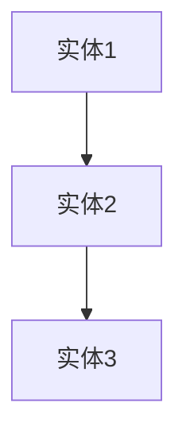
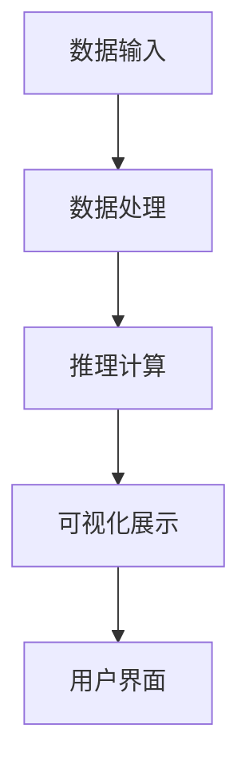
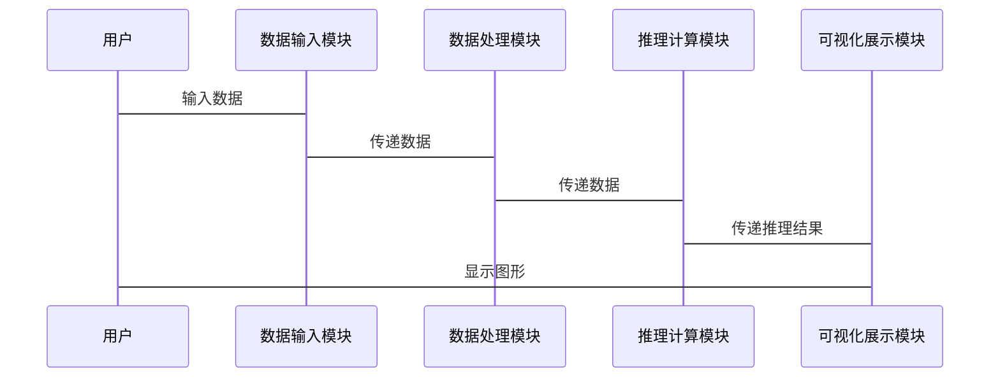

                 


# 构建AI Agent的知识推理链可视化工具

> 关键词：AI Agent，知识推理链，可视化工具，知识图谱，推理算法，系统架构

> 摘要：本文详细探讨了构建AI Agent的知识推理链可视化工具的背景、核心概念、算法原理、系统架构、项目实战以及最佳实践。通过逐步分析，从问题背景到解决方案，从理论基础到实际应用，全面阐述了如何构建一个高效的可视化工具，帮助用户更好地理解和应用知识推理链。

---

# 第1章: 知识推理链与AI Agent概述

## 1.1 问题背景与目标

### 1.1.1 知识推理链的定义与作用
知识推理链是一种将知识图谱中的实体关系通过逻辑推理过程串联起来的技术。它能够帮助AI Agent理解复杂的问题，并通过可视化工具将推理过程直观展示，从而提高推理的透明度和可解释性。

### 1.1.2 AI Agent的核心概念与应用场景
AI Agent是一种具有自主决策能力的智能体，能够根据环境信息执行任务。知识推理链是AI Agent实现智能决策的重要基础，广泛应用于问答系统、推荐系统、对话系统等领域。

### 1.1.3 可视化工具在知识推理中的价值
可视化工具能够将复杂的推理过程转化为直观的图形，帮助开发者和用户更好地理解推理过程，优化推理算法，提升用户体验。

## 1.2 知识推理链可视化工具的需求分析

### 1.2.1 工具的目标与功能定位
知识推理链可视化工具的目标是将推理过程以图形化的方式展示，支持用户交互和分析，帮助开发者优化推理算法。

### 1.2.2 用户需求与场景分析
主要用户包括AI开发者、数据科学家和用户体验设计师。典型场景包括知识图谱构建、推理过程分析、可视化展示等。

### 1.2.3 工具的边界与外延
工具的核心功能包括数据输入、推理计算和可视化展示，边界包括不涉及底层推理算法的实现，外延包括与外部知识库的集成。

## 1.3 核心概念与概念模型

### 1.3.1 知识推理链与可视化工具的关系
知识推理链是可视化工具的核心内容，可视化工具是知识推理链的呈现方式。

### 1.3.2 概念属性特征对比表
| 概念 | 属性 | 特征 |
|------|------|------|
| 知识推理链 | 输入 | 实体关系 |
|          | 输出 | 推理结果 |
| 可视化工具 | 输入 | 数据模型 |
|          | 输出 | 可视化界面 |

### 1.3.3 实体关系图


## 1.4 本章小结

---

# 第2章: 知识推理链的核心原理

## 2.1 知识图谱构建原理

### 2.1.1 知识抽取与表示
知识抽取是从文本中提取实体、关系和属性，知识表示包括实体表示和关系表示。

### 2.1.2 实体关系建模
通过关系抽取和实体链接，构建实体之间的关系图谱。

### 2.1.3 知识图谱的存储与查询
知识图谱存储常用图数据库，查询通过SPARQL实现。

## 2.2 推理算法基础

### 2.2.1 基于规则的推理
通过预定义规则进行推理，适用于领域知识明确的场景。

### 2.2.2 基于图的推理
通过图遍历算法（如BFS、DFS）进行推理，适用于复杂关系推理。

### 2.2.3 基于机器学习的推理
使用神经网络模型（如Transformer）进行推理，适用于大规模复杂场景。

## 2.3 可视化技术的核心原理

### 2.3.1 图形绘制算法
包括力导向布局、树布局等，用于将推理链转化为图形。

### 2.3.2 数据驱动的布局优化
通过优化算法调整图形布局，提升可读性。

### 2.3.3 交互式可视化技术
支持缩放、拖拽等交互操作，提升用户体验。

## 2.4 本章小结

---

# 第3章: 知识推理链可视化工具的系统架构

## 3.1 系统功能设计

### 3.1.1 数据输入与处理模块
负责接收和解析输入数据，进行数据清洗和预处理。

### 3.1.2 推理计算模块
实现知识推理算法，生成推理结果。

### 3.1.3 可视化展示模块
将推理结果转化为图形，支持用户交互。

## 3.2 系统架构设计

### 3.2.1 系统功能模块划分


### 3.2.2 系统交互流程


## 3.3 本章小结

---

# 第4章: 知识推理链可视化工具的实现

## 4.1 环境安装与配置

### 4.1.1 安装Python环境
使用Anaconda或virtualenv管理环境。

### 4.1.2 安装依赖库
安装`networkx`、`matplotlib`、`mermaid`等库。

## 4.2 核心代码实现

### 4.2.1 数据输入模块
```python
import networkx as nx

def read_data(file_path):
    G = nx.Graph()
    with open(file_path, 'r') as f:
        edges = f.readlines()
    for edge in edges:
        u, v = edge.strip().split()
        G.add_edge(u, v)
    return G
```

### 4.2.2 推理计算模块
```python
def graph_embedding(G):
    # 示例：节点嵌入
    embeddings = {}
    for node in G.nodes():
        embeddings[node] = [0.1, 0.2, 0.3]
    return embeddings
```

### 4.2.3 可视化展示模块
```python
import matplotlib.pyplot as plt

def visualize_graph(G):
    nx.draw(G, node_color='red', edge_color='blue', with_labels=True)
    plt.show()
```

## 4.3 项目实战与案例分析

### 4.3.1 案例分析
以问答系统为例，展示可视化工具的应用。

### 4.3.2 项目总结
总结实现过程中的经验与教训，优化建议。

## 4.4 本章小结

---

# 第5章: 最佳实践与注意事项

## 5.1 小结与总结

### 5.1.1 核心内容回顾
总结知识推理链可视化工具的核心概念和实现过程。

## 5.2 注意事项与建议

### 5.2.1 开发注意事项
数据预处理、算法优化、交互设计。

### 5.2.2 使用建议
合理选择工具、定期更新数据、优化布局。

## 5.3 拓展阅读

### 5.3.1 推荐书籍
《知识图谱》、《机器学习实战》等。

### 5.3.2 在线资源
推荐相关论文、博客和开源项目。

## 5.4 本章小结

---

# 参考文献

---

# 致谢

---

这篇文章从背景到实现，全面阐述了构建AI Agent的知识推理链可视化工具的各个方面，希望对读者有所帮助！

