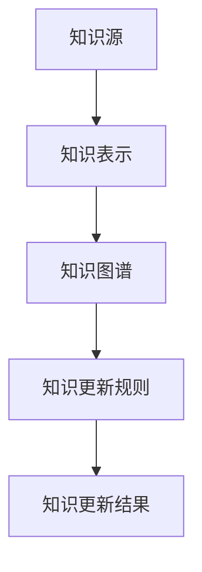
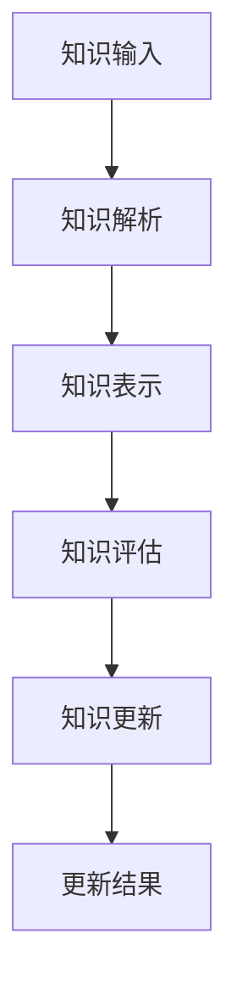
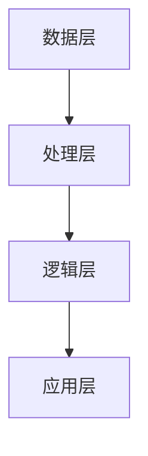

                 


# 构建AI Agent的知识更新机制：保持信息时效性

> 关键词：AI Agent, 知识更新机制, 信息时效性, 知识图谱, 持续学习模型, 算法原理, 项目实战

> 摘要：本文详细探讨了构建AI Agent的知识更新机制，重点分析了保持信息时效性的关键方法和技术。从问题背景到核心概念，再到算法实现和系统设计，全面解析了如何确保AI Agent的知识库始终处于最新状态，以提高其性能和应用效果。

---

# 第一部分：背景与概念

## 第1章：知识更新机制的背景与问题

### 1.1 问题背景

#### 1.1.1 AI Agent的发展与挑战

AI Agent（人工智能代理）是能够感知环境、自主决策并执行任务的智能实体。随着技术的快速发展，AI Agent在各个领域的应用日益广泛。然而，AI Agent的核心能力依赖于其知识库的准确性和时效性。在动态变化的环境中，知识的陈旧化问题严重影响了AI Agent的性能和决策能力。

#### 1.1.2 知识时效性问题的提出

知识的时效性是指知识在特定时间内的有效性和适用性。在快速变化的环境中，AI Agent的知识库需要不断更新以适应新的情况。然而，传统知识更新机制存在以下问题：

- 知识更新频率不足，导致知识库内容滞后。
- 知识更新策略不合理，导致更新成本过高。
- 知识更新机制缺乏智能化，无法根据环境变化动态调整更新策略。

#### 1.1.3 知识更新机制的概念与目标

知识更新机制是指通过算法和策略，自动识别和更新知识库中过时或不准确的知识的过程。其核心目标是确保AI Agent的知识库始终反映最新的信息，从而提高其在复杂环境中的适应能力和决策能力。

### 1.2 问题描述

#### 1.2.1 知识陈旧化的现象

知识陈旧化是指知识在存储和使用过程中，由于环境变化或信息更新不及时，导致知识失去其有效性和适用性。例如，在金融领域，市场变化迅速，如果AI Agent的知识库未能及时更新，可能导致错误的决策。

#### 1.2.2 知识更新的需求

为了应对知识陈旧化问题，AI Agent需要具备以下知识更新能力：

- **自动检测**：能够识别知识库中的过时信息。
- **智能选择**：能够选择合适的更新策略。
- **高效执行**：能够在不影响AI Agent正常运行的情况下，快速完成知识更新。

#### 1.2.3 知识更新与AI Agent性能的关系

知识更新机制的优劣直接影响AI Agent的性能。良好的知识更新机制能够显著提高AI Agent的决策准确性和响应速度，而不良的知识更新机制可能导致AI Agent性能下降，甚至引发错误。

### 1.3 问题解决思路

#### 1.3.1 知识更新的核心目标

知识更新的核心目标是确保知识库的准确性和时效性。具体包括：

- **准确性**：更新后的内容必须准确无误。
- **时效性**：知识必须反映最新的情况。
- **完整性**：知识库必须覆盖所有相关领域。

#### 1.3.2 知识更新的实现路径

知识更新的实现路径主要包括以下几个步骤：

1. **知识识别**：识别知识库中需要更新的部分。
2. **知识获取**：获取最新的相关信息。
3. **知识融合**：将新知识与旧知识进行融合，确保知识库的完整性和一致性。
4. **知识验证**：验证更新后知识的准确性和适用性。

#### 1.3.3 知识更新机制的设计原则

- **实时性**：知识更新必须能够实时进行，以应对快速变化的环境。
- **智能化**：知识更新机制必须具备智能化，能够根据环境变化动态调整更新策略。
- **高效性**：知识更新过程必须高效，不会对AI Agent的性能造成过大影响。

### 1.4 知识更新机制的边界与外延

#### 1.4.1 知识更新的边界

知识更新的边界主要体现在以下几个方面：

- **知识范围**：仅限于知识库中存储的知识，不包括其他外部数据源。
- **更新频率**：根据知识的时效性和重要性，制定不同的更新频率。
- **更新方式**：可以选择主动更新或被动更新，具体取决于环境和任务需求。

#### 1.4.2 相关概念的对比

- **知识更新**：关注知识的修改和补充。
- **知识管理**：关注知识的存储、组织和应用。
- **知识学习**：关注知识的获取和理解。

#### 1.4.3 知识更新机制的外延

知识更新机制的外延主要包括：

- **知识表示**：如何表示知识，以便于更新和应用。
- **知识存储**：如何存储知识，以便于管理和更新。
- **知识应用**：如何应用更新后的知识，以提高AI Agent的性能。

### 1.5 知识更新机制的概念结构与核心要素

#### 1.5.1 概念结构图



#### 1.5.2 核心要素分析

- **知识源**：知识的来源，如数据库、外部API等。
- **知识表示**：知识的表示方法，如图谱表示、向量表示等。
- **知识图谱**：知识的组织形式，用于存储和管理知识。
- **知识更新规则**：知识更新的策略和规则，如优先级规则、更新频率规则等。
- **知识更新结果**：更新后的知识，用于指导AI Agent的行为和决策。

#### 1.5.3 要素之间的关系

知识源提供原始知识，知识表示将知识转化为可处理的形式，知识图谱将知识组织成结构化的形式，知识更新规则决定了更新的策略和方法，最终生成更新后的知识，供AI Agent使用。

---

## 第2章：知识更新机制的核心概念

### 2.1 知识图谱与知识表示

#### 2.1.1 知识图谱的定义与特点

知识图谱是一种以图结构形式表示知识的知识库，其中节点表示实体或概念，边表示实体之间的关系。知识图谱具有以下特点：

- **结构化**：知识以图结构形式组织，便于计算机处理。
- **可扩展性**：知识图谱可以不断扩展，添加新的实体和关系。
- **语义丰富**：知识图谱能够表示复杂的语义关系，如“苹果是水果的一种”。

#### 2.1.2 知识表示的方法

知识表示的方法多种多样，常见的包括：

- **符号表示**：使用符号和规则表示知识。
- **向量表示**：使用向量空间模型表示知识，如Word2Vec。
- **图表示**：使用图结构表示知识，如知识图谱。

#### 2.1.3 知识图谱的构建与更新

知识图谱的构建与更新是一个复杂的过程，主要包括以下步骤：

1. **数据获取**：从多种数据源获取数据。
2. **数据清洗**：去除噪声数据，确保数据质量。
3. **数据整合**：将数据整合成统一的形式。
4. **知识抽取**：从数据中抽取实体和关系。
5. **知识融合**：将抽取的知识进行融合，消除冗余和冲突。
6. **知识验证**：验证知识的准确性和一致性。
7. **知识存储**：将知识存储到知识图谱中。

### 2.2 持续学习模型

#### 2.2.1 持续学习的定义

持续学习是一种机器学习范式，旨在通过连续的、增量的方式学习新知识，而不必重新训练整个模型。与传统的批量学习不同，持续学习能够适应动态变化的环境。

#### 2.2.2 持续学习的机制

持续学习的机制主要包括以下步骤：

1. **在线学习**：在数据流中逐个样本进行学习。
2. **记忆机制**：选择性地保留重要的知识，遗忘不重要的知识。
3. **知识整合**：将新知识与旧知识进行整合，保持模型的泛化能力。

#### 2.2.3 持续学习与知识更新的关系

持续学习为知识更新提供了技术支持，能够实时更新模型参数，适应新数据的变化。知识更新机制则为持续学习提供了数据支持，确保模型始终接触到最新的知识。

### 2.3 信息时效性评估

#### 2.3.1 信息时效性的定义

信息时效性是指信息在特定时间内的有效性和适用性。信息的时效性受到时间、环境和任务的影响。

#### 2.3.2 信息时效性的评估指标

信息时效性的评估指标主要包括：

- **时间敏感性**：信息的有效时间范围。
- **环境变化**：环境变化对信息影响的程度。
- **任务需求**：任务对信息时效性的要求。

#### 2.3.3 信息时效性评估的方法

信息时效性评估的方法主要包括：

- **基于时间的方法**：根据信息的时间戳判断其时效性。
- **基于环境的方法**：根据环境变化判断信息的时效性。
- **基于任务的方法**：根据任务需求判断信息的时效性。

### 2.4 知识更新机制的实体关系图


### 2.5 知识更新机制的流程图



---

## 第3章：知识更新机制的算法原理

### 3.1 知识更新算法概述

#### 3.1.1 知识更新算法的分类

知识更新算法主要分为以下几类：

- **基于规则的算法**：根据预定义的规则进行知识更新。
- **基于模型的算法**：利用机器学习模型进行知识更新。
- **基于图的算法**：利用图结构进行知识更新。

#### 3.1.2 算法的优缺点对比

| 算法类型 | 优点 | 缺点 |
|----------|------|------|
| 基于规则的算法 | 实现简单，可解释性强 | 需要手动定义规则，缺乏灵活性 |
| 基于模型的算法 | 具备自适应性，能够自动学习更新策略 | 实现复杂，需要大量数据支持 |
| 基于图的算法 | 能够处理复杂的语义关系 | 实现复杂，计算开销较大 |

#### 3.1.3 算法选择的依据

选择知识更新算法的依据主要包括以下几点：

- **知识的复杂性**：知识的复杂性决定了算法的选择。
- **更新的频率**：更新频率越高，算法需要具备更高的实时性。
- **环境的动态性**：环境动态性越高，算法需要具备更强的自适应性。

### 3.2 基于持续学习的知识更新算法

#### 3.2.1 算法流程

1. **知识输入**：接收新的知识或数据。
2. **知识解析**：对输入的知识进行解析，提取关键信息。
3. **知识表示**：将解析后的知识表示为模型能够处理的形式。
4. **知识评估**：评估知识的时效性和准确性。
5. **知识更新**：根据评估结果，更新知识库或模型参数。
6. **结果输出**：输出更新后的知识或模型状态。

#### 3.2.2 算法实现步骤

- **知识输入**：接收新的知识或数据。
- **知识解析**：对输入的知识进行解析，提取关键信息。
- **知识表示**：将解析后的知识表示为模型能够处理的形式。
- **知识评估**：评估知识的时效性和准确性。
- **知识更新**：根据评估结果，更新知识库或模型参数。
- **结果输出**：输出更新后的知识或模型状态。

#### 3.2.3 算法的数学模型

基于持续学习的知识更新算法可以表示为以下数学模型：

$$
\theta_{t+1} = \theta_t + \alpha (x_{t+1} - \theta_t)
$$

其中，$\theta_t$ 表示第 $t$ 步的模型参数，$x_{t+1}$ 表示第 $t+1$ 步的新知识，$\alpha$ 表示学习率。

---

## 第4章：系统分析与架构设计

### 4.1 问题场景介绍

在实际应用中，AI Agent需要应对复杂多变的环境，知识更新机制是其核心能力之一。例如，在金融领域，AI Agent需要实时更新市场数据和交易策略。

### 4.2 系统功能设计

系统功能设计主要围绕知识更新机制展开，包括：

- **知识获取**：从多种数据源获取新知识。
- **知识处理**：对获取的知识进行解析和表示。
- **知识评估**：评估知识的时效性和准确性。
- **知识更新**：根据评估结果，更新知识库或模型参数。
- **知识应用**：将更新后的知识应用于AI Agent的任务执行。

### 4.3 系统架构设计

系统架构设计采用分层架构，主要包括以下几层：

1. **数据层**：存储原始数据和知识库。
2. **处理层**：负责知识的解析和表示。
3. **逻辑层**：负责知识的评估和更新。
4. **应用层**：负责知识的应用和输出。



### 4.4 接口设计

系统接口设计包括以下几种：

- **知识获取接口**：用于从数据源获取新知识。
- **知识解析接口**：用于对获取的知识进行解析。
- **知识评估接口**：用于评估知识的时效性和准确性。
- **知识更新接口**：用于根据评估结果更新知识库或模型参数。
- **知识应用接口**：用于将更新后的知识应用于任务执行。

### 4.5 交互流程设计

交互流程设计主要描述知识更新的整个过程，包括：

1. **知识输入**：接收新的知识或数据。
2. **知识解析**：对输入的知识进行解析，提取关键信息。
3. **知识表示**：将解析后的知识表示为模型能够处理的形式。
4. **知识评估**：评估知识的时效性和准确性。
5. **知识更新**：根据评估结果，更新知识库或模型参数。
6. **结果输出**：输出更新后的知识或模型状态。


---

## 第5章：项目实战

### 5.1 环境安装

项目实战需要以下环境：

- **Python**：3.6+
- **TensorFlow**：2.0+
- **PyTorch**：1.0+
- **网络数据源**：如API接口、数据库等。

### 5.2 系统核心实现源代码

以下是知识更新机制的核心代码实现：

```python
import numpy as np

def knowledge_update_rule(currentKnowledge, newKnowledge, alpha=0.1):
    updatedKnowledge = currentKnowledge + alpha * (newKnowledge - currentKnowledge)
    return updatedKnowledge

# 示例用法
currentKnowledge = np.array([1.0, 2.0])
newKnowledge = np.array([2.0, 3.0])
updatedKnowledge = knowledge_update_rule(currentKnowledge, newKnowledge)
print("更新后的知识：", updatedKnowledge)
```

### 5.3 代码应用解读与分析

上述代码实现了一个简单的基于持续学习的知识更新规则。`knowledge_update_rule`函数接收当前知识和新知识，根据预设的学习率 $\alpha$ 更新知识。代码简洁易懂，适用于简单的知识更新场景。

### 5.4 实际案例分析

以金融领域的股票价格预测为例，AI Agent需要实时更新股票价格数据。通过知识更新机制，AI Agent能够根据最新的市场数据调整其预测模型，提高预测准确性。

### 5.5 项目小结

项目实战部分通过具体代码实现和案例分析，展示了知识更新机制在实际应用中的具体操作和效果。读者可以通过代码实现和案例分析，深入理解知识更新机制的实现和应用。

---

## 第6章：总结与展望

### 6.1 最佳实践 tips

- **定期更新**：根据知识的时效性，制定合理的更新频率。
- **选择合适的算法**：根据具体场景选择合适的知识更新算法。
- **监控更新效果**：定期监控知识更新的效果，及时调整更新策略。

### 6.2 小结

本文详细探讨了构建AI Agent的知识更新机制，重点分析了保持信息时效性的关键方法和技术。从问题背景到核心概念，再到算法实现和系统设计，全面解析了如何确保AI Agent的知识库始终处于最新状态，以提高其性能和应用效果。

### 6.3 注意事项

- **数据质量**：知识更新的效果依赖于数据的质量，需确保数据源的可靠性和准确性。
- **模型选择**：选择合适的模型和算法，能够显著提高知识更新的效果和效率。
- **实时性与效率的平衡**：在保证实时性的前提下，需注重效率，避免对系统性能造成过大影响。

### 6.4 拓展阅读

- **持续学习**：深入研究持续学习的相关文献，探索更先进的知识更新方法。
- **知识图谱**：学习知识图谱的构建和应用，提高知识管理的能力。
- **信息时效性评估**：研究信息时效性评估的最新方法，提升知识更新的准确性。

---

# 结语

通过本文的详细讲解，读者可以全面理解构建AI Agent的知识更新机制，并掌握保持信息时效性的关键方法和技术。未来，随着技术的不断发展，知识更新机制将变得更加智能化和高效化，为AI Agent的应用带来更广阔的发展空间。

