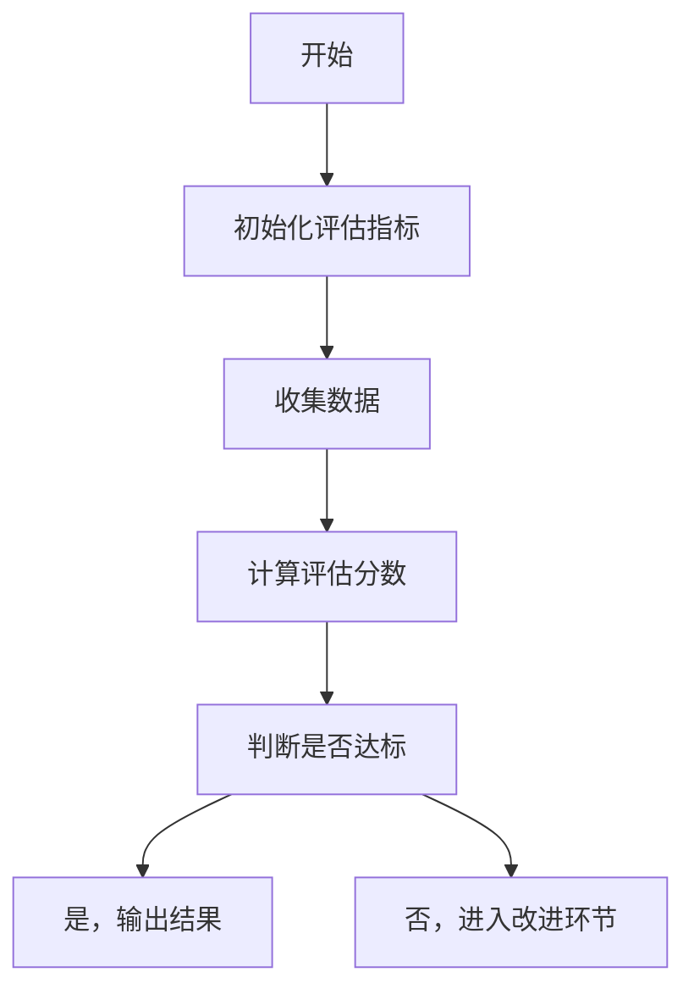
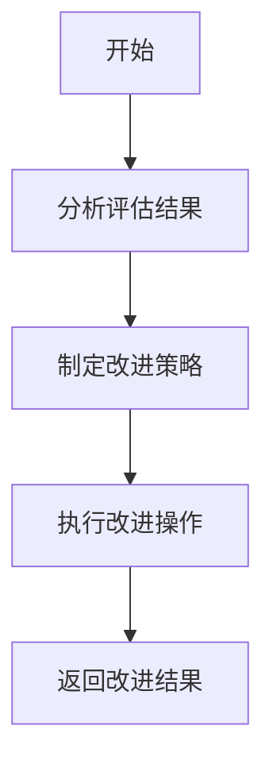
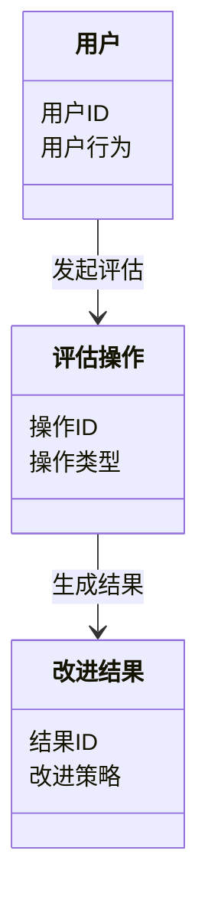
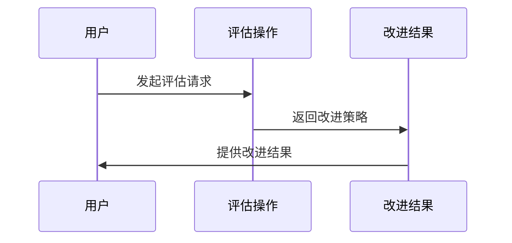

                 


# 构建AI Agent的自我评估与改进系统

## 关键词：AI Agent，自我评估，改进系统，算法原理，系统架构，项目实战

## 摘要：  
本文详细探讨了构建AI Agent的自我评估与改进系统的各个方面，从理论到实践，结合实际案例，分析了系统设计的核心要素，算法原理，以及实现步骤。文章通过清晰的逻辑和专业的技术语言，帮助读者全面理解并掌握如何设计和实现一个高效的AI Agent自我评估与改进系统。

---

# 第一部分: 背景介绍

## 第1章: 问题背景

### 1.1 AI Agent的基本概念  
AI Agent（人工智能代理）是一种能够感知环境并采取行动以实现目标的智能实体。它可以是一个软件程序、机器人或其他智能系统，核心目标是通过与环境的交互来完成特定任务。  

### 1.2 自我评估与改进的必要性  
AI Agent需要具备自我评估的能力，以便发现自身的不足并进行改进。这种能力使其能够适应动态变化的环境，并不断提升自身的性能和效率。  

### 1.3 当前AI Agent的挑战与不足  
- **挑战**：AI Agent在复杂环境中可能面临不确定性、信息不完整等问题，需要通过自我评估来优化决策。  
- **不足**：现有的AI Agent系统往往缺乏自我评估与改进机制，导致其性能受限。  

## 第2章: 问题描述

### 2.1 自我评估的定义与目标  
- **定义**：AI Agent通过内部或外部反馈机制，对自身的行为、性能和结果进行评估。  
- **目标**：通过评估发现问题，制定改进策略，优化系统性能。  

### 2.2 改进机制的核心问题  
- **核心问题**：如何设计高效的评估算法和改进策略，确保AI Agent能够持续优化。  
- **实现路径**：结合机器学习、优化算法和反馈机制，构建闭环系统。  

### 2.3 系统边界与外延  
- **边界**：AI Agent的自我评估与改进系统仅关注其自身的性能优化。  
- **外延**：改进后的AI Agent可以应用于更多场景，如自动驾驶、智能客服等。  

## 第3章: 问题解决

### 3.1 自我评估与改进的总体思路  
1. 设计评估指标：基于任务需求，定义性能评估的量化指标。  
2. 实现评估算法：通过算法对AI Agent的行为进行分析和评分。  
3. 制定改进策略：根据评估结果，优化系统参数或调整行为策略。  

### 3.2 系统设计的核心要素  
- **输入**：环境反馈、用户输入、系统日志。  
- **输出**：评估结果、改进策略、性能优化。  

### 3.3 实现路径与方法  
1. 数据采集：收集AI Agent的行为数据。  
2. 数据分析：通过算法对数据进行处理，生成评估结果。  
3. 策略优化：基于评估结果，调整系统参数或行为模式。  

---

# 第二部分: 核心概念与联系

## 第4章: 核心概念原理

### 4.1 自我评估的数学模型  
评估分数的计算可以表示为：  
$$评估分数 = \sum_{i=1}^{n} w_i \cdot f_i$$  
其中，$w_i$ 是指标 $f_i$ 的权重，$f_i$ 是指标的评估值。  

### 4.2 改进机制的算法原理  
改进算法的步骤如下：  
1. 收集评估数据。  
2. 计算评估分数。  
3. 判断是否达标。  
4. 如果达标，输出结果；否则，执行改进操作。  

### 4.3 系统反馈的闭环机制  
闭环机制确保AI Agent能够根据评估结果不断优化自身行为，形成一个持续改进的循环。  

## 第5章: 核心概念属性对比

### 5.1 不同评估方法的对比分析  
| 评估方法 | 优点 | 缺点 |  
|---------|------|------|  
| 基于规则 | 简单易实现 | 无法应对复杂场景 |  
| 基于机器学习 | 高度自适应 | 训练数据依赖性强 |  

### 5.2 改进策略的优劣势分析  
| 改进策略 | 优点 | 缺点 |  
|---------|------|------|  
| 参数调整 | 易实现 | 可能导致系统不稳定 |  
| 行为模式优化 | 高效 | 需要复杂算法支持 |  

---

# 第三部分: 算法原理讲解

## 第6章: 算法原理

### 6.1 自我评估算法

#### 6.1.1 算法步骤  
1. 初始化评估指标。  
2. 收集AI Agent的行为数据。  
3. 计算评估分数。  
4. 判断是否达标。  
5. 输出评估结果。  

#### 6.1.2 算法流程图  


### 6.2 改进算法

#### 6.2.1 改进步骤  
1. 分析评估结果。  
2. 制定改进策略。  
3. 执行改进操作。  
4. 返回改进结果。  

#### 6.2.2 改进流程图  


---

# 第四部分: 系统架构与设计

## 第7章: 系统架构设计

### 7.1 系统功能设计  
系统功能模块包括：  
1. 数据采集模块：收集AI Agent的行为数据。  
2. 评估计算模块：计算评估分数。  
3. 改进策略模块：制定并执行改进操作。  

### 7.2 系统架构图  


### 7.3 系统交互图  


---

# 第五部分: 项目实战

## 第8章: 项目实战

### 8.1 环境安装  
1. 安装Python 3.8及以上版本。  
2. 安装必要的库：numpy、pandas、scikit-learn。  

### 8.2 核心代码实现  

#### 8.2.1 评估算法实现  
```python
def calculate_score(data, weights):
    return sum(weights[i] * data[i] for i in range(len(data)))
```

#### 8.2.2 改进策略实现  
```python
def improve_strategy(current_strategy, score):
    if score < 0.7:
        return "调整参数"
    elif score < 0.9:
        return "优化算法"
    else:
        return "保持现状"
```

### 8.3 案例分析  
通过一个实际案例，展示如何使用上述代码实现AI Agent的自我评估与改进。

---

# 第六部分: 总结与展望

## 第9章: 总结与展望

### 9.1 本章总结  
本文详细探讨了构建AI Agent的自我评估与改进系统的核心要素，包括算法原理、系统架构和项目实战。通过实际案例的分析，读者可以掌握如何设计和实现一个高效的AI Agent自我评估与改进系统。

### 9.2 未来展望  
随着人工智能技术的不断发展，AI Agent的自我评估与改进系统将变得更加智能化和自动化。未来的研究可以进一步探索如何结合强化学习和自适应算法，提升系统的性能和效率。

---

通过本文的详细分析，读者可以全面理解AI Agent的自我评估与改进系统的构建过程，并能够将其应用于实际场景中。

