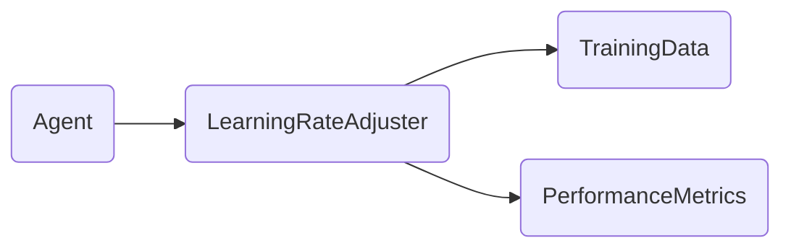
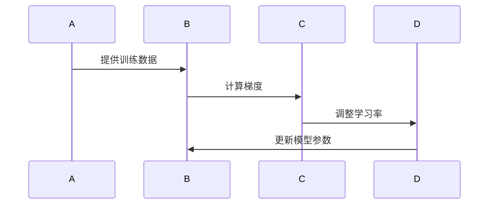

                 


# 构建AI Agent的自适应学习率调节系统

> 关键词：AI Agent，自适应学习率，机器学习，优化算法，系统架构

> 摘要：本文详细探讨了构建AI Agent的自适应学习率调节系统的核心概念、算法原理、系统架构及其实现方法。通过分析传统学习率调节的局限性，提出了一种基于自适应调节的学习率优化方法，并通过系统设计和项目实战，展示了如何高效实现该系统，为AI Agent的优化提供了新的思路。

---

## 第一部分: 自适应学习率调节系统概述

### 第1章: AI Agent与自适应学习率调节系统背景介绍

#### 1.1 问题背景与问题描述

AI Agent是一种智能体，能够感知环境并采取行动以实现目标。在机器学习模型训练中，AI Agent通常需要通过优化算法不断调整模型参数，以提高预测准确性和任务执行效率。然而，传统的学习率调节方法存在以下问题：

- **固定学习率的局限性**：固定学习率在训练初期可能导致收敛速度慢，而在后期可能导致震荡或无法收敛。
- **手动调节的低效性**：手动调整学习率需要反复试验，耗时且难以找到最优值。
- **动态变化的适应性不足**：在实际应用中，数据分布和任务目标可能动态变化，静态学习率难以适应这些变化。

因此，自适应学习率调节系统成为解决这些问题的关键。

#### 1.2 问题解决与边界外延

自适应学习率调节系统的目标是根据训练过程中的动态信息（如梯度变化、模型性能等）自动调整学习率，以加快收敛速度并提高模型性能。系统的边界包括：

- **适用场景**：适用于需要动态调整学习率的机器学习任务，如深度神经网络训练、强化学习等。
- **不适用场景**：对于某些简单任务或数据分布稳定的任务，固定学习率可能已足够，无需自适应调节。

#### 1.3 概念结构与核心要素

自适应学习率调节系统由以下核心要素组成：

1. **学习率调整器**：负责根据当前梯度信息和模型性能调整学习率。
2. **训练数据**：输入数据，包括特征和标签。
3. **模型参数**：需要优化的模型权重。
4. **性能指标**：模型在验证集或测试集上的表现，用于评估调整效果。

这些要素通过相互作用，共同实现自适应调节的目标。

### 第2章: 自适应学习率调节的核心概念与联系

#### 2.1 核心概念原理

自适应学习率调节的核心思想是根据当前梯度信息动态调整学习率。具体步骤如下：

1. **计算梯度**：通过反向传播计算模型参数的梯度。
2. **调整学习率**：根据梯度的大小和变化趋势调整学习率。
3. **更新参数**：使用调整后的新学习率更新模型参数。

#### 2.2 实体关系图

以下是一个简单的实体关系图，展示了自适应学习率调节系统的主要实体及其关系：



---

## 第二部分: 系统分析与架构设计

### 第3章: 系统分析与架构设计

#### 3.1 问题场景介绍

在构建AI Agent的自适应学习率调节系统时，我们面临以下问题：

1. 如何高效地计算梯度并调整学习率？
2. 如何确保系统能够实时响应模型性能的变化？
3. 如何在不同任务和数据分布下保持系统的稳定性？

#### 3.2 系统功能设计

系统功能设计包括以下模块：

1. **数据输入模块**：接收训练数据。
2. **梯度计算模块**：计算模型参数的梯度。
3. **学习率调整模块**：根据梯度信息动态调整学习率。
4. **模型更新模块**：使用调整后的新学习率更新模型参数。
5. **性能监控模块**：监控模型性能，并根据需要调整学习率。

#### 3.3 系统架构设计

系统架构采用分层设计，包括数据层、计算层、控制层和应用层。以下是系统的架构图：


#### 3.4 接口与交互设计

系统主要接口包括：

1. **数据输入接口**：接收训练数据。
2. **梯度计算接口**：计算模型参数的梯度。
3. **学习率调整接口**：根据梯度信息调整学习率。
4. **模型更新接口**：更新模型参数。

以下是系统交互的序列图：



---

## 第三部分: 项目实战

### 第4章: 项目实战

#### 4.1 环境安装

以下是构建系统的环境要求：

- **Python 3.6+**
- **TensorFlow或PyTorch**
- **Mermaid工具**

#### 4.2 核心代码实现

以下是自适应学习率调节的核心代码实现：

```python
def adaptive_learning_rate_adjustment():
    # 初始化参数
    params = {'learning_rate': 0.1}
    # 计算梯度
    gradient = compute_gradient(params)
    # 调整学习率
    params['learning_rate'] = adjust_learning_rate(gradient, params['learning_rate'])
    # 更新参数
    update_params(params)
```

#### 4.3 案例分析

以下是一个简单的案例分析：

1. **问题描述**：训练一个简单的神经网络模型，目标是分类任务。
2. **数据准备**：使用MNIST数据集。
3. **模型训练**：使用自适应学习率调节系统进行训练，观察模型性能的变化。

---

## 第四部分: 最佳实践与总结

### 第5章: 最佳实践与总结

#### 5.1 小结

自适应学习率调节系统通过动态调整学习率，能够有效提高模型训练效率和性能。在实际应用中，需要注意以下几点：

- **系统稳定性**：确保系统能够稳定运行，避免参数震荡。
- **计算效率**：优化计算过程，减少计算开销。
- **适应性**：针对不同任务和数据分布进行调整。

#### 5.2 注意事项

- **初始化参数**：学习率的初始值需要合理选择。
- **梯度计算**：确保梯度计算的准确性。
- **性能监控**：实时监控模型性能，及时调整学习率。

#### 5.3 拓展阅读

- **深度学习优化算法综述**
- **自适应优化算法的研究进展**

---

通过以上步骤，我们详细探讨了构建AI Agent的自适应学习率调节系统的核心概念、算法原理、系统架构及其实现方法。希望本文能够为读者提供有价值的见解，帮助他们在实际应用中优化AI Agent的性能。

