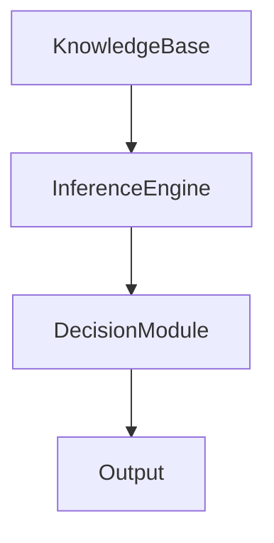
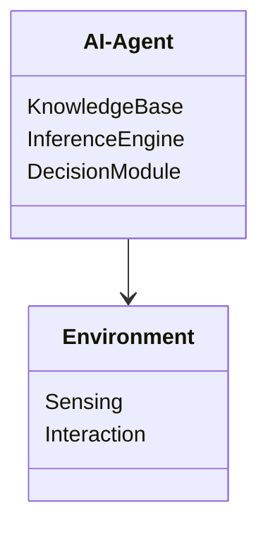

                 


# 构建AI Agent的道德推理与决策系统

## 关键词
AI Agent，道德推理，决策系统，人工智能，伦理决策，智能体设计

## 摘要
随着人工智能技术的飞速发展，AI Agent（智能体）在各个领域的应用越来越广泛。然而，AI Agent在决策过程中需要考虑道德和伦理问题，这使得构建一个能够进行道德推理与决策的系统变得尤为重要。本文将从AI Agent的基本概念出发，逐步分析道德推理与决策系统的原理、算法、系统架构，并通过实际案例展示如何构建这样一个系统。文章内容包括背景介绍、核心概念、算法原理、系统架构设计、项目实战以及总结与展望等部分，旨在为读者提供一个全面而系统的指导。

---

# 第一部分: AI Agent的道德推理与决策系统概述

## 第1章: AI Agent的基本概念与背景

### 1.1 AI Agent的定义与特点
#### 1.1.1 AI Agent的定义
AI Agent（人工智能智能体）是指能够感知环境、自主决策并执行任务的智能系统。与传统程序不同，AI Agent具有主动性、目标导向性和适应性。

#### 1.1.2 AI Agent的核心特点
- **自主性**：AI Agent能够在没有外部干预的情况下独立执行任务。
- **反应性**：AI Agent能够实时感知环境并做出反应。
- **目标导向性**：AI Agent的行为通常是为了实现特定的目标。
- **学习能力**：AI Agent能够通过学习和经验优化自己的决策能力。

#### 1.1.3 AI Agent与传统AI的区别
传统的AI程序通常只是完成特定任务，而AI Agent具有更强的自主性和适应性，能够根据环境动态调整行为。

---

### 1.2 道德推理与决策系统的背景
#### 1.2.1 道德推理的定义
道德推理是指AI Agent在决策过程中，根据伦理准则和道德规范，评估不同行为的道德价值并选择最优行为的过程。

#### 1.2.2 AI Agent决策系统的必要性
AI Agent在医疗、自动驾驶、机器人等领域广泛应用，其决策可能直接影响人类的生命和财产安全，因此需要具备道德推理能力。

#### 1.2.3 道德推理与决策系统的应用场景
- **自动驾驶**：AI Agent需要在复杂的交通环境中做出安全且符合伦理的决策。
- **医疗辅助**：AI Agent需要在诊断和治疗中考虑患者的福祉和伦理规范。
- **智能助手**：AI Agent需要在日常生活中协助人类时，遵循基本的伦理准则。

---

## 第2章: 道德推理与决策系统的原理

### 2.1 道德推理的核心概念
#### 2.1.1 道德规则的建立
AI Agent需要根据特定领域或通用的伦理准则建立道德规则库，例如“不伤害他人”、“公平对待”等。

#### 2.1.2 道德案例分析
通过分析实际案例，AI Agent可以学习不同情境下的道德决策模式。

#### 2.1.3 道德推理的逻辑框架
道德推理通常基于逻辑推理和案例推理的结合，确保AI Agent能够灵活应对各种复杂情况。

---

### 2.2 决策系统的核心机制
#### 2.2.1 决策树的构建
决策树是一种树状结构，用于表示可能的决策路径。AI Agent可以通过构建决策树来选择最优行为。

#### 2.2.2 基于规则的决策
AI Agent根据预定义的道德规则进行决策，例如“在紧急情况下优先保护人类生命”。

#### 2.2.3 基于案例的推理
AI Agent通过比较当前情境与历史案例的相似性，推导出合适的决策。

---

## 第3章: 道德推理与决策系统的数学模型

### 3.1 道德推理的数学表示
#### 3.1.1 道德规则的符号化表示
道德规则可以用逻辑符号表示，例如：如果行为X可能导致伤害，则选择行为Y。

#### 3.1.2 道德案例的相似性度量
通过相似性度量公式，AI Agent可以评估当前情境与历史案例的相似程度：
$$ \text{相似度} = \sum_{i=1}^{n} w_i \cdot s_i $$
其中，\(w_i\) 是权重，\(s_i\) 是相似性指标。

#### 3.1.3 道德推理的逻辑框架
基于逻辑推理的道德推理模型可以表示为：
$$ \text{如果} \, P \, \text{成立，那么} \, Q \, \text{成立} $$

---

### 3.2 决策系统的数学模型
#### 3.2.1 决策树的构建与优化
决策树的构建可以通过信息增益率或基尼指数进行优化：
$$ \text{信息增益率} = \frac{\text{熵} - \text{条件熵}}{\text{熵}} $$

#### 3.2.2 基于概率的决策模型
贝叶斯决策模型可以表示为：
$$ P(A|B) = \frac{P(B|A) \cdot P(A)}{P(B)} $$

#### 3.2.3 基于强化学习的决策模型
强化学习通过奖励函数优化决策策略：
$$ R(s, a) = \text{奖励} $$

---

## 第4章: 道德推理与决策系统的算法实现

### 4.1 道德推理算法
#### 4.1.1 基于规则的道德推理算法
```python
def moral_reasoning(rules):
    for rule in rules:
        if rule.condition_met():
            return rule.action()
    return default_action()
```

#### 4.1.2 基于案例的道德推理算法
```python
def case_based_reasoning(cases):
    max_similarity = -1
    best_case = None
    for case in cases:
        similarity = calculate_similarity(case)
        if similarity > max_similarity:
            max_similarity = similarity
            best_case = case
    return best_case.action()
```

#### 4.1.3 基于逻辑的道德推理算法
```python
def logic_based_reasoning(rules):
    for rule in rules:
        if rule.is_applicable():
            return rule.resolve_conflict()
    return fallback_action()
```

---

### 4.2 决策算法
#### 4.2.1 基于树的决策算法
```python
def decision_tree(node, data):
    if node.is_leaf():
        return node.predict(data)
    else:
        return decision_tree(node.children[data.split_feature()], data)
```

#### 4.2.2 基于概率的决策算法
```python
def bayesian_decision(beliefs, actions):
    max_probability = -1
    best_action = None
    for action in actions:
        probability = calculate_probability(action, beliefs)
        if probability > max_probability:
            max_probability = probability
            best_action = action
    return best_action
```

#### 4.2.3 基于强化学习的决策算法
```python
def reinforcement_learning(state, actions, model):
    q_value = model.predict(state)
    best_action = np.argmax(q_value)
    return actions[best_action]
```

---

## 第5章: 系统架构与设计

### 5.1 系统架构设计
#### 5.1.1 知识库模块
知识库模块存储道德规则、历史案例和领域知识。

#### 5.1.2 推理引擎模块
推理引擎负责根据输入情境调用合适的推理算法。

#### 5.1.3 决策模块
决策模块根据推理结果生成最终的决策。



---

### 5.2 系统交互设计
#### 5.2.1 系统功能设计


---

## 第6章: 项目实战

### 6.1 环境安装
安装必要的库：
```bash
pip install numpy scikit-learn tensorflow
```

---

### 6.2 系统核心实现
```python
class MoralReasoningSystem:
    def __init__(self, rules, cases):
        self.rules = rules
        self.cases = cases

    def reason(self, scenario):
        # 基于规则的推理
        for rule in self.rules:
            if rule.apply(scenario):
                return rule.resolve(scenario)
        # 基于案例的推理
        best_case = self.find_best_case(scenario)
        return best_case.resolve(scenario)

    def find_best_case(self, scenario):
        max_similarity = -1
        best_case = None
        for case in self.cases:
            similarity = case.similarity(scenario)
            if similarity > max_similarity:
                max_similarity = similarity
                best_case = case
        return best_case
```

---

### 6.3 实际案例分析
以自动驾驶为例，AI Agent需要在紧急情况下做出决策，例如：
- **案例1**：前方出现障碍物，选择转向还是刹车。
- **案例2**：两名行人突然横穿马路，选择撞向哪一方的风险更低。

---

## 第7章: 总结与展望

### 7.1 总结
本文详细介绍了AI Agent的道德推理与决策系统的构建过程，包括核心概念、算法原理、系统架构和实际案例。

### 7.2 展望
未来的研究方向包括动态环境下的决策优化、多智能体协作中的伦理问题，以及如何确保道德决策的透明性和可解释性。

---

通过本文的指导，读者可以系统地了解AI Agent的道德推理与决策系统的构建方法，并能够将其应用到实际项目中。

