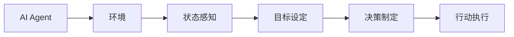
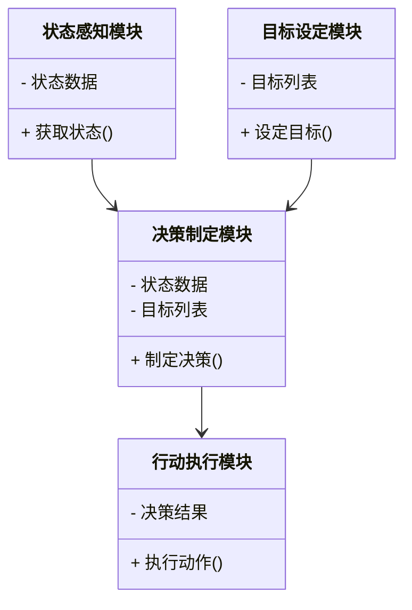
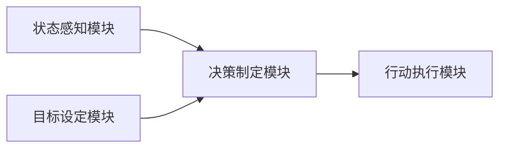
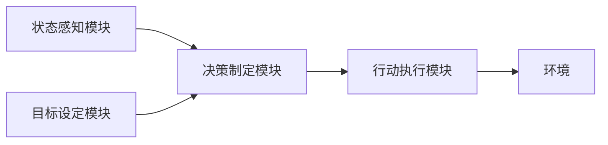

                 


# 构建AI Agent的长期规划与决策系统

## 关键词：AI Agent, 长期规划, 决策系统, 强化学习, 系统架构, 项目实战

## 摘要：  
AI Agent的长期规划与决策系统是实现智能体自主决策的核心技术。本文系统地介绍了构建AI Agent长期规划与决策系统的背景、核心概念、算法原理、系统架构设计、项目实战及最佳实践。通过详细阐述长期规划与决策系统的理论基础和实际应用，结合具体案例和代码实现，为读者提供了一套完整的构建方法论。

---

# 第一部分: AI Agent的长期规划与决策系统引言

## 第1章: AI Agent的长期规划与决策系统概述

### 1.1 AI Agent的基本概念

#### 1.1.1 什么是AI Agent

AI Agent（智能体）是指能够感知环境、自主决策并执行动作的智能系统。它可以是一个软件程序、机器人或任何能够与环境交互的实体。AI Agent的核心目标是通过感知和行动来实现特定任务，例如路径规划、游戏AI、推荐系统等。

#### 1.1.2 AI Agent的核心特征

- **自主性**：AI Agent能够在没有外部干预的情况下自主运行。
- **反应性**：能够实时感知环境并做出反应。
- **目标导向**：具有明确的目标，并通过行动实现这些目标。
- **学习能力**：能够通过经验改进自己的决策能力。

#### 1.1.3 AI Agent的应用领域

- **自动驾驶**：如特斯拉、Waymo的自动驾驶系统。
- **智能助手**：如Siri、Alexa、Google Assistant。
- **游戏AI**：如《星际争霸II》中的AI对手。
- **机器人控制**：如工业机器人和家庭服务机器人。
- **推荐系统**：如Netflix、Spotify的内容推荐。

### 1.2 长期规划与决策系统的重要性

#### 1.2.1 长期规划的定义与作用

长期规划是指AI Agent在面对复杂环境时，能够制定并执行一系列跨越较长时间跨度的行动策略。例如，自动驾驶汽车需要规划从起点到终点的整个路径，而不仅仅关注当前的局部决策。

#### 1.2.2 决策系统的核心功能

- **状态感知**：通过传感器或数据源获取环境信息。
- **目标设定**：根据当前状态和历史信息，设定短期和长期目标。
- **决策制定**：基于当前状态和目标，选择最优或近似最优的动作。
- **行动执行**：将决策转化为实际动作，与环境交互。

#### 1.2.3 长期规划与决策系统的结合

长期规划为决策系统提供了全局视角，而决策系统则负责将长期目标分解为可执行的短期行动。两者的结合使得AI Agent能够在复杂环境中实现高效、稳定的运行。

### 1.3 本章小结

本章介绍了AI Agent的基本概念、核心特征和应用领域，并重点阐述了长期规划与决策系统的重要性。通过理解这些内容，读者可以为后续章节的学习打下坚实的基础。

---

# 第二部分: 长期规划与决策系统的背景介绍

## 第2章: 长期规划与决策系统的背景分析

### 2.1 问题背景

#### 2.1.1 当前AI Agent面临的挑战

- **复杂环境**：AI Agent需要处理动态变化、不确定性和部分可观察的环境。
- **长期目标**：需要在较长的时间跨度内保持目标的一致性。
- **资源约束**：计算资源、时间资源和能量资源的限制。

#### 2.1.2 长期规划与决策系统的需求来源

- **任务复杂性**：复杂任务需要分解为多个子任务，每个子任务都需要独立的规划和决策。
- **环境不确定性**：环境的不确定性要求系统具有灵活性和适应性。
- **高效性要求**：需要在有限的时间内做出高质量的决策。

#### 2.1.3 解决策略

- **分层规划**：将长期目标分解为多个层次的子目标。
- **动态规划**：通过状态转移和价值评估，找到最优路径。
- **强化学习**：通过与环境的交互，逐步优化决策策略。

### 2.2 问题描述

#### 2.2.1 长期规划的核心问题

- **目标分解**：将长期目标分解为可执行的短期目标。
- **状态转移**：确定当前状态到下一状态的转移方式。
- **价值评估**：评估不同决策的长期收益。

#### 2.2.2 决策系统的关键挑战

- **决策的实时性**：需要在有限时间内做出决策。
- **决策的鲁棒性**：需要能够处理环境中的不确定性。
- **决策的可解释性**：需要能够理解决策背后的原因。

#### 2.2.3 问题的边界与外延

- **边界**：明确问题的限制条件和适用范围。
- **外延**：扩展问题的应用场景和潜在的未来发展方向。

### 2.3 问题解决

#### 2.3.1 长期规划与决策系统的解决方案

- **分层规划**：将长期目标分解为多个层次的子目标。
- **强化学习**：通过与环境的交互，逐步优化决策策略。
- **动态规划**：通过状态转移和价值评估，找到最优路径。

#### 2.3.2 系统设计的核心要素

- **状态表示**：如何表示环境中的状态。
- **动作空间**：AI Agent可以执行的动作。
- **目标函数**：衡量决策优劣的标准。
- **奖励机制**：通过奖励信号指导AI Agent的学习方向。

### 2.4 系统核心概念与联系

#### 2.4.1 核心概念的原理

- **状态空间**：所有可能的状态的集合。
- **动作空间**：所有可能的动作的集合。
- **奖励函数**：定义每个动作和状态组合的奖励值。

#### 2.4.2 核心概念的属性特征对比表

| 核心概念 | 属性特征 |
|----------|----------|
| 长期规划 | 时间跨度、目标分解、资源分配 |
| 决策系统 | 实时性、鲁棒性、可解释性 |

#### 2.4.3 实体关系图



---

# 第三部分: 长期规划与决策系统的算法原理

## 第3章: 算法原理讲解

### 3.1 马尔可夫决策过程（MDP）

#### 3.1.1 MDP的定义

马尔可夫决策过程是一种数学模型，用于描述在不确定环境中的决策过程。它由以下几个部分组成：

- **状态空间**（S）：所有可能的状态的集合。
- **动作空间**（A）：AI Agent可以执行的动作的集合。
- **转移概率**（P）：从当前状态执行某个动作后转移到下一个状态的概率。
- **奖励函数**（R）：定义每个动作和状态组合的奖励值。

#### 3.1.2 MDP的算法实现

以下是使用Python实现的简单MDP算法示例：

```python
import numpy as np

# 定义状态空间
states = ['A', 'B', 'C']
# 定义动作空间
actions = ['left', 'right']
# 定义转移概率矩阵
transition = {
    ('A', 'left'): 'A',
    ('A', 'right'): 'B',
    ('B', 'left'): 'A',
    ('B', 'right'): 'C',
    ('C', 'left'): 'B',
    ('C', 'right'): 'C'
}
# 定义奖励函数
rewards = {
    ('A', 'left'): 0,
    ('A', 'right'): 1,
    ('B', 'left'): -1,
    ('B', 'right'): 0,
    ('C', 'left'): 0,
    ('C', 'right'): 0
}
```

#### 3.1.3 MDP的流程图


### 3.2 强化学习算法

#### 3.2.1 Q-Learning算法

Q-Learning是一种基于值迭代的强化学习算法。它的核心思想是通过不断更新Q值表，找到最优的Q值函数。

#### 3.2.2 Q-Learning的算法实现

以下是使用Python实现的Q-Learning算法示例：

```python
import numpy as np

# 定义状态空间
states = 4
# 定义动作空间
actions = 2
# 初始化Q值表
Q = np.zeros((states, actions))

# 定义学习率
alpha = 0.1
# 定义折扣因子
gamma = 0.9

# 训练过程
for _ in range(100):
    current_state = np.random.randint(0, states)
    action = np.random.randint(0, actions)
    next_state = np.random.randint(0, states)
    reward = np.random.randint(0, 10)
    
    # 更新Q值表
    Q[current_state][action] += alpha * (reward + gamma * np.max(Q[next_state]) - Q[current_state][action])
```

#### 3.2.3 Q-Learning的流程图


---

# 第四部分: 长期规划与决策系统的系统架构设计

## 第4章: 系统分析与架构设计

### 4.1 系统功能设计

#### 4.1.1 功能模块

- **状态感知模块**：感知环境状态。
- **目标设定模块**：设定长期和短期目标。
- **决策制定模块**：基于当前状态和目标，制定决策。
- **行动执行模块**：将决策转化为实际动作。

#### 4.1.2 功能模块的类图



### 4.2 系统架构设计

#### 4.2.1 系统架构图



### 4.3 系统接口设计

- **输入接口**：接收环境状态和目标设定。
- **输出接口**：输出决策结果和执行动作。

#### 4.3.1 系统交互流程图



---

# 第五部分: 长期规划与决策系统的项目实战

## 第5章: 项目实战

### 5.1 环境配置

#### 5.1.1 安装必要的库

```bash
pip install numpy
pip install matplotlib
pip install gym
```

### 5.2 系统核心实现

#### 5.2.1 核心代码实现

```python
import gym
import numpy as np

# 初始化环境
env = gym.make('CartPole-v0')

# 定义AI Agent的策略
class Agent:
    def __init__(self, state_size, action_size):
        self.state_size = state_size
        self.action_size = action_size
        self.Q_table = np.zeros((state_size, action_size))
    
    def take_action(self, state):
        if np.random.random() < 0.9:
            return np.argmax(self.Q_table[state])
        else:
            return np.random.randint(self.action_size)
    
    def update_Q_table(self, state, action, reward, next_state):
        self.Q_table[state][action] += 0.1 * (reward + 0.9 * np.max(self.Q_table[next_state]) - self.Q_table[state][action])

# 初始化AI Agent
agent = Agent(env.observation_space.shape[0], env.action_space.n)

# 训练过程
for episode in range(100):
    state = env.reset()
    total_reward = 0
    while True:
        action = agent.take_action(state)
        next_state, reward, done, _ = env.step(action)
        agent.update_Q_table(state, action, reward, next_state)
        total_reward += reward
        state = next_state
        if done:
            break
    print(f"Episode {episode}, Total Reward: {total_reward}")
```

#### 5.2.2 代码实现的解读与分析

上述代码实现了一个简单的Q-Learning算法，在CartPole环境中训练AI Agent。通过不断更新Q值表，AI Agent学会了如何在环境中做出最优决策。

### 5.3 实际案例分析

#### 5.3.1 案例介绍

以自动驾驶汽车为例，AI Agent需要规划从起点到终点的路径，并在行驶过程中实时调整路径以应对突发情况。

#### 5.3.2 系统实现


#### 5.3.3 详细讲解剖析

路径规划模块负责生成从起点到终点的路径，路径执行模块负责根据实时环境信息调整路径。通过长期规划与决策系统的结合，AI Agent能够在复杂环境中实现高效的路径规划和调整。

### 5.4 项目小结

本章通过具体的项目实战，详细讲解了AI Agent长期规划与决策系统的实现过程。通过实际案例分析，读者可以更好地理解理论知识，并将其应用到实际项目中。

---

# 第六部分: 长期规划与决策系统的最佳实践

## 第6章: 最佳实践

### 6.1 小结

- **长期规划**：需要将长期目标分解为可执行的短期目标。
- **决策系统**：需要结合环境信息和历史经验，做出最优决策。
- **系统架构**：需要合理设计功能模块和接口，确保系统的高效运行。

### 6.2 注意事项

- **复杂性控制**：避免过度复杂的系统设计，保持系统的简洁性和可维护性。
- **资源优化**：合理分配计算资源，提高系统的运行效率。
- **安全性保障**：确保系统在复杂环境中的安全性和稳定性。

### 6.3 拓展阅读

- **强化学习**：深入学习强化学习的相关理论和算法。
- **动态规划**：研究动态规划在长期规划中的应用。
- **系统架构设计**：学习系统架构设计的最佳实践和方法论。

---

# 结语

通过本文的详细讲解，读者可以全面了解AI Agent长期规划与决策系统的构建过程。从理论知识到实际应用，从算法原理到系统架构设计，再到项目实战和最佳实践，本文为读者提供了一套完整的构建方法论。希望本文能够为AI领域的发展和应用提供有价值的参考和借鉴。

