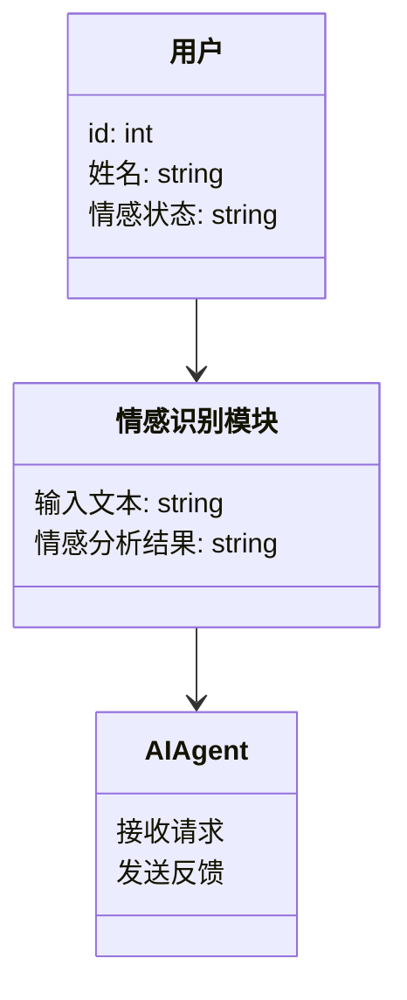
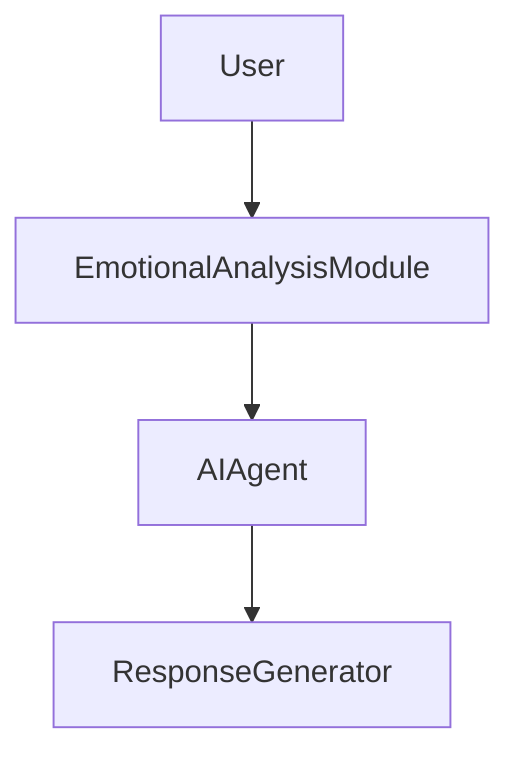

                 


# 构建AI Agent驱动的智能情感陪伴系统

> 关键词：AI Agent, 智能情感陪伴, 情感计算, 深度学习, 自然语言处理, 系统架构

> 摘要：随着人工智能技术的飞速发展，情感陪伴系统逐渐成为人们生活中不可或缺的一部分。本文将详细介绍如何利用AI Agent构建智能情感陪伴系统，涵盖从核心概念到系统架构，从算法原理到项目实战的全过程。我们将从问题背景出发，探讨AI Agent在情感陪伴中的应用价值，并结合具体的技术实现，为读者提供一套完整的解决方案。

---

## 第1章: 智能情感陪伴系统的背景与需求

### 1.1 问题背景

#### 1.1.1 当代人的情感陪伴需求
现代社会节奏快，人们面临的工作和生活压力越来越大，情感陪伴的需求日益增长。传统的情感陪伴方式（如人际交往）存在时间和空间的限制，难以满足现代人的多样化需求。

#### 1.1.2 传统情感陪伴方式的局限性
- 人类情感陪伴的不稳定性：情绪波动、主观性较强。
- 时间与空间的限制：无法随时提供情感支持。
- 成本问题：专业情感陪伴（如心理咨询）门槛较高。

#### 1.1.3 AI技术在情感陪伴中的潜力
AI技术可以提供24/7的实时陪伴，通过自然语言处理和情感计算技术，实现情感支持的智能化和个性化。

### 1.2 问题描述

#### 1.2.1 情感陪伴系统的定义
情感陪伴系统是一种能够识别用户情感状态并提供相应情感支持的智能系统。

#### 1.2.2 系统需要解决的核心问题
- 准确识别用户情感状态。
- 提供个性化的反馈与支持。
- 维护用户隐私与数据安全。

#### 1.2.3 用户需求分析与场景描述
用户场景包括：孤独、压力、焦虑等情感困扰时，需要实时的情感支持。

### 1.3 问题解决与系统目标

#### 1.3.1 AI Agent在情感陪伴中的作用
AI Agent通过自然语言处理和情感计算，实现情感陪伴的智能化和自动化。

#### 1.3.2 系统设计的核心目标
- 提供实时情感支持。
- 实现个性化互动。
- 保护用户隐私与数据安全。

#### 1.3.3 边界与外延
系统不涉及医疗诊断或其他专业领域的情感支持。

### 1.4 概念结构与核心要素

#### 1.4.1 智能情感陪伴系统的组成要素
- 用户交互界面：文本输入、语音交互等。
- 情感识别模块：基于NLP的情感分析。
- AI Agent：负责处理用户请求并生成反馈。
- 数据存储与分析：记录用户情感数据，优化系统性能。

#### 1.4.2 各要素之间的关系
用户通过交互界面与系统互动，情感识别模块分析用户情感状态，AI Agent根据分析结果生成反馈，数据存储与分析模块记录和优化系统行为。

---

## 第2章: AI Agent的核心原理与情感计算技术

### 2.1 AI Agent的基本原理

#### 2.1.1 AI Agent的定义与分类
AI Agent是一种能够感知环境并采取行动以实现目标的智能实体。在情感陪伴系统中，AI Agent主要负责处理用户情感需求。

#### 2.1.2 基于情感计算的AI Agent分类
- 基于规则的AI Agent：通过预定义规则提供情感支持。
- 基于机器学习的AI Agent：通过学习用户数据优化情感支持。

#### 2.1.3 各类AI Agent的特点与应用场景
| 类型         | 特点                     | 应用场景                     |
|--------------|--------------------------|------------------------------|
| 基于规则的AI Agent | 简单易实现，依赖于规则库 | 适用于简单情感支持场景       |
| 基于机器学习的AI Agent | 高度个性化，依赖于数据 | 适用于复杂情感支持场景       |

---

### 2.2 情感计算的核心技术

#### 2.2.1 情感识别与分析
情感识别是通过分析用户输入的文本或语音，判断用户的情感状态（如快乐、悲伤、愤怒等）。

#### 2.2.2 情感推理与预测
基于历史数据和当前情感状态，预测用户未来的情感变化。

#### 2.2.3 情感反馈与生成
根据用户情感状态，生成相应的反馈，如安慰的话语或建议。

---

### 2.3 AI Agent与情感计算的关系

#### 2.3.1 AI Agent在情感计算中的角色
AI Agent是情感计算的核心驱动力，负责处理用户请求并生成反馈。

#### 2.3.2 情感计算对AI Agent的支撑作用
情感计算为AI Agent提供了情感分析和推理的能力。

#### 2.3.3 两者的结合与协同
AI Agent通过情感计算技术，实现对用户情感状态的精准识别与反馈。

---

## 第3章: 情感陪伴系统的算法与数学模型

### 3.1 情感分析算法

#### 3.1.1 基于词袋模型的情感分析
词袋模型是一种简单的情感分析方法，通过统计文本中情感词汇的出现频率，判断情感倾向。

#### 3.1.2 基于词嵌入的情感分析
词嵌入（如Word2Vec）将词语映射为向量，通过向量相似度判断情感倾向。

#### 3.1.3 基于深度学习的情感分析
深度学习模型（如LSTM、Transformer）通过学习长文本的情感上下文，实现更准确的情感分析。

---

### 3.2 情感分析的数学模型

#### 3.2.1 朴素贝叶斯模型
$$ P(y|x) = \frac{P(x|y)P(y)}{P(x)} $$
其中，$y$表示情感类别，$x$表示输入文本。

#### 3.2.2 支持向量机模型
$$ \text{max} \ \frac{1}{2}\|w\|^2 $$
$$ \text{subject to} \ y_i(w \cdot x_i + b) \geq 1 $$
其中，$w$是权重向量，$b$是偏置项，$y_i$是类别标签。

---

## 第4章: 系统分析与架构设计

### 4.1 项目背景

#### 4.1.1 项目介绍
构建一个基于AI Agent的智能情感陪伴系统，提供实时情感支持。

### 4.2 系统功能设计

#### 4.2.1 领域模型设计


### 4.3 系统架构设计

#### 4.3.1 系统架构图


---

## 第5章: 项目实战

### 5.1 环境安装

#### 5.1.1 安装Python和相关库
```bash
pip install numpy
pip install scikit-learn
pip install transformers
```

### 5.2 系统核心实现

#### 5.2.1 情感识别模块实现
```python
from sklearn.feature_extraction.text import TfidfVectorizer
from sklearn.naive_bayes import MultinomialNB

# 初始化向量器和分类器
vectorizer = TfidfVectorizer()
model = MultinomialNB()

# 训练模型
X = vectorizer.fit_transform(X_train)
model.fit(X, y_train)
```

---

## 第6章: 最佳实践

### 6.1 小结
本文详细介绍了如何构建AI Agent驱动的智能情感陪伴系统，从核心概念到系统架构，从算法原理到项目实战，为读者提供了一套完整的解决方案。

### 6.2 注意事项
- 数据隐私保护是系统设计中的重要环节。
- 系统需要不断优化情感识别算法，提高准确率。

### 6.3 拓展阅读
建议读者进一步学习自然语言处理和深度学习的相关知识，以更好地优化情感陪伴系统。

---

通过以上内容，我们详细讲解了如何构建一个基于AI Agent的智能情感陪伴系统，从理论到实践，帮助读者掌握核心技术和实现方法。

