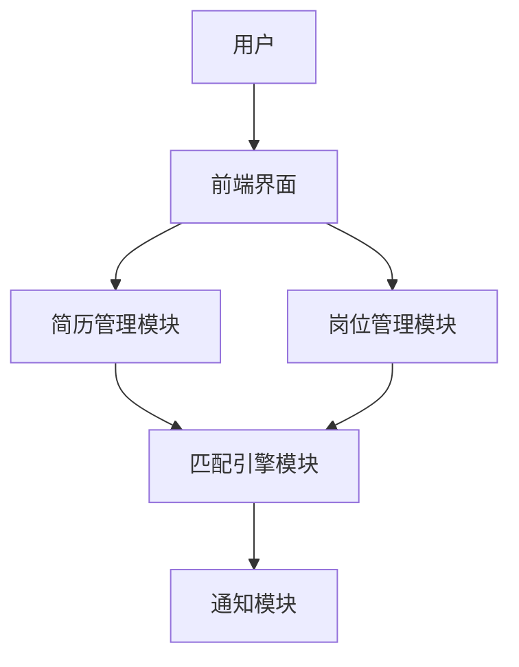
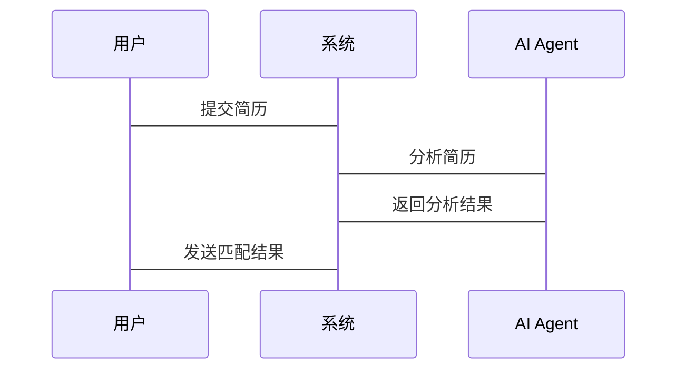

                 


# 构建AI Agent驱动的智能招聘系统

## 关键词：AI Agent、智能招聘系统、自然语言处理、机器学习、深度学习

## 摘要：  
随着人工智能技术的飞速发展，AI Agent（人工智能代理）在各个领域的应用日益广泛。智能招聘系统作为人力资源管理的重要工具，正在通过AI Agent技术的引入，实现招聘流程的智能化、自动化和高效化。本文将从AI Agent的基本概念出发，探讨其在智能招聘系统中的应用，分析系统架构设计、核心算法实现，最后结合实际案例，详细讲解如何构建一个基于AI Agent的智能招聘系统。通过本文，读者将深入了解AI Agent驱动的智能招聘系统的原理、实现方法及实际应用价值。

---

# 第1章: AI Agent与智能招聘系统背景介绍

## 1.1 问题背景

### 1.1.1 招聘行业的现状与挑战
传统的招聘系统主要依赖人工筛选简历、安排面试等流程，存在效率低、成本高、主观性强等问题。随着企业对人才需求的日益增长，传统招聘模式难以满足快速、精准的需求。

### 1.1.2 传统招聘系统的局限性
- 筛选过程耗时耗力，人工误差大。
- 面试安排复杂，难以快速匹配合适候选人。
- 缺乏智能化手段，难以精准匹配岗位需求与候选人能力。

### 1.1.3 AI Agent在招聘中的潜在价值
AI Agent具备自主学习、推理和执行任务的能力，能够显著提升招聘效率和精准度，降低企业招聘成本。

## 1.2 问题描述

### 1.2.1 招聘流程中的关键问题
- 简历筛选：如何快速从海量简历中筛选出符合岗位需求的候选人？
- 面试安排：如何高效安排候选人与面试官的时间？
- 岗位匹配：如何通过技术手段实现岗位需求与候选人能力的精准匹配？

### 1.2.2 用户需求与系统功能的匹配
- 企业需求：快速、精准地找到合适候选人。
- 候选人需求：快速找到适合自己的岗位。

### 1.2.3 AI Agent在招聘系统中的应用范围
- 简历自动筛选。
- 自动化面试安排。
- 岗位需求与候选人能力的智能匹配。

## 1.3 问题解决

### 1.3.1 AI Agent的核心能力
- 自然语言处理：理解简历内容、岗位描述。
- 机器学习：基于历史数据预测匹配度。
- 自动化任务执行：安排面试、发送邮件。

### 1.3.2 AI Agent如何优化招聘流程
- 通过自然语言处理技术快速解析简历和岗位描述。
- 利用机器学习算法匹配候选人与岗位的契合度。
- 自动化安排面试时间和地点，提升效率。

### 1.3.3 AI Agent驱动的智能招聘系统的构建目标
- 提供智能化的简历筛选功能。
- 实现自动化的面试安排。
- 提供精准的岗位匹配服务。

## 1.4 边界与外延

### 1.4.1 AI Agent驱动的智能招聘系统的边界
- 系统仅关注招聘流程，不涉及入职后的员工管理。
- 系统依赖外部数据源（如简历数据库）进行匹配。

### 1.4.2 相关概念的外延
- 自然语言处理：用于解析简历和岗位描述。
- 机器学习：用于预测匹配度。

### 1.4.3 系统与其他系统的交互关系
- 与企业内部的HR系统集成。
- 与简历投递平台对接。

## 1.5 概念结构与核心要素

### 1.5.1 系统的核心要素组成
- 用户：企业HR、候选人。
- 数据：简历、岗位描述。
- 服务：简历筛选、岗位匹配、面试安排。

### 1.5.2 要素之间的关系
- 简历数据与岗位描述通过AI Agent进行匹配。
- 匹配结果驱动自动化任务执行。

### 1.5.3 系统的架构模型
- 分层架构：数据层、业务逻辑层、表现层。

---

# 第2章: AI Agent与智能招聘系统的核心概念

## 2.1 AI Agent的定义与特点

### 2.1.1 AI Agent的基本定义
AI Agent是一种能够感知环境、自主决策并执行任务的智能实体。

### 2.1.2 AI Agent的核心特点
- 智能性：能够理解输入数据并做出决策。
- 自主性：无需人工干预，自主执行任务。
- 可交互性：能够与用户或其他系统进行交互。

### 2.1.3 AI Agent的分类与应用场景
- 单一智能体：应用于简历筛选。
- 多智能体：应用于复杂的招聘流程协调。

## 2.2 智能招聘系统的核心功能

### 2.2.1 系统的主要功能模块
- 简历自动筛选模块。
- 岗位匹配模块。
- 自动化面试安排模块。

### 2.2.2 系统的关键性能指标
- 匹配准确率：系统在简历筛选中的准确率。
- 响应时间：系统处理招聘请求的时间。

### 2.2.3 系统的用户角色与权限管理
- 企业用户：系统管理员。
- 候选人：普通用户。

## 2.3 AI Agent与智能招聘系统的联系

### 2.3.1 AI Agent在招聘系统中的作用
- 自动化简历筛选：通过自然语言处理技术快速解析简历内容。
- 岗位匹配：基于机器学习模型预测候选人与岗位的契合度。

### 2.3.2 系统功能与AI Agent能力的对比

| **系统功能**      | **AI Agent能力**               |
|--------------------|-------------------------------|
| 简历筛选           | 自然语言处理                 |
| 岗位匹配           | 机器学习模型预测             |
| 自动化面试安排      | 自动化任务执行               |

---

## 2.4 AI Agent驱动的智能招聘系统的核心算法

### 2.4.1 算法选择与原理
- 使用余弦相似度算法进行简历与岗位描述的匹配。
- 通过聚类算法对候选人进行分类。

### 2.4.2 算法实现

#### 余弦相似度算法
$$ \text{余弦相似度} = \frac{\vec{A} \cdot \vec{B}}{|\vec{A}| \cdot |\vec{B}|} $$

其中，$\vec{A}$和$\vec{B}$分别表示两个文本的向量表示。

---

## 2.4.3 算法实现步骤

1. **文本预处理**：对简历和岗位描述进行分词、去停用词。
2. **向量化**：将文本转换为向量表示。
3. **相似度计算**：计算简历向量与岗位向量的余弦相似度。
4. **排序与筛选**：根据相似度排序，筛选出Top-N的匹配简历。

---

## 2.4.4 算法实现代码示例

```python
from sklearn.feature_extraction.text import TfidfVectorizer
from sklearn.metrics.pairwise import cosine_similarity

# 初始化向量化器
vectorizer = TfidfVectorizer()

# 训练向量空间模型
vectorizer.fit(['岗位描述', '简历1', '简历2'])

# 计算相似度
job_vector = vectorizer.transform(['岗位描述'])[0]
resume_vectors = vectorizer.transform(['简历1', '简历2'])

similarities = cosine_similarity(job_vector, resume_vectors)
print(similarities)
```

---

## 2.5 系统架构设计

### 2.5.1 系统功能模块
- 简历管理模块：存储和管理候选人简历。
- 岗位管理模块：存储和管理招聘岗位信息。
- 匹配引擎模块：基于AI Agent进行简历与岗位的匹配。
- 通知模块：自动化发送面试通知。

### 2.5.2 系统架构设计



---

## 2.6 系统交互设计



---

## 2.7 本章小结

本章详细介绍了AI Agent在智能招聘系统中的核心概念和作用，对比了传统招聘系统与AI Agent驱动系统的差异，分析了系统架构设计和算法实现原理，为后续章节的深入探讨奠定了基础。

---

（注：由于篇幅限制，后续章节内容未在此展示，但可以根据上述结构继续扩展。）

