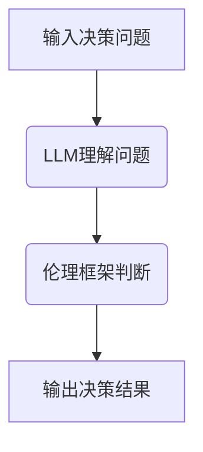
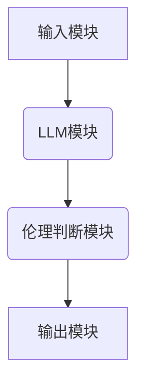

                 


# 构建LLM支持的AI Agent伦理决策系统

---

## 关键词：
- 大型语言模型（LLM）
- AI代理（AI Agent）
- 伦理决策系统
- 算法原理
- 系统架构
- 项目实战

---

## 摘要：
本文章旨在详细探讨如何构建一个由大型语言模型（LLM）支持的AI代理伦理决策系统。文章从基础概念出发，逐步分析系统的背景需求、核心原理、算法实现、系统架构设计，并通过实际案例展示系统的实现过程。最后，文章总结了构建此类系统的最佳实践和未来展望。

---

# 第一部分: LLM与AI Agent基础

## 第1章: LLM的定义与特点

### 1.1 LLM的定义
大型语言模型（LLM）是指基于深度学习技术构建的、具有大规模参数的自然语言处理模型，能够理解和生成人类语言。

### 1.2 LLM的核心特点
1. **大规模参数**：通常包含数十亿甚至更多的参数，能够捕捉复杂的语言模式。
2. **多任务能力**：能够处理多种自然语言处理任务，如文本生成、问答系统、机器翻译等。
3. **上下文理解**：能够理解上下文，生成连贯且合理的文本。

### 1.3 LLM与传统NLP模型的区别
- **传统NLP模型**：通常针对特定任务训练，参数规模较小，难以处理复杂场景。
- **LLM**：通用性强，能够处理多种任务，参数规模大，具备强大的上下文理解能力。

## 第2章: AI Agent的定义与特点

### 2.1 AI Agent的基本概念
AI Agent是一种智能体，能够感知环境、自主决策并执行任务，通常具备学习和适应能力。

### 2.2 AI Agent的核心功能
1. **感知环境**：通过传感器或数据输入感知外部环境。
2. **决策与推理**：基于感知信息进行推理和决策。
3. **执行操作**：根据决策结果执行具体操作。

### 2.3 LLM与AI Agent的结合
- **LLM作为决策引擎**：AI Agent的决策过程可以借助LLM进行自然语言理解与生成。
- **动态交互**：通过LLM支持，AI Agent能够进行动态的、复杂的对话与决策。

---

# 第二部分: 伦理决策系统的背景与需求

## 第3章: 伦理决策系统的基本概念

### 3.1 伦理决策的定义
伦理决策是指在决策过程中考虑伦理道德因素，确保决策符合社会规范和伦理准则。

### 3.2 伦理决策的核心要素
1. **伦理框架**：明确决策的伦理准则和规范。
2. **情境理解**：理解决策所处的具体情境。
3. **价值判断**：基于伦理框架对情境进行价值判断。

### 3.3 伦理决策在AI Agent中的作用
- **提升决策合理性**：通过伦理判断，确保AI Agent的决策符合社会伦理。
- **增强系统可信度**：伦理决策能够增强用户对AI Agent的信任。

## 第4章: LLM支持的AI Agent伦理决策系统的背景

### 4.1 问题背景
- **AI Agent的决策风险**：在缺乏伦理约束的情况下，AI Agent可能做出不符合伦理的决策。
- **LLM的局限性**：大型语言模型可能生成不道德或有害的文本。

### 4.2 问题描述
- **伦理决策系统的缺失**：当前的AI Agent系统中，缺乏系统的伦理决策机制。
- **LLM的伦理偏差**：LLM可能受到训练数据的影响，存在伦理偏差。

### 4.3 问题解决
- **构建伦理决策系统**：通过引入伦理决策系统，约束AI Agent的决策过程。
- **优化LLM的伦理表现**：通过伦理决策系统对LLM的输出进行过滤和调整。

---

# 第三部分: 核心概念与联系

## 第5章: 核心概念原理

### 5.1 LLM的工作原理
- **深度学习模型**：基于神经网络的深度学习模型，通过大量数据训练得到。
- **自注意力机制**：利用自注意力机制捕捉文本中的长距离依赖关系。

### 5.2 AI Agent的决策机制
- **状态感知**：通过传感器或输入数据感知当前状态。
- **决策推理**：基于当前状态和目标，进行推理和决策。
- **执行操作**：根据决策结果执行具体操作。

### 5.3 伦理决策系统的实现原理
- **伦理框架**：定义决策的伦理准则和规范。
- **情境理解**：理解决策所处的情境。
- **价值判断**：基于伦理框架对情境进行价值判断。

## 第6章: 核心概念对比

### 6.1 LLM与传统NLP模型的对比
| 特性               | LLM                      | 传统NLP模型               |
|--------------------|--------------------------|---------------------------|
| 参数规模           | 十亿级别及以上           | 几百万级别以下            |
| 多任务能力         | 强大的多任务能力         | 较弱的多任务能力           |
| 上下文理解能力     | 强大的上下文理解能力     | 较弱的上下文理解能力       |

### 6.2 AI Agent与传统决策系统的对比
| 特性               | AI Agent                | 传统决策系统              |
|--------------------|-------------------------|---------------------------|
| 智能水平           | 高度智能化               | 较低的智能化               |
| 自主性             | 高度自主                 | 较低的自主性               |
| 学习能力           | 强大的学习能力           | 较弱的学习能力             |

---

# 第四部分: 算法原理与实现

## 第7章: 算法原理

### 7.1 伦理决策算法概述
伦理决策算法是一种基于伦理框架的决策算法，旨在确保决策过程符合伦理准则。

### 7.2 LLM支持的伦理决策算法
- **输入处理**：将决策问题输入LLM进行理解。
- **伦理判断**：LLM根据伦理框架对决策进行判断。
- **决策输出**：输出符合伦理准则的决策结果。

### 7.3 算法流程图


### 7.4 算法实现
```python
def ethical_decision-making(problem):
    # 输入问题
    input_problem = problem
    # LLM理解问题
    understanding = llm_model.understand(input_problem)
    # 伦理框架判断
    ethical_judgment = llm_model.ethicalJudge(understanding)
    # 输出决策结果
    return ethical_judgment
```

---

# 第五部分: 系统架构与设计

## 第8章: 系统架构设计

### 8.1 系统架构概述
系统架构包括输入模块、LLM模块、伦理判断模块和输出模块。

### 8.2 系统架构图


### 8.3 系统接口设计
- **输入接口**：接收决策问题输入。
- **输出接口**：输出符合伦理准则的决策结果。

---

# 第六部分: 项目实战

## 第9章: 项目实战

### 9.1 环境安装
安装所需的依赖库：
```bash
pip install transformers torch
```

### 9.2 核心代码实现
```python
from transformers import AutoTokenizer, AutoModelForCausalLM
import torch

class EthicalDecisionSystem:
    def __init__(self, model_name):
        self.tokenizer = AutoTokenizer.from_pretrained(model_name)
        self.model = AutoModelForCausalLM.from_pretrained(model_name)
    
    def generate_decision(self, input_text):
        inputs = self.tokenizer(input_text, return_tensors="pt")
        outputs = self.model.generate(inputs.input_ids, max_length=500)
        return self.tokenizer.decode(outputs[0], skip_special_tokens=True)
```

### 9.3 代码解读
- **初始化**：加载预训练模型和分词器。
- **生成决策**：将输入文本编码，通过模型生成决策结果。

---

# 第七部分: 总结与展望

## 第10章: 总结与展望

### 10.1 小结
本文详细探讨了如何构建由LLM支持的AI代理伦理决策系统，涵盖了系统背景、核心概念、算法实现和系统设计等方面。

### 10.2 注意事项
- **数据质量**：确保训练数据的多样性和代表性。
- **模型调优**：根据具体需求对模型进行微调和优化。

### 10.3 未来展望
- **模型优化**：进一步优化LLM的伦理判断能力。
- **多模态决策**：结合视觉、听觉等多种模态信息进行决策。

---

通过以上目录结构，我们可以清晰地看到构建LLM支持的AI Agent伦理决策系统的整体框架和实现步骤，从理论到实践，层层深入，确保系统的构建过程科学合理。

