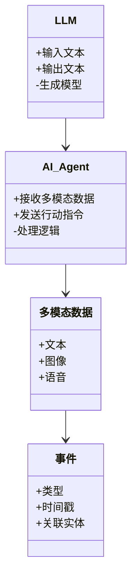
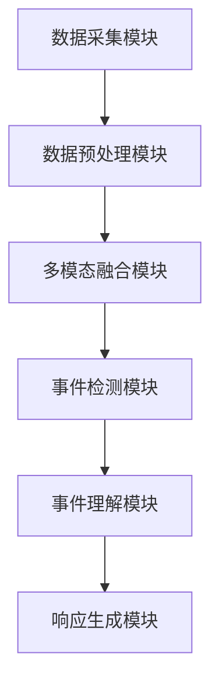
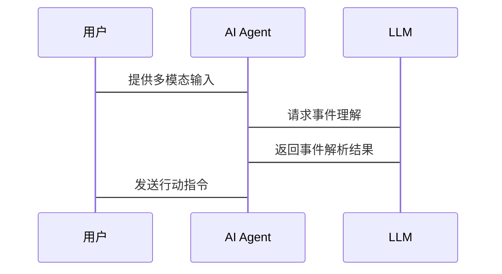

                 


# 《构建LLM支持的AI Agent多模态事件理解》

## 关键词：
- 大语言模型（LLM）
- AI Agent
- 多模态事件理解
- 人机交互
- 多模态数据融合

## 摘要：
本文详细探讨了如何利用大语言模型（LLM）构建支持多模态事件理解的AI Agent。文章从背景、核心概念、算法原理、系统架构到项目实战，全面分析了构建这一系统的关键步骤和方法。通过实际案例分析，展示了LLM在多模态数据处理和事件理解中的优势，帮助读者理解如何将这些技术应用于实际场景中。文章最后总结了最佳实践和未来研究方向。

---

# 第四章: 系统分析与架构设计

## 4.1 项目背景介绍
多模态事件理解系统旨在通过整合文本、图像、语音等多种数据源，实现对复杂事件的全面理解和响应。该系统适用于智能客服、智能家居、自动驾驶等多种场景，能够提高AI Agent的交互能力和决策水平。

## 4.2 系统功能设计
### 4.2.1 功能模块划分
系统功能模块包括：
1. 数据采集模块：接收多模态输入数据。
2. 数据预处理模块：清洗和格式化数据。
3. 多模态融合模块：整合不同数据源。
4. 事件检测模块：识别关键事件。
5. 事件理解模块：解析事件语义。
6. 响应生成模块：生成对应的行动指令。

### 4.2.2 领域模型设计
使用Mermaid绘制领域模型类图：


## 4.3 系统架构设计
### 4.3.1 分层架构设计
系统采用分层架构，包括数据层、业务逻辑层和表示层。

#### 数据层
- 数据采集模块：通过API接口接收多模态数据。
- 数据存储模块：将数据存储到数据库中。

#### 业务逻辑层
- 多模态融合模块：整合文本、图像、语音数据。
- 事件检测模块：识别关键事件。
- 事件理解模块：解析事件语义。

#### 表示层
- 用户界面：展示事件理解和处理结果。
- API接口：提供与其他系统的交互接口。

### 4.3.2 模块交互流程
使用Mermaid绘制系统架构图：


## 4.4 系统接口设计
### 4.4.1 输入接口
- 文本输入接口：支持自然语言输入。
- 图像输入接口：支持图片数据输入。
- 语音输入接口：支持语音识别结果输入。

### 4.4.2 输出接口
- 行动指令输出接口：生成AI Agent的执行指令。
- 反馈输出接口：返回事件理解和处理结果。

## 4.5 系统交互设计
使用Mermaid绘制交互序列图：


## 4.6 本章小结
本章详细介绍了系统的架构设计，包括功能模块划分、数据流设计、接口设计和交互流程。通过分层架构和模块化设计，确保了系统的可扩展性和可维护性。

---

# 第五章: 项目实战

## 5.1 环境安装与配置
### 5.1.1 安装Python环境
```bash
python --version
pip install --upgrade pip
```

### 5.1.2 安装依赖库
```bash
pip install transformers torch
```

## 5.2 核心代码实现
### 5.2.1 LLM模型的调用
```python
from transformers import AutoTokenizer, AutoModelForCausalLM

tokenizer = AutoTokenizer.from_pretrained("gpt2")
model = AutoModelForCausalLM.from_pretrained("gpt2")

inputs = tokenizer("hello, how are you?", return_tensors="pt")
outputs = model.generate(inputs.input_ids, max_length=50)
print(tokenizer.decode(outputs[0], skip_special_tokens=True))
```

### 5.2.2 多模态数据的处理
```python
import cv2
import torch

# 图像预处理
def preprocess_image(image_path):
    img = cv2.imread(image_path)
    img = cv2.resize(img, (224, 224))
    img = img.transpose((2, 0, 1))
    img = torch.FloatTensor(img)
    return img

# 文本预处理
def preprocess_text(text):
    return tokenizer(text, return_tensors="pt")

## 5.2.3 事件理解的实现
```python
def multi_modal_event_understanding():
    text = "The cat is sitting on the mat."
    text_input = tokenizer(text, return_tensors="pt")
    image_input = preprocess_image("cat_on_mat.jpg")

    # 调用LLM进行事件理解
    outputs = model.generate(text_input.input_ids, max_length=50)
    print(tokenizer.decode(outputs[0], skip_special_tokens=True))
```

## 5.3 案例分析
### 5.3.1 案例背景
以智能家居环境监控为例，分析如何通过多模态数据理解“火灾”事件。

### 5.3.2 数据处理
- 文本数据：烟雾报警器触发的警报信息。
- 图像数据：烟雾检测摄像头捕捉的图像。
- 语音数据：家庭成员的呼救声音。

### 5.3.3 系统响应
AI Agent通过多模态数据融合，识别出“火灾”事件，并生成相应的行动指令，如“打开应急灯”、“拨打急救电话”等。

## 5.4 代码实现与解读
### 5.4.1 代码实现
```python
# 整合多模态数据
def integrate_multi_modal():
    text = "烟雾报警器触发！"
    text_input = tokenizer(text, return_tensors="pt")
    image_input = preprocess_image("smoke_detector.jpg")
    
    # 调用LLM进行事件理解
    outputs = model.generate(text_input.input_ids, max_length=50)
    print(tokenizer.decode(outputs[0], skip_special_tokens=True))
    
    # 生成行动指令
    action_output = model.generate(image_input, max_length=30)
    print(tokenizer.decode(action_output[0], skip_special_tokens=True))
```

### 5.4.2 代码解读
1. **文本处理**：将烟雾报警信息输入LLM，生成警报解读。
2. **图像处理**：将烟雾图像输入模型，生成视觉理解结果。
3. **事件理解**：整合文本和图像信息，识别出“火灾”事件。
4. **行动指令生成**：根据事件理解结果，生成相应的行动指令。

## 5.5 本章小结
本章通过实际案例展示了如何利用LLM支持的AI Agent进行多模态事件理解。通过代码实现和案例分析，帮助读者理解系统的实际应用和实现细节。

---

# 第六章: 总结与最佳实践

## 6.1 总结
本文详细探讨了构建LLM支持的AI Agent多模态事件理解系统的各个方面，包括背景、核心概念、算法原理、系统架构和项目实战。通过实际案例分析，展示了该技术在多个场景中的应用潜力。

## 6.2 最佳实践
1. **数据处理**：确保多模态数据的高质量和一致性。
2. **模型选择**：根据具体场景选择合适的LLM模型。
3. **系统设计**：采用模块化设计，便于扩展和维护。
4. **交互设计**：注重用户体验，优化系统交互流程。

## 6.3 注意事项
- 数据隐私：确保多模态数据的隐私安全。
- 模型性能：关注模型的推理速度和资源消耗。
- 边界条件：明确系统的适用范围和限制。

## 6.4 拓展阅读
- 《Large Language Models for Multimodal Understanding》
- 《AI Agent Design Patterns》
- 《Event-Driven Architectures》

## 6.5 本章小结
通过本文的探讨，读者可以全面了解构建LLM支持的AI Agent多模态事件理解系统的各个方面，并能够将其应用到实际场景中。

---

# 结语

构建LLM支持的AI Agent多模态事件理解系统是一项复杂而有趣的任务。通过本文的详细讲解，读者可以掌握该系统的背景、核心概念、算法原理、系统架构和项目实战。希望本文能够为相关领域的研究和实践提供有价值的参考和启发。

---

