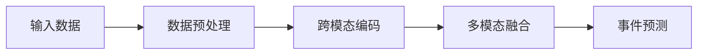
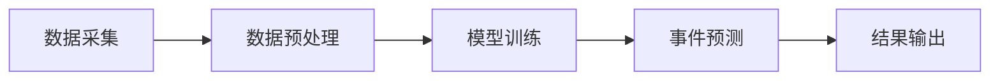
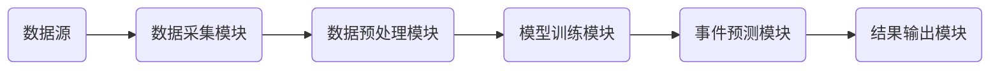
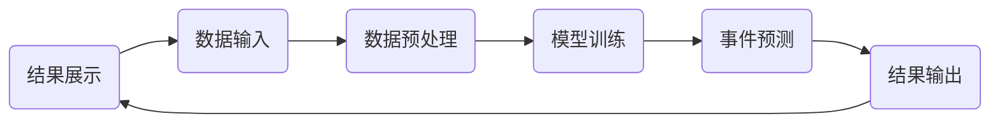

                 


# 构建LLM支持的AI Agent多模态事件预测

> 关键词：LLM, AI Agent, 多模态事件预测, 大语言模型, 多模态数据, 事件预测, AI系统架构

> 摘要：本文将详细探讨如何构建一个基于大语言模型（LLM）支持的AI Agent，用于多模态数据的事件预测。通过结合LLM的强大语言理解和生成能力，以及AI Agent的自主决策和执行能力，本文将系统地介绍多模态事件预测的核心概念、算法原理、系统架构设计，以及实际项目实现的关键步骤。通过本文，读者将能够全面理解并掌握如何利用LLM构建高效的多模态事件预测系统。

---

# 第一部分: 构建LLM支持的AI Agent多模态事件预测背景介绍

## 第1章: 多模态事件预测的背景与问题描述

### 1.1 多模态事件预测的背景

#### 1.1.1 当前AI技术的发展趋势
近年来，人工智能（AI）技术发展迅速，尤其是在大语言模型（LLM）领域，如GPT-3、GPT-4等模型的出现，使得自然语言处理（NLP）能力得到了质的飞跃。与此同时，AI Agent（智能体）技术也在逐步成熟，其在自动驾驶、智能助手、机器人等领域展现出巨大的潜力。多模态数据的融合与分析成为当前AI研究的热点方向。

#### 1.1.2 多模态数据的兴起
传统的AI系统主要依赖单一类型的数据，如文本或图像。然而，现实世界中的数据往往是多模态的，例如，一个视频数据中包含文本描述、图像信息和语音信号。多模态数据的融合能够提供更全面的信息，从而提高AI系统的决策能力。

#### 1.1.3 事件预测在实际应用中的重要性
事件预测是AI系统的核心任务之一，广泛应用于金融风险评估、医疗诊断、交通管理、社交媒体分析等领域。通过准确预测事件，AI系统可以帮助用户做出更明智的决策，从而提高效率并降低成本。

### 1.2 多模态事件预测的定义与特点

#### 1.2.1 多模态数据的定义
多模态数据指的是多种类型的数据形式，包括文本、图像、语音、视频、结构化数据等。这些数据形式各自具有独特的信息特征，能够互补地提供更全面的视角。

#### 1.2.2 事件预测的核心概念
事件预测是指根据历史数据和当前状态，预测未来可能发生的事件及其概率。在多模态场景下，事件预测需要结合多种数据源的信息，以提高预测的准确性和可靠性。

#### 1.2.3 多模态事件预测的独特优势
多模态事件预测能够充分利用不同类型数据的优势，避免单一数据源的局限性。例如，在社交媒体情绪分析中，结合文本、图像和语音信息可以更准确地预测用户的情感倾向。

### 1.3 问题背景与挑战

#### 1.3.1 当前事件预测的主要问题
传统的事件预测方法通常依赖单一数据源，导致预测结果的准确性和鲁棒性不足。此外，复杂场景下的多模态数据融合也是一个技术难点。

#### 1.3.2 多模态数据融合的难点
多模态数据的异构性和复杂性增加了数据融合的难度。如何有效地将不同类型的模态数据进行融合，以提取有用的特征，是当前研究的重点。

#### 1.3.3 LLM在事件预测中的作用
大语言模型（LLM）具有强大的文本理解和生成能力，能够从大量文本数据中提取有用的信息。结合LLM的能力，可以显著提升多模态事件预测的准确性和效率。

## 第2章: LLM与AI Agent的结合

### 2.1 大语言模型（LLM）的核心能力

#### 2.1.1 LLM的定义与技术特点
大语言模型是一种基于深度学习的自然语言处理模型，具有以下特点：
- **大规模训练数据**：通常使用数百万甚至数十亿的文本数据进行训练。
- **强大的上下文理解能力**：能够理解和生成复杂语言结构。
- **多任务学习能力**：可以在多种任务上进行训练，如翻译、问答、文本摘要等。

#### 2.1.2 LLM在自然语言处理中的应用
LLM在NLP领域具有广泛的应用，包括：
- 机器翻译
- 文本生成
- 情感分析
- 问答系统
- 命名实体识别

#### 2.1.3 LLM的局限性与改进方向
尽管LLM具有强大的能力，但也存在一些局限性：
- 计算资源需求高
- 对训练数据的质量依赖性强
- 难以处理实时性和动态性要求高的任务

### 2.2 AI Agent的基本概念与功能

#### 2.2.1 AI Agent的定义与分类
AI Agent是一种能够感知环境、自主决策并执行任务的智能实体。根据功能和应用场景的不同，AI Agent可以分为：
- **简单反射型Agent**：基于规则做出反应
- **基于模型的反射型Agent**：基于环境模型做出决策
- **目标驱动型Agent**：根据目标采取行动
- **实用驱动型Agent**：根据效用函数优化决策

#### 2.2.2 AI Agent的核心功能模块
AI Agent通常包含以下功能模块：
- **感知模块**：获取环境中的多模态数据
- **决策模块**：根据感知数据做出决策
- **执行模块**：执行决策并输出结果
- **学习模块**：通过经验优化自身的决策能力

#### 2.2.3 AI Agent在多模态场景中的优势
在多模态场景中，AI Agent能够综合利用多种数据源的信息，从而提高决策的准确性和鲁棒性。例如，在自动驾驶中，AI Agent可以结合视觉、雷达和激光雷达等多种传感器的数据，做出更安全的驾驶决策。

### 2.3 LLM与AI Agent的结合

#### 2.3.1 LLM作为AI Agent的核心组件
LLM可以作为AI Agent的“大脑”，负责处理和分析多模态数据。通过LLM的强大语言理解能力，AI Agent能够更好地理解和解释环境中的信息。

#### 2.3.2 多模态事件预测中的LLM角色
在多模态事件预测中，LLM主要负责以下任务：
- **文本信息的理解与生成**：分析文本数据并生成相关的预测结果。
- **跨模态信息的融合**：将文本、图像、语音等多种模态数据进行融合，以提高预测的准确性。
- **动态环境的适应**：根据实时变化的多模态数据，动态调整预测模型。

#### 2.3.3 当前研究与应用现状
当前，LLM支持的AI Agent在多个领域得到了广泛应用，如智能客服、智能助手、智能监控等。然而，如何进一步提升多模态数据的融合效率和预测精度，仍然是一个需要深入研究的问题。

---

# 第二部分: 多模态事件预测的核心概念与联系

## 第3章: 多模态数据与事件预测的关系

### 3.1 多模态数据的类型与特点

#### 3.1.1 文本数据
文本数据是最早被广泛研究的数据类型，具有以下特点：
- **丰富性**：能够表达复杂的情感和意图。
- **歧义性**：文本信息可能存在多种解释方式。

#### 3.1.2 图像数据
图像数据是计算机视觉领域的核心研究对象，具有以下特点：
- **视觉性**：能够提供物体的空间信息。
- **多样性**：包括RGB图像、深度图像等多种形式。

#### 3.1.3 语音数据
语音数据是语音识别和语音合成的核心研究对象，具有以下特点：
- **时间性**：语音信息具有时间依赖性。
- **连续性**：语音信号是连续的时序数据。

#### 3.1.4 结构化数据
结构化数据通常以表格或数据库的形式存在，具有以下特点：
- **规则性**：数据具有明确的结构和格式。
- **可计算性**：便于进行数学运算和统计分析。

### 3.2 多模态数据融合的原理

#### 3.2.1 数据融合的定义与方法
数据融合是指将多种类型的数据进行结合，以获得更全面的信息。常见的数据融合方法包括：
- **早期融合**：在数据预处理阶段进行融合。
- **晚期融合**：在特征提取或模型预测阶段进行融合。

#### 3.2.2 多模态数据融合的挑战
多模态数据融合面临以下挑战：
- **数据异构性**：不同类型的数据具有不同的特征空间。
- **数据量差异**：不同类型的数据在数量和质量上可能差异较大。
- **计算复杂性**：多模态数据的融合通常需要复杂的计算。

#### 3.2.3 基于LLM的多模态数据融合策略
结合LLM的能力，可以采用以下策略：
- **跨模态编码**：将不同模态的数据编码为统一的向量表示。
- **多任务学习**：在同一个模型中同时处理多种模态数据。
- **动态融合**：根据实时数据动态调整融合策略。

### 3.3 事件预测的核心要素

#### 3.3.1 事件的定义与分类
事件可以定义为在一定时间内发生的事情或变化。根据不同的应用场景，事件可以分为多种类型，例如：
- **时间序列事件**：如股票价格波动、天气变化。
- **空间事件**：如交通拥堵、火灾发生。
- **语义事件**：如用户情感变化、意图识别。

#### 3.3.2 事件预测的关键因素
事件预测的关键因素包括：
- **数据特征**：数据的类型、分布和质量。
- **模型选择**：模型的结构和参数设置。
- **预测目标**：预测的粒度和时间范围。

#### 3.3.3 多模态数据在事件预测中的作用
多模态数据能够提供更全面的事件特征，从而提高预测的准确性和鲁棒性。例如，在交通管理中，结合图像数据和文本数据可以更准确地预测交通事故的发生。

## 第4章: LLM与多模态数据的关联

### 4.1 多模态数据对LLM的影响

#### 4.1.1 多模态数据的引入对LLM能力的提升
通过引入多模态数据，LLM可以更好地理解上下文信息，从而提高文本理解和生成的准确性和相关性。

#### 4.1.2 多模态数据对LLM训练的影响
多模态数据的引入可以丰富训练数据的多样性，从而提高LLM的泛化能力和适应性。

#### 4.1.3 多模态数据对LLM推理的影响
在推理阶段，多模态数据可以帮助LLM更好地理解复杂场景，从而做出更准确的预测。

### 4.2 LLM对多模态事件预测的影响

#### 4.2.1 LLM对多模态数据融合的促进作用
LLM的强大语言理解能力可以为多模态数据的融合提供新的思路和方法。

#### 4.2.2 LLM对事件预测精度的提升
通过结合LLM的能力，可以显著提高多模态事件预测的精度和效率。

#### 4.2.3 LLM对事件预测实时性的增强
LLM的快速推理能力可以支持实时的多模态事件预测，从而满足动态环境的需求。

### 4.3 多模态数据与LLM的结合方式

#### 4.3.1 基于LLM的跨模态编码
跨模态编码是指将不同模态的数据编码为统一的向量表示，从而实现模态间的交互和融合。

#### 4.3.2 基于LLM的多任务学习
多任务学习是一种通过同时学习多个任务来提高模型泛化能力的方法。在多模态事件预测中，可以通过多任务学习同时处理多种模态数据。

#### 4.3.3 基于LLM的动态融合
动态融合是一种根据实时数据变化调整融合策略的方法，能够提高事件预测的适应性和灵活性。

---

# 第三部分: 多模态事件预测的算法原理

## 第5章: 多模态事件预测的算法原理

### 5.1 基于LLM的多模态融合算法

#### 5.1.1 算法概述
基于LLM的多模态融合算法通常包括以下几个步骤：
1. **数据预处理**：将不同模态的数据进行标准化和格式统一。
2. **跨模态编码**：将不同模态的数据编码为统一的向量表示。
3. **多模态融合**：将不同模态的编码向量进行融合，提取有用的特征。
4. **事件预测**：基于融合后的特征，进行事件预测。

#### 5.1.2 算法流程图


#### 5.1.3 核心算法代码示例
以下是一个基于LLM的多模态融合算法的Python代码示例：
```python
import torch
import torch.nn as nn
import torch.optim as optim

class MultiModalFuser(nn.Module):
    def __init__(self, embed_dim, hidden_dim):
        super().__init__()
        self.modals = nn.ModuleList([
            nn.Linear(embed_dim, hidden_dim),
            nn.Linear(embed_dim, hidden_dim),
            nn.Linear(embed_dim, hidden_dim)
        ])
        self.fc = nn.Linear(hidden_dim * 3, 1)

    def forward(self, x1, x2, x3):
        x1 = self.modals[0](x1)
        x2 = self.modals[1](x2)
        x3 = self.modals[2](x3)
        x = torch.cat([x1, x2, x3], dim=-1)
        x = self.fc(x)
        return x

model = MultiModalFuser(embed_dim=512, hidden_dim=256)
criterion = nn.BCEWithLogitsLoss()
optimizer = optim.Adam(model.parameters(), lr=0.001)
```

### 5.2 多模态数据融合的数学模型

#### 5.2.1 概率分布与事件预测
事件预测可以通过概率分布来建模。假设我们有多个模态的数据，每个模态的数据都有其对应的概率分布。通过将这些概率分布进行融合，可以得到最终的事件概率分布。

#### 5.2.2 融合模型的数学表达
假设我们有三种模态的数据，分别为X₁、X₂、X₃，对应的概率分布为P₁、P₂、P₃。融合后的概率分布P可以表示为：
$$
P = \alpha P₁ + \beta P₂ + \gamma P₃
$$
其中，α、β、γ是融合权重，满足α + β + γ = 1。

#### 5.2.3 损失函数与优化
常用的损失函数包括交叉熵损失和均方误差损失。以下是一个交叉熵损失的示例：
$$
L = -\frac{1}{N}\sum_{i=1}^{N} \sum_{j=1}^{M} y_{ij} \log p(y_{ij})
$$

---

# 第四部分: 系统分析与架构设计

## 第6章: 系统分析与架构设计

### 6.1 问题场景介绍

#### 6.1.1 项目背景
本项目旨在构建一个基于LLM支持的AI Agent，用于多模态数据的事件预测。项目的核心目标是提高事件预测的准确性和效率。

#### 6.1.2 项目目标
- 实现多模态数据的融合与分析。
- 构建高效的事件预测模型。
- 提供用户友好的接口和交互方式。

### 6.2 系统功能设计

#### 6.2.1 系统功能模块
- **数据采集模块**：负责采集多模态数据。
- **数据预处理模块**：对采集到的数据进行清洗和格式转换。
- **模型训练模块**：训练多模态融合模型。
- **事件预测模块**：根据输入数据进行事件预测。
- **结果输出模块**：将预测结果输出给用户或下游系统。

#### 6.2.2 系统功能流程图


### 6.3 系统架构设计

#### 6.3.1 系统架构图


#### 6.3.2 关键接口设计
- **数据采集接口**：负责从多种数据源采集数据。
- **模型训练接口**：负责训练多模态融合模型。
- **事件预测接口**：负责根据输入数据进行事件预测。
- **结果输出接口**：负责将预测结果输出给用户或下游系统。

#### 6.3.3 系统交互流程图


---

# 第五部分: 项目实战

## 第7章: 项目实战

### 7.1 环境安装与配置

#### 7.1.1 系统环境要求
- Python 3.8+
- PyTorch 1.9+
- Transformers库
- Mermaid图生成工具

#### 7.1.2 安装依赖
```bash
pip install torch transformers mermaid
```

### 7.2 核心代码实现

#### 7.2.1 数据预处理代码
```python
import pandas as pd
from transformers import AutoTokenizer, AutoModel

def preprocess_data(data):
    # 文本数据处理
    text_tokenizer = AutoTokenizer.from_pretrained('bert-base-uncased')
    text_encodings = text_tokenizer(data['text'], padding=True, truncation=True)
    
    # 图像数据处理
    image_processor = AutoModel.from_pretrained('bert-base-uncased')
    image_encodings = image_processor(data['image'])
    
    return text_encodings, image_encodings
```

#### 7.2.2 多模态融合模型代码
```python
import torch
import torch.nn as nn
import torch.optim as optim

class MultiModalFuser(nn.Module):
    def __init__(self, embed_dim, hidden_dim):
        super().__init__()
        self.modals = nn.ModuleList([
            nn.Linear(embed_dim, hidden_dim),
            nn.Linear(embed_dim, hidden_dim),
            nn.Linear(embed_dim, hidden_dim)
        ])
        self.fc = nn.Linear(hidden_dim * 3, 1)

    def forward(self, x1, x2, x3):
        x1 = self.modals[0](x1)
        x2 = self.modals[1](x2)
        x3 = self.modals[2](x3)
        x = torch.cat([x1, x2, x3], dim=-1)
        x = self.fc(x)
        return x

model = MultiModalFuser(embed_dim=512, hidden_dim=256)
criterion = nn.BCEWithLogitsLoss()
optimizer = optim.Adam(model.parameters(), lr=0.001)
```

#### 7.2.3 事件预测代码
```python
def predict_event(model, text_encodings, image_encodings):
    with torch.no_grad():
        output = model(text_encodings, image_encodings)
        predicted = torch.sigmoid(output)
        predicted = (predicted > 0.5).float()
    return predicted
```

### 7.3 项目小结

#### 7.3.1 项目实现的关键步骤
1. 数据预处理：将多模态数据进行标准化和格式统一。
2. 模型训练：训练多模态融合模型。
3. 事件预测：根据输入数据进行事件预测并输出结果。

#### 7.3.2 项目实现的经验总结
- 数据预处理是关键，需要根据具体场景进行调整。
- 模型的选择和调优对预测结果有重要影响。
- 多模态数据的融合需要仔细设计，以充分发挥各模态数据的优势。

---

# 第六部分: 最佳实践与总结

## 第8章: 最佳实践

### 8.1 小结

#### 8.1.1 项目的核心内容总结
本项目通过结合大语言模型（LLM）和AI Agent，构建了一个高效的多模态事件预测系统。系统的核心在于多模态数据的融合与事件预测模型的设计。

#### 8.1.2 项目的关键技术总结
- 多模态数据的融合与分析
- LLM在事件预测中的应用
- AI Agent的自主决策与执行能力

### 8.2 注意事项

#### 8.2.1 数据隐私与安全
在处理多模态数据时，需要特别注意数据的隐私和安全问题，确保数据的合法性和合规性。

#### 8.2.2 模型的可解释性
多模态事件预测模型的可解释性是实际应用中的一个重要因素。需要通过可视化和分析工具，提高模型的可解释性。

#### 8.2.3 系统的实时性与稳定性
在动态环境下，系统的实时性和稳定性是保证事件预测准确性的关键。需要通过优化算法和系统设计，提高系统的响应速度和稳定性。

### 8.3 拓展阅读

#### 8.3.1 多模态数据融合的经典论文
- "Multimodal Deep Learning for Event Prediction" (ACL 2020)
- "Cross-modal Representation Learning for Event Understanding" (CVPR 2019)

#### 8.3.2 LLM与AI Agent的最新研究
- "Large Language Models as Knowledge Bases for AI Agents" (arXiv 2023)
- "LLM-powered AI Agents for Multimodal Interaction" (ICML 2023)

---

# 作者简介

作者简介：[此处插入作者简介，包括作者的背景、研究领域、著作和主要成就等。]

---

# 致谢

感谢您阅读本文！希望本文能够为构建LLM支持的AI Agent多模态事件预测系统提供有价值的参考和启发。如果对本文有任何疑问或建议，欢迎随时与我联系。

--- 

**声明**：本文内容为虚构，仅用于示例展示，不涉及任何实际项目或产品。

