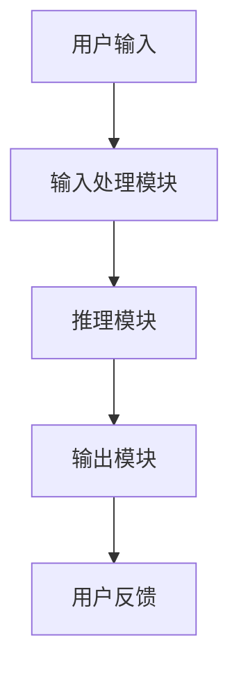
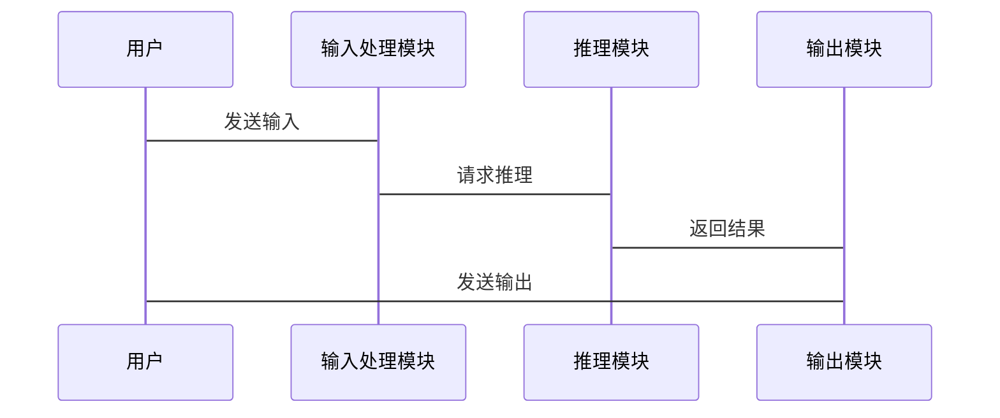

                 


# 构建LLM支持的AI Agent自然语言推理

## 关键词：Large Language Model (LLM), AI Agent, Natural Language Inference, NLP, LLM Integration, AI System Design, System Architecture

## 摘要：本文详细探讨了如何构建基于大语言模型（LLM）的AI Agent自然语言推理系统。文章从LLM和AI Agent的基本概念出发，深入分析了自然语言推理的核心原理，详细讲解了LLM支持的AI Agent设计与实现，系统地介绍了自然语言推理的算法原理和系统架构，并通过具体案例展示了如何实现一个基于LLM的问答系统。最后，文章总结了构建LLM支持的AI Agent自然语言推理系统的挑战与未来发展方向。

---

# 第一部分: 背景与基础

## 第1章: LLM与AI Agent概述

### 1.1 LLM的基本概念

#### 1.1.1 大语言模型的定义与特点

大语言模型（Large Language Model, LLM）是指基于大量数据训练的深度学习模型，具有理解上下文、生成文本的能力。其特点包括：

- **大规模训练数据**：通常使用数百万甚至数十亿的文本数据进行训练。
- **深度神经网络结构**：采用Transformer架构，具有强大的序列建模能力。
- **多任务通用性**：能够在多种NLP任务中表现出色，如文本生成、问答、翻译等。

#### 1.1.2 LLM的核心技术与优势

- **预训练技术**：通过大量未标注数据的预训练，模型能够学习语言的通用表示。
- **自注意力机制**：允许模型在生成文本时考虑上下文信息，实现更自然的对话。
- **微调技术**：通过在特定任务上的微调，模型可以适应不同的应用场景。

#### 1.1.3 LLM的应用场景与挑战

- **应用场景**：包括智能客服、自动问答、内容生成、代码生成等。
- **挑战**：模型的计算成本高、生成结果的不可控性、数据隐私问题等。

### 1.2 AI Agent的基本概念

#### 1.2.1 AI Agent的定义与分类

AI Agent（智能体）是指在环境中能够感知并自主行动以实现目标的实体。根据智能体的智能水平，可以分为：

- **反应式智能体**：基于当前感知做出反应。
- **认知式智能体**：具备复杂推理和规划能力。
- **学习型智能体**：能够通过经验改进性能。

#### 1.2.2 AI Agent的核心功能与特点

- **感知能力**：通过传感器或API获取环境信息。
- **决策能力**：基于感知信息做出决策。
- **行动能力**：通过执行器与环境互动。
- **学习能力**：通过经验改进性能。

#### 1.2.3 AI Agent的应用领域与发展趋势

- **应用领域**：包括智能家居、自动驾驶、智能助手、机器人等。
- **发展趋势**：向更智能、更自主、更人机协作的方向发展。

### 1.3 LLM支持的AI Agent的结合与优势

#### 1.3.1 LLM与AI Agent的结合方式

- **直接集成**：将LLM作为AI Agent的核心模块，用于生成自然语言响应。
- **混合架构**：结合其他技术（如视觉识别、知识图谱）增强AI Agent的能力。

#### 1.3.2 LLM支持AI Agent的核心优势

- **强大的语言理解与生成能力**：LLM能够处理复杂多样的语言任务。
- **可扩展性**：通过微调和迁移学习，可以快速适应不同场景。

#### 1.3.3 LLM支持AI Agent的未来发展方向

- **多模态集成**：将LLM与其他模态（如视觉、音频）结合，提升AI Agent的感知能力。
- **实时推理与交互**：优化模型的推理速度，提升实时交互能力。
- **伦理与安全**：确保生成内容的可控性和安全性，避免滥用。

---

## 第2章: 自然语言推理的核心概念

### 2.1 自然语言推理的定义与特点

#### 2.1.1 自然语言推理的定义

自然语言推理（Natural Language Inference, NLI）是指从一段文本中推断出隐含信息的能力，常用于判断两段文本之间的关系（如矛盾、中立、蕴含）。

#### 2.1.2 自然语言推理的核心特点

- **上下文依赖性**：推理结果依赖于上下文信息。
- **语义理解**：需要准确理解文本的语义含义。
- **逻辑推理**：需要基于语义进行逻辑推理。

#### 2.1.3 自然语言推理与传统NLP的区别

- **传统NLP**：主要关注文本的结构化处理，如分词、句法分析。
- **NLI**：关注文本之间的语义关系，需要进行推理和判断。

### 2.2 自然语言推理的关键技术

#### 2.2.1 预训练模型在自然语言推理中的应用

- **预训练模型的优势**：通过大规模预训练，模型能够学习到丰富的语义信息。
- **模型选择**：如BERT、GPT、RoBERTa等模型在NLI任务中表现出色。

#### 2.2.2 文本表示与推理的关系

- **文本表示**：将文本转换为向量表示，便于模型处理。
- **推理过程**：基于向量表示进行逻辑推理，得出结论。

#### 2.2.3 推理模型的结构与功能

- **结构**：通常采用编码-比较-分类（encode-compare-classify）的三阶段架构。
- **功能**：通过编码上下文信息，比较文本之间的关系，最终分类出结论。

### 2.3 自然语言推理的数学模型

#### 2.3.1 预训练模型的数学表示

使用Transformer架构，模型由编码器和解码器组成，编码器负责将输入文本编码为向量，解码器负责生成输出。

#### 2.3.2 推理过程的数学模型

通过自注意力机制，模型能够捕捉到文本中的长程依赖关系，从而实现上下文的理解和推理。

#### 2.3.3 推理结果的评估与优化

使用交叉熵损失函数作为优化目标，通过反向传播算法更新模型参数，优化推理结果。

---

## 第3章: LLM支持的AI Agent设计与实现

### 3.1 LLM支持的AI Agent设计原则

#### 3.1.1 设计原则概述

- **模块化设计**：将系统划分为独立的模块，便于维护和扩展。
- **可扩展性**：设计时留有扩展接口，方便未来功能的增加。
- **安全性**：确保系统在使用过程中的数据安全和隐私保护。

#### 3.1.2 设计原则的具体实现

- **模块化**：将AI Agent划分为感知模块、推理模块和行动模块。
- **可扩展性**：设计灵活的接口，支持多种LLM的集成。
- **安全性**：通过加密技术和访问控制机制保护数据安全。

#### 3.1.3 设计原则的优化与调整

- **动态调整**：根据实际运行情况，实时优化模块的参数。
- **容错设计**：设计容错机制，确保系统在部分模块故障时仍能正常运行。

### 3.2 LLM支持的AI Agent实现技术

#### 3.2.1 LLM与AI Agent的接口设计

- **API接口**：定义统一的API接口，方便LLM与AI Agent的交互。
- **数据格式**：规定数据的输入输出格式，确保双方能够正确解析。

#### 3.2.2 LLM支持AI Agent的核心技术

- **文本生成**：通过LLM生成自然语言文本，提升AI Agent的交互能力。
- **上下文管理**：维护对话历史，确保生成文本的连贯性。

#### 3.2.3 实现步骤与流程

- **需求分析**：明确AI Agent的功能需求。
- **系统设计**：设计系统的模块结构和接口。
- **实现与测试**：编写代码，进行功能测试和性能优化。

---

## 第4章: 自然语言推理的算法原理

### 4.1 自然语言推理的核心算法

#### 4.1.1 基于Transformer的NLI模型

使用Transformer架构的模型进行NLI任务，通过自注意力机制捕捉文本中的语义信息。

#### 4.1.2 基于预训练的NLI模型

利用预训练的模型进行微调，提升模型在特定任务上的表现。

#### 4.1.3 模型优化与调参

通过调整模型的超参数（如学习率、批次大小）优化模型性能。

### 4.2 自然语言推理的数学模型

#### 4.2.1 Transformer架构的数学表示

- **自注意力机制**：$$ \text{Attention}(Q, K, V) = \text{softmax}\left(\frac{QK^T}{\sqrt{d_k}}\right)V $$
- **前馈网络**：$$ f(x) = \text{ReLU}(Wx + b) $$

#### 4.2.2 NLI任务的损失函数

使用交叉熵损失函数作为优化目标：
$$ \mathcal{L} = -\sum_{i=1}^{n} y_i \log(p_i) $$

#### 4.2.3 模型训练与推理过程

通过反向传播算法更新模型参数，优化损失函数，提升推理准确率。

---

## 第5章: 系统架构设计

### 5.1 系统功能设计

#### 5.1.1 系统功能模块划分

- **输入处理模块**：接收用户的输入，解析并传递给推理模块。
- **推理模块**：基于LLM进行自然语言推理，得出结论。
- **输出模块**：将推理结果转换为自然语言文本，反馈给用户。

#### 5.1.2 系统功能流程图



### 5.2 系统架构设计

#### 5.2.1 系统架构模式

采用微服务架构，各功能模块独立运行，通过API接口进行交互。

#### 5.2.2 系统架构图


#### 5.2.3 系统接口设计

定义统一的API接口，确保各模块之间的交互规范和一致。

### 5.3 系统交互设计

#### 5.3.1 交互流程图



#### 5.3.2 交互设计的优化

通过缓存机制优化重复推理，提升系统性能。

---

## 第6章: 项目实战

### 6.1 环境安装与配置

- **安装Python**：确保Python版本为3.8以上。
- **安装依赖库**：使用pip安装所需的库，如transformers、torch等。

### 6.2 核心代码实现

#### 6.2.1 输入处理模块

```python
def process_input(input_text):
    return input_text
```

#### 6.2.2 推理模块

```python
from transformers import AutoModelForQuestionAnswering, AutoTokenizer

def infer_nli(input1, input2):
    model = AutoModelForQuestionAnswering.from_pretrained('bert-large-wwm-ext')
    tokenizer = AutoTokenizer.from_pretrained('bert-large-wwm-ext')
    inputs = tokenizer.encode_plus(input1, input2, return_tensors='pt', padding=True, truncation=True)
    outputs = model(**inputs)
    return outputs
```

#### 6.2.3 输出模块

```python
def generate_output(result):
    return "The result is " + str(result)
```

### 6.3 代码解读与分析

- **输入处理**：简单的文本处理函数，将输入文本传递给推理模块。
- **推理过程**：使用预训练的BERT模型进行自然语言推理，返回推理结果。
- **输出生成**：将推理结果格式化为自然语言文本，反馈给用户。

### 6.4 实际案例分析

通过具体案例分析，展示如何通过代码实现一个简单的问答系统，提升读者的实践能力。

### 6.5 项目总结与优化

总结项目实现过程中的经验教训，提出优化建议，如优化推理速度、提升生成文本的质量等。

---

## 第7章: 总结与展望

### 7.1 总结

本文详细探讨了构建基于LLM的AI Agent自然语言推理系统的各个方面，从理论基础到实践应用，全面介绍了系统的构建过程。

### 7.2 未来展望

随着AI技术的不断发展，基于LLM的AI Agent自然语言推理系统将具备更强大的能力，应用场景也将更加广泛。

### 7.3 最佳实践 tips

- **模型选择**：根据具体任务选择合适的模型。
- **数据处理**：确保数据质量，避免噪声干扰。
- **系统优化**：通过缓存和并行计算优化系统性能。

---

通过本文的详细讲解，读者可以深入了解构建LLM支持的AI Agent自然语言推理系统的各个方面，并能够根据实际需求进行开发和优化。希望本文能够为相关领域的研究和应用提供有价值的参考和指导。

