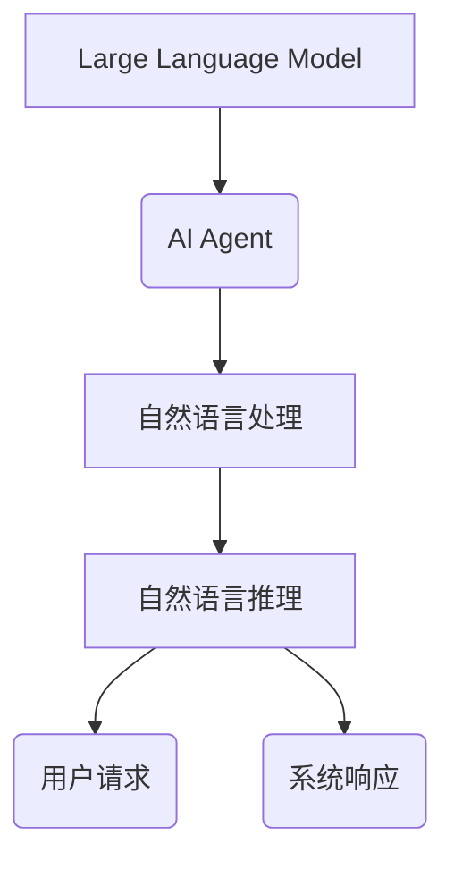
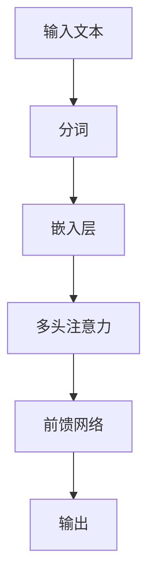
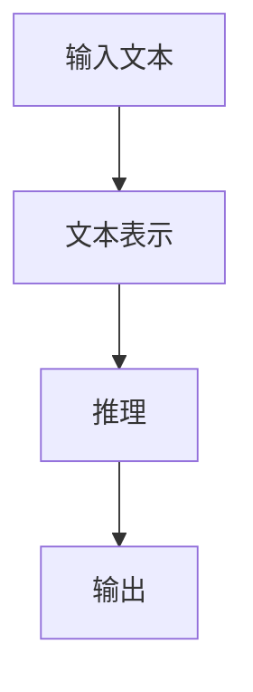
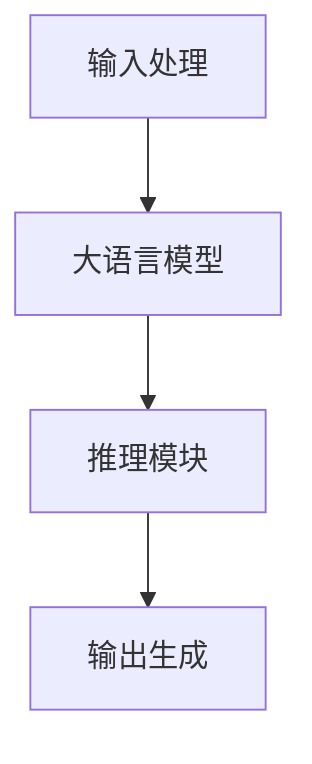
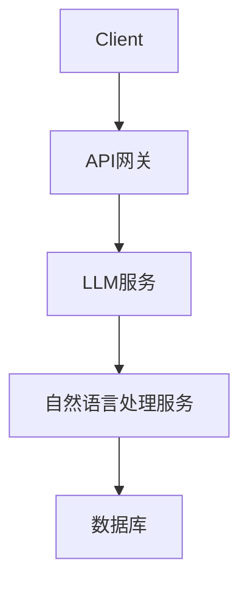
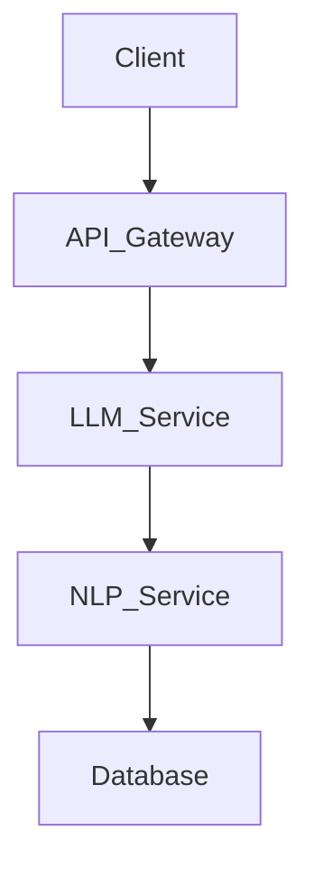

                 


# 构建LLM支持的AI Agent自然语言推理系统

## 关键词
LLM, AI Agent, 自然语言推理, 系统架构, 项目实战

## 摘要
本文将详细探讨如何构建一个由大语言模型（LLM）支持的AI代理（AI Agent）自然语言推理系统。通过分析系统的背景、核心概念、算法原理、系统架构设计以及项目实战，本文旨在为读者提供一个全面而深入的构建指南。从问题背景到系统实现，本文将逐步引导读者理解并掌握构建此类系统的知识和技能。

---

# 第一部分: 背景介绍

## 第1章: 问题背景

### 1.1 问题背景

#### 1.1.1 LLM与AI Agent的结合
大语言模型（LLM）通过其强大的语言理解和生成能力，为AI代理提供了强大的自然语言处理基础。AI代理需要能够理解和处理用户的自然语言输入，并通过推理生成合理的输出。LLM的支持使得AI代理能够更自然地与用户交互。

#### 1.1.2 自然语言推理的定义与应用
自然语言推理（NLP）是研究如何让计算机能够理解、推理和生成自然语言文本的学科。其应用广泛，包括智能对话系统、信息抽取、情感分析、机器翻译等。在AI代理中，自然语言推理是其核心能力之一。

#### 1.1.3 当前技术挑战与机遇
尽管LLM在自然语言处理领域取得了显著进展，但构建支持LLM的AI代理自然语言推理系统仍面临诸多挑战，例如模型的实时性、推理的准确性、系统的可解释性等。这些挑战也为技术的发展带来了机遇。

### 1.2 问题描述

#### 1.2.1 LLM支持的AI Agent的定义
LLM支持的AI代理是一种能够通过自然语言与用户交互，并利用LLM的能力进行理解和推理的智能系统。它不仅能够理解用户的输入，还能通过推理生成合理的输出。

#### 1.2.2 自然语言推理的核心问题
自然语言推理的核心问题是理解文本的含义，并基于此进行推理。在AI代理中，这涉及到从用户的输入中提取意图、实体，并根据上下文进行推理，生成符合用户需求的输出。

#### 1.2.3 系统构建的目标与意义
构建LLM支持的AI代理自然语言推理系统的目的是为了提高AI代理的智能化水平，使其能够更自然地与用户交互。这不仅能够提升用户体验，还能够拓展AI代理的应用场景。

---

# 第二部分: 核心概念与联系

## 第2章: 核心概念原理

### 2.1 LLM的基本原理

#### 2.1.1 基于Transformer的模型架构
大语言模型通常基于Transformer架构，由编码器和解码器组成。编码器将输入文本转化为向量表示，解码器根据编码器的输出生成目标文本。

#### 2.1.2 注意力机制
注意力机制使得模型能够关注输入文本中的重要部分，从而提高理解和生成的准确性。

#### 2.1.3 训练与微调
大语言模型通常通过大量的文本数据进行预训练，然后通过特定任务的数据进行微调，以适应具体的应用场景。

### 2.2 AI Agent的定义与功能

#### 2.2.1 AI Agent的基本概念
AI代理是一种智能体，能够感知环境并采取行动以实现目标。它能够通过传感器获取信息，并通过执行器与环境交互。

#### 2.2.2 自然语言处理在AI Agent中的应用
AI代理需要通过自然语言与用户交互，理解用户的意图，并通过推理生成合理的输出。

#### 2.2.3 自然语言推理在AI Agent中的作用
自然语言推理是AI代理理解用户输入并生成合理输出的核心能力。它使得AI代理能够从用户的输入中提取有用的信息，并根据上下文进行推理。

### 2.3 自然语言推理的机制

#### 2.3.1 基于规则的推理
基于规则的推理通过预定义的规则进行推理，适用于简单且确定性的场景。

#### 2.3.2 基于统计的推理
基于统计的推理通过分析数据的分布规律进行推理，适用于复杂且不确定性的场景。

#### 2.3.3 基于深度学习的推理
基于深度学习的推理利用神经网络模型进行推理，能够处理复杂的语言结构和上下文信息。

### 2.4 核心概念对比

#### 2.4.1 LLM与传统NLP模型的对比
| 对比维度 | LLM | 传统NLP模型 |
|----------|------|------------|
| 模型复杂度 | 高 | 低 |
| 训练数据量 | 大 | 小 |
| 性能 | 高 | 中 |

#### 2.4.2 AI Agent与传统AI系统的对比
| 对比维度 | AI Agent | 传统AI系统 |
|----------|----------|------------|
| 自主性 | 高 | 低 |
| 交互性 | 高 | 中 |
| 可定制性 | 高 | 中 |

#### 2.4.3 自然语言推理与传统逻辑推理的对比
| 对比维度 | 自然语言推理 | 传统逻辑推理 |
|----------|-------------|--------------|
| 数据来源 | 文本 | 逻辑规则 |
| 处理方式 | 统计学习 | 基于逻辑 |
| 可解释性 | 低 | 高 |

### 2.5 实体关系图

#### 2.5.1 实体关系图


---

# 第三部分: 算法原理讲解

## 第3章: 算法原理讲解

### 3.1 LLM算法原理

#### 3.1.1 Transformer架构


#### 3.1.2 注意力机制公式
$$
\text{Attention}(Q, K, V) = \text{softmax}\left(\frac{QK^T}{\sqrt{d_k}}\right)V
$$

#### 3.1.3 模型训练
使用大规模文本数据进行预训练，采用自监督学习，目标是最小化预测与真实值之间的误差。

### 3.2 自然语言推理算法

#### 3.2.1 基于规则的推理算法
通过预定义的规则对文本进行分析和推理，例如基于关键词匹配。

#### 3.2.2 基于统计的推理算法
通过统计文本中的词语和句法结构，推断出文本的含义。

#### 3.2.3 基于深度学习的推理算法
使用神经网络模型，如BERT、GPT等，进行文本表示和推理。

#### 3.2.4 自然语言推理模型公式
$$
P(h|t) = \text{softmax}(f(h, t))
$$

#### 3.2.5 推理流程图


### 3.3 算法实现代码

#### 3.3.1 LLM实现示例
```python
import torch
import torch.nn as nn

class LLM(nn.Module):
    def __init__(self, vocab_size, embedding_dim, hidden_dim):
        super(LLM, self).__init__()
        self.embedding = nn.Embedding(vocab_size, embedding_dim)
        self.transformer = nn.Transformer(embedding_dim, hidden_dim)
    
    def forward(self, input_ids):
        embed = self.embedding(input_ids)
        output = self.transformer(embed)
        return output
```

#### 3.3.2 自然语言推理实现示例
```python
def nlp_reasoning(input_text):
    # 分词
    tokens = tokenize(input_text)
    # 生成向量表示
    vectors = get_embeddings(tokens)
    # 推理
    result = model.predict(vectors)
    return result
```

---

# 第四部分: 系统分析与架构设计

## 第4章: 系统分析与架构设计

### 4.1 项目介绍

#### 4.1.1 项目目标
构建一个支持自然语言推理的AI代理系统，能够通过LLM理解和生成自然语言文本。

#### 4.1.2 项目范围
涵盖自然语言处理、自然语言推理、AI代理设计等多个方面。

### 4.2 系统功能设计

#### 4.2.1 功能模块划分
| 功能模块 | 描述 |
|----------|------|
| 输入处理 | 处理用户的自然语言输入 |
| 推理模块 | 基于LLM进行推理 |
| 输出生成 | 生成系统的自然语言输出 |

#### 4.2.2 功能模块关系图


### 4.3 系统架构设计

#### 4.3.1 系统架构图


#### 4.3.2 组件关系图


### 4.4 系统接口设计

#### 4.4.1 API接口
| 接口名称 | 描述 | 请求方式 | 请求参数 | 返回值 |
|----------|------|----------|----------|--------|
| process_input | 处理用户输入 | POST | input_text | response |
| generate_output | 生成输出 | POST | input_text | output_text |

#### 4.4.2 接口交互流程图
```mermaid
graph TD
    Client --> API_Gateway: process_input
    API_Gateway --> LLM_Service: process_input
    LLM_Service --> NLP_Service: generate_output
    NLP_Service --> Client: response
```

### 4.5 系统交互流程设计

#### 4.5.1 用户与系统交互流程
```mermaid
graph TD
    User --> System: 用户请求
    System --> LLM: 处理请求
    LLM --> NLP: 进行推理
    NLP --> System: 生成响应
    System --> User: 返回响应
```

---

# 第五部分: 项目实战

## 第5章: 项目实战

### 5.1 环境安装

#### 5.1.1 安装Python
```bash
python --version
```

#### 5.1.2 安装依赖
```bash
pip install transformers torch
```

### 5.2 系统核心实现

#### 5.2.1 输入处理
```python
def process_input(input_text):
    return input_text
```

#### 5.2.2 推理模块
```python
def nlp_reasoning(input_text):
    model = load_model()
    return model.predict(input_text)
```

#### 5.2.3 输出生成
```python
def generate_output(input_text):
    reasoning = nlp_reasoning(input_text)
    return generate_response(reasoning)
```

### 5.3 代码实现示例

#### 5.3.1 全局代码实现
```python
import torch
import torch.nn as nn

class LLM(nn.Module):
    def __init__(self, vocab_size, embedding_dim, hidden_dim):
        super(LLM, self).__init__()
        self.embedding = nn.Embedding(vocab_size, embedding_dim)
        self.transformer = nn.Transformer(embedding_dim, hidden_dim)
    
    def forward(self, input_ids):
        embed = self.embedding(input_ids)
        output = self.transformer(embed)
        return output
```

#### 5.3.2 代码实现解读
```python
# 加载模型
model = LLM(vocab_size=10000, embedding_dim=512, hidden_dim=512)
# 训练模型
optimizer = torch.optim.Adam(model.parameters(), lr=0.001)
criterion = nn.CrossEntropyLoss()
```

### 5.4 案例分析与讲解

#### 5.4.1 案例分析
假设用户输入“今天天气怎么样？”，系统需要通过LLM进行推理，并生成合理的输出。

#### 5.4.2 代码实现分析
```python
def process_input(input_text):
    return input_text

def generate_output(input_text):
    reasoning = process_input(input_text)
    return generate_response(reasoning)
```

### 5.5 项目小结

#### 5.5.1 项目总结
通过本项目的实践，我们了解了如何利用LLM构建自然语言推理系统，并掌握了系统设计和实现的关键步骤。

#### 5.5.2 实践中的注意事项
在实际应用中，需要注意模型的训练数据质量、推理的准确性和系统的可扩展性。

---

# 第六部分: 总结与展望

## 第6章: 总结与展望

### 6.1 内容总结

#### 6.1.1 核心内容回顾
本文详细介绍了构建LLM支持的AI代理自然语言推理系统的背景、核心概念、算法原理、系统设计和项目实战。

#### 6.1.2 主要观点总结
通过结合LLM和自然语言推理技术，可以构建出更智能、更自然的AI代理系统。

### 6.2 最佳实践 tips

#### 6.2.1 技术实现 tips
在实际应用中，建议使用预训练的LLM模型，并结合特定任务的数据进行微调。

#### 6.2.2 系统设计 tips
系统设计时，需要注意模块化设计，确保各组件之间的松耦合，便于后续的维护和扩展。

### 6.3 展望

#### 6.3.1 技术发展展望
随着大语言模型的不断发展，AI代理的自然语言推理能力将更加智能化和个性化。

#### 6.3.2 应用场景拓展
未来，LLM支持的AI代理自然语言推理系统将在更多领域得到应用，例如教育、医疗、金融等。

### 6.4 注意事项

#### 6.4.1 模型训练注意事项
在模型训练过程中，需要注意数据的多样性和代表性，避免过拟合。

#### 6.4.2 系统部署注意事项
在系统部署时，需要注意性能优化和安全性保障，确保系统的稳定运行。

### 6.5 拓展阅读

#### 6.5.1 推荐书籍
- 《Deep Learning》
- 《自然语言处理实战》

#### 6.5.2 推荐论文
- "Attention Is All You Need"
- "BERT: Pre-training of Deep Bidirectional Transformers for NLP"

---

通过以上步骤，我们可以系统地构建一个基于LLM的AI代理自然语言推理系统，从理论到实践，全面掌握其设计和实现的关键点。

