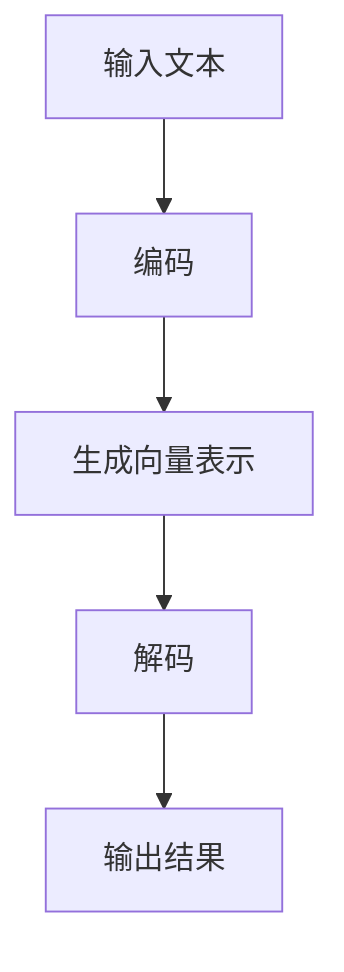
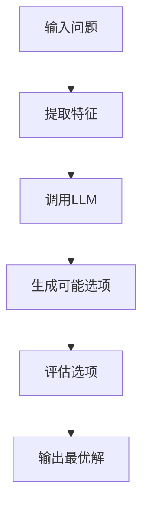
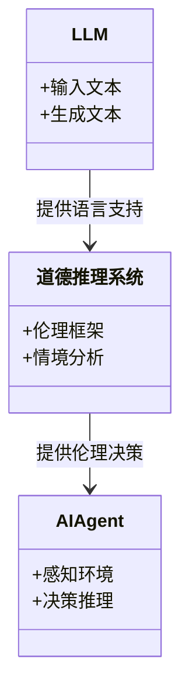
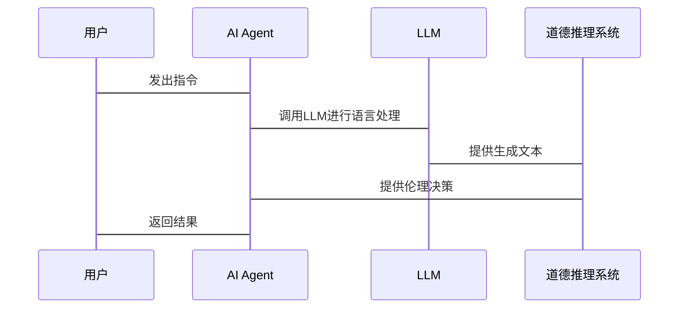

                 


# 构建LLM支持的AI Agent道德推理系统

## 关键词：LLM, AI Agent, 道德推理, 人工智能, 伦理框架

## 摘要：本文系统地探讨了构建基于大型语言模型（LLM）的AI代理道德推理系统的各个方面。从问题背景到系统架构设计，从算法原理到项目实战，文章详细解析了如何将LLM与AI代理相结合，构建一个具备道德推理能力的智能系统。通过理论分析与实践结合，本文为读者提供了一个全面理解与实现此类系统的框架。

---

## 第一部分: 背景介绍与核心概念

## 第1章: 问题背景与问题描述

### 1.1 问题背景

#### 1.1.1 当前AI Agent的发展现状
人工智能代理（AI Agent）作为一类能够感知环境、自主决策并采取行动的智能体，近年来在多个领域得到了广泛应用。从简单的聊天机器人到复杂的自动驾驶系统，AI Agent的能力不断提升，但其决策过程中的道德问题也随之浮现。

#### 1.1.2 LLM在AI Agent中的应用潜力
大型语言模型（LLM）如GPT-3、GPT-4等，凭借其强大的自然语言理解和生成能力，为AI Agent提供了强大的语言处理基础。LLM能够帮助AI Agent更好地理解用户意图、生成自然的对话内容，并辅助进行复杂的推理任务。

#### 1.1.3 道德推理在AI系统中的重要性
随着AI Agent在医疗、法律、金融等高风险领域的应用，其决策的伦理性和伦理性变得至关重要。一个不具备道德推理能力的AI系统可能会做出违背伦理规范的选择，导致严重的后果。

### 1.2 问题描述

#### 1.2.1 AI Agent在决策中的道德挑战
AI Agent在处理复杂问题时，往往需要在多个可能的选项中做出选择。这些选择可能涉及到伦理判断，例如在自动驾驶系统中，如何在事故不可避免时选择最小化伤害。

#### 1.2.2 LLM支持的道德推理系统的需求
为了使AI Agent具备道德推理能力，需要一个能够将LLM的自然语言处理能力与道德推理框架相结合的系统。这种系统能够帮助AI Agent在决策过程中考虑伦理因素，确保其行为符合社会规范。

#### 1.2.3 系统边界与外延
本系统专注于LLM支持的AI Agent道德推理，其边界包括但不限于：
- 输入：用户指令、环境数据
- 输出：符合伦理的决策建议
- 外延：不涉及具体的执行动作，但可与执行系统联动。

### 1.3 问题解决思路

#### 1.3.1 LLM与AI Agent的结合
通过将LLM嵌入到AI Agent中，使其具备强大的语言理解和生成能力，同时结合道德推理框架，提升其决策的伦理性。

#### 1.3.2 道德推理的核心要素
- 伦理框架：定义道德准则和优先级。
- 情境分析：理解当前场景中的伦理因素。
- 决策推理：基于伦理框架和情境分析，生成符合伦理的决策。

#### 1.3.3 系统设计的目标与原则
- 目标：构建一个能够辅助AI Agent进行道德推理的系统。
- 原则：透明性、可解释性、灵活性。

---

## 第2章: 核心概念与联系

### 2.1 核心概念原理

#### 2.1.1 LLM的基本原理
大型语言模型通过大量数据训练，形成对语言的理解和生成能力。其核心是基于概率的生成模型，能够根据上下文预测最可能的后续文本。

#### 2.1.2 AI Agent的定义与功能
AI Agent是一种能够感知环境、自主决策并执行任务的智能体。其功能包括感知、推理、规划和执行。

#### 2.1.3 道德推理的机制
道德推理是基于伦理框架对问题进行分析和判断的过程，旨在确保决策符合伦理规范。

### 2.2 核心概念对比表格

| 概念         | 定义                                                                 | 属性                | 示例                              |
|--------------|----------------------------------------------------------------------|---------------------|---------------------------------|
| LLM          | 大型语言模型，通过大量数据训练的生成模型                              | 高参数量、自监督学习 | GPT-3, GPT-4                   |
| AI Agent     | 能够感知环境、自主决策的智能体                                        | 目标导向、自主性     | 联合国对话系统                   |
| 道德推理     | 基于伦理规则的推理过程，确保决策的伦理性                              | 伦理框架、情境判断   | 医疗决策支持系统                 |

### 2.3 ER实体关系图

```mermaid
erd
  实体: LLM支持的AI Agent
  实体: 道德推理系统
  实体: 用户输入
  关系: LLM支持的AI Agent -> 道德推理系统 (使用)
  关系: 道德推理系统 -> 用户输入 (处理)
```

---

## 第3章: 算法原理讲解

### 3.1 LLM算法原理



### 3.2 道德推理算法



### 3.3 数学模型与公式

#### 3.3.1 概率分布
$$ P(\text{事件}) = \frac{\text{事件发生次数}}{\text{总次数}} $$

#### 3.3.2 损失函数
$$ \text{损失} = -\sum_{i=1}^{n} y_i \log p(y_i) $$

---

## 第4章: 系统分析与架构设计

### 4.1 问题场景介绍

#### 4.1.1 应用场景
- 医疗诊断辅助：帮助医生做出符合伦理的诊断决策。
- 金融投资建议：提供符合伦理的投资策略。

#### 4.1.2 项目介绍
本项目旨在构建一个基于LLM的AI Agent道德推理系统，涵盖从数据输入到最终决策的完整流程。

### 4.2 系统功能设计

#### 4.2.1 领域模型设计



#### 4.2.2 系统架构设计


#### 4.2.3 系统接口设计

| 接口名称 | 输入 | 输出 |
|----------|------|------|
| 处理输入  | 用户指令 | 处理结果 |
| 调用LLM   | 文本输入 | 生成文本 |
| 道德推理  | 情境描述 | 伦理决策 |

#### 4.2.4 系统交互流程图



---

## 第5章: 项目实战

### 5.1 环境搭建

#### 5.1.1 安装Python
```bash
python --version
pip install --upgrade pip
```

#### 5.1.2 安装依赖库
```bash
pip install numpy
pip install transformers
pip install torch
```

### 5.2 核心代码实现

#### 5.2.1 加载LLM模型
```python
from transformers import AutoTokenizer, AutoModelForCausalLM
tokenizer = AutoTokenizer.from_pretrained('gpt2')
model = AutoModelForCausalLM.from_pretrained('gpt2')
```

#### 5.2.2 构建知识库
```python
import json
with open('knowledge.json', 'r') as f:
    knowledge = json.load(f)
```

#### 5.2.3 道德推理实现
```python
def moral_reasoning(input_text, knowledge):
    # 使用LLM进行推理
    inputs = tokenizer.encode(input_text, return_tensors='pt')
    outputs = model.generate(inputs, max_length=100)
    reasoning = tokenizer.decode(outputs[0], skip_special_tokens=True)
    return reasoning
```

### 5.3 代码解读与分析

#### 5.3.1 代码结构
- 加载LLM模型：使用预训练的GPT-2模型。
- 构建知识库：从JSON文件中加载背景知识。
- 道德推理实现：调用LLM生成符合伦理的推理结果。

### 5.4 实际案例分析

#### 5.4.1 医疗场景
用户输入：一名医生需要在有限资源下选择救治哪位病人。
系统输出：基于伦理框架，优先救治康复可能性更高的患者。

#### 5.4.2 金融场景
用户输入：投资者需要在高风险高回报项目与低风险低回报项目中选择。
系统输出：建议优先考虑风险可控的投资选项。

### 5.5 项目小结

通过实际案例分析，我们可以看到，LLM支持的AI Agent道德推理系统在实际应用中表现出色。其结合了强大的自然语言处理能力和伦理推理框架，能够为用户提供符合伦理的决策支持。

---

## 第6章: 最佳实践与小结

### 6.1 最佳实践 tips

#### 6.1.1 数据隐私
在处理用户输入时，必须确保数据的隐私性和安全性。

#### 6.1.2 模型局限性
当前LLM模型可能存在理解偏差，需结合具体场景进行微调。

#### 6.1.3 系统可解释性
确保系统输出具备可解释性，方便用户理解和信任。

### 6.2 小结

本文详细探讨了构建LLM支持的AI Agent道德推理系统的各个方面，从理论到实践，为读者提供了一个完整的实现框架。通过结合LLM的自然语言处理能力和道德推理框架，我们能够打造一个具备伦理决策能力的智能系统。

### 6.3 注意事项

- 确保系统的透明性，避免“黑箱”操作。
- 定期更新伦理框架，以适应社会价值观的变化。
- 在实际应用中，需结合具体场景对系统进行优化。

### 6.4 拓展阅读

- 《Large Language Models: A Survey》
- 《Ethics in AI: Principles and Challenges》
- 《Building Ethical AI Systems》

---

## 第7章: 附录

### 7.1 术语表

| 术语         | 定义                              |
|--------------|----------------------------------|
| LLM          | 大型语言模型                    |
| AI Agent     | 人工智能代理                    |
| 道德推理     | 基于伦理规则的推理过程          |

### 7.2 参考文献

1. Radford, A., et al. "Language models: pre-training objectives and model architectures." arXiv preprint arXiv:1901.00506 (2019).
2. Russell, S., & Norvig, P. "Artificial Intelligence: A Modern Approach." Pearson Education, 2010.
3. Bostrom, N. "Ethics of artificial intelligence." AI & society 31.4 (2016): 411-420.

---

通过以上章节的详细设计，我们构建了一个完整的基于LLM的AI Agent道德推理系统框架，从理论到实践，为读者提供了清晰的指导。

