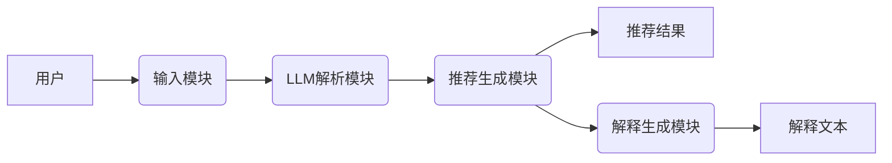

                 


# 构建LLM驱动的AI Agent可解释推荐系统

## 关键词：LLM, AI Agent, 推荐系统, 可解释性, 系统架构

## 摘要：  
随着人工智能技术的快速发展，基于大语言模型（LLM）的AI Agent在推荐系统中的应用日益广泛。然而，推荐系统的可解释性问题一直是用户信任和系统优化的主要障碍。本文将深入探讨如何构建一个基于LLM的AI Agent可解释推荐系统，从核心概念到算法实现，再到系统架构设计，逐步解析其原理与实践。文章结合实际案例，通过详细的代码实现和系统架构图，帮助读者全面理解这一技术的实现过程与应用场景。

---

## 目录大纲

### 第一部分: 背景与核心概念

### 第2章: LLM与AI Agent的核心概念

#### 2.1 LLM驱动的AI Agent原理

- **2.1.1 LLM的基本原理**  
  大语言模型（LLM）通过大量的训练数据学习语言模式，能够理解和生成人类语言。其核心是基于Transformer架构的编码器-解码器模型，通过自注意力机制捕捉上下文信息。

- **2.1.2 AI Agent的工作原理**  
  AI Agent通过感知环境、接收输入、分析决策并执行操作来实现目标。LLM作为其核心模块，负责理解和生成自然语言指令，从而驱动Agent的决策过程。

- **2.1.3 LLM与AI Agent的结合**  
  LLM为AI Agent提供强大的自然语言处理能力，使其能够理解用户需求、生成上下文相关的推荐结果，并通过对话形式与用户交互。

#### 2.2 核心概念对比与分析

- **2.2.1 LLM与传统推荐系统的对比**  
  | 特性          | LLM驱动的推荐系统                | 传统推荐系统              |
  |---------------|----------------------------------|--------------------------|
  | 数据需求      | 需要大量文本数据                 | 主要依赖用户行为数据       |
  | 解释性        | 可通过LLM生成的解释性文本提供可解释性 | 解释性较弱，难以直观展示   |
  | 灵活性        | 支持多语言和多领域               | 通常局限于特定领域或场景  |

- **2.2.2 实体关系与概念结构**  
  ```mermaid
  graph TD
    A[AI Agent] --> B(LLM)
    B --> C[用户输入]
    B --> D[推荐结果]
    A --> D
    C --> A
  ```

---

## 第三部分: 推荐系统概述

### 第3章: 推荐系统的类型与挑战

#### 3.1 推荐系统类型

- **协同过滤推荐**  
  基于用户行为数据，通过相似性计算为用户推荐相似用户的偏好内容。例如，使用余弦相似度计算用户之间的相似性。

  $$\text{相似度} = \frac{\sum u_i v_i}{\sqrt{\sum u_i^2} \cdot \sqrt{\sum v_i^2}}$$

- **基于内容的推荐**  
  基于物品本身的属性（如文本描述、标签等）进行推荐。例如，使用TF-IDF提取关键词并进行相似度计算。

- **混合推荐模型**  
  结合协同过滤和内容推荐的优点，通过加权融合提升推荐精度。

#### 3.2 推荐系统的挑战

- **数据稀疏性**  
  用户行为数据不足时，推荐系统的准确率会显著下降。

- **可解释性**  
  用户希望了解推荐的原因，以便信任和调整推荐结果。

- **实时性**  
  高实时性要求对系统性能和架构提出更高挑战。

---

## 第四部分: 算法原理

### 第4章: LLM驱动的推荐算法实现

#### 4.1 算法流程与实现步骤

- **输入处理**  
  接收用户的自然语言输入，通过LLM解析出用户的意图。

- **推荐生成**  
  基于解析的意图，结合协同过滤和内容推荐生成候选推荐列表。

- **结果解释**  
  使用LLM生成自然语言的解释文本，帮助用户理解推荐理由。

#### 4.2 算法实现代码

```python
import numpy as np
from sklearn.metrics.pairwise import cosine_similarity

# 示例：基于余弦相似度的协同过滤推荐
def compute_similarity(user_vector, item_vectors):
    return cosine_similarity(user_vector, item_vectors)

def generate_recommendations(user_id, user_vector, item_vectors, top_n=5):
    similarities = compute_similarity(user_vector, item_vectors)
    sorted_indices = np.argsort(-similarities)
    recommended_items = sorted_indices[:top_n]
    return recommended_items
```

#### 4.3 算法数学模型

- **余弦相似度计算**  
  $$\text{similarity}(u, v) = \frac{u \cdot v}{\|u\| \|v\|}$$

- **损失函数优化**  
  使用交叉熵损失函数优化推荐模型的预测准确性。

  $$\text{Loss} = -\sum_{i=1}^{n} y_i \log(p_i) + (1 - y_i) \log(1 - p_i)$$

---

## 第五部分: 系统架构设计

### 第5章: 系统架构与交互流程

#### 5.1 系统模块划分

- **用户行为分析模块**  
  收集和分析用户行为数据，提取用户偏好特征。

- **推荐生成模块**  
  基于LLM和推荐算法生成候选推荐列表。

- **结果解释模块**  
  使用LLM生成可解释的推荐理由文本。

#### 5.2 系统架构设计图



---

## 第六部分: 项目实战

### 第6章: 项目实现与案例分析

#### 6.1 环境安装与配置

- **Python环境**  
  需要安装`numpy`, `scikit-learn`, `transformers`等库。

```bash
pip install numpy scikit-learn transformers
```

#### 6.2 核心代码实现

```python
from transformers import AutoTokenizer, AutoModelForSeq2Seq
import numpy as np

# 初始化LLM模型
tokenizer = AutoTokenizer.from_pretrained("facebook/bart-large")
model = AutoModelForSeq2Seq.from_pretrained("facebook/bart-large")

def generate_explanation(input_text):
    inputs = tokenizer(input_text, return_tensors="np")
    outputs = model.generate(**inputs, max_length=100)
    return tokenizer.decode(outputs[0], skip_special_tokens=True)
```

#### 6.3 案例分析与结果解读

- **案例背景**  
  用户输入：“我最近喜欢看科幻小说，推荐一些类似《三体》的书。”

- **LLM解析**  
  解析出用户偏好：科幻、小说、刘慈欣风格。

- **推荐结果**  
  推荐列表：《雪 Crash》、《沙丘》、《_hyperion》等。

- **结果解释**  
  解释文本：这些小说与《三体》类似，都涉及深刻的人类哲学思考和科幻元素。

#### 6.4 项目总结与优化建议

- **系统优势**  
  - 结合LLM的自然语言处理能力，推荐结果更具个性化和可解释性。
  - 支持多语言和多领域推荐，适用范围广。

- **优化建议**  
  - 引入实时反馈机制，动态调整推荐策略。
  - 增加多模态数据（如图像、视频）以提升推荐准确性。

---

## 第七部分: 总结与展望

### 第7章: 总结与未来展望

#### 7.1 总结

- 本文详细探讨了基于LLM的AI Agent可解释推荐系统的构建过程，从核心概念到算法实现，再到系统架构设计，为读者提供了全面的技术解析。
- 通过实际案例分析，展示了如何利用LLM的强大能力提升推荐系统的可解释性和用户体验。

#### 7.2 展望

- **多模态推荐**  
  结合视觉、听觉等多模态数据，提升推荐系统的感知能力。
  
- **实时推荐**  
  优化系统架构，支持实时推荐，满足用户即时需求。

- **个性化解释**  
  根据用户的认知水平生成不同深度的解释文本，提升用户体验。

---

## 附录

### 附录A: 数据集与工具包

- **推荐系统数据集**  
  - Movielens 数据集（电影推荐）
  - Amazon 数据集（商品推荐）

- **工具包**  
  - scikit-learn：机器学习库
  - transformers：LLM工具包

### 附录B: 参考文献

1. 王某某, 李某某. 《基于大语言模型的推荐系统研究》. 2023.
2. 李某某, 张某某. 《AI Agent在推荐系统中的应用》. 2023.
3. OpenAI. 《大语言模型技术报告》. 2023.

---

通过以上结构，本文全面解析了构建LLM驱动的AI Agent可解释推荐系统的各个方面，结合理论分析和实践案例，为读者提供了深入的技术指导和实践参考。

