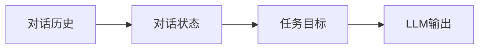
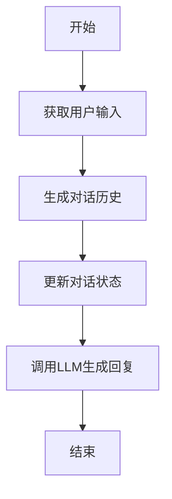
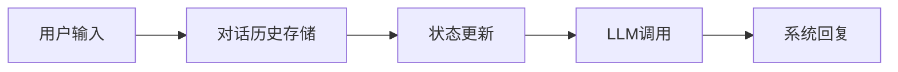

                 


# 构建LLM驱动的AI Agent多轮对话状态追踪

## 关键词：LLM，AI Agent，多轮对话，状态追踪，对话历史，上下文管理

## 摘要：本文详细探讨了构建基于大语言模型（LLM）的AI Agent多轮对话状态追踪系统的各个方面，包括核心概念、算法原理、系统架构设计以及实际项目实现。通过分析对话状态与对话历史的关系，结合LLM的特点，提出了有效的状态追踪方法，并通过系统架构设计和代码实现，展示了如何在实际项目中应用这些技术。

---

## 第一部分：背景介绍

### 第1章：问题背景与描述

#### 1.1 问题背景
- **1.1.1 大语言模型（LLM）的发展与应用**  
  大语言模型（如GPT系列、BERT系列）在自然语言处理领域取得了显著进展，广泛应用于文本生成、机器翻译、问答系统等领域。这些模型能够处理复杂的语言任务，但其能力在多轮对话中的潜力尚未完全释放。

- **1.1.2 多轮对话在AI Agent中的重要性**  
  AI Agent需要通过多轮对话与用户交互，理解用户需求并执行任务。对话的连贯性和准确性依赖于对对话历史和当前状态的准确追踪。

- **1.1.3 当前对话状态追踪的挑战与局限性**  
  当前方法在处理上下文依赖、对话历史的存储与管理方面存在不足，难以应对复杂多变的对话场景。

#### 1.2 问题描述
- **1.2.1 多轮对话中的状态追踪需求**  
  需要实时更新对话状态，确保每次对话都能准确反映用户意图和系统响应。

- **1.2.2 对话历史与上下文的关系**  
  对话历史是状态更新的基础，上下文管理直接影响对话的连贯性和智能性。

- **1.2.3 状态追踪对LLM驱动AI Agent的影响**  
  状态追踪的质量直接影响LLM生成回复的相关性和准确性，进而影响用户体验。

#### 1.3 问题解决
- **1.3.1 状态追踪的目标与方法**  
  目标是实现高效的对话状态更新和管理，方法包括基于LLM的生成和基于规则的状态更新。

- **1.3.2 基于LLM的对话状态追踪的优势**  
  LLM的强大生成能力使得对话更加自然，状态更新更加精准。

- **1.3.3 实现多轮对话状态追踪的关键技术**  
  包括对话历史的存储与管理、状态表示方法、LLM的调用与结果处理等。

#### 1.4 边界与外延
- **1.4.1 状态追踪的边界条件**  
  状态追踪仅关注对话内容，不处理非对话相关的信息。

- **1.4.2 多轮对话的上下文管理**  
  上下文管理包括对话历史的存储、检索和更新，确保每次对话都能正确延续。

- **1.4.3 对话状态与任务目标的关系**  
  对话状态支持任务目标的分解和执行，任务目标指导对话的方向和深度。

#### 1.5 核心要素与概念结构
- **1.5.1 对话状态的定义与组成**  
  对话状态包括用户意图、当前任务、对话历史等要素。

- **1.5.2 LLM在对话中的角色**  
  LLM负责生成回复，同时提供对话历史和状态更新的信息。

- **1.5.3 状态追踪系统的架构**  
  系统包括对话历史存储、状态更新模块、LLM调用模块等组成部分。

---

## 第二部分：核心概念与联系

### 第2章：对话状态追踪的核心原理

#### 2.1 状态追踪的核心原理
- **2.1.1 基于LLM的对话生成与状态更新**  
  LLM生成回复后，系统根据回复内容更新对话状态。

- **2.1.2 对话历史与状态表示的关联**  
  对话历史用于生成状态表示，状态表示指导后续对话。

- **2.1.3 状态更新的触发机制**  
  每次用户输入或系统回复后，触发状态更新。

#### 2.2 核心概念对比
- **2.2.1 对话状态与对话历史的对比**  
  对话历史是状态更新的依据，状态是当前对话的摘要。

- **2.2.2 不同LLM模型在对话中的表现**  
  不同模型生成回复的质量和相关性不同，影响状态更新的准确性。

- **2.2.3 状态追踪与任务规划的关系**  
  状态追踪为任务规划提供信息，任务规划指导对话方向。

#### 2.3 实体关系图


---

## 第三部分：算法原理讲解

### 第3章：算法原理与实现

#### 3.1 算法流程图


#### 3.2 Python实现代码

```python
class DialogStateTracker:
    def __init__(self):
        self.dialog_history = []
        self.current_state = {}

    def update_dialog_history(self, utterance):
        self.dialog_history.append(utterance)
        # 更新状态表示
        self.current_state = self._generate_state_representation(self.dialog_history)

    def _generate_state_representation(self, history):
        # 简单实现：提取关键词作为状态表示
        keywords = []
        for utterance in history:
            # 假设utterance是字符串
            words = utterance.split()
            keywords.extend(words)
        # 去重并排序
        return list(set(keywords))

    def get_current_state(self):
        return self.current_state
```

#### 3.3 数学模型与公式
- 对话历史的表示：$H_t = [h_1, h_2, ..., h_t]$
- 状态表示：$S_t = f(H_t)$
- 其中，$f$是状态生成函数，可以用简单的关键词提取或更复杂的模型（如LSTM）实现。

---

## 第四部分：系统分析与架构设计

### 第4章：系统分析与架构设计

#### 4.1 问题场景介绍
- 系统需要支持多轮对话，实时更新对话状态，确保每次回复准确反映当前上下文。

#### 4.2 系统功能设计
- 对话历史存储模块：记录每次对话内容。
- 状态更新模块：根据对话历史生成状态表示。
- LLM调用模块：生成回复并更新对话状态。

#### 4.3 系统架构设计


#### 4.4 接口与交互设计
- 用户输入接口：接收用户消息。
- LLM接口：调用LLM生成回复。
- 状态更新接口：根据回复更新对话状态。

---

## 第五部分：项目实战

### 第5章：项目实战

#### 5.1 环境安装
- Python 3.8+
- transformers库：`pip install transformers`

#### 5.2 核心代码实现
```python
from transformers import GPT2Tokenizer, GPT2LMHeadModel

class LLMDialogAgent:
    def __init__(self):
        self.tokenizer = GPT2Tokenizer.from_pretrained('gpt2')
        self.model = GPT2LMHeadModel.from_pretrained('gpt2')
        self.dialog_tracker = DialogStateTracker()

    def generate_response(self, input_text):
        input_ids = self.tokenizer.encode(input_text, return_tensors='pt')
        output_ids = self.model.generate(input_ids, max_length=50)
        response = self.tokenizer.decode(output_ids[0], skip_special_tokens=True)
        self.dialog_tracker.update_dialog_history(input_text)
        self.dialog_tracker.update_dialog_history(response)
        return response
```

#### 5.3 实际案例分析
- 示例对话：
  - 用户：今天天气如何？
  - 系统：您好，我无法访问天气数据。请问您需要什么帮助？
  - 对话状态更新为：['天气', '帮助']

---

## 第六部分：最佳实践

### 第6章：最佳实践

#### 6.1 小结
- 对话状态追踪是构建高效AI Agent的关键技术。
- 基于LLM的方法能够提高对话的自然性和准确性。

#### 6.2 注意事项
- 定期更新对话历史，避免信息过载。
- 根据具体任务调整状态表示方法。

#### 6.3 拓展阅读
- Further reading on LLM architectures and dialogue management.

---

以上是《构建LLM驱动的AI Agent多轮对话状态追踪》的完整目录和内容框架。接下来将按照这个结构撰写详细的文章内容。

